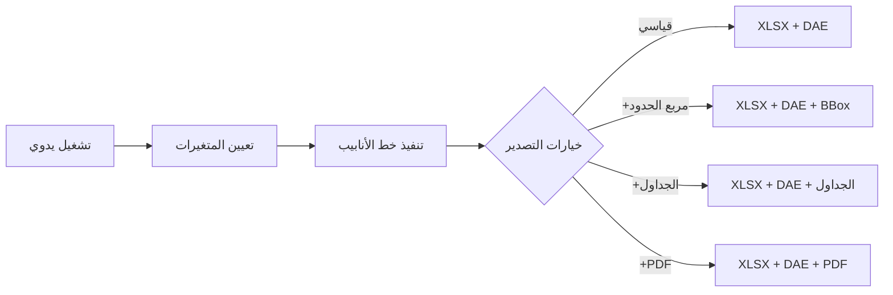
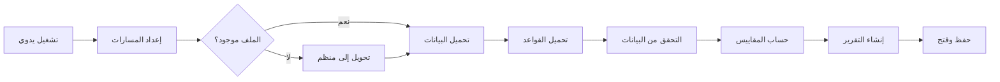
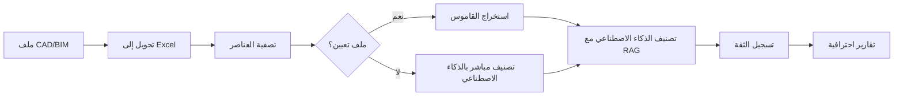
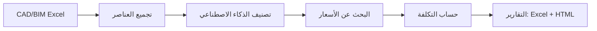
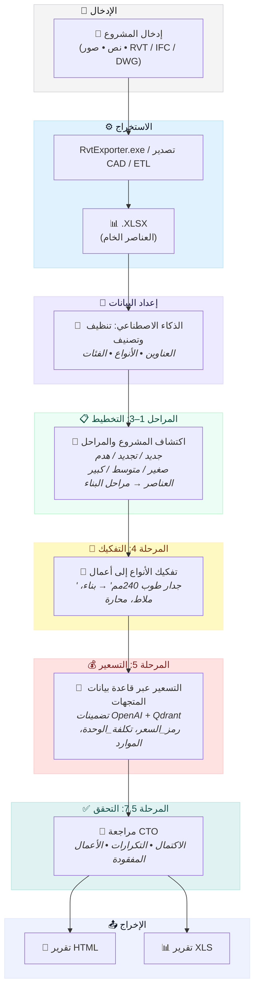
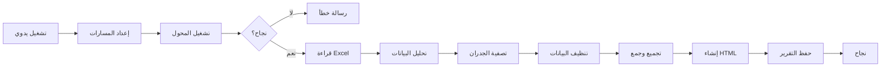

<p align="center">
  <a href="README.md">🇬🇧 English</a> •
  <a href="README.de.md">🇩🇪 Deutsch</a> •
  <a href="README.es.md">🇪🇸 Español</a> •
  <a href="README.fr.md">🇫🇷 Français</a> •
  <a href="README.ru.md">🇷🇺 Русский</a> •
  <a href="README.zh.md">🇨🇳 中文</a> •
  <a href="README.ar.md">🇸🇦 العربية</a>
</p>

<p align="center">
  
</p>
<p align="center">

  <a href="LICENSE">
  
</a>
<a href="https://datadrivenconstruction.io">
  
</a>
</br>


<!-- التسعير -->
<a href="https://dify.ai/pricing" target="_blank">
  
</a>
</br>


<h3 align="center">معالجة وتحويل CAD/BIM (Revit، DWG، IFC، DGN) مع المعالجة الدفعية والتجميع والفحوصات وتقدير التكاليف وتقارير حصر الكميات. تصور عمليات الأتمتة في الوكلاء المفتوحين وسير العمل</h3>

<p align="center">
  أتمتة استخراج وتحويل بيانات CAD/BIM باستخدام واجهة DDC أو سطر الأوامر أو PowerShell أو سير العمل — بدون تقييد للمورد، بدون تراخيص Autodesk® أو CAD، مع التحكم الكامل في بيانات مشروعك
</p>


<p align="center">
  
</p>
<p align="center">
  
<p align="center">
 عملاء ومستخدمي DataDrivenConstruction
  <br>
  <a href="https://datadrivenconstruction.io/">
  
  </a>
  <br></br>
</p>


<div dir="rtl">

## جدول المحتويات

- [فيديوهات تعليمية](#فيديوهات-تعليمية)
- [نظرة عامة](#نظرة-عامة)
- [الصيغ المدعومة](#الصيغ-المدعومة)
- [الميزات الرئيسية](#الميزات-الرئيسية)
- [تشغيل المحولات](#تشغيل-المحولات)
- [🖥️ واجهة سطر الأوامر (CLI)](#️-واجهة-سطر-الأوامر-cli)
- [🚀 التكامل مع الذكاء الاصطناعي](#-التكامل-مع-الذكاء-الاصطناعي--الوقود-المثالي-لمنتجات-ai)
  - [📂 مجلد AI_AGENTS_INSTRUCTIONS](#-مجلد-ai_agents_instructions--سياق-جاهز-لمساعدي-ai)
- [البدء السريع مع n8n](#البدء-السريع-مع-n8n)
- [📁 سير العمل](#سير-عمل-n8n-للعمل-مع-بيانات-cadbim)
  - [⚡️ 1. التحويل الأساسي لـ Revit، IFC، DWG، DGN](#️-1-التحويل-الأساسي-لـ-revit-ifc-dwg-dgn)
  - [⚡️ 2. تحويل Revit مع إعدادات متقدمة](#️-2-تحويل-revit-مع-إعدادات-متقدمة)
  - [⚡️ 3. التحويل الدفعي لـ Revit، IFC، DWG مع التحقق والتقارير](#️-3-التحويل-الدفعي-لـ-revit-ifc-dwg-مع-التحقق-والتقارير)
  - [⚡️ 4. التحقق متعدد الصيغ لـ CAD (BIM) لـ Revit، IFC، DWG، DGN](#️-4-التحقق-متعدد-الصيغ-لـ-cad-bim-لـ-revit-ifc-dwg-dgn)
  - [⚡️ 5. التصنيف الشامل لـ BIM/CAD مع الذكاء الاصطناعي وRAG لـ Revit، IFC، DWG، DGN](#️-5-التصنيف-الشامل-لـ-bimcad-مع-الذكاء-الاصطناعي-وrag-لـ-revit-ifc-dwg-dgn)
  - [⚡️ 6. خطوط أنابيب تقدير تكاليف البناء](#️-6-خطوط-أنابيب-تقدير-تكاليف-البناء)
    - [⚡️ 6.1 خط أنابيب تقدير أسعار البناء لـ Revit وIFC مع LLM (الذكاء الاصطناعي)](#️-61-خط-أنابيب-تقدير-أسعار-البناء-لـ-revit-وifc-مع-llm-الذكاء-الاصطناعي)
    - [⚡️ 6.2 خط أنابيب تقدير تكاليف CAD (BIM) 4D/5D مع DDC CWICR](#️-62-خط-أنابيب-تقدير-تكاليف-cad-bim-4d5d-مع-ddc-cwicr)
  - [⚡️ 7. مقدر البصمة الكربونية CO2 لـ Revit وIFC مع LLM (الذكاء الاصطناعي)](#️-7-مقدر-البصمة-الكربونية-co2-لـ-revit-وifc-مع-llm-الذكاء-الاصطناعي)
  - [⚡️ 8. ETL بسيط لحالات استخدام LLM لـ Revit، IFC، DWG، DGN](#️-8-etl-بسيط-لحالات-استخدام-llm-لـ-revit-ifc-dwg-dgn)
  - [⚡️ 9. Revit وIFC إلى HTML حصر الكميات](#️-9-revit-وifc-إلى-html-حصر-الكميات)
- [استكشاف الأخطاء وإصلاحها](#استكشاف-الأخطاء-وإصلاحها)
- [ما هو DataFrames؟](#ما-هو-dataframes)
- [Excel إلى Revit. تحديث المشروع من Excel](#excel-إلى-revit-تحديث-المشروع-من-excel)
- [المساهمة](#المساهمة)
- [🆘 الدعم](#الدعم)
- [🎓 الاستشارات والتدريب](#الاستشارات-والتدريب)

</div>


<div dir="rtl">

## فيديوهات تعليمية

</div>

<table style="border: none; border-collapse: collapse;">
  <!-- الفيديوهات الجديدة في الأعلى -->
  <tr>
    <td style="border: none; padding-right: 12px; vertical-align: top;">
      <a href="https://www.youtube.com/watch?v=fHkXDMLzWzQ" target="_blank">
        
      </a>
    </td>
    <td style="border: none; vertical-align: top;">
     <b> نظرة عامة على محول CAD/BIM الشامل </b>
      <br>
        مقدمة إلى <strong>محول DDC</strong> لخطوط أنابيب Revit، IFC، DWG، وDGN — حالات استخدام التحويل والتحقق والأتمتة.<br>
        <a href="https://www.youtube.com/watch?v=fHkXDMLzWzQ" target="_blank">شاهد نظرة عامة على المحول على YouTube</a>
      </br>
    </td>
  </tr>
  <tr>
    <td style="border: none; padding-right: 12px; vertical-align: top;">
      <a href="https://www.youtube.com/watch?v=jVU7vlMNTO0" target="_blank">
        
      </a>
    </td>
    <td style="border: none; vertical-align: top;">
     <b> خط أنابيب محول DWG إلى Excel </b>
      <br>
        دليل خطوة بخطوة لأتمتة تحويل بيانات <strong>DWG إلى Excel</strong> باستخدام <code>n8n</code>، مما يجعل بيانات مشروع CAD سهلة الاستخدام في التقارير والتحليل.<br>
        <a href="https://www.youtube.com/watch?v=jVU7vlMNTO0" target="_blank">شاهد خط أنابيب DWG إلى Excel على YouTube</a>
      </br>
    </td>
  </tr>
  <tr>
    <td style="border: none; padding-right: 12px; vertical-align: top;">
      <a href="https://youtu.be/QBaH8oBsPpM?si=gno6LZf98d6gWdPl" target="_blank">
        
      </a>
    </td>
    <td style="border: none; vertical-align: top;">
     <b> ETL مع Revit وIFC </b>
      <br>
        تعلم كيفية بناء <strong>خط أنابيب ETL</strong> كامل مع بيانات Revit وIFC: استخراج وتحويل والتحقق وتحميل معلومات المشروع في صيغ مفتوحة.<br>
        <a href="https://youtu.be/QBaH8oBsPpM?si=gno6LZf98d6gWdPl" target="_blank">شاهد درس ETL مع Revit وIFC على YouTube</a>
      </br>
    </td>
  </tr>

  <!-- الفيديوهات الموجودة -->
  <tr>
    <td style="border: none; padding-right: 12px; vertical-align: top;">
      <a href="https://youtu.be/HUbEPo-yfeA?si=Gjbj2glKgU3q-XZC" target="_blank">
        
      </a>
    </td>
    <td style="border: none; vertical-align: top;">
     <b> البدء السريع مع n8n: التثبيت السهل وإنشاء خط الأنابيب (القوالب وLLM) </b>
      <br>
        درس للمبتدئين خطوة بخطوة حول إعداد <strong>n8n</strong> من الصفر، وبناء أول خط أنابيب أتمتة، واستخدام LLMs (مثل ChatGPT/Claude) لإنشاء الأتمتة.<br>
        <a href="https://youtu.be/HUbEPo-yfeA?si=Gjbj2glKgU3q-XZC" target="_blank">شاهد البدء السريع مع n8n على YouTube</a>
      </br>
    </td>
  </tr>
  <tr>
    <td style="border: none; padding-right: 12px; vertical-align: top;">
      <a href="https://www.youtube.com/watch?v=PMTZNRFjD6c" target="_blank">
        
      </a>
    </td>
    <td style="border: none; vertical-align: top;">
     <b> درس خط أنابيب بيانات CAD-BIM </b>
      <br>
        جولة عملية كاملة: أتمتة سير عمل <strong>معالجة بيانات CAD-BIM</strong> المعقدة في <code>n8n</code>، بما في ذلك التحويل والتحقق والتحليلات القابلة للتنفيذ.<br>
        <a href="https://www.youtube.com/watch?v=PMTZNRFjD6c" target="_blank">شاهد درس خط أنابيب CAD-BIM على YouTube</a>
      </br>
    </td>
  </tr>
  <tr>
    <td style="border: none; padding-right: 12px; vertical-align: top;">
      <a href="https://www.youtube.com/watch?v=p84AmP2dcvg" target="_blank">
        
      </a>
    </td>
    <td style="border: none; vertical-align: top;">
     <b> ⚡️التحقق الآلي من بيانات CAD/BIM مع n8n | نهاية الفحوصات اليدوية لـ BIM </b>
      <br>
        اكتشف كيفية أتمتة سير عمل <strong>التحقق من بيانات CAD/BIM</strong> بالكامل باستخدام منصة <code>n8n</code> المجانية ومفتوحة المصدر. مثالي لفرق المشاريع التي تتطلع لتوفير ساعات (أو أيام) كل أسبوع.<br>
        <a href="https://www.youtube.com/watch?v=p84AmP2dcvg" target="_blank">شاهد درس التحقق الآلي على YouTube</a>
      </br>
    </td>
  </tr>
</table>


<p align="center">
  
</p>

</p>
<p align="center">
  
   <br></br>
</p>


<div dir="rtl">

## نظرة عامة

يقوم هذا الخط الأنابيب بأتمتة تحويل ملفات CAD/BIM إلى Excel لحصر الكميات وتحليل البيانات والمعالجة اللاحقة. يدعم العمل دون اتصال بالإنترنت والتوسع باستخدام Python أو أدوات الذكاء الاصطناعي.


## الصيغ المدعومة

| الصيغة | امتداد الملف | المحول | المخرجات |
|--------|-------------|--------|----------|
| Revit (2015-2026) | `.rvt` | RvtExporter.exe | قاعدة بيانات XLSX + هندسة DAE + الجداول + رسومات PDF |
| Revit (2015-2026) | `.rvt` | RVT2IFC_converter.exe | IFC2x3، IFC4، IFC4.3، IFCXML، IFCZIP، HDF5 |
| IFC (2x3, 4x1, 4x4, 4x, 4.3) | `.ifc` | IfcExporter.exe | قاعدة بيانات XLSX + هندسة DAE |
| AutoCAD (1983-2026) | `.dwg` | DwgExporter.exe | قاعدة بيانات XLSX + رسومات PDF |
| MicroStation (v7-v8) | `.dgn` | DgnExporter.exe | قاعدة بيانات XLSX |

## الميزات الرئيسية

- التحويل التلقائي إلى Excel (العناصر كصفوف، الخصائص كأعمدة).
- تصدير الهندسة المضلعة ثلاثية الأبعاد (DAE) مع معرفات العناصر المطابقة لبيانات XLSX.
- المعالجة دون اتصال بالإنترنت أو واجهات برمجة التطبيقات أو التراخيص.
- قابل للتوسيع للمعالجة اللاحقة المخصصة.

## تشغيل المحولات

يمكن تشغيل محولات DDC بطرق مختلفة — **n8n هو مجرد خيار واحد** للأتمتة.
بناءً على سير العمل والخلفية التقنية، يمكنك الاختيار من بين أربع طرق:

1. **واجهة المستخدم الرسومية (UI)**
   - الأفضل للمستخدمين غير التقنيين والتحويلات السريعة لمرة واحدة.
   - واجهة بديهية، لا تتطلب إعدادًا — ما عليك سوى تحديد مجلد والبدء.

</div>

<p align="center">
  
  <br></br>
</p>

<div dir="rtl">

2. **وحدة التحكم / الطرفية (CMD، PowerShell، Shell)**
   - مناسب للمستخدمين المتقدمين والمطورين والفرق التقنية.
   - مرن وقابل للبرمجة النصية، يمكن دمجه في نصوص الأتمتة أو العمليات الدفعية.

</div>

<p align="center">
  
  <br></br>
</p>

<div dir="rtl">

3. **خطوط أنابيب Python أو JavaScript**
   - مثالي للمؤسسات والفرق التي تعمل مع مجموعات بيانات كبيرة.
   - معالجة قابلة للتطوير لمئات ملفات CAD (BIM) بالتوازي.
   - أمثلة جاهزة للاستخدام في مجلد `DDC_Python_pipelines`.

</div>

<p align="center">
  
  <br></br>
</p>

<div dir="rtl">

4. **سير عمل n8n**
   - الأفضل للشركات التي تسعى إلى **الأتمتة الكاملة وتكامل الأنظمة**.
   - خطوط أنابيب شاملة حيث يصبح تحويل CAD (BIM) جزءًا من تدفق بيانات سلس.
   - أمثلة في مجلد `DDC_n8n_Workflows&Pipelines`.

</div>

<p align="center">
  
  <br></br>
</p>


---

<div dir="rtl">

## 🖥️ واجهة سطر الأوامر (CLI)

محولات DDC هي أدوات سطر أوامر كاملة الوظائف يمكن دمجها في **أي سير عمل أتمتة**. وهذا يجعلها مثالية للبرمجة النصية وخطوط أنابيب CI/CD ووكلاء الذكاء الاصطناعي ومنصات low-code.

### 🤖 لماذا CLI مهم: دع الذكاء الاصطناعي يبني خطوط أنابيبك

**الميزة الرئيسية لأدوات CLI هي أن الذكاء الاصطناعي يمكنه استخدامها مباشرة.**

مساعدو البرمجة بالذكاء الاصطناعي الحديثون (**Claude Code**، **Cursor**، **GitHub Copilot**، **Windsurf**، **Aider**، **Cline**) يمكنهم تنفيذ أوامر shell وقراءة الوثائق وبناء خطوط أنابيب أتمتة كاملة بشكل مستقل. وهذا يعني:

> **لست بحاجة إلى كتابة الكود بنفسك — فقط صف ما تريد، وسيقوم الذكاء الاصطناعي بدمج محولات DDC في سير عملك.**

**كيف يعمل:**
1. **انسخ هذه الوثائق** (أو وجه الذكاء الاصطناعي إلى هذا README)
2. **صف مهمتك** بلغة طبيعية: *"حول جميع ملفات Revit في المجلد X إلى Excel، ثم حلل كميات الجدران"*
3. **يقرأ الذكاء الاصطناعي بناء جملة CLI**، يكتب النص البرمجي، ينفذه ويعالج النتائج

**ما يمكن للذكاء الاصطناعي فعله مع محولات DDC:**
- ✅ تحويل دفعي لمئات ملفات CAD/BIM تلقائيًا
- ✅ بناء خطوط أنابيب ETL: Revit → Excel → قاعدة بيانات → لوحة معلومات
- ✅ إنشاء نصوص تحقق للتحقق من جودة بيانات BIM
- ✅ إنشاء تقارير من البيانات المستخرجة (PDF، HTML، Excel)
- ✅ دمج التحويلات في خطوط أنابيب CI/CD
- ✅ ربط أدوات متعددة: تحويل → تحقق → تصنيف → تقدير التكاليف
- ✅ جدولة المعالجة الآلية عبر cron/Task Scheduler

**مثال على موجه لمساعد الذكاء الاصطناعي:**

</div>

```
لدي ملفات Revit في C:\Projects. باستخدام DDC RvtExporter.exe الموجود في C:\DDC\،
حول جميع ملفات .rvt إلى Excel مع مربعات الحدود، ثم أنشئ نص Python
يقرأ ملفات XLSX وينشئ تقريرًا ملخصًا لجميع أنواع الجدران وأحجامها.
```

<div dir="rtl">

سيقوم الذكاء الاصطناعي بـ:
1. فحص المجلد للعثور على ملفات `.rvt`
2. تنفيذ `RvtExporter.exe` لكل ملف بالمعاملات الصحيحة
3. كتابة كود Python لتحليل ملفات `.xlsx` الناتجة
4. إنشاء تقرير الملخص

**هذا يحول DDC من أداة إلى لبنة بناء أصلية للذكاء الاصطناعي لأتمتة بيانات البناء.**

</div>

### RvtExporter.exe — Revit إلى XLSX/DAE/PDF

```
===========================================
         DataDrivenConstruction
         DDC Revit Community
         Version: 17.1.1
===========================================

Usage: RvtExporter <input file> [<output file>] [<output file>] [<export mode>] [<category file>] [bbox] [room] [schedule] [sheets2pdf] [-no-xlsx] [-no-collada]
```

<div dir="rtl">

| المعامل | الوصف |
|---------|-------|
| `<input file>` | ملف `.rvt` / `.rfa` للإدخال (مطلوب) |
| `[<output file>]` | مسار الإخراج لملف `.dae` (اختياري، مفعل افتراضيًا) |
| `[<output file>]` | مسار الإخراج لملف `.xlsx` (اختياري، مفعل افتراضيًا) |
| `[<export mode>]` | `basic` (309 فئة)، `standard` (724)، `complete` (1209)، أو `custom` |
| `[<category file>]` | ملف `.txt` بأسماء الفئات (مطلوب فقط في وضع `custom`) |
| `bbox` | تضمين مربعات حدود العناصر في مخرجات XLSX |
| `room` | تضمين بيانات ToRoom/FromRoom في مخرجات XLSX |
| `schedule` | تصدير جميع جداول Revit |
| `sheets2pdf` | تصدير جميع الأوراق إلى PDF |
| `-no-xlsx` | تعطيل التصدير إلى صيغة `.xlsx` |
| `-no-collada` | تعطيل التصدير إلى صيغة `.dae` |

**أمثلة:**

</div>

```bash
# التحويل الأساسي (XLSX + DAE)
RvtExporter.exe "C:\Projects\Building.rvt"

# التصدير الكامل مع مربعات الحدود والجداول وأوراق PDF
RvtExporter.exe "C:\Projects\Building.rvt" complete bbox schedule sheets2pdf

# تصدير XLSX فقط (بدون هندسة ثلاثية الأبعاد)
RvtExporter.exe "C:\Projects\Building.rvt" -no-collada

# فئات مخصصة من ملف
RvtExporter.exe "C:\Projects\Building.rvt" custom "C:\Config\my_categories.txt"
```

---

### RVT2IFCconverter.exe — Revit إلى IFC

```
===========================================
         DataDrivenConstruction
         DDC RVT2IFC Community
         Version: 17.1.2
===========================================

Usage: Rvt2IfcConverter <input.rvt> [<output.ifc>] [preset|mode=<name>] [config="..."] [key=value ...]
```

<div dir="rtl">

| المعامل | الوصف |
|---------|-------|
| `<input.rvt>` | ملف Revit `.rvt` / `.rfa` (مطلوب) |
| `[<output.ifc>]` | مسار إخراج IFC (اختياري) |
| `preset=<name>` أو `mode=<name>` | `standard`، `extended`، `custom` |
| `config="K=V; K=V; ..."` | تكوين مخصص (مفصول بفاصلة منقوطة) |
| `key=value` | معاملات تكوين فردية |

**أمثلة:**

</div>

```bash
# تصدير IFC القياسي
RVT2IFCconverter.exe "C:\Projects\Building.rvt"

# التصدير الموسع مع المزيد من التفاصيل
RVT2IFCconverter.exe "C:\Projects\Building.rvt" preset=extended

# مسار إخراج مخصص
RVT2IFCconverter.exe "C:\Projects\Building.rvt" "D:\Output\model.ifc"

# تكوين مخصص
RVT2IFCconverter.exe "C:\Projects\Building.rvt" config="ExportBaseQuantities=true; SitePlacement=Shared"
```

---

<div dir="rtl">

### أمثلة التكامل

يمكن استدعاء أدوات CLI من أي بيئة تقريبًا:

#### 🔹 PowerShell / نصوص Batch

</div>

```powershell
# PowerShell: معالجة جميع ملفات .rvt في مجلد
Get-ChildItem "C:\Projects\*.rvt" | ForEach-Object {
    & "C:\DDC\RvtExporter.exe" $_.FullName
}
```

```batch
:: Batch: تحويل بسيط
@echo off
"C:\DDC\RvtExporter.exe" "%1" complete bbox schedule
```

<div dir="rtl">

#### 🔹 مهام VS Code

أضف إلى `.vscode/tasks.json`:

</div>

```json
{
  "version": "2.0.0",
  "tasks": [
    {
      "label": "تحويل Revit إلى Excel",
      "type": "shell",
      "command": "C:\\DDC\\RvtExporter.exe",
      "args": ["${file}", "complete", "bbox"],
      "problemMatcher": []
    }
  ]
}
```

<div dir="rtl">

#### 🔹 مساعدو البرمجة بالذكاء الاصطناعي (Claude Code، Cursor، Copilot، Windsurf، Aider، Cline)

يمكن لمساعدي الذكاء الاصطناعي الذين لديهم وصول إلى الطرفية تنفيذ محولات DDC مباشرة وبناء سير عمل كامل:

</div>

```bash
# مثال: ينفذ الذكاء الاصطناعي هذا الأمر عندما تسأل "حول ملف Revit الخاص بي إلى Excel"
RvtExporter.exe "C:\Projects\Model.rvt" complete bbox schedule
```

<div dir="rtl">

**سيناريوهات سير العمل الحقيقية مع الذكاء الاصطناعي:**

| أنت تقول للذكاء الاصطناعي | الذكاء الاصطناعي يفعل |
|---------------------------|----------------------|
| *"حول Building.rvt إلى Excel مع جميع البيانات"* | يشغل `RvtExporter.exe Building.rvt complete bbox room` |
| *"عالج جميع ملفات Revit في هذا المجلد"* | يكتب حلقة PowerShell، ينفذ المحول لكل ملف |
| *"صدر إلى صيغة IFC 4.3"* | يشغل `RVT2IFCconverter.exe` مع الإعداد المسبق الصحيح |
| *"أنشئ تقدير تكلفة من هذا النموذج"* | يحول إلى Excel → يحلل البيانات → يحسب التكاليف |
| *"تحقق من جودة بيانات BIM"* | يحول → يحلل XLSX → ينشئ تقرير التحقق |
| *"أنشئ لوحة معلومات من بيانات المشروع"* | يحول → يعالج مع pandas → ينشئ التصور |

**أدوات الذكاء الاصطناعي المدعومة:**
- **Claude Code** — وصول كامل للطرفية، يمكنه تشغيل المحولات وتحليل النتائج
- **Cursor** — IDE مع ذكاء اصطناعي يمكنه تنفيذ أوامر shell
- **GitHub Copilot CLI** — مساعد ذكاء اصطناعي لسطر الأوامر
- **Windsurf** — IDE مدعوم بالذكاء الاصطناعي مع تكامل الطرفية
- **Aider** — البرمجة الثنائية مع الذكاء الاصطناعي في الطرفية
- **Cline** — امتداد VS Code مع وصول shell
- **Open Interpreter** — ذكاء اصطناعي يشغل الكود محليًا
- **AutoGPT / AgentGPT** — وكلاء ذكاء اصطناعي مستقلون

**نصيحة احترافية:** شارك هذا README مع مساعد الذكاء الاصطناعي الخاص بك حتى يفهم بناء جملة CLI الكامل ويمكنه بناء خطوط أنابيب متطورة بشكل مستقل.

#### 🔹 n8n (عقدة Execute Command)

</div>

```javascript
// في عقدة Execute Command في n8n
C:\DDC\RvtExporter.exe "{{ $json.filePath }}" complete bbox
```

<div dir="rtl">

#### 🔹 Python Subprocess

</div>

```python
import subprocess

result = subprocess.run([
    r"C:\DDC\RvtExporter.exe",
    r"C:\Projects\Building.rvt",
    "complete", "bbox", "schedule"
], capture_output=True, text=True)

print(result.stdout)
```

<div dir="rtl">

#### 🔹 Node.js / JavaScript

</div>

```javascript
const { execSync } = require('child_process');

const output = execSync(
  'C:\\DDC\\RvtExporter.exe "C:\\Projects\\Building.rvt" complete bbox'
);
console.log(output.toString());
```

<div dir="rtl">

#### 🔹 Make / Makefile

</div>

```makefile
CONVERTER = C:/DDC/RvtExporter.exe

convert:
	$(CONVERTER) "$(INPUT)" complete bbox schedule
```

<div dir="rtl">

#### 🔹 GitHub Actions / CI/CD

</div>

```yaml
- name: تحويل Revit إلى Excel
  run: |
    C:\DDC\RvtExporter.exe "${{ github.workspace }}\model.rvt" complete bbox
```

<div dir="rtl">

#### 🔹 Docker (حاوية Windows)

</div>

```dockerfile
COPY DDC_Converters_Windows_Packages/DDC_CONVERTER_Revit /app/DDC
RUN C:\app\DDC\RvtExporter.exe "C:\data\model.rvt"
```

---

<div dir="rtl">

## 🚀 تكامل الذكاء الاصطناعي — وقود مثالي لمنتجات AI

<p align="center">
  <b>فقط استنسخ المستودع وصف ما تحتاجه — الذكاء الاصطناعي يفعل الباقي</b>
</p>

محولات DDC ليست مجرد أدوات — إنها **وقود جاهز للاستخدام للتطبيقات المدعومة بالذكاء الاصطناعي**. أنشئ روبوتات تقدير التكاليف، وأتمت سير عمل البناء، أو أنشئ مساعدين أذكياء — البيانات تعمل فوراً مع أدوات الذكاء الاصطناعي الحديثة.

### لماذا DDC مثالي للذكاء الاصطناعي

| الميزة | الفائدة |
|--------|---------|
| **مخرجات منظمة** | تنسيق Excel/JSON يمكن للذكاء الاصطناعي تحليله فوراً |
| **واجهة CLI** | مساعدو الذكاء الاصطناعي يمكنهم استدعاء المحولات مباشرة |
| **تكامل DDC CWICR** | أكثر من 55,000 بند عمل مع تضمينات محسوبة مسبقاً للبحث الدلالي |
| **إدخال متعدد الصيغ** | Revit، IFC، DWG، DGN — واجهة واحدة لجميع الصيغ |

</div>

### 🛠️ يعمل بشكل مثالي مع

<table>
<tr>
<td align="center" width="14%">
<br/>
<b>Claude Code</b>
</td>
<td align="center" width="14%">
<br/>
<b>Google Antigravity</b>
</td>
<td align="center" width="14%">
<br/>
<b>Cursor</b>
</td>
<td align="center" width="14%">
<br/>
<b>Copilot</b>
</td>
<td align="center" width="14%">
<br/>
<b>n8n</b>
</td>
<td align="center" width="14%">
<br/>
<b>Dify</b>
</td>
<td align="center" width="14%">
<br/>
<b>Windsurf</b>
</td>
</tr>
</table>

---

<div dir="rtl">

### 💻 Claude Code & Google Antigravity — مساعدو البرمجة بالذكاء الاصطناعي

أسرع طريقة للعمل مع محولات DDC. فقط افتح المستودع واطرح أسئلة بلغة طبيعية.

</div>

**البدء:**
```bash
# استنساخ المستودع
git clone https://github.com/datadrivenconstruction/cad2data-Revit-IFC-DWG-DGN.git

# فتح مع Claude Code
cd cad2data-Revit-IFC-DWG-DGN
claude
```

<div dir="rtl">

**أمثلة على المطالبات:**

| المهمة | المطالبة |
|--------|---------|
| **التحويل** | "حوّل جميع ملفات .rvt في المجلد C:\Projects إلى Excel مع صناديق الحدود" |
| **تحليل البيانات** | "حلل ملف XLSX الناتج وأظهر جميع أنواع الجدران مع أحجامها" |
| **بناء خط أنابيب** | "أنشئ سكريبت Python يحول Revit → يحلل Excel → يولد تقرير التكاليف" |
| **التحقق من BIM** | "تحقق من جودة بيانات BIM وأنشئ تقرير اكتمال المعلمات" |
| **تقدير التكاليف** | "باستخدام DDC CWICR، قدّر تكاليف أعمال الخرسانة من هذا النموذج" |
| **تكامل CI/CD** | "اكتب GitHub Action يحول ملفات .rvt تلقائياً عند الدفع" |

**نصائح احترافية:**
- وجّه الذكاء الاصطناعي إلى ملفات محددة: *"حلل ملف Parquet ولخص توزيع التكاليف"*
- اطلب تفسيرات: *"اشرح كيف تعمل منهجية التكلفة القائمة على الموارد"*
- اطلب تعديلات: *"عدّل سير عمل n8n لإضافة إشعارات البريد الإلكتروني"*

---

<div dir="rtl">

⭐ <b>إذا وجدت أدواتنا مفيدة وترغب في رؤية المزيد من التطبيقات المماثلة لصناعة البناء، يرجى إعطاء مستودعاتنا نجمة.</b>
ضع نجمة على سير عمل DDC على GitHub ليتم إعلامك فورًا بالإصدارات الجديدة.

</div>

<p align="center">
  <br>
  
  <br></br>
</p>

---

<div dir="rtl">

### 📂 مجلد AI_AGENTS_INSTRUCTIONS — سياق جاهز لمساعدي AI

يتضمن المستودع مجلدًا مخصصًا **[AI_AGENTS_INSTRUCTIONS](AI_AGENTS_INSTRUCTIONS/)** يحتوي على كل ما يحتاجه مساعدو البرمجة بالذكاء الاصطناعي للعمل بفعالية مع هذه الأدوات.

**ما يحتويه:**

| الملف | الغرض |
|-------|-------|
| **INSTRUCTIONS.md** | نظرة عامة رئيسية: فلسفة المستودع، صيغ الإدخال/الإخراج، أمثلة CLI |
| **CLAUDE.md** | تعليمات محددة لـ Claude Code مع صياغة CLI مفصلة |
| **OPENCODE.md** | تعليمات لـ Opencode |
| **ANTIGRAVITY.md** | تعليمات لـ Google Antigravity مع أمثلة تكامل GCP |
| **TOOLS_OVERVIEW.md** | مرجع كامل لجميع المحولات ومنطق العمليات |
| **DATA_DRIVEN_CONSTRUCTION_BOOK.txt** | كتاب "البناء المبني على البيانات" — الفلسفة الموجهة لأتمتة البناء |

**لماذا هذا مهم:**
- يمكن لمساعدي AI قراءة هذه الملفات لفهم السياق الكامل
- يحتوي على صياغة CLI وأنماط التكامل وأفضل الممارسات
- يعمل الكتاب كـ "بوصلة" لقرارات الأتمتة في البناء
- تم توثيق سير عمل n8n كـ **قوالب منطق عمليات مرئية** — ليست الحل النهائي، بل أساس يمكن تنفيذه بأي لغة (Python، JavaScript، C#، Go، Rust)

**كيفية الاستخدام:**

</div>

```bash
# يقرأ مساعدو AI تلقائيًا AI_AGENTS_INSTRUCTIONS عند العمل مع المستودع
# أو وجههم مباشرة:
"اقرأ AI_AGENTS_INSTRUCTIONS/CLAUDE.md وساعدني في إنشاء خط أنابيب تحويل دفعي"
```

---

## 🎯 DDC Skills — 196 أتمتة AI جاهزة للاستخدام

<div dir="rtl">

> **جديد!** [DDC Skills لوكلاء AI في البناء](https://github.com/datadrivenconstruction/DDC_Skills_for_AI_Agents_in_Construction) — مجموعة أدوات أتمتة كاملة لشركات البناء.

</div>

<p align="center">
  <a href="https://github.com/datadrivenconstruction/DDC_Skills_for_AI_Agents_in_Construction">
    
  </a>
</p>

<div dir="rtl">

### كيف يعمل

</div>

```
1. استنساخ مستودع Skills
2. فتح باستخدام Claude Code أو Cursor أو GitHub Copilot
3. وصف ما تريد أتمتته — AI يرشدك خطوة بخطوة
```

<div dir="rtl">

لا حاجة للبرمجة. يقرأ مساعد AI تعريفات المهارات ويرشدك خلال عملية الأتمتة بأكملها.

### مهارات سير عمل CAD/BIM

| الفئة | القدرات |
|-------|---------|
| **معالجة BIM** | تحليل IFC، استخراج بيانات Revit، تحويل DWG/DGN |
| **أتمتة QTO** | حساب الكميات، قوائم المواد، ربط التكاليف |
| **التحقق** | فحص النموذج، تقارير جودة البيانات، معدلات ملء المعلمات |
| **التقارير** | التقارير اليومية، تقارير الصور، تتبع التقدم |
| **تقدير التكلفة** | تقديرات آلية باستخدام قاعدة بيانات DDC CWICR |
| **التكامل** | سير عمل n8n، مزامنة Excel، اتصالات API |

### توفير الوقت

| العملية | التخفيض |
|---------|---------|
| البحث عن الأسعار | 99% (15 دقيقة → 10 ثوانٍ) |
| التقارير اليومية | 92% |
| تقديرات التكلفة | 87% |
| تتبع الميزانية | 87% |

يجمع مستودع Skills بين **خط أنابيب CAD2Data هذا** و**قاعدة بيانات تكاليف CWICR** — أتمتة شاملة من النموذج إلى التقدير.

</div>

**→ [استكشف 196 DDC Skills](https://github.com/datadrivenconstruction/DDC_Skills_for_AI_Agents_in_Construction)**

---

## البدء السريع مع n8n

<div dir="rtl">

### المتطلبات الأساسية

1. **تثبيت Node.js** من [nodejs.org](https://nodejs.org/).
2. **تشغيل n8n** في موجه الأوامر:

</div>

   ```
   npx n8n
   ```

<div dir="rtl">

   الوصول عبر `http://localhost:5678`.
3. **تنزيل هذا المستودع من GitHub**
   - انقر على زر "Code" الأخضر → "Download ZIP"
   - فك ضغط المجلد
4. **تشغيل سير العمل**
     - أنت جاهز. فقط انقر على **Execute Workflow** في n8n لبدء معالجة ملفات CAD-BIM الخاصة بك

</div>

<p align="center">
  
  <br></br>
</p>

---

<div dir="rtl">

## سير عمل n8n للعمل مع بيانات CAD/BIM

### ⚡️ 1. التحويل الأساسي لـ Revit، IFC، DWG، DGN
**الملف**: `n8n_1_Revit_IFC_DWG_Conversation_simple.json`

يحول ملفات CAD/BIM (`.rvt`، `.ifc`، `.dwg`، `.dgn`) إلى Excel (XLSX) وCollada (DAE) لملفات Revit/IFC. تكوين بسيط للإعداد السريع.

</div>

<p align="center">
  
</p>

<div dir="rtl">

#### التثبيت
1. استورد `n8n_1_Revit_IFC_DWG_Conversation_simple.json` إلى n8n عبر **Workflows > Import from File**.
2. حدّث عقدة **Set Variables**:

</div>

   ```
   # Revit
   path_to_converter: C:\Converters\datadrivenlibs\RvtExporter.exe
   path_project_file: C:\Projects\Model.rvt

   # Revit إلى IFC
   path_to_converter: C:\Converters\datadrivenlibs\RVT2IFCconverter.exe
   path_project_file: C:\Projects\Model.rvt

   # IFC
   path_to_converter: C:\Converters\datadrivenlibs\IfcExporter.exe
   path_project_file: C:\Projects\Model.ifc

   # DWG
   path_to_converter: C:\Converters\datadrivenlibs\DwgExporter.exe
   path_project_file: C:\Projects\Plan.dwg

   # DGN
   path_to_converter: C:\Converters\datadrivenlibs\DgnExporter.exe
   path_project_file: C:\Projects\Bridge.dgn
   ```

<div dir="rtl">

3. تأكد من أن المحول في مجلد `datadrivenlibs`، مثل `C:\Converters\datadrivenlibs\XxxExporter.exe`.

#### الاستخدام
1. شغل سير العمل عبر **Manual Trigger**.
2. تحقق من مجلد الإخراج لملفات XLSX وDAE وPDF.
3. راقب السجلات لحالة التحويل.

</div>


<div dir="rtl">

### ⚡️ 2. تحويل Revit مع إعدادات متقدمة
**الملف**: `n8n_2_All_Settings_Revit_IFC_DWG_Conversation_simple.json`

يحول ملفات CAD/BIM مع أوضاع تصدير قابلة للتخصيص (basic: 309 فئة، standard: 724 فئة، complete: جميع 1209 فئة) ومخرجات اختيارية مثل مربع الحدود، جداول Revit، أو رسومات PDF.

</div>

<p align="center">
  
</p>

<div dir="rtl">

#### التثبيت
1. استورد `n8n_2_All_Settings_Revit_IFC_DWG_Conversation_simple.json` إلى n8n عبر **Workflows > Import from File**.
2. حدّث عقدة **Set Variables** بمسارات المحول والملف (نفس التحويل الأساسي).
3. كوّن خيارات التصدير:

</div>

   ```
   export_mode: basic | standard | complete
   bbox: true | false
   schedule: true | false
   sheets2pdf: true | false
   no-xlsx: true | false
   no-collada: true | false
   ```

<div dir="rtl">

#### الاستخدام
1. شغل سير العمل عبر **Manual Trigger**.
2. تحقق من مجلد الإخراج لملفات XLSX وDAE والجداول أو PDF بناءً على الإعدادات.
3. راقب السجلات لحالة التحويل.

</div>



<div dir="rtl">

### ⚡️ 3. التحويل الدفعي لـ Revit، IFC، DWG مع التحقق والتقارير
**الملف**: `n8n_3_CAD-BIM-Batch-Converter-Pipeline.json`

يؤتمت التحويل الدفعي لملفات Revit (`.rvt`) إلى Excel (XLSX) وCollada (DAE)، يتحقق من المخرجات، يتتبع أوقات المعالجة، وينشئ تقرير HTML مع المقاييس وروابط الملفات وتفاصيل التكوين.

</div>

<p align="center">
  
</p>

<div dir="rtl">

#### التثبيت
1. استورد `n8n_3_CAD-BIM-Batch-Converter-Pipeline.json` إلى n8n عبر **Workflows > Import from File**.
2. حدّث عقدة **Set Configuration Parameters**:

</div>

   ```
   converter_path: C:\Converters\datadrivenlibs\RvtExporter.exe
   source_folder: C:\Sample_Projects
   output_folder: C:\Output
   include_subfolders: true
   file_extension: .rvt
   ```

<div dir="rtl">

3. تأكد من أن `RvtExporter.exe` في `C:\Converters\datadrivenlibs\` وملفات `.rvt` في مجلد المصدر.

#### الاستخدام
1. شغل سير العمل عبر **Manual Trigger**.
2. راقب السجلات لاكتشاف الملفات وتقدم التحويل.
3. راجع تقرير HTML (يفتح تلقائيًا في المتصفح) مع:
   - المقاييس (الملفات المعالجة، معدل النجاح، الوقت، الأحجام).
   - جداول النجاح/الفشل مع روابط الملفات.
4. تحقق من مجلد الإخراج لملفات XLSX وDAE.

</div>


<div dir="rtl">

### ⚡️ 4. التحقق متعدد الصيغ لـ CAD (BIM) لـ Revit، IFC، DWG، DGN
**الملفات**: `n8n_4_Validation_CAD_BIM_Revit_IFC_DWG.json`، `DDC_BIM_Requirements_Table_for_Revit_IFC_DWG.xlsx`

يتحقق من بيانات CAD/BIM مقابل قواعد محددة مسبقًا، وينشئ تقارير Excel ملونة بمقاييس جودة البيانات.

</div>

<p align="center">
  
</p>

<div dir="rtl">

#### التثبيت
1. استورد `n8n_3_Validation_CAD_BIM_Revit_IFC_DWG.json` إلى n8n عبر **Workflows > Import from File**.
2. حدّث عقدة **Setup Paths**:

</div>

   ```
   path_to_converter: C:\Converters\datadrivenlibs\RvtExporter.exe
   project_file: C:\Projects\Model.rvt
   validation_rules_path: C:\Validation\DDC_Revit_IFC_Validation_Table.xlsx
   ```

<div dir="rtl">

3. تأكد من إمكانية الوصول إلى المحول وملف قواعد التحقق.

#### الاستخدام
1. شغل سير العمل عبر **Manual Trigger**.
2. تحقق من مجلد الإخراج لتقرير XLSX الملون.
3. راجع مقاييس جودة البيانات (معدلات الملء، القيم الفريدة، الأنماط).
4. راقب السجلات لحالة التحقق.

</div>



<div dir="rtl">

### ⚡️ 5. التصنيف الشامل لـ BIM/CAD مع الذكاء الاصطناعي وRAG لـ Revit، IFC، DWG، DGN
**الملف**: `n8n_5_CAD_BIM_Automatic_Classification_with_LLM_and_RAG.json`

🔗 **معزز بقاعدة بيانات DDC CWICR**: [OpenConstructionEstimate-DDC-CWICR](https://github.com/datadrivenconstruction/OpenConstructionEstimate-DDC-CWICR)
يستفيد سير العمل هذا من قاعدة بيانات المتجهات DDC CWICR (Qdrant) التي تحتوي على **55,719 بند عمل** مع تضمينات OpenAI مسبقة الحساب (3072d). يقوم خط أنابيب RAG بإجراء بحث دلالي عبر 9 لغات، مطابقًا عناصر BIM بأوصاف أعمال البناء المعيارية. تغطي قاعدة البيانات الطيف الكامل لأنشطة البناء — من أعمال الحفر والخرسانة إلى تركيبات MEP المتخصصة — مما يتيح التصنيف الدقيق مقابل أي معيار (Omniclass، Uniclass، MasterFormat، أو أنظمة مخصصة).

يصنف عناصر المباني من ملفات CAD/BIM بذكاء باستخدام الذكاء الاصطناعي وأي نظام تصنيف — معايير دولية (Omniclass، Uniclass، إلخ) أو تصنيفاتك المخصصة/الخاصة. يدعم استخراج القاموس التلقائي من ملفات التعيين.

#### الميزات الرئيسية
- **التصنيف الشامل**: يعمل مع أي نظام تصنيف — قياسي أو مخصص
- **التصنيف بالذكاء الاصطناعي**: يستخدم LLMs لتصنيف العناصر مع تسجيل الثقة
- **التعيين الذكي**: يستخرج تلقائيًا القواميس من ملفات Excel وCSV وPDF
- **التصفية التلقائية**: يفصل عناصر المبنى عن الرسومات/التعليقات التوضيحية
- **دعم التسلسل الهرمي**: يتعامل مع هياكل التصنيف المسطحة والهرمية
- **تقارير احترافية**: لوحات معلومات HTML تفاعلية + Excel متعدد الأوراق
- **تقنية RAG**: الجيل المعزز بالاسترجاع للتصنيف الدقيق

</div>

<p align="center">
  
</p>

<div dir="rtl">

#### التثبيت
1. استورد `n8n_5_CAD_BIM_Automatic_Classification_with_LLM_and_RAG.json` إلى n8n
2. كوّن بيانات اعتماد الذكاء الاصطناعي (OpenAI/Anthropic/OpenRouter/Gemini/xAI)
3. حدّث عقدة **Setup - Define file paths**:

</div>

   ```
   path_to_converter: C:\Converters\datadrivenlibs\RvtExporter.exe
   project_file: C:\Projects\Model.rvt
   group_by: Type Name
   classification_name: [أي اسم تصنيف]
   optional_mapping_file: C:\Classifications\[your_classification].xlsx
   optional_help_prompt: "سياق إضافي للذكاء الاصطناعي"
   ```

<div dir="rtl">

#### مرونة التصنيف
يعمل هذا الخط الأنابيب مع **أي نظام تصنيف**:
- ✅ المعايير الدولية (Omniclass، Uniclass، MasterFormat، إلخ)
- ✅ المعايير الوطنية (DIN، NF، BS، إلخ)
- ✅ تصنيفات خاصة بالشركة
- ✅ تصنيفات مشروع مخصصة
- ✅ أنظمة ترميز خاصة
- ✅ أي تصنيف منظم بصيغة Excel/CSV/PDF

#### كيف يعمل
1. **مع ملف التعيين**: قدم قاموس التصنيف الخاص بك (Excel/CSV/PDF) — سيستخرج الذكاء الاصطناعي الرموز ويطبقها بدقة
2. **بدون ملف التعيين**: يستخدم الذكاء الاصطناعي معرفته للتصنيف وفقًا للمعيار الذي تحدده
3. **الوضع الهجين**: اجمع ملف التعيين مع ذكاء الذكاء الاصطناعي للحصول على أفضل النتائج

**⏱️ وقت المعالجة:** 3-10 ثوانٍ لكل مجموعة عناصر (يختلف حسب نموذج LLM)

</div>



<div dir="rtl">

### ⚡️ 6. خطوط أنابيب تقدير تكاليف البناء

🔗 **مدعوم بقاعدة بيانات DDC CWICR**: [OpenConstructionEstimate-DDC-CWICR](https://github.com/datadrivenconstruction/OpenConstructionEstimate-DDC-CWICR)

تتصل سير عمل تقدير التكلفة بقاعدة بيانات تكلفة DDC CWICR التي تحتوي على **55,719 بند عمل** و**27,672 موردًا** مع تفاصيل تفصيل الأسعار عبر أكثر من 10 أسواق إقليمية. تفصل المنهجية القائمة على الموارد بين المعايير الفيزيائية (ساعات العمل، كميات المواد، وقت المعدات) والأسعار المتقلبة، مما يضمن تقديرات شفافة وقابلة للتدقيق.

📦 **تحميلات قاعدة البيانات**: [إصدارات DDC CWICR](https://github.com/datadrivenconstruction/OpenConstructionEstimate-DDC-CWICR/releases) — Excel، Parquet، CSV، لقطات Qdrant
🌐 **عرض مباشر**: [openconstructionestimate.com](https://openconstructionestimate.com) — استكشف قاعدة البيانات والبحث الدلالي

---

#### ⚡️ 6.1 خط أنابيب تقدير أسعار البناء لـ Revit وIFC مع LLM (الذكاء الاصطناعي)
**الملف:** `n8n_6_Construction_Price_Estimation_Pipeline.json`

يؤتمت تقدير التكلفة لعناصر المباني من ملفات CAD/BIM. يستخدم الذكاء الاصطناعي لتصنيف المواد، والبحث عن أسعار السوق، وإنشاء تقارير تكلفة شاملة.

##### الميزات الرئيسية
- **تصنيف الذكاء الاصطناعي**: المواد عبر معايير EU/DE/US
- **التسعير الذكي**: قواعد بيانات خاصة بالمنطقة مع بدائل احتياطية
- **تحليل التكلفة**: إجمالي التكاليف، التكلفة لكل وحدة، أعلى 10 مجموعات
- **إخراج متعدد الصيغ**: مصنف Excel + تقرير HTML مع مخططات

</div>

<p align="center">
  
</p>

<div dir="rtl">

##### التثبيت
1. استورد `Construction_Price_Estimation_Pipeline.json` إلى n8n
2. كوّن بيانات اعتماد الذكاء الاصطناعي (OpenAI/Anthropic)
3. حدّث عقدة **Set Parameters**:

</div>

   ```
   input_file_path: C:\Output\Project_Elements.xlsx
   grouping_parameter: Type Name
   country: Germany
   ```

<div dir="rtl">

- معامل التجميع (group_by، مثل 'Type Name'، 'IfcType' لـ IFC أو غيرها)
- البلد (البلد الذي سيتم حساب القيم له، مثل 'Germany' أو 'Brazil')

**⏱️ وقت المعالجة:** 5-15 ثانية لكل مجموعة عناصر (يعتمد على سرعة LLM)

</div>



---

<div dir="rtl">

#### ⚡️ 6.2 خط أنابيب تقدير تكاليف CAD (BIM) 4D/5D مع DDC CWICR
**الملف:** `n8n_4_CAD_(BIM)_Cost_Estimation_Pipeline_4D_5D_with_DDC_CWICR.json`

🔗 **مستودع سير العمل**: [OpenConstructionEstimate-DDC-CWICR](https://github.com/datadrivenconstruction/OpenConstructionEstimate-DDC-CWICR)

تقدير التكلفة الآلي من نماذج Revit/IFC/DWG. يستخرج بيانات BIM، يصنف العناصر، يفكك إلى بنود العمل، وينشئ تقديرات 4D/5D مع تفصيل كامل للموارد.

</div>

<p align="left">
  <a href="https://datadrivenconstruction.io">
    
  </a>
</p>

<div dir="rtl">

##### مراحل خط الأنابيب

| المرحلة | الاسم | الوصف |
|---------|------|-------|
| **0** | جمع بيانات BIM | استخراج العناصر من Revit عبر محول DDC |
| **1** | اكتشاف المشروع | يحدد الذكاء الاصطناعي نوع المشروع (سكني، تجاري، إلخ) |
| **2** | إنشاء المراحل | ينشئ الذكاء الاصطناعي مراحل البناء |
| **3** | تعيين العناصر | يربط الذكاء الاصطناعي أنواع BIM بالمراحل |
| **4** | تفكيك العمل | يفكك الذكاء الاصطناعي الأنواع إلى بنود عمل ("جدار طوب" → بناء، ملاط) |
| **5** | البحث المتجهي | إيجاد الأسعار المطابقة في DDC CWICR عبر Qdrant |
| **6** | تعيين الوحدات | تحويل وحدات BIM إلى وحدات الأسعار |
| **7** | حساب التكلفة | الكمية × سعر الوحدة لكل بند عمل |
| **7.5** | التحقق | مراجعة CTO للاكتمال والتكرارات |
| **8** | التجميع | الجمع حسب المراحل والفئات |
| **9** | إنشاء التقارير | إنشاء مخرجات HTML وExcel |

</div>



<div dir="rtl">

##### الميزات الرئيسية
- **تكامل BIM الكامل**: دعم أصلي لـ Revit، IFC، DWG عبر محول DDC
- **التفكيك بالذكاء الاصطناعي**: يفكك أنواع BIM المعقدة إلى بنود عمل مكونة
- **التسعير الدلالي**: البحث المتجهي Qdrant مع 55,719 بند عمل مضمن مسبقًا
- **دعم متعدد LLM**: OpenAI GPT-4o، Claude، Gemini 2.5 Pro، xAI Grok، DeepSeek
- **التحقق من CTO**: مرحلة مراجعة بالذكاء الاصطناعي تتحقق من الاكتمال وتلتقط التكرارات
- **9 لغات**: AR، DE، EN، ES، FR، HI، PT، RU، ZH مع تسعير إقليمي

##### المتطلبات الأساسية

| المكون | المتطلب | الوصف |
|--------|---------|-------|
| **n8n** | v1.0+ (مستضاف ذاتيًا) | منصة أتمتة سير العمل |
| **Qdrant** | سحابي أو مستضاف ذاتيًا | قاعدة بيانات متجهات للبحث الدلالي |
| **OpenAI API** | `text-embedding-3-large` | ينشئ التضمينات للمطابقة |
| **LLM API** | OpenAI / Claude / Gemini / Grok | نماذج الذكاء الاصطناعي للتصنيف |
| **محول DDC** | `RvtExporter.exe` | يستخرج بيانات BIM إلى Excel |

##### اللغات ومستويات الأسعار المدعومة

| الرمز | اللغة | مستوى السعر | العملة | مجموعة Qdrant |
|-------|------|-------------|-------|---------------|
| `AR` | العربية | دبي | AED | `ddc_cwicr_ar` |
| `DE` | الألمانية | برلين | EUR | `ddc_cwicr_de` |
| `EN` | الإنجليزية | تورونتو | CAD | `ddc_cwicr_en` |
| `ES` | الإسبانية | برشلونة | EUR | `ddc_cwicr_es` |
| `FR` | الفرنسية | باريس | EUR | `ddc_cwicr_fr` |
| `HI` | الهندية | مومباي | INR | `ddc_cwicr_hi` |
| `PT` | البرتغالية | ساو باولو | BRL | `ddc_cwicr_pt` |
| `RU` | الروسية | سانت بطرسبرغ | RUB | `ddc_cwicr_ru` |
| `ZH` | الصينية | شنغهاي | CNY | `ddc_cwicr_zh` |

##### ملفات الإخراج

يتم حفظ التقارير في مجلد المشروع:

</div>

```
project_YYYY-MM-DD.html   ← تقرير تفاعلي (يفتح في المتصفح)
project_YYYY-MM-DD.xls    ← جدول بيانات متوافق مع Excel
```

<p align="center">
  
</p>

<div dir="rtl">

##### اختيار نموذج LLM

يدعم سير العمل مزودين متعددين للذكاء الاصطناعي. فعّل النموذج المفضل لديك:

| النموذج | الحالة |
|---------|-------|
| OpenAI GPT-4o | ✅ افتراضي |
| Claude Opus 4 | معطل |
| Gemini 2.5 Pro | معطل |
| xAI Grok | معطل |
| DeepSeek | معطل |

للتبديل بين النماذج: **فعّل** عقدة النموذج المطلوب و**عطّل** الأخرى.

**⏱️ وقت المعالجة:** يختلف حسب حجم المشروع ونموذج LLM


### ⚡️ 7. مقدر البصمة الكربونية CO2 لـ Revit وIFC مع LLM (الذكاء الاصطناعي)

**الملف:** `n8n_7_Carbon_Footprint_CO2_Estimator_for_Revit_and_IFC.json`

🔗 **متكامل مع قاعدة بيانات DDC CWICR**: [OpenConstructionEstimate-DDC-CWICR](https://github.com/datadrivenconstruction/OpenConstructionEstimate-DDC-CWICR)
يستخدم سير العمل هذا تصنيفات المواد التفصيلية وتفكيك الموارد في DDC CWICR لحساب الكربون المضمن (مراحل دورة الحياة A1-A3). توفر قاعدة البيانات كميات مواد دقيقة لكل بند عمل — أحجام الخرسانة، أطنان الفولاذ، مساحات العزل — والتي يتم بعد ذلك مطابقتها مع معاملات انبعاثات CO₂e. مع البيانات التي تغطي 9 لغات ومعايير إقليمية متعددة (EU/DE/US)، يقدم خط الأنابيب تقييمات استدامة دقيقة للمشاريع الدولية.

يحسب انبعاثات الكربون المضمن لمشاريع البناء. يحلل المواد، يطبق معاملات الانبعاثات، وينشئ تقارير استدامة احترافية.

#### الميزات الرئيسية
- **تحليل الكربون المضمن**: مراحل دورة الحياة A1-A3
- **تصنيف المواد**: معايير EU/DE/US مع بيانات الكثافة
- **معاملات الانبعاثات**: معاملات CO2e قياسية صناعية لكل مادة
- **تقييم الأثر**: تصنيف حرج/مرتفع/متوسط/منخفض
- **تقارير احترافية**: HTML بأسلوب McKinsey + Excel متعدد الأوراق

</div>

<p align="center">
  
</p>

<div dir="rtl">

#### التثبيت
1. استورد `n8n_6_Carbon_Footprint_CO2_Estimator_for_Revit_and_IFC.json` إلى n8n
2. كوّن بيانات اعتماد الذكاء الاصطناعي (OpenAI/Anthropic)
3. حدّث عقدة **Setup - Define file paths**:

</div>

   ```
   path_to_converter: C:\Converters\datadrivenlibs\RvtExporter.exe
   project_file: C:\Projects\Model.rvt
   group_by: Type Name (Category أو غيرها)
   country: Germany (البلد الذي سيتم حساب القيم له، مثل 'Germany' أو 'Brazil')
   ```

<div dir="rtl">

**⏱️ وقت المعالجة:** 5-15 ثانية لكل مجموعة عناصر (يعتمد على سرعة LLM)

</div>


<div dir="rtl">

### ⚡️ 8. ETL بسيط لحالات استخدام LLM لـ Revit، IFC، DWG، DGN
**الملف**: `n8n_8_Revit_IFC_DWG_Conversation_EXTRACT_Phase_with_Parse_XLSX.json`

يحول ملف Revit إلى Excel، ينشئ اسم ملف XLSX، ويحلل البيانات لمهام الأتمتة القائمة على LLM.

</div>

<p align="center">
  
</p>

<div dir="rtl">

#### التثبيت
1. استورد `n8n_4_Revit_IFC_DWG_Conversation_EXTRACT_Phase_with_Parse_XLSX.json` إلى n8n عبر **Workflows > Import from File**.
2. حدّث عقدة **Setup Paths**:

</div>

   ```
   path_to_converter: C:\Converters\datadrivenlibs\RvtExporter.exe
   project_file: C:\Projects\Model.rvt
   ```

<div dir="rtl">

3. تأكد من إمكانية الوصول إلى المحول.

#### الاستخدام
1. شغل سير العمل عبر **Manual Trigger**.
2. تحقق من مجلد الإخراج لملف XLSX.
3. استخدم البيانات المحللة لمهام LLM (مثل تغذية JSON إلى Claude أو ChatGPT).
4. راقب السجلات لحالة التحويل والتحليل.


### ⚡️ 9. Revit وIFC إلى HTML حصر الكميات
**الملف**: `n8n_9_CAD_BIM_Quantity_TakeOff_HTML_Report_Generatorn.json`

يحلل بيانات جدران Revit، يحسب الأحجام حسب النوع، وينشئ تقارير HTML تفاعلية مع إحصائيات ملخصة.

</div>

<p align="center">
  
</p>

<div dir="rtl">

#### التثبيت
1. استورد `n8n_5_CAD_BIM_Quantity_TakeOff_HTML_Report_Generatorn.json` إلى n8n عبر **Workflows > Import from File**.
2. حدّث عقدة **Setup Paths**:

</div>

   ```
   path_to_converter: C:\Converters\datadrivenlibs\RvtExporter.exe
   project_file: C:\Projects\Model.rvt
   ```

<div dir="rtl">

3. تأكد من إمكانية الوصول إلى المحول.

#### الاستخدام
1. شغل سير العمل عبر **Manual Trigger**.
2. تحقق من مجلد الإخراج لتقرير HTML.
3. راجع التقرير (يفتح تلقائيًا في المتصفح) لكميات الجدران والإحصائيات.
4. راقب السجلات لحالة المعالجة.

</div>



<div dir="rtl">

## استكشاف الأخطاء وإصلاحها

### عقدة Execute Command مفقودة (n8n 2.0+)

**الأعراض:**
- تظهر العقد بعلامة استفهام (؟)
- خطأ: `Unrecognized node type: n8n-nodes-base.executeCommand`
- Execute Command لا تظهر في بحث العقد

**الحل:** أضف متغير البيئة قبل تشغيل n8n:

</div>

```cmd
set NODES_EXCLUDE=[] && npx n8n
```

<div dir="rtl">

أو أنشئ ملف `.env` في `C:\Users\YOUR_USER\.n8n\.env` مع `NODES_EXCLUDE=[]`

انظر [⚠️ إعداد n8n 2.0+](#️-إعداد-n8n-20-مطلوب) للتفاصيل.

### خطأ حظر وحدة 'os'
في إصدارات n8n 1.98.0–1.101.x، تم حظر وحدة `os`، مما يؤثر على المكتبات مثل pandas. الحل: استخدم أحدث إصدار مع `npx n8n@latest`.


## ما هو DataFrames؟

صيغ CAD/BIM مثل `.rvt`، `.ifc`، `.dwg`، أو `.dgn` معقدة ومملوكة. تحويلها إلى **DataFrames** — هياكل جدولية مع صفوف (عناصر) وأعمدة (خصائص) — يتيح معالجة بيانات فعالة. اشتهرت DataFrames بمكتبة pandas في Python، وتستخدم على نطاق واسع لتوافقها مع أدوات الأتمتة والتحليلات والذكاء الاصطناعي (مكتبة واحدة فقط من مكتبات Python، pandas، يتم تحميلها 12 مليون مرة يوميًا). تبسط مهام مثل التصفية والتجميع والتصور، مما يجعلها مثالية للوحات المعلومات وحصر الكميات والتحقق.

</div>

<p align="center">
  
</p>

<div dir="rtl">

العودة إلى جذور "BIM". 𝗛𝗼𝘄𝗶𝗲 𝗠𝗮𝗿𝗸𝗲𝘁𝗶𝗻𝗴 𝗕𝘂𝘇𝘇𝘄𝗼𝗿𝗱: 𝗧𝗵𝗲 𝗟𝗼𝘀𝘁 𝗜𝗱𝗲𝗻𝘁𝗶𝘁𝘆: من قاعدة البيانات إلى كلمة تسويقية طنانة.
في البداية، لم يكن BIM أبدًا عن الكلمات الطنانة أو نقاشات التشغيل البيني التي لا تنتهي. كان أساسه دائمًا قواعد البيانات.

🔹 1974. قدم تشارلز إيستمان نظام وصف المباني (BDS). في ورقته البحثية، ظهرت كلمة قاعدة البيانات 43 مرة.
🔹 2000. نشرت ADSK ورقة بيضاء تؤكد على قيمة الوصول المباشر إلى "قاعدة بيانات CAD". اعتبرت المترجمات المحايدة مثل STEP/IFC ثانوية.
💬 "قدرة تبادل البيانات الأصلية — يجب أن تصل التطبيقات إلى قاعدة بيانات CAD الرئيسية مباشرة، حتى لا تُفقد التفاصيل والدقة."
🔹 2002. بعد الاستحواذ على Revit-BOM، وضعت ورقة BIM البيضاء لـ ADSK قاعدة البيانات مرة أخرى في الجوهر (23 إشارة للمصطلح).
🔹 2003. للمرة الأخيرة، ربطت ADSK رسميًا BIM بتكنولوجيا المعلومات وقواعد البيانات. بعد ذلك، اختفت قاعدة البيانات من السرد — واستُبدلت بالتسويق الخالص.

</div>

<p align="center">
  
</p>

<div dir="rtl">

في الواقع، كان BIM دائمًا بسيطًا: قاعدة بيانات لعناصر المشروع، كل منها بمعاملاته الخاصة. كل شيء آخر طبقات تسويقية.
ربما حان الوقت للعودة إلى الجوهر: بيانات مفتوحة ومنظمة وقابلة للوصول.


**تعلم المزيد:**
- [Python Pandas — أداة لا غنى عنها](https://datadrivenconstruction.io/2025/06/048-python-pandas-an-indispensable-tool-for-working-with-data/)
- [DataFrame — صيغة البيانات الجدولية الشاملة](https://datadrivenconstruction.io/2025/06/049-dataframe-universal-tabular-data-format/)
- [البيانات المنظمة في البناء](https://datadrivenconstruction.io/2025/06/025-structured-data/)


## Excel إلى Revit تحديث المشروع من Excel

بعد تحويل وإثراء بيانات Excel الخاصة بك، يمكنك بسهولة دفع البيانات المعدلة مرة أخرى إلى مشروع Revit الخاص بك. أداتنا المخصصة **[ImportExcelToRevit](https://github.com/datadrivenconstruction/cad2data-Revit-IFC-DWG-DGN/tree/main/DDC_Converters_Windows_Packages/DDC_Update_Revit_from_Excel)** تجعل هذه العملية سلسة من خلال استيراد أوراق Excel المحدثة مباشرة إلى معاملات وعائلات Revit.

> **بسّط سير عمل BIM الخاص بك:** Revit ➡️ Excel ➡️ تحويل ➡️ Excel ➡️ Revit.

</div>


<div dir="rtl">

## 🗃️ DDC CWICR - قاعدة بيانات تكاليف البناء

للحصول على أعلى جودة لتقدير تكاليف البناء، يتكامل هذا المستودع مع **[OpenConstructionEstimate-DDC-CWICR](https://github.com/datadrivenconstruction/OpenConstructionEstimate-DDC-CWICR)** — قاعدة بيانات تكاليف بناء مفتوحة متعددة اللغات.

### لماذا DDC CWICR؟

توفر DDC CWICR (بنود عمل البناء والمكونات والموارد) الأساس لتقدير تكلفة دقيق وشفاف وقابل للتدقيق:

- **55,719 بند عمل** — تغطية شاملة لأنشطة البناء
- **27,672 موردًا** — المواد والعمالة والمعدات مع تفاصيل تفصيلية
- **9 لغات** — العربية، الصينية، الألمانية، الإنجليزية، الإسبانية، الفرنسية، الهندية، البرتغالية، الروسية
- **85 حقل بيانات** — هيكل تكلفة كامل قائم على الموارد لكل بند عمل
- **البحث الدلالي** — قاعدة بيانات متجهات Qdrant مع تضمينات OpenAI (3072d) لاستعلامات اللغة الطبيعية

### مزايا قاعدة البيانات

| الميزة | الفائدة |
|--------|--------|
| **المنهجية القائمة على الموارد** | المعايير الفيزيائية (ساعات العمل، كميات المواد) منفصلة عن الأسعار المتقلبة |
| **شفافية كاملة** | تفصيل كامل لكل مكون تكلفة — بدون رسوم مخفية |
| **تصدير متعدد الصيغ** | Excel، Parquet، CSV، لقطات Qdrant لأي سيناريو تكامل |
| **جاهز للذكاء الاصطناعي** | تضمينات محسوبة مسبقًا تتيح خطوط أنابيب RAG وتقدير مدعوم بـ LLM |

### العرض المباشر والموارد

🌐 **عرض مباشر**: [openconstructionestimate.com](https://openconstructionestimate.com) — استكشف قاعدة البيانات والبحث الدلالي عمليًا

📦 **المستودع**: [github.com/datadrivenconstruction/OpenConstructionEstimate-DDC-CWICR](https://github.com/datadrivenconstruction/OpenConstructionEstimate-DDC-CWICR)

تستفيد سير العمل في هذا المستودع (خاصة **سير العمل 5 و6 و7**) من DDC CWICR للتصنيف والتسعير وحسابات البصمة الكربونية، مما يضمن جودة تقدير احترافية.


## المساهمة

نرحب بالمساهمات! لا تتردد في:
- الإبلاغ عن الأخطاء
- اقتراح الميزات
- تقديم طلبات السحب
- تحسين الوثائق


## الدعم

🌐 **الموقع الإلكتروني**: [DataDrivenConstruction.io](https://datadrivenconstruction.io)
💬 **المشاكل**: [GitHub Issues](https://github.com/datadrivenconstruction/Revit-IFC-DWG-DGN-Converter-in-n8n-with-QTO/issues)
📧 **البريد الإلكتروني**: info@datadrivenconstruction.io


## الاستشارات والتدريب

نعمل مع شركات البناء والهندسة ووكالات الاستشارات وشركات التكنولوجيا الرائدة حول العالم لمساعدتها على تنفيذ مبادئ البيانات المفتوحة، وأتمتة معالجة CAD/BIM وبناء خطوط أنابيب ETL قوية.

إذا كنت ترغب في اختبار هذا الحل ببياناتك الخاصة، أو مهتمًا بتكييف سير العمل لمهام المشروع الحقيقية، فلا تتردد في الاتصال بنا.

يقدم فريقنا ورش عمل عملية، واستشارات استراتيجية، ويطور نماذج أولية مصممة خصيصًا لعمليات المشروع الحقيقية. ندعم بنشاط المنظمات التي تسعى إلى حلول عملية للتحول الرقمي والتشغيل البيني، مع التركيز على تحديات جودة البيانات والتصنيف، ودفع اعتماد سير العمل المفتوح والآلي.

اتصل بنا للحصول على استشارة مجانية حيث سنناقش تحدياتك ونوضح كيف يمكن لأتمتة n8n تحويل عملياتك. تواصل عبر البريد الإلكتروني على [@DataDrivenConstruction](mailto: info@datadrivenconstruction.io) أو قم بزيارة موقعنا على [datadrivenconstruction.io](https://datadrivenconstruction.io) لمعرفة المزيد عن خدماتنا.

</div>

---
 <!-- الروابط الاجتماعية -->
  <a href="https://x.com/datadrivenconst" target="_blank">
    
  </a>
  <a href="https://www.youtube.com/@datadrivenconstruction" target="_blank">
    
  </a>
  <a href="https://www.linkedin.com/company/78381569" target="_blank">
    
  </a>
</p>


<p align="left">

  <a href="https://datadrivenconstruction.io">
    
  </a>
  <br>
   <b>   أطلق قوة البيانات في البناء</b>
   <br>
     🚀 انتقل إلى إدارة البيانات الكاملة حيث تبقى فقط <br /> البيانات والعمليات المنظمة الموحدة وحيث 🔓 بياناتك ملكك
</p>

---

## العلامات التجارية

<div dir="rtl">

Autodesk® و Revit® و AutoCAD® و DWG™ هي علامات تجارية مسجلة أو علامات تجارية لشركة Autodesk, Inc. MicroStation® و DGN™ هي علامات تجارية لشركة Bentley Systems, Incorporated. IFC هي علامة تجارية لـ buildingSMART International Ltd. OmniClass® و MasterFormat® هي علامات تجارية لمعهد مواصفات البناء (CSI). جميع أسماء العلامات التجارية الأخرى وأسماء المنتجات أو العلامات التجارية هي ملك لأصحابها.

هذا المشروع غير منتسب أو معتمد أو برعاية Autodesk أو Bentley Systems أو buildingSMART أو أي من مالكي العلامات التجارية المذكورين أعلاه.

</div>
