<p align="center">
  <a href="README.md">🇬🇧 English</a> •
  <a href="README.de.md">🇩🇪 Deutsch</a> •
  <a href="README.es.md">🇪🇸 Español</a> •
  <a href="README.fr.md">🇫🇷 Français</a> •
  <a href="README.ru.md">🇷🇺 Русский</a> •
  <a href="README.zh.md">🇨🇳 中文</a> •
  <a href="README.ar.md">🇸🇦 العربية</a>
</p>

<p align="center">
  
</p>
<p align="center">

  <a href="LICENSE">
  
</a>
<a href="https://datadrivenconstruction.io">
  
</a>
</br>


<!-- Preise -->
<a href="https://dify.ai/pricing" target="_blank">
  
</a>
</br>


<h3 align="center">CAD/BIM-Verarbeitung und -Konvertierung (Revit, DWG, IFC, DGN) mit Stapelverarbeitung, Gruppierung, Prüfungen, Kostenschätzung und QTO-Berichten. Visualisierung von Automatisierungsprozessen in offenen Agenten und Workflows</h3>

<p align="center">
  Automatisieren Sie Ihre CAD/BIM-Datenextraktion und -transformation mit DDC UI, Eingabeaufforderung, PowerShell oder Workflows — ohne Herstellerbindung, ohne Autodesk®- oder CAD-Lizenzen und mit voller Kontrolle über Ihre Projektdaten
</p>


<p align="center">
  
</p>
<p align="center">
  
<p align="center">
 DataDrivenConstruction Kunden und Nutzer
  <br>
  <a href="https://datadrivenconstruction.io/">
  
  </a>
  <br></br>
</p>


## Inhaltsverzeichnis

- [Tutorial-Videos](#tutorial-videos)
- [Übersicht](#übersicht)
- [Unterstützte Formate](#unterstützte-formate)
- [Hauptfunktionen](#hauptfunktionen)
- [Ausführung der Konverter](#ausführung-der-konverter)
- [🖥️ Befehlszeilenschnittstelle (CLI)](#️-befehlszeilenschnittstelle-cli)
- [🚀 KI-Integration](#-ki-integration--perfekter-treibstoff-für-ki-produkte)
  - [📂 AI_AGENTS_INSTRUCTIONS-Ordner](#-ai_agents_instructions-ordner--fertiger-kontext-für-ki-assistenten)
- [Schnellstart](#schnellstart)
- [📁 Workflows](#n8n-workflows-für-die-arbeit-mit-cadbim-daten)
  - [⚡️ 1. Revit, IFC, DWG, DGN Basiskonvertierung](#️-1-revit-ifc-dwg-dgn-basiskonvertierung)
  - [⚡️ 2. Revit-Konvertierung mit erweiterten Einstellungen](#️-2-revit-konvertierung-mit-erweiterten-einstellungen)
  - [⚡️ 3. Revit, IFC, DWG Stapelkonvertierung mit Validierung und Berichten](#️-3-revit-ifc-dwg-stapelkonvertierung-mit-validierung-und-berichten)
  - [⚡️ 4. Multi-Format CAD (BIM) Validierung für Revit, IFC, DWG, DGN](#️-4-multi-format-cad-bim-validierung-für-revit-ifc-dwg-dgn)
  - [⚡️ 5. Universelle BIM/CAD-Klassifizierung mit KI & RAG für Revit, IFC, DWG, DGN](#️-5-universelle-bimcad-klassifizierung-mit-ki--rag-für-revit-ifc-dwg-dgn)
  - [⚡️ 6. Baukostenschätzungs-Pipelines](#️-6-baukostenschätzungs-pipelines)
    - [⚡️ 6.1 Baupreis-Schätzungs-Pipeline für Revit und IFC mit LLM (KI)](#️-61-baupreis-schätzungs-pipeline-für-revit-und-ifc-mit-llm-ki)
    - [⚡️ 6.2 CAD (BIM) Kostenschätzungs-Pipeline 4D/5D mit DDC CWICR](#️-62-cad-bim-kostenschätzungs-pipeline-4d5d-mit-ddc-cwicr)
  - [⚡️ 7. CO2-Fußabdruck-Schätzer für Revit und IFC mit LLM (KI)](#️-7-co2-fußabdruck-schätzer-für-revit-und-ifc-mit-llm-ki)
  - [⚡️ 8. Einfaches ETL für LLM-Anwendungsfälle für Revit, IFC, DWG, DGN](#️-8-einfaches-etl-für-llm-anwendungsfälle-für-revit-ifc-dwg-dgn)
  - [⚡️ 9. Revit und IFC zu HTML Mengenermittlung](#️-9-revit-und-ifc-zu-html-mengenermittlung)
- [Fehlerbehebung](#fehlerbehebung)
- [Was sind DataFrames?](#was-sind-dataframes)
- [Excel zu Revit. Projekt aus Excel aktualisieren](#excel-zu-revit-projekt-aus-excel-aktualisieren)
- [Mitwirken](#mitwirken)
- [🆘 Support](#support)
- [🎓 Beratung und Schulung](#beratung-und-schulung)


## Tutorial-Videos

<table style="border: none; border-collapse: collapse;">
  <!-- Neue Videos oben -->
  <tr>
    <td style="border: none; padding-right: 12px; vertical-align: top;">
      <a href="https://www.youtube.com/watch?v=fHkXDMLzWzQ" target="_blank">
        
      </a>
    </td>
    <td style="border: none; vertical-align: top;">
     <b> Universeller CAD/BIM-Konverter Übersicht </b>
      <br>
        Einführung in den <strong>DDC Converter</strong> für Revit, IFC, DWG und DGN Pipelines – Konvertierung, Validierung und Automatisierungsanwendungen.<br>
        <a href="https://www.youtube.com/watch?v=fHkXDMLzWzQ" target="_blank">Konverter-Übersicht auf YouTube ansehen</a>
      </br>
    </td>
  </tr>
  <tr>
    <td style="border: none; padding-right: 12px; vertical-align: top;">
      <a href="https://www.youtube.com/watch?v=jVU7vlMNTO0" target="_blank">
        
      </a>
    </td>
    <td style="border: none; vertical-align: top;">
     <b> DWG zu Excel Konverter-Pipeline </b>
      <br>
        Schritt-für-Schritt-Anleitung zur Automatisierung der <strong>DWG zu Excel</strong> Datenkonvertierung mit <code>n8n</code>, die CAD-Projektdaten für Berichte und Analysen nutzbar macht.<br>
        <a href="https://www.youtube.com/watch?v=jVU7vlMNTO0" target="_blank">DWG zu Excel Pipeline auf YouTube ansehen</a>
      </br>
    </td>
  </tr>
  <tr>
    <td style="border: none; padding-right: 12px; vertical-align: top;">
      <a href="https://youtu.be/QBaH8oBsPpM?si=gno6LZf98d6gWdPl" target="_blank">
        
      </a>
    </td>
    <td style="border: none; vertical-align: top;">
     <b> ETL mit Revit und IFC </b>
      <br>
        Lernen Sie, wie Sie eine vollständige <strong>ETL-Pipeline</strong> mit Revit- und IFC-Daten erstellen: Extrahieren, Transformieren, Validieren und Laden von Projektinformationen in offene Formate.<br>
        <a href="https://youtu.be/QBaH8oBsPpM?si=gno6LZf98d6gWdPl" target="_blank">ETL mit Revit und IFC Tutorial auf YouTube ansehen</a>
      </br>
    </td>
  </tr>

  <!-- Bestehende Videos -->
  <tr>
    <td style="border: none; padding-right: 12px; vertical-align: top;">
      <a href="https://youtu.be/HUbEPo-yfeA?si=Gjbj2glKgU3q-XZC" target="_blank">
        
      </a>
    </td>
    <td style="border: none; vertical-align: top;">
     <b> n8n Schnellstart: Einfache Installation & Pipeline-Erstellung (Vorlagen und LLM) </b>
      <br>
        Schritt-für-Schritt Einsteiger-Tutorial zur Einrichtung von <strong>n8n</strong> von Grund auf, Erstellung Ihrer ersten Automatisierungs-Pipeline und Verwendung von LLMs (wie ChatGPT/Claude) zur Generierung von Automatisierungen.<br>
        <a href="https://youtu.be/HUbEPo-yfeA?si=Gjbj2glKgU3q-XZC" target="_blank">n8n Schnellstart auf YouTube ansehen</a>
      </br>
    </td>
  </tr>
  <tr>
    <td style="border: none; padding-right: 12px; vertical-align: top;">
      <a href="https://www.youtube.com/watch?v=PMTZNRFjD6c" target="_blank">
        
      </a>
    </td>
    <td style="border: none; vertical-align: top;">
     <b> CAD-BIM Daten-Pipeline Tutorial </b>
      <br>
        Vollständige praktische Anleitung: Automatisieren Sie komplexe <strong>CAD-BIM Datenverarbeitungs</strong>-Workflows in <code>n8n</code>, einschließlich Konvertierung, Validierung und umsetzbarer Analysen.<br>
        <a href="https://www.youtube.com/watch?v=PMTZNRFjD6c" target="_blank">CAD-BIM Pipeline Tutorial auf YouTube ansehen</a>
      </br>
    </td>
  </tr>
  <tr>
    <td style="border: none; padding-right: 12px; vertical-align: top;">
      <a href="https://www.youtube.com/watch?v=p84AmP2dcvg" target="_blank">
        
      </a>
    </td>
    <td style="border: none; vertical-align: top;">
     <b> ⚡️Automatisierte CAD/BIM Datenvalidierung mit n8n | Das Ende manueller BIM-Prüfungen </b>
      <br>
        Entdecken Sie, wie Sie <strong>CAD/BIM Datenvalidierungs</strong>-Workflows vollständig automatisieren können mit der kostenlosen, Open-Source <code>n8n</code>-Plattform. Ideal für Projektteams, die jede Woche Stunden (oder Tage) sparen möchten.<br>
        <a href="https://www.youtube.com/watch?v=p84AmP2dcvg" target="_blank">Automatisiertes Validierungs-Tutorial auf YouTube ansehen</a>
      </br>
    </td>
  </tr>
</table>


<p align="center">
  
</p>

</p>
<p align="center">
  
   <br></br>
</p>


## Übersicht

Diese Pipeline automatisiert die Konvertierung von CAD/BIM-Dateien zu Excel für Mengenermittlung, Datenanalyse und Weiterverarbeitung. Sie unterstützt Offline-Betrieb und Erweiterbarkeit mit Python oder KI-Werkzeugen.


## Unterstützte Formate

| Format | Dateiendung | Konverter | Ausgabe |
|--------|-------------|-----------|---------|
| Revit (2015-2026) | `.rvt` | RvtExporter.exe | XLSX-Datenbank + DAE-Geometrie + Bauteillisten + PDF-Zeichnungen |
| Revit (2015-2026) | `.rvt` | RVT2IFC_converter.exe | IFC2x3, IFC4, IFC4.3, IFCXML, IFCZIP, HDF5 |
| IFC (2x3, 4x1, 4x4, 4x, 4.3) | `.ifc` | IfcExporter.exe | XLSX-Datenbank + DAE-Geometrie |
| AutoCAD (1983-2026) | `.dwg` | DwgExporter.exe | XLSX-Datenbank + PDF-Zeichnungen |
| MicroStation (v7-v8) | `.dgn` | DgnExporter.exe | XLSX-Datenbank |

## Hauptfunktionen

- Automatische Konvertierung zu Excel (Elemente als Zeilen, Eigenschaften als Spalten).
- Export von 3D-Polygongeometrie (DAE) mit Element-IDs, die den XLSX-Daten entsprechen.
- Offline-Verarbeitung ohne Internet, APIs oder Lizenzen.
- Erweiterbar für benutzerdefinierte Nachbearbeitung.

## Ausführung der Konverter

Die DDC-Konverter können auf verschiedene Weisen gestartet werden — **n8n ist nur eine der Möglichkeiten** zur Automatisierung.
Je nach Workflow und technischem Hintergrund können Sie zwischen vier Methoden wählen:

1. **Grafische Benutzeroberfläche (UI)**
   - Am besten für nicht-technische Anwender und schnelle Einzelkonvertierungen.
   - Intuitive Oberfläche, keine Einrichtung erforderlich — einfach Ordner auswählen und starten.
<p align="center">
  
  <br></br>
</p>

2. **Konsole / Terminal (CMD, PowerShell, Shell)**
   - Geeignet für fortgeschrittene Benutzer, Entwickler und technische Teams.
   - Flexibel und skriptfähig, kann in Automatisierungsskripte oder Stapelprozesse integriert werden.
<p align="center">
  
  <br></br>
</p>

3. **Python- oder JavaScript-Pipelines**
   - Ideal für Unternehmen und Teams, die mit großen Datensätzen arbeiten.
   - Skalierbare Verarbeitung von Hunderten von CAD (BIM)-Dateien parallel.
   - Einsatzbereite Beispiele im Ordner `DDC_Python_pipelines` verfügbar.
<p align="center">
  
  <br></br>
</p>

4. **n8n-Workflows**
   - Am besten für Unternehmen, die **vollständige Automatisierung und Systemintegration** suchen.
   - End-to-End-Pipelines, bei denen CAD (BIM)-Konvertierung Teil eines nahtlosen Datenflusses wird.
   - Beispiele im Ordner `DDC_n8n_Workflows&Pipelines` bereitgestellt.
  <p align="center">
  
  <br></br>
</p>


---

## 🖥️ Befehlszeilenschnittstelle (CLI)

Die DDC-Konverter sind voll funktionsfähige Befehlszeilenwerkzeuge, die in **jeden Automatisierungs-Workflow** integriert werden können. Das macht sie perfekt für Skripterstellung, CI/CD-Pipelines, KI-Agenten und Low-Code-Plattformen.

### 🤖 Warum CLI wichtig ist: Lassen Sie KI Ihre Pipelines erstellen

**Der Hauptvorteil von CLI-Werkzeugen ist, dass KI sie direkt nutzen kann.**

Moderne KI-Coding-Assistenten (**Claude Code**, **Cursor**, **GitHub Copilot**, **Windsurf**, **Aider**, **Cline**) können Shell-Befehle ausführen, Dokumentation lesen und vollständige Automatisierungs-Pipelines autonom erstellen. Das bedeutet:

> **Sie müssen keinen Code selbst schreiben — beschreiben Sie einfach, was Sie wollen, und die KI integriert DDC-Konverter in Ihren Workflow.**

**So funktioniert es:**
1. **Kopieren Sie diese Dokumentation** (oder verweisen Sie die KI auf diese README)
2. **Beschreiben Sie Ihre Aufgabe** in natürlicher Sprache: *"Konvertiere alle Revit-Dateien im Ordner X zu Excel, dann analysiere Wandmengen"*
3. **Die KI liest die CLI-Syntax**, schreibt das Skript, führt es aus und verarbeitet die Ergebnisse

**Was KI mit DDC-Konvertern machen kann:**
- ✅ Stapelkonvertierung von Hunderten von CAD/BIM-Dateien automatisch
- ✅ ETL-Pipelines erstellen: Revit → Excel → Datenbank → Dashboard
- ✅ Validierungsskripte erstellen, die BIM-Datenqualität prüfen
- ✅ Berichte aus extrahierten Daten generieren (PDF, HTML, Excel)
- ✅ Konvertierungen in CI/CD-Pipelines integrieren
- ✅ Mehrere Werkzeuge verketten: konvertieren → validieren → klassifizieren → Kosten schätzen
- ✅ Automatisierte Verarbeitung über cron/Task Scheduler planen

**Beispiel-Prompt für KI-Assistenten:**
```
Ich habe Revit-Dateien in C:\Projekte. Mit DDC RvtExporter.exe unter C:\DDC\,
konvertiere alle .rvt-Dateien zu Excel mit Bounding Boxes, dann erstelle ein Python-Skript,
das die XLSX-Dateien liest und einen Zusammenfassungsbericht aller Wandtypen und ihrer Volumen generiert.
```

Die KI wird:
1. Den Ordner nach `.rvt`-Dateien durchsuchen
2. `RvtExporter.exe` für jede Datei mit korrekten Parametern ausführen
3. Python-Code zum Parsen der resultierenden `.xlsx`-Dateien schreiben
4. Den Zusammenfassungsbericht generieren

**Dies verwandelt DDC von einem Werkzeug in einen KI-nativen Baustein für Baudaten-Automatisierung.**

### RvtExporter.exe — Revit zu XLSX/DAE/PDF

```
===========================================
         DataDrivenConstruction
         DDC Revit Community
         Version: 17.1.1
===========================================

Usage: RvtExporter <Eingabedatei> [<Ausgabedatei>] [<Ausgabedatei>] [<Exportmodus>] [<Kategoriedatei>] [bbox] [room] [schedule] [sheets2pdf] [-no-xlsx] [-no-collada]
```

| Parameter | Beschreibung |
|-----------|--------------|
| `<Eingabedatei>` | Eingabe `.rvt` / `.rfa` Datei (erforderlich) |
| `[<Ausgabedatei>]` | Ausgabepfad für `.dae` Datei (optional, standardmäßig aktiviert) |
| `[<Ausgabedatei>]` | Ausgabepfad für `.xlsx` Datei (optional, standardmäßig aktiviert) |
| `[<Exportmodus>]` | `basic` (309 Kategorien), `standard` (724), `complete` (1209), oder `custom` |
| `[<Kategoriedatei>]` | `.txt` Datei mit Kategorienamen (nur im `custom` Modus erforderlich) |
| `bbox` | Bounding Boxes der Elemente in XLSX-Ausgabe einbeziehen |
| `room` | ToRoom/FromRoom-Daten in XLSX-Ausgabe einbeziehen |
| `schedule` | Alle Revit-Bauteillisten exportieren |
| `sheets2pdf` | Alle Blätter als PDF exportieren |
| `-no-xlsx` | Export in `.xlsx` Format deaktivieren |
| `-no-collada` | Export in `.dae` Format deaktivieren |

**Beispiele:**
```bash
# Basiskonvertierung (XLSX + DAE)
RvtExporter.exe "C:\Projekte\Gebäude.rvt"

# Vollständiger Export mit Bounding Boxes, Bauteillisten und PDF-Blättern
RvtExporter.exe "C:\Projekte\Gebäude.rvt" complete bbox schedule sheets2pdf

# Nur XLSX exportieren (keine 3D-Geometrie)
RvtExporter.exe "C:\Projekte\Gebäude.rvt" -no-collada

# Benutzerdefinierte Kategorien aus Datei
RvtExporter.exe "C:\Projekte\Gebäude.rvt" custom "C:\Config\meine_kategorien.txt"
```

---

### RVT2IFCconverter.exe — Revit zu IFC

```
===========================================
         DataDrivenConstruction
         DDC RVT2IFC Community
         Version: 17.1.2
===========================================

Usage: Rvt2IfcConverter <eingabe.rvt> [<ausgabe.ifc>] [preset|mode=<name>] [config="..."] [key=value ...]
```

| Parameter | Beschreibung |
|-----------|--------------|
| `<eingabe.rvt>` | Revit-Datei `.rvt` / `.rfa` (erforderlich) |
| `[<ausgabe.ifc>]` | Ausgabe-IFC-Pfad (optional) |
| `preset=<name>` oder `mode=<name>` | `standard`, `extended`, `custom` |
| `config="K=V; K=V; ..."` | Benutzerdefinierte Konfiguration (Semikolon-getrennt) |
| `key=value` | Einzelne Konfigurationsparameter |

**Beispiele:**
```bash
# Standard IFC-Export
RVT2IFCconverter.exe "C:\Projekte\Gebäude.rvt"

# Erweiterter Export mit mehr Details
RVT2IFCconverter.exe "C:\Projekte\Gebäude.rvt" preset=extended

# Benutzerdefinierter Ausgabepfad
RVT2IFCconverter.exe "C:\Projekte\Gebäude.rvt" "D:\Ausgabe\modell.ifc"

# Benutzerdefinierte Konfiguration
RVT2IFCconverter.exe "C:\Projekte\Gebäude.rvt" config="ExportBaseQuantities=true; SitePlacement=Shared"
```

---

### Integrationsbeispiele

Die CLI-Werkzeuge können aus praktisch jeder Umgebung aufgerufen werden:

#### 🔹 PowerShell / Batch-Skripte
```powershell
# PowerShell: Alle .rvt-Dateien in einem Ordner verarbeiten
Get-ChildItem "C:\Projekte\*.rvt" | ForEach-Object {
    & "C:\DDC\RvtExporter.exe" $_.FullName
}
```

```batch
:: Batch: Einfache Konvertierung
@echo off
"C:\DDC\RvtExporter.exe" "%1" complete bbox schedule
```

#### 🔹 VS Code Tasks
Zu `.vscode/tasks.json` hinzufügen:
```json
{
  "version": "2.0.0",
  "tasks": [
    {
      "label": "Revit zu Excel konvertieren",
      "type": "shell",
      "command": "C:\\DDC\\RvtExporter.exe",
      "args": ["${file}", "complete", "bbox"],
      "problemMatcher": []
    }
  ]
}
```

#### 🔹 KI-Coding-Assistenten (Claude Code, Cursor, Copilot, Windsurf, Aider, Cline)

KI-Assistenten mit Terminal-Zugang können DDC-Konverter direkt ausführen und vollständige Workflows erstellen:

```bash
# Beispiel: KI führt diesen Befehl aus, wenn Sie fragen "konvertiere meine Revit-Datei zu Excel"
RvtExporter.exe "C:\Projekte\Modell.rvt" complete bbox schedule
```

**Reale KI-Workflow-Szenarien:**

| Sie sagen zur KI | KI macht |
|------------------|----------|
| *"Konvertiere Gebäude.rvt zu Excel mit allen Daten"* | Führt `RvtExporter.exe Gebäude.rvt complete bbox room` aus |
| *"Verarbeite alle Revit-Dateien in diesem Ordner"* | Schreibt PowerShell-Schleife, führt Konverter für jede Datei aus |
| *"Exportiere in IFC 4.3 Format"* | Führt `RVT2IFCconverter.exe` mit korrektem Preset aus |
| *"Erstelle eine Kostenschätzung aus diesem Modell"* | Konvertiert zu Excel → analysiert Daten → berechnet Kosten |
| *"Validiere BIM-Datenqualität"* | Konvertiert → analysiert XLSX → generiert Validierungsbericht |
| *"Erstelle ein Dashboard aus Projektdaten"* | Konvertiert → verarbeitet mit pandas → erstellt Visualisierung |

**Unterstützte KI-Werkzeuge:**
- **Claude Code** — voller Terminal-Zugang, kann Konverter ausführen und Ergebnisse analysieren
- **Cursor** — IDE mit KI, die Shell-Befehle ausführen kann
- **GitHub Copilot CLI** — Befehlszeilen-KI-Assistent
- **Windsurf** — KI-gestützte IDE mit Terminal-Integration
- **Aider** — KI-Paarprogrammierung im Terminal
- **Cline** — VS Code-Erweiterung mit Shell-Zugang
- **Open Interpreter** — KI, die Code lokal ausführt
- **AutoGPT / AgentGPT** — autonome KI-Agenten

**Profi-Tipp:** Teilen Sie diese README mit Ihrem KI-Assistenten, damit er die vollständige CLI-Syntax versteht und anspruchsvolle Pipelines autonom erstellen kann.

#### 🔹 n8n (Execute Command Node)
```javascript
// In n8n Execute Command Node
C:\DDC\RvtExporter.exe "{{ $json.filePath }}" complete bbox
```

#### 🔹 Python Subprocess
```python
import subprocess

result = subprocess.run([
    r"C:\DDC\RvtExporter.exe",
    r"C:\Projekte\Gebäude.rvt",
    "complete", "bbox", "schedule"
], capture_output=True, text=True)

print(result.stdout)
```

#### 🔹 Node.js / JavaScript
```javascript
const { execSync } = require('child_process');

const output = execSync(
  'C:\\DDC\\RvtExporter.exe "C:\\Projekte\\Gebäude.rvt" complete bbox'
);
console.log(output.toString());
```

#### 🔹 Make / Makefile
```makefile
CONVERTER = C:/DDC/RvtExporter.exe

convert:
	$(CONVERTER) "$(INPUT)" complete bbox schedule
```

#### 🔹 GitHub Actions / CI/CD
```yaml
- name: Revit zu Excel konvertieren
  run: |
    C:\DDC\RvtExporter.exe "${{ github.workspace }}\model.rvt" complete bbox
```

#### 🔹 Docker (Windows Container)
```dockerfile
COPY DDC_Converters_Windows_Packages/DDC_CONVERTER_Revit /app/DDC
RUN C:\app\DDC\RvtExporter.exe "C:\data\model.rvt"
```

---

## 🚀 KI-Integration — Perfekter Treibstoff für AI-Produkte

<p align="center">
  <b>Klonen Sie einfach das Repository und beschreiben Sie, was Sie möchten — die KI erledigt den Rest</b>
</p>

Die DDC-Konverter sind nicht nur Werkzeuge — sie sind **einsatzbereiter Treibstoff für KI-gestützte Anwendungen**. Erstellen Sie Kostenkalkulationsbots, automatisieren Sie Bauprozesse oder erstellen Sie intelligente Assistenten — die Daten funktionieren sofort mit modernen KI-Tools.

### Warum DDC ideal für KI ist

| Funktion | Vorteil |
|----------|---------|
| **Strukturierte Ausgabe** | Excel/JSON-Format, das KI sofort analysieren kann |
| **CLI-Schnittstelle** | KI-Assistenten können Konverter direkt aufrufen |
| **DDC CWICR Integration** | 55.000+ Arbeitspositionen mit vorberechneten Embeddings für semantische Suche |
| **Multi-Format-Eingabe** | Revit, IFC, DWG, DGN — eine Schnittstelle für alle Formate |

### 🛠️ Funktioniert perfekt mit

<table>
<tr>
<td align="center" width="14%">
<br/>
<b>Claude Code</b>
</td>
<td align="center" width="14%">
<br/>
<b>Google Antigravity</b>
</td>
<td align="center" width="14%">
<br/>
<b>Cursor</b>
</td>
<td align="center" width="14%">
<br/>
<b>Copilot</b>
</td>
<td align="center" width="14%">
<br/>
<b>n8n</b>
</td>
<td align="center" width="14%">
<br/>
<b>Dify</b>
</td>
<td align="center" width="14%">
<br/>
<b>Windsurf</b>
</td>
</tr>
</table>

---

### 💻 Claude Code & Google Antigravity — KI-Programmierassistenten

Der schnellste Weg, mit DDC-Konvertern zu arbeiten. Öffnen Sie einfach das Repository und stellen Sie Fragen in natürlicher Sprache.

**Erste Schritte:**
```bash
# Repository klonen
git clone https://github.com/datadrivenconstruction/cad2data-Revit-IFC-DWG-DGN.git

# Mit Claude Code öffnen
cd cad2data-Revit-IFC-DWG-DGN
claude
```

**Beispiel-Prompts:**

| Aufgabe | Prompt |
|---------|--------|
| **Konvertierung** | "Konvertiere alle .rvt-Dateien im Ordner C:\Projects nach Excel mit Bounding Boxes" |
| **Datenanalyse** | "Analysiere die resultierende XLSX und zeige alle Wandtypen mit ihren Volumina" |
| **Pipeline erstellen** | "Erstelle ein Python-Skript, das Revit konvertiert → Excel parst → Kostenbericht generiert" |
| **BIM-Validierung** | "Prüfe die BIM-Datenqualität und generiere einen Bericht zur Parametervollständigkeit" |
| **Kostenschätzung** | "Schätze mit DDC CWICR die Betonarbeitskosten aus diesem Modell" |
| **CI/CD-Integration** | "Schreibe eine GitHub Action, die .rvt-Dateien bei Push automatisch konvertiert" |

**Profi-Tipps:**
- Verweisen Sie die KI auf bestimmte Dateien: *"Analysiere die Parquet-Datei und fasse die Kostenverteilung zusammen"*
- Bitten Sie um Erklärungen: *"Erkläre, wie die ressourcenbasierte Kalkulationsmethodik funktioniert"*
- Fordern Sie Änderungen an: *"Modifiziere den n8n-Workflow, um E-Mail-Benachrichtigungen hinzuzufügen"*

---

⭐ <b>Wenn Sie unsere Werkzeuge nützlich finden und mehr ähnliche Anwendungen für die Baubranche sehen möchten, geben Sie bitte unseren Repositories einen Stern.</b>
DDC Workflow auf GitHub markieren und sofort über neue Releases benachrichtigt werden.
<p align="center">
  <br>
  
  <br></br>
</p>

---

### 📂 AI_AGENTS_INSTRUCTIONS-Ordner — Fertiger Kontext für KI-Assistenten

Das Repository enthält einen speziellen **[AI_AGENTS_INSTRUCTIONS](AI_AGENTS_INSTRUCTIONS/)**-Ordner mit allem, was KI-Coding-Assistenten für die effektive Arbeit mit diesen Werkzeugen benötigen.

**Was enthalten ist:**

| Datei | Zweck |
|-------|-------|
| **INSTRUCTIONS.md** | Hauptübersicht: Repository-Philosophie, Ein-/Ausgabeformate, CLI-Beispiele |
| **CLAUDE.md** | Spezifische Anweisungen für Claude Code mit detaillierter CLI-Syntax |
| **OPENCODE.md** | Anweisungen für Opencode |
| **ANTIGRAVITY.md** | Anweisungen für Google Antigravity mit GCP-Integrationsbeispielen |
| **TOOLS_OVERVIEW.md** | Vollständige Referenz für alle Konverter und Prozesslogik |
| **DATA_DRIVEN_CONSTRUCTION_BOOK.txt** | Das Buch "Data-Driven Construction" — Leitphilosophie für Bauautomatisierung |

**Warum das wichtig ist:**
- KI-Assistenten können diese Dateien lesen, um den vollständigen Kontext zu verstehen
- Enthält CLI-Syntax, Integrationsmuster und Best Practices
- Das Buch dient als "Kompass" für Automatisierungsentscheidungen im Bauwesen
- n8n-Workflows sind als **visuelle Prozesslogik-Vorlagen** dokumentiert — nicht die endgültige Lösung, sondern eine Grundlage für die Implementierung in jeder Sprache (Python, JavaScript, C#, Go, Rust)

**Verwendung:**
```bash
# KI-Assistenten lesen AI_AGENTS_INSTRUCTIONS automatisch bei der Arbeit mit dem Repository
# Oder verweisen Sie sie direkt:
"Lies AI_AGENTS_INSTRUCTIONS/CLAUDE.md und hilf mir, eine Stapelkonvertierungs-Pipeline zu erstellen"
```

---

## 🎯 DDC Skills — 196 Einsatzbereite KI-Automatisierungen

> **Neu!** [DDC Skills für KI-Agenten im Bauwesen](https://github.com/datadrivenconstruction/DDC_Skills_for_AI_Agents_in_Construction) — ein komplettes Automatisierungs-Toolkit für Bauunternehmen.

<p align="center">
  <a href="https://github.com/datadrivenconstruction/DDC_Skills_for_AI_Agents_in_Construction">
    
  </a>
</p>

### So funktioniert es

```
1. Skills-Repository klonen
2. Mit Claude Code, Cursor oder GitHub Copilot öffnen
3. Beschreiben Sie, was Sie automatisieren möchten — KI führt Sie Schritt für Schritt
```

Keine Programmierung erforderlich. Der KI-Assistent liest die Skill-Definitionen und führt Sie durch den gesamten Automatisierungsprozess.

### Skills für CAD/BIM-Workflows

| Kategorie | Fähigkeiten |
|-----------|-------------|
| **BIM-Verarbeitung** | IFC-Parsing, Revit-Datenextraktion, DWG/DGN-Konvertierung |
| **QTO-Automatisierung** | Mengenermittlung, Materialübersichten, Kostenverknüpfung |
| **Validierung** | Modellprüfung, Datenqualitätsberichte, Parameterfüllraten |
| **Berichterstattung** | Tagesberichte, Fotoberichte, Fortschrittsverfolgung |
| **Kostenschätzung** | Automatisierte Schätzungen mit DDC CWICR-Datenbank |
| **Integration** | n8n-Workflows, Excel-Synchronisierung, API-Verbindungen |

### Zeitersparnis

| Prozess | Reduzierung |
|---------|-------------|
| Preisrecherche | 99% (15 Min → 10 Sek) |
| Tagesberichte | 92% |
| Kostenschätzungen | 87% |
| Budgetverfolgung | 87% |

Das Skills-Repository kombiniert **diese CAD2Data-Pipeline** mit der **CWICR-Kostendatenbank** — für End-to-End-Automatisierung vom Modell bis zur Schätzung.

**→ [196 DDC Skills entdecken](https://github.com/datadrivenconstruction/DDC_Skills_for_AI_Agents_in_Construction)**

---

## Schnellstart mit n8n

### Voraussetzungen

1. **Node.js installieren** von [nodejs.org](https://nodejs.org/).
2. **n8n starten** in der Eingabeaufforderung:
   ```
   npx n8n
   ```
   Zugriff unter `http://localhost:5678`.
3. **Dieses Repository von GitHub herunterladen**
   - Auf den grünen "Code"-Button klicken → "Download ZIP"
   - Den Ordner entpacken
4. **Den Workflow ausführen**
     - Sie sind bereit. Klicken Sie einfach auf **Execute Workflow** in n8n, um Ihre CAD-BIM-Dateien zu verarbeiten
<p align="center">
  
  <br></br>
</p>

---

### ⚡️ 1. Revit, IFC, DWG, DGN Basiskonvertierung
**Datei**: `n8n_1_Revit_IFC_DWG_Conversation_simple.json`

Konvertiert CAD/BIM-Dateien (`.rvt`, `.ifc`, `.dwg`, `.dgn`) zu Excel (XLSX) und Collada (DAE) für Revit/IFC-Dateien. Minimale Konfiguration für schnelle Einrichtung.

<p align="center">
  
</p>

#### Installation
1. `n8n_1_Revit_IFC_DWG_Conversation_simple.json` in n8n importieren über **Workflows > Import from File**.
2. **Set Variables** Node aktualisieren:
   ```
   # Revit
   path_to_converter: C:\Converters\datadrivenlibs\RvtExporter.exe
   path_project_file: C:\Projekte\Modell.rvt

   # Revit zu IFC
   path_to_converter: C:\Converters\datadrivenlibs\RVT2IFCconverter.exe
   path_project_file: C:\Projekte\Modell.rvt

   # IFC
   path_to_converter: C:\Converters\datadrivenlibs\IfcExporter.exe
   path_project_file: C:\Projekte\Modell.ifc

   # DWG
   path_to_converter: C:\Converters\datadrivenlibs\DwgExporter.exe
   path_project_file: C:\Projekte\Plan.dwg

   # DGN
   path_to_converter: C:\Converters\datadrivenlibs\DgnExporter.exe
   path_project_file: C:\Projekte\Brücke.dgn
   ```
3. Sicherstellen, dass der Konverter im `datadrivenlibs`-Ordner ist, z.B. `C:\Converters\datadrivenlibs\XxxExporter.exe`.

#### Verwendung
1. Workflow über **Manual Trigger** ausführen.
2. Ausgabeordner auf XLSX-, DAE- und PDF-Dateien prüfen.
3. Logs auf Konvertierungsstatus überwachen.


### ⚡️ 2. Revit-Konvertierung mit erweiterten Einstellungen
**Datei**: `n8n_2_All_Settings_Revit_IFC_DWG_Conversation_simple.json`

Konvertiert CAD/BIM-Dateien mit anpassbaren Exportmodi (basic: 309 Kategorien, standard: 724 Kategorien, complete: alle 1209 Kategorien) und optionalen Ausgaben wie Bounding Box, Revit-Bauteillisten oder PDF-Zeichnungen.

<p align="center">
  
</p>

#### Installation
1. `n8n_2_All_Settings_Revit_IFC_DWG_Conversation_simple.json` in n8n importieren über **Workflows > Import from File**.
2. **Set Variables** Node mit Konverter- und Dateipfaden aktualisieren (wie bei Basiskonvertierung).
3. Exportoptionen konfigurieren:
   ```
   export_mode: basic | standard | complete
   bbox: true | false
   schedule: true | false
   sheets2pdf: true | false
   no-xlsx: true | false
   no-collada: true | false
   ```

#### Verwendung
1. Workflow über **Manual Trigger** ausführen.
2. Ausgabeordner auf XLSX-, DAE-, Bauteillisten- oder PDF-Dateien je nach Einstellungen prüfen.
3. Logs auf Konvertierungsstatus überwachen.




```mermaid
graph LR;
    A[Manueller Trigger] --> B[Variablen setzen];
    B --> C[Pipeline ausführen];
    C --> D{Exportoptionen};
    D -->|Standard| F[XLSX + DAE];
    D -->|+BBox| G[XLSX + DAE + BBox];
    D -->|+Bauteillisten| H[XLSX + DAE + Bauteillisten];
    D -->|+PDF| I[XLSX + DAE + PDF];
```

### ⚡️ 3. Revit, IFC, DWG Stapelkonvertierung mit Validierung und Berichten
**Datei**: `n8n_3_CAD-BIM-Batch-Converter-Pipeline.json`

Automatisiert Stapelkonvertierung von Revit (`.rvt`) Dateien zu Excel (XLSX) und Collada (DAE), validiert Ausgaben, verfolgt Verarbeitungszeiten und generiert einen HTML-Bericht mit Metriken, Dateilinks und Konfigurationsdetails.

<p align="center">
  
</p>

#### Installation
1. `n8n_3_CAD-BIM-Batch-Converter-Pipeline.json` in n8n importieren über **Workflows > Import from File**.
2. **Set Configuration Parameters** Node aktualisieren:
   ```
   converter_path: C:\Converters\datadrivenlibs\RvtExporter.exe
   source_folder: C:\Beispiel_Projekte
   output_folder: C:\Ausgabe
   include_subfolders: true
   file_extension: .rvt
   ```
3. Sicherstellen, dass `RvtExporter.exe` in `C:\Converters\datadrivenlibs\` ist und `.rvt`-Dateien im Quellordner sind.

#### Verwendung
1. Workflow über **Manual Trigger** ausführen.
2. Logs auf Dateierkennung und Konvertierungsfortschritt überwachen.
3. HTML-Bericht überprüfen (öffnet sich automatisch im Browser) mit:
   - Metriken (verarbeitete Dateien, Erfolgsrate, Zeit, Größen).
   - Erfolgs-/Fehlertabellen mit Dateilinks.
4. Ausgabeordner auf XLSX- und DAE-Dateien prüfen.


### ⚡️ 4. Multi-Format CAD (BIM) Validierung für Revit, IFC, DWG, DGN
**Dateien**: `n8n_4_Validation_CAD_BIM_Revit_IFC_DWG.json`, `DDC_BIM_Requirements_Table_for_Revit_IFC_DWG.xlsx`

Validiert CAD/BIM-Daten gegen vordefinierte Regeln und generiert farbkodierte Excel-Berichte mit Datenqualitätsmetriken.

<p align="center">
  
</p>

#### Installation
1. `n8n_3_Validation_CAD_BIM_Revit_IFC_DWG.json` in n8n importieren über **Workflows > Import from File**.
2. **Setup Paths** Node aktualisieren:
   ```
   path_to_converter: C:\Converters\datadrivenlibs\RvtExporter.exe
   project_file: C:\Projekte\Modell.rvt
   validation_rules_path: C:\Validierung\DDC_Revit_IFC_Validation_Table.xlsx
   ```
3. Sicherstellen, dass Konverter und Validierungsregeldatei zugänglich sind.

#### Verwendung
1. Workflow über **Manual Trigger** ausführen.
2. Ausgabeordner auf farbkodierten XLSX-Bericht prüfen.
3. Datenqualitätsmetriken überprüfen (Füllraten, eindeutige Werte, Muster).
4. Logs auf Validierungsstatus überwachen.


### ⚡️ 5. Universelle BIM/CAD-Klassifizierung mit KI & RAG für Revit, IFC, DWG, DGN
**Datei**: `n8n_5_CAD_BIM_Automatic_Classification_with_LLM_and_RAG.json`

🔗 **Erweitert mit DDC CWICR-Datenbank**: [OpenConstructionEstimate-DDC-CWICR](https://github.com/datadrivenconstruction/OpenConstructionEstimate-DDC-CWICR)
Dieser Workflow nutzt die DDC CWICR-Vektordatenbank (Qdrant) mit **55.719 Arbeitspositionen** mit vorberechneten OpenAI-Embeddings (3072d). Die RAG-Pipeline führt semantische Suche über 9 Sprachen durch und ordnet BIM-Elemente standardisierten Bauarbeitsbeschreibungen zu. Die Datenbank deckt das gesamte Spektrum der Bauaktivitäten ab — von Erdarbeiten und Beton bis zu spezialisierten TGA-Installationen — und ermöglicht genaue Klassifizierung gegen jeden Standard (Omniclass, Uniclass, MasterFormat oder benutzerdefinierte Systeme).

Klassifiziert intelligent Bauelemente aus CAD/BIM-Dateien mit KI und JEDEM Klassifizierungssystem - internationale Standards (Omniclass, Uniclass, etc.) oder Ihre benutzerdefinierten/proprietären Klassifizierungen. Unterstützt automatische Wörterbuchextraktion aus Mapping-Dateien.

#### Hauptfunktionen
- **Universelle Klassifizierung**: Funktioniert mit JEDEM Klassifizierungssystem - Standard oder benutzerdefiniert
- **KI-gestützte Klassifizierung**: Verwendet LLMs zur Klassifizierung von Elementen mit Konfidenzwertung
- **Intelligentes Mapping**: Extrahiert automatisch Wörterbücher aus Excel-, CSV-, PDF-Dateien
- **Automatisches Filtern**: Trennt Bauelemente von Zeichnungen/Annotationen
- **Hierarchische Unterstützung**: Handhabt sowohl flache als auch hierarchische Klassifizierungsstrukturen
- **Professionelle Berichte**: Interaktive HTML-Dashboards + Multi-Sheet Excel
- **RAG-Technologie**: Retrieval-Augmented Generation für genaue Klassifizierung

<p align="center">
  
</p>

#### Installation
1. `n8n_5_CAD_BIM_Automatic_Classification_with_LLM_and_RAG.json` in n8n importieren
2. KI-Zugangsdaten konfigurieren (OpenAI/Anthropic/OpenRouter/Gemini/xAI)
3. **Setup - Define file paths** Node aktualisieren:
   ```
   path_to_converter: C:\Converters\datadrivenlibs\RvtExporter.exe
   project_file: C:\Projekte\Modell.rvt
   group_by: Type Name
   classification_name: [Beliebiger Klassifizierungsname]
   optional_mapping_file: C:\Klassifizierungen\[ihre_klassifizierung].xlsx
   optional_help_prompt: "Zusätzlicher Kontext für KI"
   ```

#### Klassifizierungsflexibilität
Diese Pipeline funktioniert mit **JEDEM Klassifizierungssystem**:
- ✅ Internationale Standards (Omniclass, Uniclass, MasterFormat, etc.)
- ✅ Nationale Standards (DIN, NF, BS, etc.)
- ✅ Unternehmensspezifische Klassifizierungen
- ✅ Benutzerdefinierte Projektklassifizierungen
- ✅ Proprietäre Kodierungssysteme
- ✅ Jede strukturierte Klassifizierung im Excel/CSV/PDF-Format

#### So funktioniert es
1. **Mit Mapping-Datei**: Stellen Sie Ihr Klassifizierungswörterbuch (Excel/CSV/PDF) bereit - die KI extrahiert Codes und wendet sie genau an
2. **Ohne Mapping-Datei**: KI verwendet ihr Wissen, um nach dem von Ihnen angegebenen Standard zu klassifizieren
3. **Hybridmodus**: Kombinieren Sie Mapping-Datei mit KI-Intelligenz für beste Ergebnisse

**⏱️ Verarbeitungszeit:** 3-10 Sekunden pro Elementgruppe (variiert nach LLM-Modell)

```mermaid
graph LR;
    A[CAD/BIM-Datei] --> B[Zu Excel konvertieren];
    B --> C[Elemente filtern];
    C --> D{Mapping-Datei?};
    D -->|Ja| E[Wörterbuch extrahieren];
    D -->|Nein| F[Direkte KI-Klassifizierung];
    E --> G[KI-Klassifizierung mit RAG];
    F --> G;
    G --> H[Konfidenzwertung];
    H --> I[Professionelle Berichte];
```




### ⚡️ 6. Baukostenschätzungs-Pipelines

🔗 **Angetrieben von DDC CWICR-Datenbank**: [OpenConstructionEstimate-DDC-CWICR](https://github.com/datadrivenconstruction/OpenConstructionEstimate-DDC-CWICR)

Die Kostenschätzungs-Workflows verbinden sich mit der DDC CWICR-Kostendatenbank mit **55.719 Arbeitspositionen** und **27.672 Ressourcen** mit detaillierten Preisaufschlüsselungen über 10+ regionale Märkte. Die ressourcenbasierte Methodik trennt physische Normen (Arbeitsstunden, Materialmengen, Gerätezeit) von volatilen Preisen und gewährleistet transparente und prüfbare Schätzungen.

📦 **Datenbank-Downloads**: [DDC CWICR Releases](https://github.com/datadrivenconstruction/OpenConstructionEstimate-DDC-CWICR/releases) — Excel, Parquet, CSV, Qdrant-Snapshots
🌐 **Live-Demo**: [openconstructionestimate.com](https://openconstructionestimate.com) — erkunden Sie die Datenbank und semantische Suche

---

#### ⚡️ 6.1 Baupreis-Schätzungs-Pipeline für Revit und IFC mit LLM (KI)
**Datei:** `n8n_6_Construction_Price_Estimation_Pipeline.json`

Automatisiert Kostenschätzung für Bauelemente aus CAD/BIM-Dateien. Verwendet KI zur Materialklassifizierung, Marktpreissuche und Generierung umfassender Kostenberichte.

##### Hauptfunktionen
- **KI-Klassifizierung**: Materialien nach EU/DE/US-Standards
- **Intelligente Preisfindung**: Regionsspezifische Datenbanken mit Fallbacks
- **Kostenanalyse**: Gesamtkosten, Kosten pro Einheit, Top 10 Gruppen
- **Multi-Format-Ausgabe**: Excel-Arbeitsmappe + HTML-Bericht mit Diagrammen

<p align="center">
  
</p>


##### Installation
1. `Construction_Price_Estimation_Pipeline.json` in n8n importieren
2. KI-Zugangsdaten konfigurieren (OpenAI/Anthropic)
3. **Set Parameters** Node aktualisieren:
   ```
   input_file_path: C:\Ausgabe\Projekt_Elemente.xlsx
   grouping_parameter: Type Name
   country: Germany
   ```
- Gruppierungsparameter (group_by, z.B. 'Type Name', 'IfcType' für IFC oder andere)
- Land (Land, für das die Werte berechnet werden, z.B. 'Germany' oder 'Brazil')

**⏱️ Verarbeitungszeit:** 5-15 Sekunden pro Elementgruppe (abhängig von LLM-Geschwindigkeit)


---

#### ⚡️ 6.2 CAD (BIM) Kostenschätzungs-Pipeline 4D/5D mit DDC CWICR
**Datei:** `n8n_4_CAD_(BIM)_Cost_Estimation_Pipeline_4D_5D_with_DDC_CWICR.json`

🔗 **Workflow-Repository**: [OpenConstructionEstimate-DDC-CWICR](https://github.com/datadrivenconstruction/OpenConstructionEstimate-DDC-CWICR)

Automatisierte Kostenschätzung aus Revit/IFC/DWG-Modellen. Extrahiert BIM-Daten, klassifiziert Elemente, zerlegt in Arbeitspositionen und generiert 4D/5D-Schätzungen mit vollständiger Ressourcenaufschlüsselung.

<p align="left">
  <a href="https://datadrivenconstruction.io">
    
  </a>
</p>

##### Pipeline-Phasen

| Phase   | Name                 | Beschreibung                                                       |
|---------|----------------------|-------------------------------------------------------------------|
| **0**   | BIM-Daten sammeln    | Elemente aus Revit über DDC Converter extrahieren                 |
| **1**   | Projekterkennung     | KI identifiziert Projekttyp (Wohnbau, Gewerbebau, etc.)           |
| **2**   | Phasengenerierung    | KI erstellt Bauphasen                                              |
| **3**   | Elementzuweisung     | KI ordnet BIM-Typen Phasen zu                                      |
| **4**   | Arbeitszerlegung     | KI zerlegt Typen in Arbeitspositionen ("Ziegelwand" → Mauerwerk, Mörtel) |
| **5**   | Vektorsuche          | Passende Preise in DDC CWICR über Qdrant finden                   |
| **6**   | Einheitenzuordnung   | BIM-Einheiten in Preiseinheiten umwandeln                         |
| **7**   | Kostenberechnung     | Menge × Stückpreis für jede Arbeitsposition                       |
| **7.5** | Validierung          | CTO-Überprüfung auf Vollständigkeit und Duplikate                 |
| **8**   | Aggregation          | Summe nach Phasen und Kategorien                                   |
| **9**   | Berichtgenerierung   | HTML- und Excel-Ausgaben erstellen                                 |

```mermaid
flowchart TB
    subgraph INPUT["📁 EINGABE<br/><i>CAD • Fotos • Textbeschreibung</i>"]
        CAD["📐 Projekteingabe<br/>(Text • Fotos • RVT / IFC / DWG)"]
    end

    subgraph EXTRACT["⚙️ EXTRAKTION"]
        CONV["RvtExporter.exe / CAD Export / ETL"]
        XLSX["📊 .XLSX<br/>(Rohe Elemente)"]
    end

    subgraph PREP["🔧 DATENVORBEREITUNG"]
        PREP_AI["🤖 KI: Bereinigen & Klassifizieren<br/><i>Header • Typen • Kategorien</i>"]
    end

    subgraph STAGE_PLAN["📋 PHASEN 1–3: Planung"]
        PLAN["🤖 Projekt & Phasen erkennen<br/><i>neu / Sanierung / Abriss</i><br/><i>klein / mittel / groß</i><br/><i>Elemente → Bauphasen</i>"]
    end

    subgraph STAGE4["🔨 PHASE 4: Zerlegung"]
        S4["🤖 Typen in Arbeiten zerlegen<br/><i>'Ziegelwand 240mm' → Mauerwerk, Mörtel, Putz</i>"]
    end

    subgraph STAGE5["💰 PHASE 5: Preisfindung"]
        S5["🤖 Preis über Vektor-DB<br/><i>OpenAI Embeddings + Qdrant</i><br/><i>Preisschlüssel, Stückkosten, Ressourcen</i>"]
    end

    subgraph STAGE75["✅ PHASE 7.5: Validierung"]
        S75["🤖 CTO-Überprüfung<br/><i>Vollständigkeit • Duplikate • fehlende Arbeiten</i>"]
    end

    subgraph OUTPUT["📤 AUSGABE"]
        HTML["📄 HTML-Bericht"]
        XLS["📊 XLS-Bericht"]
    end

    CAD --> CONV --> XLSX
    XLSX --> PREP_AI --> PLAN --> S4 --> S5 --> S75
    S75 --> HTML & XLS

    style INPUT fill:#f4f4f5,stroke:#d4d4d8,color:#18181b
    style EXTRACT fill:#e0f2fe,stroke:#bae6fd,color:#0f172a
    style PREP fill:#ede9fe,stroke:#ddd6fe,color:#1e1b4b
    style STAGE_PLAN fill:#ecfdf5,stroke:#bbf7d0,color:#064e3b
    style STAGE4 fill:#fef9c3,stroke:#fef3c7,color:#78350f
    style STAGE5 fill:#fee2e2,stroke:#fecaca,color:#7f1d1d
    style STAGE75 fill:#e0f2f1,stroke:#bae5e1,color:#134e4a
    style OUTPUT fill:#eef2ff,stroke:#e0e7ff,color:#111827
```



##### Hauptfunktionen
- **Volle BIM-Integration**: Native Unterstützung für Revit, IFC, DWG über DDC Converter
- **KI-gestützte Zerlegung**: Zerlegt komplexe BIM-Typen in Bestandteils-Arbeitspositionen
- **Semantische Preisfindung**: Qdrant-Vektorsuche mit 55.719 voreingebetteten Arbeitspositionen
- **Multi-LLM-Unterstützung**: OpenAI GPT-4o, Claude, Gemini 2.5 Pro, xAI Grok, DeepSeek
- **CTO-Validierung**: KI-Überprüfungsphase prüft Vollständigkeit und erkennt Duplikate
- **9 Sprachen**: AR, DE, EN, ES, FR, HI, PT, RU, ZH mit regionaler Preisgestaltung

##### Voraussetzungen

| Komponente | Anforderung | Beschreibung |
|------------|-------------|--------------|
| **n8n** | v1.0+ (selbst-gehostet) | Workflow-Automatisierungsplattform |
| **Qdrant** | Cloud oder selbst-gehostet | Vektordatenbank für semantische Suche |
| **OpenAI API** | `text-embedding-3-large` | Generiert Embeddings für Abgleich |
| **LLM API** | OpenAI / Claude / Gemini / Grok | KI-Modelle für Klassifizierung |
| **DDC Converter** | `RvtExporter.exe` | Extrahiert BIM-Daten zu Excel |

##### Unterstützte Sprachen & Preisniveaus

| Code  | Sprache     | Preisniveau     | Währung | Qdrant-Sammlung     |
|-------|-------------|-----------------|---------|---------------------|
| `AR`  | Arabisch    | Dubai           | AED     | `ddc_cwicr_ar`      |
| `DE`  | Deutsch     | Berlin          | EUR     | `ddc_cwicr_de`      |
| `EN`  | Englisch    | Toronto         | CAD     | `ddc_cwicr_en`      |
| `ES`  | Spanisch    | Barcelona       | EUR     | `ddc_cwicr_es`      |
| `FR`  | Französisch | Paris           | EUR     | `ddc_cwicr_fr`      |
| `HI`  | Hindi       | Mumbai          | INR     | `ddc_cwicr_hi`      |
| `PT`  | Portugiesisch| São Paulo      | BRL     | `ddc_cwicr_pt`      |
| `RU`  | Russisch    | St. Petersburg  | RUB     | `ddc_cwicr_ru`      |
| `ZH`  | Chinesisch  | Shanghai        | CNY     | `ddc_cwicr_zh`      |

##### Ausgabedateien

Berichte werden im Projektordner gespeichert:
```
projekt_YYYY-MM-DD.html   ← Interaktiver Bericht (öffnet sich im Browser)
projekt_YYYY-MM-DD.xls    ← Excel-kompatible Tabelle
```

<p align="center">
  
</p>

##### LLM-Modellauswahl

Der Workflow unterstützt mehrere KI-Anbieter. Aktivieren Sie Ihr bevorzugtes Modell:

| Modell           | Status       |
|------------------|--------------|
| OpenAI GPT-4o    | ✅ Standard  |
| Claude Opus 4    | Deaktiviert  |
| Gemini 2.5 Pro   | Deaktiviert  |
| xAI Grok         | Deaktiviert  |
| DeepSeek         | Deaktiviert  |

Um Modelle zu wechseln: Gewünschten Modell-Node **aktivieren** und andere **deaktivieren**.

**⏱️ Verarbeitungszeit:** Variiert nach Projektgröße und LLM-Modell


### ⚡️ 7. CO2-Fußabdruck-Schätzer für Revit und IFC mit LLM (KI)

**Datei:** `n8n_7_Carbon_Footprint_CO2_Estimator_for_Revit_and_IFC.json`

🔗 **Integriert mit DDC CWICR-Datenbank**: [OpenConstructionEstimate-DDC-CWICR](https://github.com/datadrivenconstruction/OpenConstructionEstimate-DDC-CWICR)
Dieser Workflow nutzt DDC CWICRs detaillierte Materialklassifizierungen und Ressourcenzerlegung zur Berechnung der grauen Energie (A1-A3 Lebenszyklusphasen). Die Datenbank liefert präzise Materialmengen pro Arbeitsposition — Betonvolumen, Stahltonnen, Dämmflächen — die dann mit CO₂e-Emissionsfaktoren abgeglichen werden. Mit Daten über 9 Sprachen und mehrere regionale Standards (EU/DE/US) liefert die Pipeline genaue Nachhaltigkeitsbewertungen für internationale Projekte.

Berechnet graue Kohlenstoffemissionen für Bauprojekte. Analysiert Materialien, wendet Emissionsfaktoren an und generiert professionelle Nachhaltigkeitsberichte.

#### Hauptfunktionen
- **Graue-Energie-Analyse**: A1-A3 Lebenszyklusphasen
- **Materialklassifizierung**: EU/DE/US-Standards mit Dichtedaten
- **Emissionsfaktoren**: Industriestandard CO2e-Faktoren pro Material
- **Wirkungsbewertung**: Kritisch/Hoch/Mittel/Niedrig Kategorisierung
- **Professionelle Berichte**: McKinsey-Stil HTML + Multi-Sheet Excel

<p align="center">
  
</p>

#### Installation
1. `n8n_6_Carbon_Footprint_CO2_Estimator_for_Revit_and_IFC.json` in n8n importieren
2. KI-Zugangsdaten konfigurieren (OpenAI/Anthropic)
3. **Setup - Define file paths** Node aktualisieren:
   ```
   path_to_converter: C:\Converters\datadrivenlibs\RvtExporter.exe
   project_file: C:\Projekte\Modell.rvt
   group_by: Type Name (Kategorie oder andere)
   country: Germany (Land, für das die Werte berechnet werden, z.B. 'Germany' oder 'Brazil')

   ```

**⏱️ Verarbeitungszeit:** 5-15 Sekunden pro Elementgruppe (abhängig von LLM-Geschwindigkeit)


### ⚡️ 8. Einfaches ETL für LLM-Anwendungsfälle für Revit, IFC, DWG, DGN
**Datei**: `n8n_8_Revit_IFC_DWG_Conversation_EXTRACT_Phase_with_Parse_XLSX.json`

Konvertiert eine Revit-Datei zu Excel, generiert einen XLSX-Dateinamen und parst Daten für LLM-basierte Automatisierungsaufgaben.

<p align="center">
  
</p>

#### Installation
1. `n8n_4_Revit_IFC_DWG_Conversation_EXTRACT_Phase_with_Parse_XLSX.json` in n8n importieren über **Workflows > Import from File**.
2. **Setup Paths** Node aktualisieren:
   ```
   path_to_converter: C:\Converters\datadrivenlibs\RvtExporter.exe
   project_file: C:\Projekte\Modell.rvt
   ```
3. Sicherstellen, dass der Konverter zugänglich ist.

#### Verwendung
1. Workflow über **Manual Trigger** ausführen.
2. Ausgabeordner auf XLSX-Datei prüfen.
3. Die geparsten Daten für LLM-Aufgaben verwenden (z.B. JSON an Claude oder ChatGPT übergeben).
4. Logs auf Konvertierungs- und Parsing-Status überwachen.


### ⚡️ 9. Revit und IFC zu HTML Mengenermittlung
**Datei**: `n8n_9_CAD_BIM_Quantity_TakeOff_HTML_Report_Generatorn.json`

Analysiert Revit-Wanddaten, berechnet Volumen nach Typ und generiert interaktive HTML-Berichte mit Zusammenfassungsstatistiken.

<p align="center">
  
</p>

#### Installation
1. `n8n_5_CAD_BIM_Quantity_TakeOff_HTML_Report_Generatorn.json` in n8n importieren über **Workflows > Import from File**.
2. **Setup Paths** Node aktualisieren:
   ```
   path_to_converter: C:\Converters\datadrivenlibs\RvtExporter.exe
   project_file: C:\Projekte\Modell.rvt
   ```
3. Sicherstellen, dass der Konverter zugänglich ist.

#### Verwendung
1. Workflow über **Manual Trigger** ausführen.
2. Ausgabeordner auf HTML-Bericht prüfen.
3. Bericht überprüfen (öffnet sich automatisch im Browser) für Wandmengen und Statistiken.
4. Logs auf Verarbeitungsstatus überwachen.

```mermaid
graph LR;
    A[Manueller Trigger] --> B[Pfade einrichten];
    B --> C[Konverter ausführen];
    C --> D{Erfolg?};
    D -->|Nein| E[Fehlermeldung];
    D -->|Ja| F[Excel lesen];
    F --> G[Daten parsen];
    G --> H[Wände filtern];
    H --> I[Daten bereinigen];
    I --> J[Gruppieren & Summieren];
    J --> K[HTML generieren];
    K --> L[Bericht speichern];
    L --> M[Erfolg];
```




## Fehlerbehebung

### Execute Command Node fehlt (n8n 2.0+)

**Symptome:**
- Nodes werden mit Fragezeichen (?) angezeigt
- Fehler: `Unrecognized node type: n8n-nodes-base.executeCommand`
- Execute Command erscheint nicht in der Node-Suche

**Lösung:** Umgebungsvariable hinzufügen bevor n8n gestartet wird:
```cmd
set NODES_EXCLUDE=[] && npx n8n
```
Oder `.env`-Datei in `C:\Users\IHR_BENUTZER\.n8n\.env` mit `NODES_EXCLUDE=[]` erstellen

Siehe [⚠️ n8n 2.0+ Einrichtung](#️-n8n-20-einrichtung-erforderlich) für Details.

### Module 'os' Blockiert Fehler
In n8n-Versionen 1.98.0–1.101.x ist das `os`-Modul blockiert, was Bibliotheken wie pandas betrifft. Lösung: Die neueste Version mit `npx n8n@latest` verwenden.


## Was sind DataFrames?

CAD/BIM-Formate wie `.rvt`, `.ifc`, `.dwg` oder `.dgn` sind komplex und proprietär. Die Konvertierung in **DataFrames** — tabellarische Strukturen mit Zeilen (Elemente) und Spalten (Eigenschaften) — ermöglicht effiziente Datenverarbeitung. DataFrames, populär durch Pythons pandas-Bibliothek, werden wegen ihrer Kompatibilität mit Automatisierung, Analytik und KI-Werkzeugen weit verbreitet genutzt (allein eine von Pythons Bibliotheken, pandas, wird 12 Millionen Mal täglich heruntergeladen). Sie vereinfachen Aufgaben wie Filtern, Gruppieren und Visualisierung und sind ideal für Dashboards, Mengenermittlung und Validierung.

<p align="center">
  
</p>


Zurück zu den Wurzeln von "BIM". 𝗗𝗶𝗲 𝘃𝗲𝗿𝗹𝗼𝗿𝗲𝗻𝗲 𝗜𝗱𝗲𝗻𝘁𝗶𝘁ä𝘁: 𝘃𝗼𝗻 𝗗𝗮𝘁𝗲𝗻𝗯𝗮𝗻𝗸 𝘇𝘂 𝗠𝗮𝗿𝗸𝗲𝘁𝗶𝗻𝗴-𝗦𝗰𝗵𝗹𝗮𝗴𝘄𝗼𝗿𝘁.
Am Anfang ging es bei BIM nie um Schlagworte oder endlose Interoperabilitätsdebatten. Seine Grundlage waren immer Datenbanken.

🔹 1974. Charles Eastman führte das Building Description System (BDS) ein. In seiner Arbeit erschien das Wort Datenbank 43 Mal.
🔹 2000. ADSK veröffentlichte ein Whitepaper, das den Wert des direkten Zugriffs auf die "CAD-Datenbank" betonte. Neutrale Übersetzer wie STEP/IFC wurden als sekundär angesehen.
💬 "Native Datenaustauschfähigkeit – Anwendungen sollten direkt auf die Haupt-CAD-Datenbank zugreifen, damit Details und Genauigkeit nicht verloren gehen."
🔹 2002. Nach der Übernahme von Revit-BOM stellte ADSKs BIM-Whitepaper erneut die Datenbank in den Mittelpunkt (23 Erwähnungen des Begriffs).
🔹 2003. Zum letzten Mal verknüpfte ADSK offiziell BIM mit IT und Datenbanken. Danach verschwand die Datenbank aus dem Narrativ — ersetzt durch reines Marketing.

<p align="center">
  
</p>

In Wirklichkeit war BIM immer einfach: eine Datenbank von Projektelementen, jedes mit seinen eigenen Parametern. Alles andere sind Marketing-Schichten.
Vielleicht ist es Zeit, zur Essenz zurückzukehren: offene, strukturierte und zugängliche Daten.


**Mehr erfahren:**
- [Python Pandas – Ein unverzichtbares Werkzeug](https://datadrivenconstruction.io/2025/06/048-python-pandas-an-indispensable-tool-for-working-with-data/)
- [DataFrame – Universelles tabellarisches Datenformat](https://datadrivenconstruction.io/2025/06/049-dataframe-universal-tabular-data-format/)
- [Strukturierte Daten im Bauwesen](https://datadrivenconstruction.io/2025/06/025-structured-data/)


## Excel zu Revit. Projekt aus Excel aktualisieren

Nach der Transformation und Anreicherung Ihrer Excel-Daten können Sie die modifizierten Daten mühelos zurück in Ihr Revit-Projekt übertragen. Unser spezielles Werkzeug **[ImportExcelToRevit](https://github.com/datadrivenconstruction/cad2data-Revit-IFC-DWG-DGN/tree/main/DDC_Converters_Windows_Packages/DDC_Update_Revit_from_Excel)** macht diesen Prozess nahtlos, indem es aktualisierte Excel-Tabellen direkt in Revit-Parameter und -Familien importiert.

> **Vereinfachen Sie Ihren BIM-Workflow:** Revit ➡️ Excel ➡️ Transformieren ➡️ Excel ➡️ Revit.


## 🗃️ DDC CWICR - Baukostendatenbank

Für die höchstqualitative Baukostenschätzung integriert dieses Repository mit **[OpenConstructionEstimate-DDC-CWICR](https://github.com/datadrivenconstruction/OpenConstructionEstimate-DDC-CWICR)** — einer offenen mehrsprachigen Baukostendatenbank.

### Warum DDC CWICR?

DDC CWICR (Construction Work Items, Components & Resources) bildet die Grundlage für genaue, transparente und prüfbare Kostenschätzung:

- **55.719 Arbeitspositionen** — umfassende Abdeckung von Bauaktivitäten
- **27.672 Ressourcen** — Materialien, Arbeit und Geräte mit detaillierten Aufschlüsselungen
- **9 Sprachen** — Arabisch, Chinesisch, Deutsch, Englisch, Spanisch, Französisch, Hindi, Portugiesisch, Russisch
- **85 Datenfelder** — vollständige ressourcenbasierte Kostenstruktur pro Arbeitsposition
- **Semantische Suche** — Qdrant-Vektordatenbank mit OpenAI-Embeddings (3072d) für natürliche Sprachanfragen

### Datenbankvorteile

| Funktion | Vorteil |
|----------|---------|
| **Ressourcenbasierte Methodik** | Physische Normen (Arbeitsstunden, Materialmengen) getrennt von volatilen Preisen |
| **Volle Transparenz** | Vollständige Aufschlüsselung jeder Kostenkomponente — keine versteckten Aufschläge |
| **Multi-Format-Export** | Excel, Parquet, CSV, Qdrant-Snapshots für jedes Integrationsszenario |
| **KI-bereit** | Vorberechnete Embeddings ermöglichen RAG-Pipelines und LLM-gestützte Schätzung |

### Live-Demo & Ressourcen

🌐 **Live-Demo**: [openconstructionestimate.com](https://openconstructionestimate.com) — erkunden Sie die Datenbank und semantische Suche in Aktion

📦 **Repository**: [github.com/datadrivenconstruction/OpenConstructionEstimate-DDC-CWICR](https://github.com/datadrivenconstruction/OpenConstructionEstimate-DDC-CWICR)

Die Workflows in diesem Repository (besonders **Workflow 5, 6 und 7**) nutzen DDC CWICR für Klassifizierung, Preisfindung und CO2-Fußabdruck-Berechnungen und gewährleisten professionelle Schätzungsqualität.


## Mitwirken

Wir freuen uns über Beiträge! Bitte:
- Fehler melden
- Funktionen vorschlagen
- Pull Requests einreichen
- Dokumentation verbessern


## Support

🌐 **Website**: [DataDrivenConstruction.io](https://datadrivenconstruction.io)
💬 **Issues**: [GitHub Issues](https://github.com/datadrivenconstruction/Revit-IFC-DWG-DGN-Converter-in-n8n-with-QTO/issues)
📧 **E-Mail**: info@datadrivenconstruction.io


## Beratung und Schulung

Wir arbeiten mit führenden Bau-, Ingenieur-, Beratungsunternehmen und Technologiefirmen weltweit zusammen, um ihnen bei der Umsetzung offener Datenprinzipien, der Automatisierung der CAD/BIM-Verarbeitung und dem Aufbau robuster ETL-Pipelines zu helfen.

Wenn Sie diese Lösung mit Ihren eigenen Daten testen oder den Workflow an reale Projektaufgaben anpassen möchten, kontaktieren Sie uns gerne.

Unser Team bietet praxisorientierte Workshops, strategische Beratung und entwickelt Prototypen, die auf reale Projektprozesse zugeschnitten sind. Wir unterstützen aktiv Organisationen, die praktische Lösungen für digitale Transformation und Interoperabilität suchen, mit Fokus auf Datenqualitäts- und Klassifizierungsherausforderungen und der Förderung offener und automatisierter Workflows.

Kontaktieren Sie uns für eine kostenlose Beratung, in der wir Ihre Herausforderungen besprechen und demonstrieren, wie n8n-Automatisierung Ihre Abläufe transformieren kann. Erreichen Sie uns per E-Mail unter [@DataDrivenConstruction](mailto: info@datadrivenconstruction.io) oder besuchen Sie unsere Website unter [datadrivenconstruction.io](https://datadrivenconstruction.io), um mehr über unsere Dienstleistungen zu erfahren.

---
 <!-- Social Links -->
  <a href="https://x.com/datadrivenconst" target="_blank">
    
  </a>
  <a href="https://www.youtube.com/@datadrivenconstruction" target="_blank">
    
  </a>
  <a href="https://www.linkedin.com/company/78381569" target="_blank">
    
  </a>
</p>


<p align="left">

  <a href="https://datadrivenconstruction.io">
    
  </a>
  <br>
   <b>   Erschließen Sie die Macht der Daten im Bauwesen</b>
   <br>
     🚀 Wechseln Sie zum Vollzyklus-Datenmanagement, wo nur einheitliche <br /> strukturierte Daten & Prozesse verbleiben und wo 🔓 Ihre Daten Ihnen gehören
</p>

---

## Markenzeichen

Autodesk®, Revit®, AutoCAD® und DWG™ sind eingetragene Marken oder Marken von Autodesk, Inc. MicroStation® und DGN™ sind Marken von Bentley Systems, Incorporated. IFC ist eine Marke von buildingSMART International Ltd. OmniClass® und MasterFormat® sind Marken des Construction Specifications Institute (CSI). Alle anderen Markennamen, Produktnamen oder Markenzeichen gehören ihren jeweiligen Inhabern.

Dieses Projekt ist nicht mit Autodesk, Bentley Systems, buildingSMART oder anderen oben genannten Markeninhabern verbunden, wird nicht von ihnen unterstützt oder gesponsert.
