<p align="center">
  <a href="README.md">🇬🇧 English</a> •
  <a href="README.de.md">🇩🇪 Deutsch</a> •
  <a href="README.es.md">🇪🇸 Español</a> •
  <a href="README.fr.md">🇫🇷 Français</a> •
  <a href="README.ru.md">🇷🇺 Русский</a> •
  <a href="README.zh.md">🇨🇳 中文</a> •
  <a href="README.ar.md">🇸🇦 العربية</a>
</p>

<p align="center">
  
</p>
<p align="center">

  <a href="LICENSE">
  
</a>
<a href="https://datadrivenconstruction.io">
  
</a>
</br>


<!-- Precios -->
<a href="https://dify.ai/pricing" target="_blank">
  
</a>
</br>


<h3 align="center">Procesamiento y conversion de CAD/BIM (Revit, DWG, IFC, DGN) con manejo por lotes, agrupacion, verificaciones, estimacion de costos e informes QTO. Visualizacion de procesos de automatizacion en agentes abiertos y flujos de trabajo</h3>

<p align="center">
  Automatice su extraccion y transformacion de datos CAD/BIM usando DDC UI, linea de comandos, PowerShell o Workflows — sin dependencia de proveedores, sin licencias de Autodesk® o CAD, y con control total de los datos de su proyecto
</p>


<p align="center">
  
</p>
<p align="center">
  
<p align="center">
 Clientes y usuarios de DataDrivenConstruction
  <br>
  <a href="https://datadrivenconstruction.io/">
  
  </a>
  <br></br>
</p>


## Tabla de Contenidos

- [Videos Tutoriales](#videos-tutoriales)
- [Descripcion General](#descripcion-general)
- [Formatos Soportados](#formatos-soportados)
- [Caracteristicas Principales](#caracteristicas-principales)
- [Ejecucion de los Conversores](#ejecucion-de-los-conversores)
- [🖥️ Interfaz de Linea de Comandos (CLI)](#️-interfaz-de-linea-de-comandos-cli)
- [Inicio Rapido](#inicio-rapido)
- [⚠️ Configuracion de n8n 2.0+](#️-configuracion-de-n8n-20-requerida)
- [📁 Flujos de Trabajo](#flujos-de-trabajo-n8n-para-trabajar-con-datos-cadbim)
  - [⚡️ 1. Conversion Basica de Revit, IFC, DWG, DGN](#️-1-conversion-basica-de-revit-ifc-dwg-dgn)
  - [⚡️ 2. Conversion de Revit con Configuracion Avanzada](#️-2-conversion-de-revit-con-configuracion-avanzada)
  - [⚡️ 3. Conversion por Lotes de Revit, IFC, DWG con Validacion e Informes](#️-3-conversion-por-lotes-de-revit-ifc-dwg-con-validacion-e-informes)
  - [⚡️ 4. Validacion Multi-Formato de CAD (BIM) para Revit, IFC, DWG, DGN](#️-4-validacion-multi-formato-de-cad-bim-para-revit-ifc-dwg-dgn)
  - [⚡️ 5. Clasificacion Universal BIM/CAD con IA y RAG para Revit, IFC, DWG, DGN](#️-5-clasificacion-universal-bimcad-con-ia-y-rag-para-revit-ifc-dwg-dgn)
  - [⚡️ 6. Pipelines de Estimacion de Costos de Construccion](#️-6-pipelines-de-estimacion-de-costos-de-construccion)
    - [⚡️ 6.1 Pipeline de Estimacion de Precios de Construccion para Revit e IFC con LLM (IA)](#️-61-pipeline-de-estimacion-de-precios-de-construccion-para-revit-e-ifc-con-llm-ia)
    - [⚡️ 6.2 Pipeline de Estimacion de Costos CAD (BIM) 4D/5D con DDC CWICR](#️-62-pipeline-de-estimacion-de-costos-cad-bim-4d5d-con-ddc-cwicr)
  - [⚡️ 7. Estimador de Huella de Carbono CO2 para Revit e IFC con LLM (IA)](#️-7-estimador-de-huella-de-carbono-co2-para-revit-e-ifc-con-llm-ia)
  - [⚡️ 8. ETL Simple para Casos de Uso con LLM para Revit, IFC, DWG, DGN](#️-8-etl-simple-para-casos-de-uso-con-llm-para-revit-ifc-dwg-dgn)
  - [⚡️ 9. Medicion de Cantidades HTML de Revit e IFC](#️-9-medicion-de-cantidades-html-de-revit-e-ifc)
- [Solucion de Problemas](#solucion-de-problemas)
- [Que son los DataFrames?](#que-son-los-dataframes)
- [Excel a Revit. Actualizar Proyecto desde Excel](#excel-a-revit-actualizar-proyecto-desde-excel)
- [Contribuciones](#contribuciones)
- [🆘 Soporte](#soporte)
- [🎓 Consultoria y Capacitacion](#consultoria-y-capacitacion)


## Videos Tutoriales

<table style="border: none; border-collapse: collapse;">
  <!-- Nuevos videos arriba -->
  <tr>
    <td style="border: none; padding-right: 12px; vertical-align: top;">
      <a href="https://www.youtube.com/watch?v=fHkXDMLzWzQ" target="_blank">
        
      </a>
    </td>
    <td style="border: none; vertical-align: top;">
     <b> Vision General del Conversor Universal CAD/BIM </b>
      <br>
        Introduccion al <strong>Conversor DDC</strong> para pipelines de Revit, IFC, DWG y DGN - casos de uso de conversion, validacion y automatizacion.<br>
        <a href="https://www.youtube.com/watch?v=fHkXDMLzWzQ" target="_blank">Ver Vision General del Conversor en YouTube</a>
      </br>
    </td>
  </tr>
  <tr>
    <td style="border: none; padding-right: 12px; vertical-align: top;">
      <a href="https://www.youtube.com/watch?v=jVU7vlMNTO0" target="_blank">
        
      </a>
    </td>
    <td style="border: none; vertical-align: top;">
     <b> Pipeline de Conversor DWG a Excel </b>
      <br>
        Guia paso a paso para automatizar la conversion de datos <strong>DWG a Excel</strong> usando <code>n8n</code>, facilitando el uso de datos de proyectos CAD en informes y analisis.<br>
        <a href="https://www.youtube.com/watch?v=jVU7vlMNTO0" target="_blank">Ver Pipeline DWG a Excel en YouTube</a>
      </br>
    </td>
  </tr>
  <tr>
    <td style="border: none; padding-right: 12px; vertical-align: top;">
      <a href="https://youtu.be/QBaH8oBsPpM?si=gno6LZf98d6gWdPl" target="_blank">
        
      </a>
    </td>
    <td style="border: none; vertical-align: top;">
     <b> ETL con Revit e IFC </b>
      <br>
        Aprenda a construir un <strong>pipeline ETL completo</strong> con datos de Revit e IFC: extraer, transformar, validar y cargar informacion del proyecto en formatos abiertos.<br>
        <a href="https://youtu.be/QBaH8oBsPpM?si=gno6LZf98d6gWdPl" target="_blank">Ver Tutorial ETL con Revit e IFC en YouTube</a>
      </br>
    </td>
  </tr>

  <!-- Videos existentes -->
  <tr>
    <td style="border: none; padding-right: 12px; vertical-align: top;">
      <a href="https://youtu.be/HUbEPo-yfeA?si=Gjbj2glKgU3q-XZC" target="_blank">
        
      </a>
    </td>
    <td style="border: none; vertical-align: top;">
     <b> Inicio Rapido con n8n: Instalacion Facil y Creacion de Pipelines (Plantillas y LLM) </b>
      <br>
        Tutorial paso a paso para principiantes sobre como configurar <strong>n8n</strong> desde cero, construir su primer pipeline de automatizacion y usar LLMs (como ChatGPT/Claude) para generar automatizaciones.<br>
        <a href="https://youtu.be/HUbEPo-yfeA?si=Gjbj2glKgU3q-XZC" target="_blank">Ver Inicio Rapido con n8n en YouTube</a>
      </br>
    </td>
  </tr>
  <tr>
    <td style="border: none; padding-right: 12px; vertical-align: top;">
      <a href="https://www.youtube.com/watch?v=PMTZNRFjD6c" target="_blank">
        
      </a>
    </td>
    <td style="border: none; vertical-align: top;">
     <b> Tutorial de Pipeline de Datos CAD-BIM </b>
      <br>
        Tutorial practico completo: automatice flujos de trabajo complejos de <strong>procesamiento de datos CAD-BIM</strong> en <code>n8n</code>, incluyendo conversion, validacion y analiticas accionables.<br>
        <a href="https://www.youtube.com/watch?v=PMTZNRFjD6c" target="_blank">Ver Tutorial de Pipeline CAD-BIM en YouTube</a>
      </br>
    </td>
  </tr>
  <tr>
    <td style="border: none; padding-right: 12px; vertical-align: top;">
      <a href="https://www.youtube.com/watch?v=p84AmP2dcvg" target="_blank">
        
      </a>
    </td>
    <td style="border: none; vertical-align: top;">
     <b> ⚡️Validacion Automatizada de Datos CAD/BIM con n8n | El Fin de las Verificaciones BIM Manuales </b>
      <br>
        Descubra como automatizar completamente los flujos de trabajo de <strong>validacion de datos CAD/BIM</strong> usando la plataforma gratuita y de codigo abierto <code>n8n</code>. Ideal para equipos de proyecto que buscan ahorrar horas (o dias) cada semana.<br>
        <a href="https://www.youtube.com/watch?v=p84AmP2dcvg" target="_blank">Ver Tutorial de Validacion Automatizada en YouTube</a>
      </br>
    </td>
  </tr>
</table>


<p align="center">
  
</p>

</p>
<p align="center">
  
   <br></br>
</p>


## Descripcion General

Este pipeline automatiza la conversion de archivos CAD/BIM a Excel para mediciones de cantidades, analisis de datos y procesamiento posterior. Soporta operacion offline y extensibilidad con Python o herramientas de IA.


## Formatos Soportados

| Formato | Extension de Archivo | Conversor | Salida |
|---------|---------------------|-----------|--------|
| Revit (2015-2026) | `.rvt` | RvtExporter.exe | Base de datos XLSX + Geometria DAE + Tablas de planificacion + Planos PDF |
| Revit (2015-2026) | `.rvt` | RVT2IFC_converter.exe | IFC2x3, IFC4, IFC4.3, IFCXML, IFCZIP, HDF5 |
| IFC (2x3, 4x1, 4x4, 4x, 4.3) | `.ifc` | IfcExporter.exe | Base de datos XLSX + Geometria DAE |
| AutoCAD (1983-2026) | `.dwg` | DwgExporter.exe | Base de datos XLSX + Planos PDF |
| MicroStation (v7-v8) | `.dgn` | DgnExporter.exe | Base de datos XLSX |

## Caracteristicas Principales

- Conversion automatica a Excel (elementos como filas, propiedades como columnas).
- Exportacion de geometria poligonal 3D (DAE) con IDs de elementos que coinciden con los datos XLSX.
- Procesamiento offline sin internet, APIs o licencias.
- Extensible para post-procesamiento personalizado.

## Ejecucion de los Conversores

Los conversores DDC pueden ejecutarse de diferentes maneras — **n8n es solo una de las opciones** para automatizacion.
Dependiendo de su flujo de trabajo y conocimiento tecnico, puede elegir entre cuatro metodos:

1. **Interfaz Grafica de Usuario (UI)**
   - Ideal para usuarios no tecnicos y conversiones rapidas individuales.
   - Interfaz intuitiva, sin configuracion requerida — simplemente seleccione una carpeta y comience.
<p align="center">
  
  <br></br>
</p>

2. **Consola / Terminal (CMD, PowerShell, Shell)**
   - Adecuado para usuarios avanzados, desarrolladores y equipos tecnicos.
   - Flexible y scriptable, puede integrarse en scripts de automatizacion o procesos por lotes.
<p align="center">
  
  <br></br>
</p>

3. **Pipelines Python o JavaScript**
   - Ideal para empresas y equipos que trabajan con grandes conjuntos de datos.
   - Procesamiento escalable de cientos de archivos CAD (BIM) en paralelo.
   - Ejemplos listos para usar en la carpeta `DDC_Python_pipelines`.
<p align="center">
  
  <br></br>
</p>

4. **Flujos de trabajo n8n**
   - Ideal para empresas que buscan **automatizacion completa e integracion de sistemas**.
   - Pipelines de extremo a extremo donde la conversion CAD (BIM) se convierte en parte de un flujo de datos continuo.
   - Ejemplos en la carpeta `DDC_n8n_workflows`.
  <p align="center">
  
  <br></br>
</p>


---

## 🖥️ Interfaz de Linea de Comandos (CLI)

Los conversores DDC son herramientas de linea de comandos completamente funcionales que pueden integrarse en **cualquier flujo de trabajo de automatizacion**. Esto los hace perfectos para scripting, pipelines CI/CD, agentes de IA y plataformas low-code.

### 🤖 Por que la CLI es Importante: Deje que la IA Construya sus Pipelines

**La principal ventaja de las herramientas CLI es que la IA puede usarlas directamente.**

Los asistentes de programacion con IA modernos (**Claude Code**, **Cursor**, **GitHub Copilot**, **Windsurf**, **Aider**, **Cline**) pueden ejecutar comandos de shell, leer documentacion y construir pipelines de automatizacion completos de forma autonoma. Esto significa:

> **No necesita escribir codigo usted mismo — simplemente describa lo que quiere, y la IA integrara los conversores DDC en su flujo de trabajo.**

**Como funciona:**
1. **Copie esta documentacion** (o apunte a la IA a este README)
2. **Describa su tarea** en lenguaje natural: *"Convierte todos los archivos Revit en la carpeta X a Excel, luego analiza las cantidades de muros"*
3. **La IA lee la sintaxis CLI**, escribe el script, lo ejecuta y procesa los resultados

**Lo que la IA puede hacer con los conversores DDC:**
- ✅ Convertir por lotes cientos de archivos CAD/BIM automaticamente
- ✅ Construir pipelines ETL: Revit → Excel → Base de datos → Dashboard
- ✅ Crear scripts de validacion que verifican la calidad de datos BIM
- ✅ Generar informes a partir de datos extraidos (PDF, HTML, Excel)
- ✅ Integrar conversiones en pipelines CI/CD
- ✅ Encadenar multiples herramientas: convertir → validar → clasificar → estimar costos
- ✅ Programar procesamiento automatizado via cron/Task Scheduler

**Ejemplo de prompt para asistente de IA:**
```
Tengo archivos Revit en C:\Proyectos. Usando DDC RvtExporter.exe ubicado en C:\DDC\,
convierte todos los archivos .rvt a Excel con bounding boxes, luego crea un script Python
que lea los archivos XLSX y genere un informe resumido de todos los tipos de muros y sus volumenes.
```

La IA:
1. Escaneara la carpeta en busca de archivos `.rvt`
2. Ejecutara `RvtExporter.exe` para cada archivo con los parametros correctos
3. Escribira codigo Python para analizar los archivos `.xlsx` resultantes
4. Generara el informe resumido

**Esto transforma DDC de una herramienta en un bloque de construccion nativo de IA para automatizacion de datos de construccion.**

### RvtExporter.exe — Revit a XLSX/DAE/PDF

```
===========================================
         DataDrivenConstruction
         DDC Revit Community
         Version: 17.1.1
===========================================

Usage: RvtExporter <archivo entrada> [<archivo salida>] [<archivo salida>] [<modo exportacion>] [<archivo categorias>] [bbox] [room] [schedule] [sheets2pdf] [-no-xlsx] [-no-collada]
```

| Parametro | Descripcion |
|-----------|-------------|
| `<archivo entrada>` | Archivo `.rvt` / `.rfa` de entrada (requerido) |
| `[<archivo salida>]` | Ruta de salida para archivo `.dae` (opcional, habilitado por defecto) |
| `[<archivo salida>]` | Ruta de salida para archivo `.xlsx` (opcional, habilitado por defecto) |
| `[<modo exportacion>]` | `basic` (309 categorias), `standard` (724), `complete` (1209), o `custom` |
| `[<archivo categorias>]` | Archivo `.txt` con nombres de categorias (requerido solo en modo `custom`) |
| `bbox` | Incluir bounding boxes de elementos en salida XLSX |
| `room` | Incluir datos ToRoom/FromRoom en salida XLSX |
| `schedule` | Exportar todas las tablas de planificacion de Revit |
| `sheets2pdf` | Exportar todas las hojas a PDF |
| `-no-xlsx` | Deshabilitar exportacion a formato `.xlsx` |
| `-no-collada` | Deshabilitar exportacion a formato `.dae` |

**Ejemplos:**
```bash
# Conversion basica (XLSX + DAE)
RvtExporter.exe "C:\Proyectos\Edificio.rvt"

# Exportacion completa con bounding boxes, tablas y hojas PDF
RvtExporter.exe "C:\Proyectos\Edificio.rvt" complete bbox schedule sheets2pdf

# Exportar solo XLSX (sin geometria 3D)
RvtExporter.exe "C:\Proyectos\Edificio.rvt" -no-collada

# Categorias personalizadas desde archivo
RvtExporter.exe "C:\Proyectos\Edificio.rvt" custom "C:\Config\mis_categorias.txt"
```

---

### RVT2IFCconverter.exe — Revit a IFC

```
===========================================
         DataDrivenConstruction
         DDC RVT2IFC Community
         Version: 17.1.2
===========================================

Usage: Rvt2IfcConverter <entrada.rvt> [<salida.ifc>] [preset|mode=<nombre>] [config="..."] [key=value ...]
```

| Parametro | Descripcion |
|-----------|-------------|
| `<entrada.rvt>` | Archivo Revit `.rvt` / `.rfa` (requerido) |
| `[<salida.ifc>]` | Ruta de salida IFC (opcional) |
| `preset=<nombre>` o `mode=<nombre>` | `standard`, `extended`, `custom` |
| `config="K=V; K=V; ..."` | Configuracion personalizada (separada por punto y coma) |
| `key=value` | Parametros de configuracion individuales |

**Ejemplos:**
```bash
# Exportacion IFC estandar
RVT2IFCconverter.exe "C:\Proyectos\Edificio.rvt"

# Exportacion extendida con mas detalle
RVT2IFCconverter.exe "C:\Proyectos\Edificio.rvt" preset=extended

# Ruta de salida personalizada
RVT2IFCconverter.exe "C:\Proyectos\Edificio.rvt" "D:\Salida\modelo.ifc"

# Configuracion personalizada
RVT2IFCconverter.exe "C:\Proyectos\Edificio.rvt" config="ExportBaseQuantities=true; SitePlacement=Shared"
```

---

### Ejemplos de Integracion

Las herramientas CLI pueden llamarse desde practicamente cualquier entorno:

#### 🔹 PowerShell / Scripts Batch
```powershell
# PowerShell: Procesar todos los archivos .rvt en una carpeta
Get-ChildItem "C:\Proyectos\*.rvt" | ForEach-Object {
    & "C:\DDC\RvtExporter.exe" $_.FullName
}
```

```batch
:: Batch: Conversion simple
@echo off
"C:\DDC\RvtExporter.exe" "%1" complete bbox schedule
```

#### 🔹 Tareas de VS Code
Agregar a `.vscode/tasks.json`:
```json
{
  "version": "2.0.0",
  "tasks": [
    {
      "label": "Convertir Revit a Excel",
      "type": "shell",
      "command": "C:\\DDC\\RvtExporter.exe",
      "args": ["${file}", "complete", "bbox"],
      "problemMatcher": []
    }
  ]
}
```

#### 🔹 Asistentes de Programacion con IA (Claude Code, Cursor, Copilot, Windsurf, Aider, Cline)

Los asistentes de IA con acceso a terminal pueden ejecutar directamente los conversores DDC y construir flujos de trabajo completos:

```bash
# Ejemplo: IA ejecuta este comando cuando preguntas "convierte mi archivo Revit a Excel"
RvtExporter.exe "C:\Proyectos\Modelo.rvt" complete bbox schedule
```

**Escenarios reales de flujos de trabajo con IA:**

| Usted dice a la IA | La IA hace |
|--------------------|-----------|
| *"Convierte Edificio.rvt a Excel con todos los datos"* | Ejecuta `RvtExporter.exe Edificio.rvt complete bbox room` |
| *"Procesa todos los archivos Revit en esta carpeta"* | Escribe bucle PowerShell, ejecuta conversor para cada archivo |
| *"Exporta a formato IFC 4.3"* | Ejecuta `RVT2IFCconverter.exe` con preset correcto |
| *"Crea una estimacion de costos desde este modelo"* | Convierte a Excel → analiza datos → calcula costos |
| *"Valida la calidad de datos BIM"* | Convierte → analiza XLSX → genera informe de validacion |
| *"Construye un dashboard desde los datos del proyecto"* | Convierte → procesa con pandas → crea visualizacion |

**Herramientas de IA soportadas:**
- **Claude Code** — acceso completo a terminal, puede ejecutar conversores y analizar resultados
- **Cursor** — IDE con IA que puede ejecutar comandos de shell
- **GitHub Copilot CLI** — asistente de IA de linea de comandos
- **Windsurf** — IDE impulsado por IA con integracion de terminal
- **Aider** — programacion en pareja con IA en terminal
- **Cline** — extension de VS Code con acceso a shell
- **Open Interpreter** — IA que ejecuta codigo localmente
- **AutoGPT / AgentGPT** — agentes de IA autonomos

**Consejo profesional:** Comparta este README con su asistente de IA para que entienda la sintaxis CLI completa y pueda construir pipelines sofisticados de forma autonoma.

#### 🔹 n8n (Nodo Execute Command)
```javascript
// En nodo Execute Command de n8n
C:\DDC\RvtExporter.exe "{{ $json.filePath }}" complete bbox
```

#### 🔹 Python Subprocess
```python
import subprocess

result = subprocess.run([
    r"C:\DDC\RvtExporter.exe",
    r"C:\Proyectos\Edificio.rvt",
    "complete", "bbox", "schedule"
], capture_output=True, text=True)

print(result.stdout)
```

#### 🔹 Node.js / JavaScript
```javascript
const { execSync } = require('child_process');

const output = execSync(
  'C:\\DDC\\RvtExporter.exe "C:\\Proyectos\\Edificio.rvt" complete bbox'
);
console.log(output.toString());
```

#### 🔹 Make / Makefile
```makefile
CONVERTER = C:/DDC/RvtExporter.exe

convert:
	$(CONVERTER) "$(INPUT)" complete bbox schedule
```

#### 🔹 GitHub Actions / CI/CD
```yaml
- name: Convertir Revit a Excel
  run: |
    C:\DDC\RvtExporter.exe "${{ github.workspace }}\modelo.rvt" complete bbox
```

#### 🔹 Docker (Contenedor Windows)
```dockerfile
COPY DDC_CONVERTER_Revit /app/DDC
RUN C:\app\DDC\RvtExporter.exe "C:\data\modelo.rvt"
```

---

⭐ <b>Si encuentra utiles nuestras herramientas y le gustaria ver mas aplicaciones similares para la industria de la construccion, por favor de una estrella a nuestros repositorios.</b>
De una estrella al flujo de trabajo DDC en GitHub y sea notificado instantaneamente de nuevas versiones.
<p align="center">
  <br>
  
  <br></br>
</p>


### ✅ Prerrequisito importante (v17 y posterior)

A partir de **v17**, los conversores usan una linea base de runtime actualizada.
Por favor instale **Microsoft Visual C++ Redistributable 2015–2022 (x64)** antes de ejecutar cualquier herramienta `.exe` (`RvtExporter.exe`, `RVT2IFCconverter.exe`, etc.).

- Descarga oficial (Microsoft Learn): **Ultimo VC++ 2015–2022 soportado**.
- Elija el paquete **x64** y ejecute `VC_redist.x64.exe`.

> Sin este paquete, algunos sistemas (especialmente instalaciones frescas de Windows/VMs) fallaran al iniciar los conversores.

**Por que lo necesita:** v17 cambio la linea base tecnica desde v16; el runtime VC++ es ahora una dependencia requerida.


## Inicio Rapido con n8n

### Prerrequisitos

1. **Instalar Node.js** desde [nodejs.org](https://nodejs.org/).
2. **Iniciar n8n** en el Simbolo del sistema:
   ```
   npx n8n
   ```
   Acceda en `http://localhost:5678`.
3. **Descargar este repositorio de GitHub**
   - Haga clic en el boton verde "Code" → "Download ZIP"
   - Descomprima la carpeta
4. **Ejecutar el Flujo de Trabajo**
     - Esta listo. Simplemente haga clic en **Execute Workflow** en n8n para comenzar a procesar sus archivos CAD-BIM
<p align="center">
  
  <br></br>
</p>

---

## ⚠️ Configuracion de n8n 2.0+ Requerida

> **A partir de la version 2.0 de n8n, el nodo Execute Command esta deshabilitado por defecto por razones de seguridad.**
>
> Sin la configuracion a continuacion, los flujos de trabajo que usan Execute Command **no funcionaran** — los nodos se mostraran con un signo de interrogacion o no seran reconocidos.

### Solucion Rapida

**Windows (CMD) — ejecutar cada vez:**
```cmd
set NODES_EXCLUDE=[] && npx n8n
```

**Solucion permanente — crear una vez:**

Crear archivo `C:\Users\SU_USUARIO\.n8n\.env` con:
```
NODES_EXCLUDE=[]
```
Luego simplemente ejecute `npx n8n` como siempre.

**Docker:**
```yaml
environment:
  - NODES_EXCLUDE=[]
```

### Verificar Configuracion

1. Inicie n8n
2. Haga clic en **+** → busque **"Execute Command"**
3. Si el nodo aparece → ✅ todo esta listo!

> 📚 Mas detalles: [Cambios importantes de n8n 2.0](https://docs.n8n.io/2-0-breaking-changes/)

---


### ⚡️ 1. Conversion Basica de Revit, IFC, DWG, DGN
**Archivo**: `n8n_1_Revit_IFC_DWG_Conversation_simple.json`

Convierte archivos CAD/BIM (`.rvt`, `.ifc`, `.dwg`, `.dgn`) a Excel (XLSX) y Collada (DAE) para archivos Revit/IFC. Configuracion minima para inicio rapido.

<p align="center">
  
</p>

#### Instalacion
1. Importe `n8n_1_Revit_IFC_DWG_Conversation_simple.json` en n8n via **Workflows > Import from File**.
2. Actualice el nodo **Set Variables**:
   ```
   # Revit
   path_to_converter: C:\Converters\datadrivenlibs\RvtExporter.exe
   path_project_file: C:\Projects\Model.rvt

   # Revit a IFC
   path_to_converter: C:\Converters\datadrivenlibs\RVT2IFCconverter.exe
   path_project_file: C:\Projects\Model.rvt

   # IFC
   path_to_converter: C:\Converters\datadrivenlibs\IfcExporter.exe
   path_project_file: C:\Projects\Model.ifc

   # DWG
   path_to_converter: C:\Converters\datadrivenlibs\DwgExporter.exe
   path_project_file: C:\Projects\Plan.dwg

   # DGN
   path_to_converter: C:\Converters\datadrivenlibs\DgnExporter.exe
   path_project_file: C:\Projects\Bridge.dgn
   ```
3. Asegurese de que el conversor este en la carpeta `datadrivenlibs`, ej., `C:\Converters\datadrivenlibs\XxxExporter.exe`.

#### Uso
1. Ejecute el flujo de trabajo via **Manual Trigger**.
2. Verifique la carpeta de salida para archivos XLSX, DAE y PDF.
3. Monitoree los logs para el estado de conversion.


### ⚡️ 2. Conversion de Revit con Configuracion Avanzada
**Archivo**: `n8n_2_All_Settings_Revit_IFC_DWG_Conversation_simple.json`

Convierte archivos CAD/BIM con modos de exportacion personalizables (basic: 309 categorias, standard: 724 categorias, complete: todas las 1209 categorias) y salidas opcionales como bounding box, tablas de planificacion de Revit o planos PDF.

<p align="center">
  
</p>

#### Instalacion
1. Importe `n8n_2_All_Settings_Revit_IFC_DWG_Conversation_simple.json` en n8n via **Workflows > Import from File**.
2. Actualice el nodo **Set Variables** con rutas de conversor y archivo (igual que Conversion Basica).
3. Configure opciones de exportacion:
   ```
   export_mode: basic | standard | complete
   bbox: true | false
   schedule: true | false
   sheets2pdf: true | false
   no-xlsx: true | false
   no-collada: true | false
   ```

#### Uso
1. Ejecute el flujo de trabajo via **Manual Trigger**.
2. Verifique la carpeta de salida para archivos XLSX, DAE, tablas de planificacion o PDF segun la configuracion.
3. Monitoree los logs para el estado de conversion.


### ⚡️ 3. Conversion por Lotes de Revit, IFC, DWG con Validacion e Informes
**Archivo**: `n8n_3_CAD-BIM-Batch-Converter-Pipeline.json`

Automatiza la conversion por lotes de archivos Revit (`.rvt`) a Excel (XLSX) y Collada (DAE), valida las salidas, rastrea tiempos de procesamiento y genera un informe HTML con metricas, enlaces a archivos y detalles de configuracion.

<p align="center">
  
</p>

#### Instalacion
1. Importe `n8n_3_CAD-BIM-Batch-Converter-Pipeline.json` en n8n via **Workflows > Import from File**.
2. Actualice el nodo **Set Configuration Parameters**:
   ```
   converter_path: C:\Converters\datadrivenlibs\RvtExporter.exe
   source_folder: C:\Sample_Projects
   output_folder: C:\Output
   include_subfolders: true
   file_extension: .rvt
   ```
3. Asegurese de que `RvtExporter.exe` este en `C:\Converters\datadrivenlibs\` y los archivos `.rvt` en la carpeta de origen.

#### Uso
1. Ejecute el flujo de trabajo via **Manual Trigger**.
2. Monitoree los logs para el descubrimiento de archivos y progreso de conversion.
3. Revise el informe HTML (se abre automaticamente en el navegador) con:
   - Metricas (archivos procesados, tasa de exito, tiempo, tamanos).
   - Tablas de exitos/fallos con enlaces a archivos.
4. Verifique la carpeta de salida para archivos XLSX y DAE.


### ⚡️ 4. Validacion Multi-Formato de CAD (BIM) para Revit, IFC, DWG, DGN
**Archivos**: `n8n_4_Validation_CAD_BIM_Revit_IFC_DWG.json`, `DDC_BIM_Requirements_Table_for_Revit_IFC_DWG.xlsx`

Valida datos CAD/BIM contra reglas predefinidas, generando informes Excel con codigo de colores y metricas de calidad de datos.

<p align="center">
  
</p>

#### Instalacion
1. Importe `n8n_3_Validation_CAD_BIM_Revit_IFC_DWG.json` en n8n via **Workflows > Import from File**.
2. Actualice el nodo **Setup Paths**:
   ```
   path_to_converter: C:\Converters\datadrivenlibs\RvtExporter.exe
   project_file: C:\Projects\Model.rvt
   validation_rules_path: C:\Validation\DDC_Revit_IFC_Validation_Table.xlsx
   ```
3. Asegurese de que el conversor y el archivo de reglas de validacion sean accesibles.

#### Uso
1. Ejecute el flujo de trabajo via **Manual Trigger**.
2. Verifique la carpeta de salida para el informe XLSX con codigo de colores.
3. Revise las metricas de calidad de datos (tasas de llenado, valores unicos, patrones).
4. Monitoree los logs para el estado de validacion.


### ⚡️ 5. Clasificacion Universal BIM/CAD con IA y RAG para Revit, IFC, DWG, DGN
**Archivo**: `n8n_5_CAD_BIM_Automatic_Classification_with_LLM_and_RAG.json`

🔗 **Mejorado con Base de Datos DDC CWICR**: [OpenConstructionEstimate-DDC-CWICR](https://github.com/datadrivenconstruction/OpenConstructionEstimate-DDC-CWICR)
Este flujo de trabajo aprovecha la base de datos vectorial DDC CWICR (Qdrant) que contiene **55,719 elementos de trabajo** con embeddings OpenAI pre-calculados (3072d). El pipeline RAG realiza busqueda semantica en 9 idiomas, emparejando elementos BIM con descripciones estandarizadas de trabajos de construccion. La base de datos cubre el espectro completo de actividades de construccion — desde movimiento de tierras y hormigon hasta instalaciones MEP especializadas — permitiendo clasificacion precisa contra cualquier estandar (Omniclass, Uniclass, MasterFormat o sistemas personalizados).

Clasifica inteligentemente elementos de construccion desde archivos CAD/BIM usando IA y CUALQUIER sistema de clasificacion - estandares internacionales (Omniclass, Uniclass, etc.) o sus clasificaciones personalizadas/propietarias. Soporta extraccion automatica de diccionarios desde archivos de mapeo.

#### Caracteristicas Principales
- **Clasificacion Universal**: Funciona con CUALQUIER sistema de clasificacion - estandar o personalizado
- **Clasificacion Impulsada por IA**: Usa LLMs para clasificar elementos con puntuacion de confianza
- **Mapeo Inteligente**: Extrae automaticamente diccionarios de archivos Excel, CSV, PDF
- **Filtrado Automatico**: Separa elementos de construccion de dibujos/anotaciones
- **Soporte Jerarquico**: Maneja estructuras de clasificacion planas y jerarquicas
- **Informes Profesionales**: Dashboards HTML interactivos + Excel multi-hoja
- **Tecnologia RAG**: Generacion Aumentada por Recuperacion para clasificacion precisa

<p align="center">
  
</p>

#### Instalacion
1. Importe `n8n_5_CAD_BIM_Automatic_Classification_with_LLM_and_RAG.json` en n8n
2. Configure credenciales de IA (OpenAI/Anthropic/OpenRouter/Gemini/xAI)
3. Actualice el nodo **Setup - Define file paths**:
   ```
   path_to_converter: C:\Converters\datadrivenlibs\RvtExporter.exe
   project_file: C:\Projects\Model.rvt
   group_by: Type Name
   classification_name: [Cualquier nombre de clasificacion]
   optional_mapping_file: C:\Classifications\[su_clasificacion].xlsx
   optional_help_prompt: "Contexto adicional para IA"
   ```

#### Flexibilidad de Clasificacion
Este pipeline funciona con **CUALQUIER sistema de clasificacion**:
- ✅ Estandares internacionales (Omniclass, Uniclass, MasterFormat, etc.)
- ✅ Estandares nacionales (DIN, NF, BS, etc.)
- ✅ Clasificaciones especificas de empresa
- ✅ Clasificaciones de proyecto personalizadas
- ✅ Sistemas de codificacion propietarios
- ✅ Cualquier clasificacion estructurada en formato Excel/CSV/PDF

#### Como Funciona
1. **Con Archivo de Mapeo**: Proporcione su diccionario de clasificacion (Excel/CSV/PDF) - la IA extraera codigos y los aplicara con precision
2. **Sin Archivo de Mapeo**: La IA usa su conocimiento para clasificar segun el estandar que especifique
3. **Modo Hibrido**: Combine archivo de mapeo con inteligencia de IA para mejores resultados

**⏱️ Tiempo de Procesamiento:** 3-10 segundos por grupo de elementos (varia segun modelo LLM)


### ⚡️ 6. Pipelines de Estimacion de Costos de Construccion

🔗 **Impulsado por Base de Datos DDC CWICR**: [OpenConstructionEstimate-DDC-CWICR](https://github.com/datadrivenconstruction/OpenConstructionEstimate-DDC-CWICR)

Los flujos de trabajo de estimacion de costos se conectan a la base de datos de costos DDC CWICR que contiene **55,719 elementos de trabajo** y **27,672 recursos** con desgloses de precios detallados en mas de 10 mercados regionales. La metodologia basada en recursos separa las normas fisicas (horas de mano de obra, cantidades de materiales, tiempo de equipos) de los precios volatiles, asegurando estimaciones transparentes y auditables.

📦 **Descargas de Base de Datos**: [Versiones DDC CWICR](https://github.com/datadrivenconstruction/OpenConstructionEstimate-DDC-CWICR/releases) — Excel, Parquet, CSV, snapshots de Qdrant
🌐 **Demo en Vivo**: [openconstructionestimate.com](https://openconstructionestimate.com) — explore la base de datos y busqueda semantica

---

#### ⚡️ 6.1 Pipeline de Estimacion de Precios de Construccion para Revit e IFC con LLM (IA)
**Archivo:** `n8n_6_Construction_Price_Estimation_Pipeline.json`

Automatiza la estimacion de costos para elementos de construccion desde archivos CAD/BIM. Usa IA para clasificar materiales, buscar precios de mercado y generar informes de costos completos.

##### Caracteristicas Principales
- **Clasificacion IA**: Materiales segun estandares EU/DE/US
- **Precios Inteligentes**: Bases de datos especificas por region con respaldos
- **Analisis de Costos**: Costos totales, costo por unidad, top 10 grupos
- **Salida Multi-Formato**: Libro Excel + informe HTML con graficos

<p align="center">
  
</p>


##### Instalacion
1. Importe `Construction_Price_Estimation_Pipeline.json` en n8n
2. Configure credenciales de IA (OpenAI/Anthropic)
3. Actualice el nodo **Set Parameters**:
   ```
   input_file_path: C:\Output\Project_Elements.xlsx
   grouping_parameter: Type Name )
   country: Germany
   ```
- Parametro de agrupacion (group_by, ej. 'Type Name', 'IfcType' para IFC u otro)
- Pais (pais para el cual se calcularan los valores, ej. 'Germany' o 'Brazil')

**⏱️ Tiempo de Procesamiento:** 5-15 segundos por grupo de elementos (depende de velocidad del LLM)


---

#### ⚡️ 6.2 Pipeline de Estimacion de Costos CAD (BIM) 4D/5D con DDC CWICR
**Archivo:** `n8n_4_CAD_(BIM)_Cost_Estimation_Pipeline_4D_5D_with_DDC_CWICR.json`

🔗 **Repositorio del Flujo de Trabajo**: [OpenConstructionEstimate-DDC-CWICR](https://github.com/datadrivenconstruction/OpenConstructionEstimate-DDC-CWICR)

Estimacion automatizada de costos desde modelos Revit/IFC/DWG. Extrae datos BIM, clasifica elementos, descompone en elementos de trabajo y genera estimaciones 4D/5D con desglose completo de recursos.

<p align="left">
  <a href="https://datadrivenconstruction.io">
    
  </a>
</p>

##### Etapas del Pipeline

| Etapa   | Nombre               | Descripcion                                                       |
|---------|----------------------|-------------------------------------------------------------------|
| **0**   | Recopilar Datos BIM  | Extraer elementos de Revit via Conversor DDC                      |
| **1**   | Deteccion de Proyecto| IA identifica tipo de proyecto (Residencial, Comercial, etc.)     |
| **2**   | Generacion de Fases  | IA crea fases de construccion                                     |
| **3**   | Asignacion de Elementos | IA mapea tipos BIM a fases                                     |
| **4**   | Descomposicion de Trabajo | IA descompone tipos en elementos de trabajo ("Muro de Ladrillo" → albañileria, mortero)  |
| **5**   | Busqueda Vectorial   | Encontrar tarifas coincidentes en DDC CWICR via Qdrant            |
| **6**   | Mapeo de Unidades    | Convertir unidades BIM a unidades de tarifa                       |
| **7**   | Calculo de Costos    | Cantidad × Precio Unitario para cada elemento de trabajo          |
| **7.5** | Validacion           | Revision CTO para completitud y duplicados                        |
| **8**   | Agregacion           | Sumar por fases y categorias                                      |
| **9**   | Generacion de Informe| Crear salidas HTML y Excel                                        |

```mermaid
flowchart TB
    subgraph INPUT["📁 ENTRADA<br/><i>CAD • fotos • descripcion de texto</i>"]
        CAD["📐 Entrada de Proyecto<br/>(texto • fotos • RVT / IFC / DWG)"]
    end

    subgraph EXTRACT["⚙️ EXTRACCION"]
        CONV["RvtExporter.exe / CAD Export  / ETL"]
        XLSX["📊 .XLSX<br/>(Elementos Crudos)"]
    end

    subgraph PREP["🔧 PREPARACION DE DATOS"]
        PREP_AI["🤖 IA: Limpiar y Clasificar<br/><i>encabezados • tipos • categorias</i>"]
    end

    subgraph STAGE_PLAN["📋 ETAPAS 1–3: Planificacion"]
        PLAN["🤖 Detectar Proyecto y Fases<br/><i>nuevo / renovacion / demolicion</i><br/><i>pequeno / mediano / grande</i><br/><i>elementos → fases de construccion</i>"]
    end

    subgraph STAGE4["🔨 ETAPA 4: Descomposicion"]
        S4["🤖 Descomponer Tipos a Trabajos<br/><i>'Muro Ladrillo 240mm' → albañileria, mortero, enlucido</i>"]
    end

    subgraph STAGE5["💰 ETAPA 5: Precios"]
        S5["🤖 Precio via DB Vectorial<br/><i>embeddings OpenAI + Qdrant</i><br/><i>codigo_tarifa, costo_unitario, recursos</i>"]
    end

    subgraph STAGE75["✅ ETAPA 7.5: Validacion"]
        S75["🤖 Revision CTO<br/><i>completitud • duplicados • trabajos faltantes</i>"]
    end

    subgraph OUTPUT["📤 SALIDA"]
        HTML["📄 Informe HTML"]
        XLS["📊 Informe XLS"]
    end

    CAD --> CONV --> XLSX
    XLSX --> PREP_AI --> PLAN --> S4 --> S5 --> S75
    S75 --> HTML & XLS

    style INPUT fill:#f4f4f5,stroke:#d4d4d8,color:#18181b
    style EXTRACT fill:#e0f2fe,stroke:#bae6fd,color:#0f172a
    style PREP fill:#ede9fe,stroke:#ddd6fe,color:#1e1b4b
    style STAGE_PLAN fill:#ecfdf5,stroke:#bbf7d0,color:#064e3b
    style STAGE4 fill:#fef9c3,stroke:#fef3c7,color:#78350f
    style STAGE5 fill:#fee2e2,stroke:#fecaca,color:#7f1d1d
    style STAGE75 fill:#e0f2f1,stroke:#bae5e1,color:#134e4a
    style OUTPUT fill:#eef2ff,stroke:#e0e7ff,color:#111827
```



##### Caracteristicas Principales
- **Integracion BIM Completa**: Soporte nativo para Revit, IFC, DWG via Conversor DDC
- **Descomposicion Impulsada por IA**: Descompone tipos BIM complejos en elementos de trabajo constituyentes
- **Precios Semanticos**: Busqueda vectorial Qdrant con 55,719 elementos de trabajo pre-embebidos
- **Soporte Multi-LLM**: OpenAI GPT-4o, Claude, Gemini 2.5 Pro, xAI Grok, DeepSeek
- **Validacion CTO**: Etapa de revision IA verifica completitud y detecta duplicados
- **9 Idiomas**: AR, DE, EN, ES, FR, HI, PT, RU, ZH con precios regionales

##### Prerrequisitos

| Componente | Requisito | Descripcion |
|-----------|-------------|-------------|
| **n8n** | v1.0+ (auto-hospedado) | Plataforma de automatizacion de flujos de trabajo |
| **Qdrant** | Nube o auto-hospedado | Base de datos vectorial para busqueda semantica |
| **API OpenAI** | `text-embedding-3-large` | Genera embeddings para emparejamiento |
| **API LLM** | OpenAI / Claude / Gemini / Grok | Modelos de IA para clasificacion |
| **Conversor DDC** | `RvtExporter.exe` | Extrae datos BIM a Excel |

##### Idiomas Soportados y Niveles de Precios

| Codigo  | Idioma      | Nivel de Precios | Moneda | Coleccion Qdrant   |
|-------|-------------|-----------------|----------|---------------------|
| `AR`  | Arabe       | Dubai           | AED      | `ddc_cwicr_ar`      |
| `DE`  | Aleman      | Berlin          | EUR      | `ddc_cwicr_de`      |
| `EN`  | Ingles      | Toronto         | CAD      | `ddc_cwicr_en`      |
| `ES`  | Español     | Barcelona       | EUR      | `ddc_cwicr_es`      |
| `FR`  | Frances     | Paris           | EUR      | `ddc_cwicr_fr`      |
| `HI`  | Hindi       | Mumbai          | INR      | `ddc_cwicr_hi`      |
| `PT`  | Portugues   | Sao Paulo       | BRL      | `ddc_cwicr_pt`      |
| `RU`  | Ruso        | San Petersburgo | RUB      | `ddc_cwicr_ru`      |
| `ZH`  | Chino       | Shanghai        | CNY      | `ddc_cwicr_zh`      |

##### Archivos de Salida

Los informes se guardan en la carpeta del proyecto:
```
proyecto_YYYY-MM-DD.html   ← Informe interactivo (se abre en navegador)
proyecto_YYYY-MM-DD.xls    ← Hoja de calculo compatible con Excel
```

<p align="center">
  
</p>

##### Seleccion de Modelo LLM

El flujo de trabajo soporta multiples proveedores de IA. Habilite su modelo preferido:

| Modelo            | Estado       |
|------------------|--------------|
| OpenAI GPT-4o    | ✅ Predeterminado |
| Claude Opus 4    | Deshabilitado |
| Gemini 2.5 Pro   | Deshabilitado |
| xAI Grok         | Deshabilitado |
| DeepSeek         | Deshabilitado |

Para cambiar modelos: **Habilite** el nodo del modelo deseado y **Deshabilite** los otros.

**⏱️ Tiempo de Procesamiento:** Varia segun tamaño del proyecto y modelo LLM


### ⚡️ 7. Estimador de Huella de Carbono CO2 para Revit e IFC con LLM (IA)

**Archivo:** `n8n_7_Carbon_Footprint_CO2_Estimator_for_Revit_and_IFC.json`

🔗 **Integrado con Base de Datos DDC CWICR**: [OpenConstructionEstimate-DDC-CWICR](https://github.com/datadrivenconstruction/OpenConstructionEstimate-DDC-CWICR)
Este flujo de trabajo utiliza las clasificaciones detalladas de materiales de DDC CWICR y la descomposicion de recursos para calcular el carbono incorporado (etapas del ciclo de vida A1-A3). La base de datos proporciona cantidades precisas de materiales por elemento de trabajo — volumenes de hormigon, tonelajes de acero, areas de aislamiento — que luego se emparejan con factores de emision de CO₂e. Con datos que cubren 9 idiomas y multiples estandares regionales (EU/DE/US), el pipeline ofrece evaluaciones de sostenibilidad precisas para proyectos internacionales.

Calcula las emisiones de carbono incorporado para proyectos de construccion. Analiza materiales, aplica factores de emision y genera informes profesionales de sostenibilidad.

#### Caracteristicas Principales
- **Analisis de Carbono Incorporado**: Etapas del ciclo de vida A1-A3
- **Clasificacion de Materiales**: Estandares EU/DE/US con datos de densidad
- **Factores de Emision**: Factores CO2e estandar de la industria por material
- **Evaluacion de Impacto**: Categorizacion Critico/Alto/Medio/Bajo
- **Informes Profesionales**: HTML estilo McKinsey + Excel multi-hoja

<p align="center">
  
</p>

#### Instalacion
1. Importe `n8n_6_Carbon_Footprint_CO2_Estimator_for_Revit_and_IFC.json` en n8n
2. Configure credenciales de IA (OpenAI/Anthropic)
3. Actualice el nodo **Setup - Define file paths**:
   ```
   path_to_converter: C:\Converters\datadrivenlibs\RvtExporter.exe
   project_file: C:\Projects\Model.rvt
   group_by: Type Name (Categoria u otro)
   country: Germany (pais para el cual se calcularan los valores, ej. 'Germany' o 'Brazil')

   ```

**⏱️ Tiempo de Procesamiento:** 5-15 segundos por grupo de elementos (depende de velocidad del LLM)


### ⚡️ 8. ETL Simple para Casos de Uso con LLM para Revit, IFC, DWG, DGN
**Archivo**: `n8n_8_Revit_IFC_DWG_Conversation_EXTRACT_Phase_with_Parse_XLSX.json`

Convierte un archivo Revit a Excel, genera un nombre de archivo XLSX y analiza los datos para tareas de automatizacion basadas en LLM.

<p align="center">
  
</p>

#### Instalacion
1. Importe `n8n_4_Revit_IFC_DWG_Conversation_EXTRACT_Phase_with_Parse_XLSX.json` en n8n via **Workflows > Import from File**.
2. Actualice el nodo **Setup Paths**:
   ```
   path_to_converter: C:\Converters\datadrivenlibs\RvtExporter.exe
   project_file: C:\Projects\Model.rvt
   ```
3. Asegurese de que el conversor sea accesible.

#### Uso
1. Ejecute el flujo de trabajo via **Manual Trigger**.
2. Verifique la carpeta de salida para el archivo XLSX.
3. Use los datos analizados para tareas LLM (ej., alimente JSON a Claude o ChatGPT).
4. Monitoree los logs para el estado de conversion y analisis.


### ⚡️ 9. Medicion de Cantidades HTML de Revit e IFC
**Archivo**: `n8n_9_CAD_BIM_Quantity_TakeOff_HTML_Report_Generatorn.json`

Analiza datos de muros de Revit, calcula volumenes por tipo y genera informes HTML interactivos con estadisticas resumidas.

<p align="center">
  
</p>

#### Instalacion
1. Importe `n8n_5_CAD_BIM_Quantity_TakeOff_HTML_Report_Generatorn.json` en n8n via **Workflows > Import from File**.
2. Actualice el nodo **Setup Paths**:
   ```
   path_to_converter: C:\Converters\datadrivenlibs\RvtExporter.exe
   project_file: C:\Projects\Model.rvt
   ```
3. Asegurese de que el conversor sea accesible.

#### Uso
1. Ejecute el flujo de trabajo via **Manual Trigger**.
2. Verifique la carpeta de salida para el informe HTML.
3. Revise el informe (se abre automaticamente en el navegador) para cantidades de muros y estadisticas.
4. Monitoree los logs para el estado de procesamiento.


## Solucion de Problemas

### Nodo Execute Command Faltante (n8n 2.0+)

**Sintomas:**
- Los nodos se muestran con signo de interrogacion (?)
- Error: `Unrecognized node type: n8n-nodes-base.executeCommand`
- Execute Command no aparece en la busqueda de nodos

**Solucion:** Agregar variable de entorno antes de iniciar n8n:
```cmd
set NODES_EXCLUDE=[] && npx n8n
```
O crear archivo `.env` en `C:\Users\SU_USUARIO\.n8n\.env` con `NODES_EXCLUDE=[]`

Ver [⚠️ Configuracion de n8n 2.0+](#️-configuracion-de-n8n-20-requerida) para detalles.

### Error de Modulo 'os' Bloqueado
En versiones de n8n 1.98.0–1.101.x, el modulo `os` esta bloqueado, afectando bibliotecas como pandas. Solucion: Use la ultima version con `npx n8n@latest`.


## Que son los DataFrames?

Los formatos CAD/BIM como `.rvt`, `.ifc`, `.dwg` o `.dgn` son complejos y propietarios. Convertirlos en **DataFrames** — estructuras tabulares con filas (elementos) y columnas (propiedades) — permite un procesamiento de datos eficiente. Popularizados por la biblioteca pandas de Python, los DataFrames son ampliamente usados por su compatibilidad con herramientas de automatizacion, analitica e IA (solo una de las bibliotecas de Python, pandas, se descarga 12 millones de veces al dia). Simplifican tareas como filtrado, agrupacion y visualizacion, haciendolos ideales para dashboards, mediciones de cantidades y validacion.

<p align="center">
  
</p>


Volver a las Raices de "BIM". 𝗟𝗮 𝗜𝗱𝗲𝗻𝘁𝗶𝗱𝗮𝗱 𝗣𝗲𝗿𝗱𝗶𝗱𝗮: 𝗱𝗲 𝗕𝗮𝘀𝗲 𝗱𝗲 𝗗𝗮𝘁𝗼𝘀 𝗮 𝗧𝗲𝗿𝗺𝗶𝗻𝗼 𝗱𝗲 𝗠𝗮𝗿𝗸𝗲𝘁𝗶𝗻𝗴.
Al principio, BIM nunca fue sobre terminos de moda o debates interminables sobre interoperabilidad. Su fundamento siempre fueron las bases de datos.

🔹 1974. Charles Eastman introdujo el Building Description System (BDS). En su articulo, la palabra "database" aparecio 43 veces.
🔹 2000. ADSK publico un whitepaper enfatizando el valor del acceso directo a la "base de datos CAD". Los traductores neutrales como STEP/IFC se consideraban secundarios.
💬 "Capacidad de intercambio de datos nativo – las aplicaciones deben acceder directamente a la base de datos CAD principal, para no perder detalle y precision."
🔹 2002. Despues de adquirir Revit-BOM, el whitepaper BIM de ADSK nuevamente coloco la base de datos en el centro (23 menciones del termino).
🔹 2003. Por ultima vez, ADSK vinculo oficialmente BIM con TI y bases de datos. Despues de eso, la base de datos desaparecio de la narrativa — reemplazada por puro marketing.

<p align="center">
  
</p>

En realidad, BIM siempre ha sido simple: una base de datos de elementos del proyecto, cada uno con sus propios parametros. Todo lo demas son capas de marketing.
Quizas es hora de volver a la esencia: datos abiertos, estructurados y accesibles.


**Aprender Mas:**
- [Python Pandas – Una Herramienta Indispensable](https://datadrivenconstruction.io/2025/06/048-python-pandas-an-indispensable-tool-for-working-with-data/)
- [DataFrame – Formato Universal de Datos Tabulares](https://datadrivenconstruction.io/2025/06/049-dataframe-universal-tabular-data-format/)
- [Datos Estructurados en Construccion](https://datadrivenconstruction.io/2025/06/025-structured-data/)


## Excel a Revit Actualizar Proyecto desde Excel

Despues de transformar y enriquecer sus datos de Excel, puede facilmente enviar los datos modificados de vuelta a su proyecto Revit. Nuestra herramienta dedicada **[ImportExcelToRevit](https://github.com/datadrivenconstruction/cad2data-Revit-IFC-DWG-DGN-pipeline-with-conversion-validation-qto/tree/main/DDC_Update_Revit_from_Excel)** hace este proceso transparente al importar directamente hojas de Excel actualizadas a parametros y familias de Revit.

> **Simplifique su flujo de trabajo BIM:** Revit ➡️ Excel ➡️ Transformar ➡️ Excel ➡️ Revit.
https://github.com/datadrivenconstruction/cad2data-Revit-IFC-DWG-DGN-pipeline-with-conversion-validation-qto/tree/main/DDC_Update_Revit_from_Excel


## 🗃️ DDC CWICR - Base de Datos de Costos de Construccion

Para la estimacion de costos de construccion de la mas alta calidad, este repositorio se integra con **[OpenConstructionEstimate-DDC-CWICR](https://github.com/datadrivenconstruction/OpenConstructionEstimate-DDC-CWICR)** — una base de datos de costos de construccion multilingue y abierta.

### Por que DDC CWICR?

DDC CWICR (Construction Work Items, Components & Resources) proporciona la base para una estimacion de costos precisa, transparente y auditable:

- **55,719 Elementos de Trabajo** — cobertura completa de actividades de construccion
- **27,672 Recursos** — materiales, mano de obra y equipos con desgloses detallados
- **9 Idiomas** — Arabe, Chino, Aleman, Ingles, Español, Frances, Hindi, Portugues, Ruso
- **85 Campos de Datos** — estructura completa de costos basada en recursos por elemento de trabajo
- **Busqueda Semantica** — base de datos vectorial Qdrant con embeddings OpenAI (3072d) para consultas en lenguaje natural

### Ventajas de la Base de Datos

| Caracteristica | Beneficio |
|---------|---------|
| **Metodologia Basada en Recursos** | Normas fisicas (horas de mano de obra, cantidades de materiales) separadas de precios volatiles |
| **Transparencia Total** | Desglose completo de cada componente de costo — sin margenes ocultos |
| **Exportacion Multi-Formato** | Excel, Parquet, CSV, snapshots de Qdrant para cualquier escenario de integracion |
| **Listo para IA** | Embeddings pre-calculados habilitan pipelines RAG y estimacion impulsada por LLM |

### Demo en Vivo y Recursos

🌐 **Demo en Vivo**: [openconstructionestimate.com](https://openconstructionestimate.com) — explore la base de datos y busqueda semantica en accion

📦 **Repositorio**: [github.com/datadrivenconstruction/OpenConstructionEstimate-DDC-CWICR](https://github.com/datadrivenconstruction/OpenConstructionEstimate-DDC-CWICR)

Los flujos de trabajo en este repositorio (especialmente **Workflow 5, 6 y 7**) aprovechan DDC CWICR para clasificacion, precios y calculos de huella de carbono, asegurando calidad de estimacion de nivel profesional.


## Contribuciones

Damos la bienvenida a las contribuciones! Por favor sientase libre de:
- Reportar errores
- Sugerir funcionalidades
- Enviar pull requests
- Mejorar la documentacion


## Soporte

🌐 **Sitio web**: [DataDrivenConstruction.io](https://datadrivenconstruction.io)
💬 **Issues**: [GitHub Issues](https://github.com/datadrivenconstruction/Revit-IFC-DWG-DGN-Converter-in-n8n-with-QTO/issues)
📧 **Email**: info@datadrivenconstruction.io


## Consultoria y Capacitacion

Trabajamos con empresas lideres de construccion, ingenieria, agencias de consultoria y firmas de tecnologia en todo el mundo para ayudarlas a implementar principios de datos abiertos, automatizar el procesamiento CAD/BIM y construir pipelines ETL robustos.

Si desea probar esta solucion con sus propios datos, o esta interesado en adaptar el flujo de trabajo a tareas de proyectos reales, no dude en contactarnos.

Nuestro equipo ofrece talleres practicos, proporciona consultoria estrategica y desarrolla prototipos adaptados a procesos de proyectos reales. Apoyamos activamente a organizaciones que buscan soluciones practicas para la transformacion digital e interoperabilidad, enfocandose en desafios de calidad de datos y clasificacion, e impulsando la adopcion de flujos de trabajo abiertos y automatizados.

Contactenos para una consulta gratuita donde discutiremos sus desafios y demostraremos como la automatizacion con n8n puede transformar sus operaciones. Comuniquese via Email a [@DataDrivenConstruction](mailto: info@datadrivenconstruction.io) o visite nuestro sitio web en [datadrivenconstruction.io](https://datadrivenconstruction.io) para conocer mas sobre nuestros servicios.

---
 <!-- Enlaces Sociales -->
  <a href="https://x.com/datadrivenconst" target="_blank">
    
  </a>
  <a href="https://www.youtube.com/@datadrivenconstruction" target="_blank">
    
  </a>
  <a href="https://www.linkedin.com/company/78381569" target="_blank">
    
  </a>
</p>


<p align="left">

  <a href="https://datadrivenconstruction.io">
    
  </a>
  <br>
   <b>   Libere el Poder de los Datos en la Construccion</b>
   <br>
     🚀 Pase a la gestion de datos de ciclo completo donde solo quedan <br /> datos y procesos estructurados unificados y donde  🔓 sus datos son suyos
</p>
