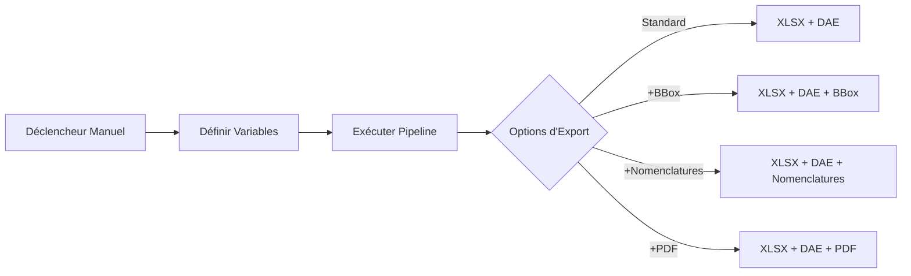
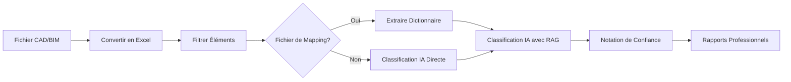
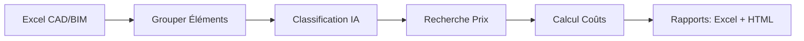
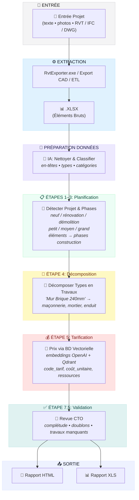
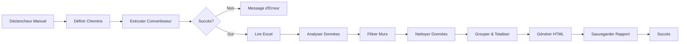

<p align="center">
  <a href="README.md">🇬🇧 English</a> •
  <a href="README.de.md">🇩🇪 Deutsch</a> •
  <a href="README.es.md">🇪🇸 Español</a> •
  <a href="README.fr.md">🇫🇷 Français</a> •
  <a href="README.ru.md">🇷🇺 Русский</a> •
  <a href="README.zh.md">🇨🇳 中文</a> •
  <a href="README.ar.md">🇸🇦 العربية</a>
</p>

<p align="center">
  
</p>
<p align="center">

  <a href="LICENSE">
  
</a>
<a href="https://datadrivenconstruction.io">
  
</a>
</br>


<!-- Tarification -->
<a href="https://dify.ai/pricing" target="_blank">
  
</a>
</br>


<h3 align="center">Traitement et conversion CAD/BIM (Revit, DWG, IFC, DGN) avec traitement par lots, regroupement, vérifications, estimation des coûts et rapports QTO. Visualisation des processus d'automatisation dans des agents ouverts et des workflows</h3>

<p align="center">
  Automatisez votre extraction et transformation de données CAD/BIM avec DDC UI, invite de commandes, PowerShell ou Workflows — sans dépendance fournisseur, sans licences Autodesk® ou CAD, et avec un contrôle total de vos données de projet
</p>


<p align="center">
  
</p>
<p align="center">
  
<p align="center">
 Clients et utilisateurs de DataDrivenConstruction
  <br>
  <a href="https://datadrivenconstruction.io/">
  
  </a>
  <br></br>
</p>


## Table des Matières

- [Vidéos Tutorielles](#vidéos-tutorielles)
- [Aperçu](#aperçu)
- [Formats Supportés](#formats-supportés)
- [Fonctionnalités Principales](#fonctionnalités-principales)
- [Exécution des Convertisseurs](#exécution-des-convertisseurs)
- [🖥️ Interface en Ligne de Commande (CLI)](#️-interface-en-ligne-de-commande-cli)
- [🚀 Intégration IA](#-intégration-ia--carburant-parfait-pour-les-produits-ia)
  - [📂 Dossier AI_INSTRUCTIONS](#-dossier-ai_instructions--contexte-prêt-pour-les-assistants-ia)
- [Démarrage Rapide](#démarrage-rapide)
- [📁 Workflows](#workflows-n8n-pour-travailler-avec-les-données-cadbim)
  - [⚡️ 1. Conversion Basique Revit, IFC, DWG, DGN](#️-1-conversion-basique-revit-ifc-dwg-dgn)
  - [⚡️ 2. Conversion Revit avec Paramètres Avancés](#️-2-conversion-revit-avec-paramètres-avancés)
  - [⚡️ 3. Conversion par Lots Revit, IFC, DWG avec Validation et Rapports](#️-3-conversion-par-lots-revit-ifc-dwg-avec-validation-et-rapports)
  - [⚡️ 4. Validation Multi-Format CAD (BIM) pour Revit, IFC, DWG, DGN](#️-4-validation-multi-format-cad-bim-pour-revit-ifc-dwg-dgn)
  - [⚡️ 5. Classification Universelle BIM/CAD avec IA & RAG pour Revit, IFC, DWG, DGN](#️-5-classification-universelle-bimcad-avec-ia--rag-pour-revit-ifc-dwg-dgn)
  - [⚡️ 6. Pipelines d'Estimation des Coûts de Construction](#️-6-pipelines-destimation-des-coûts-de-construction)
    - [⚡️ 6.1 Pipeline d'Estimation des Prix de Construction pour Revit et IFC avec LLM (IA)](#️-61-pipeline-destimation-des-prix-de-construction-pour-revit-et-ifc-avec-llm-ia)
    - [⚡️ 6.2 Pipeline d'Estimation des Coûts CAD (BIM) 4D/5D avec DDC CWICR](#️-62-pipeline-destimation-des-coûts-cad-bim-4d5d-avec-ddc-cwicr)
  - [⚡️ 7. Estimateur d'Empreinte Carbone CO2 pour Revit et IFC avec LLM (IA)](#️-7-estimateur-dempreinte-carbone-co2-pour-revit-et-ifc-avec-llm-ia)
  - [⚡️ 8. ETL Simple pour Cas d'Usage LLM pour Revit, IFC, DWG, DGN](#️-8-etl-simple-pour-cas-dusage-llm-pour-revit-ifc-dwg-dgn)
  - [⚡️ 9. Revit et IFC vers Métré HTML](#️-9-revit-et-ifc-vers-métré-html)
- [Dépannage](#dépannage)
- [Qu'est-ce que les DataFrames?](#quest-ce-que-les-dataframes)
- [Excel vers Revit. Mise à Jour du Projet depuis Excel](#excel-vers-revit-mise-à-jour-du-projet-depuis-excel)
- [Contribuer](#contribuer)
- [🆘 Support](#support)
- [🎓 Conseil et Formation](#conseil-et-formation)


## Vidéos Tutorielles

<table style="border: none; border-collapse: collapse;">
  <!-- Nouvelles vidéos en haut -->
  <tr>
    <td style="border: none; padding-right: 12px; vertical-align: top;">
      <a href="https://www.youtube.com/watch?v=fHkXDMLzWzQ" target="_blank">
        
      </a>
    </td>
    <td style="border: none; vertical-align: top;">
     <b> Présentation du Convertisseur Universel CAD/BIM </b>
      <br>
        Introduction au <strong>Convertisseur DDC</strong> pour les pipelines Revit, IFC, DWG et DGN — conversion, validation et cas d'usage d'automatisation.<br>
        <a href="https://www.youtube.com/watch?v=fHkXDMLzWzQ" target="_blank">Regarder la présentation du Convertisseur sur YouTube</a>
      </br>
    </td>
  </tr>
  <tr>
    <td style="border: none; padding-right: 12px; vertical-align: top;">
      <a href="https://www.youtube.com/watch?v=jVU7vlMNTO0" target="_blank">
        
      </a>
    </td>
    <td style="border: none; vertical-align: top;">
     <b> Pipeline Convertisseur DWG vers Excel </b>
      <br>
        Guide étape par étape sur l'automatisation de la conversion de données <strong>DWG vers Excel</strong> avec <code>n8n</code>, rendant les données de projets CAD faciles à utiliser pour les rapports et analyses.<br>
        <a href="https://www.youtube.com/watch?v=jVU7vlMNTO0" target="_blank">Regarder le Pipeline DWG vers Excel sur YouTube</a>
      </br>
    </td>
  </tr>
  <tr>
    <td style="border: none; padding-right: 12px; vertical-align: top;">
      <a href="https://youtu.be/QBaH8oBsPpM?si=gno6LZf98d6gWdPl" target="_blank">
        
      </a>
    </td>
    <td style="border: none; vertical-align: top;">
     <b> ETL avec Revit et IFC </b>
      <br>
        Apprenez à construire un <strong>pipeline ETL complet</strong> avec les données Revit et IFC : extraire, transformer, valider et charger les informations de projet dans des formats ouverts.<br>
        <a href="https://youtu.be/QBaH8oBsPpM?si=gno6LZf98d6gWdPl" target="_blank">Regarder le Tutoriel ETL avec Revit et IFC sur YouTube</a>
      </br>
    </td>
  </tr>

  <!-- Vidéos existantes -->
  <tr>
    <td style="border: none; padding-right: 12px; vertical-align: top;">
      <a href="https://youtu.be/HUbEPo-yfeA?si=Gjbj2glKgU3q-XZC" target="_blank">
        
      </a>
    </td>
    <td style="border: none; vertical-align: top;">
     <b> Démarrage Rapide n8n : Installation Facile & Création de Pipeline (Modèles et LLM) </b>
      <br>
        Tutoriel pas à pas pour débutants sur la configuration de <strong>n8n</strong> depuis zéro, la création de votre premier pipeline d'automatisation, et l'utilisation des LLM (comme ChatGPT/Claude) pour générer des automatisations.<br>
        <a href="https://youtu.be/HUbEPo-yfeA?si=Gjbj2glKgU3q-XZC" target="_blank">Regarder le Démarrage Rapide n8n sur YouTube</a>
      </br>
    </td>
  </tr>
  <tr>
    <td style="border: none; padding-right: 12px; vertical-align: top;">
      <a href="https://www.youtube.com/watch?v=PMTZNRFjD6c" target="_blank">
        
      </a>
    </td>
    <td style="border: none; vertical-align: top;">
     <b> Tutoriel Pipeline de Données CAD-BIM </b>
      <br>
        Démonstration pratique complète : automatisez des workflows complexes de <strong>traitement de données CAD-BIM</strong> dans <code>n8n</code>, incluant conversion, validation et analyses exploitables.<br>
        <a href="https://www.youtube.com/watch?v=PMTZNRFjD6c" target="_blank">Regarder le Tutoriel Pipeline CAD-BIM sur YouTube</a>
      </br>
    </td>
  </tr>
  <tr>
    <td style="border: none; padding-right: 12px; vertical-align: top;">
      <a href="https://www.youtube.com/watch?v=p84AmP2dcvg" target="_blank">
        
      </a>
    </td>
    <td style="border: none; vertical-align: top;">
     <b> ⚡️Validation Automatisée des Données CAD/BIM avec n8n | La Fin des Vérifications BIM Manuelles </b>
      <br>
        Découvrez comment automatiser entièrement les workflows de <strong>validation des données CAD/BIM</strong> avec la plateforme gratuite et open-source <code>n8n</code>. Idéal pour les équipes projet cherchant à économiser des heures (ou des jours) chaque semaine.<br>
        <a href="https://www.youtube.com/watch?v=p84AmP2dcvg" target="_blank">Regarder le Tutoriel de Validation Automatisée sur YouTube</a>
      </br>
    </td>
  </tr>
</table>


<p align="center">
  
</p>

</p>
<p align="center">
  
   <br></br>
</p>


## Aperçu

Ce pipeline automatise la conversion des fichiers CAD/BIM vers Excel pour les métrés, l'analyse de données et le traitement ultérieur. Il prend en charge le fonctionnement hors ligne et l'extensibilité avec Python ou des outils d'IA.


## Formats Supportés

| Format | Extension de Fichier | Convertisseur | Sortie |
|--------|---------------------|---------------|--------|
| Revit (2015-2026) | `.rvt` | RvtExporter.exe | Base de données XLSX + Géométrie DAE + Nomenclatures + Plans PDF |
| Revit (2015-2026) | `.rvt` | RVT2IFC_converter.exe | IFC2x3, IFC4, IFC4.3, IFCXML, IFCZIP, HDF5 |
| IFC (2x3, 4x1, 4x4, 4x, 4.3) | `.ifc` | IfcExporter.exe | Base de données XLSX + Géométrie DAE |
| AutoCAD (1983-2026) | `.dwg` | DwgExporter.exe | Base de données XLSX + Plans PDF |
| MicroStation (v7-v8) | `.dgn` | DgnExporter.exe | Base de données XLSX |

## Fonctionnalités Principales

- Conversion automatique vers Excel (éléments en lignes, propriétés en colonnes).
- Export de géométrie polygonale 3D (DAE) avec IDs d'éléments correspondant aux données XLSX.
- Traitement hors ligne sans internet, APIs ou licences.
- Extensible pour le post-traitement personnalisé.

## Exécution des Convertisseurs

Les convertisseurs DDC peuvent être lancés de différentes manières — **n8n n'est qu'une des interfaces** pour l'automatisation.
Selon votre workflow et votre niveau technique, vous pouvez choisir parmi quatre méthodes :

1. **Interface Graphique Utilisateur (UI)**
   - Idéal pour les utilisateurs non techniques et les conversions rapides ponctuelles.
   - Interface intuitive, aucune configuration requise — sélectionnez simplement un dossier et démarrez.
<p align="center">
  
  <br></br>
</p>

2. **Console / Terminal (CMD, PowerShell, Shell)**
   - Adapté aux utilisateurs avancés, développeurs et équipes techniques.
   - Flexible et scriptable, peut être intégré dans des scripts d'automatisation ou des processus par lots.
<p align="center">
  
  <br></br>
</p>

3. **Pipelines Python ou JavaScript**
   - Idéal pour les entreprises et équipes travaillant avec de grands ensembles de données.
   - Traitement évolutif de centaines de fichiers CAD (BIM) en parallèle.
   - Exemples prêts à l'emploi disponibles dans le dossier `DDC_Python_pipelines`.
<p align="center">
  
  <br></br>
</p>

4. **Workflows n8n**
   - Idéal pour les entreprises recherchant **une automatisation complète et une intégration système**.
   - Pipelines de bout en bout où la conversion CAD (BIM) fait partie d'un flux de données transparent.
   - Exemples fournis dans le dossier `DDC_n8n_workflows`.
  <p align="center">
  
  <br></br>
</p>


---

## 🖥️ Interface en Ligne de Commande (CLI)

Les convertisseurs DDC sont des outils de ligne de commande entièrement fonctionnels qui peuvent être intégrés dans **n'importe quel workflow d'automatisation**. Cela les rend parfaits pour le scripting, les pipelines CI/CD, les agents IA et les plateformes low-code.

### 🤖 Pourquoi le CLI est Important : Laissez l'IA Construire vos Pipelines

**Le principal avantage des outils CLI est que l'IA peut les utiliser directement.**

Les assistants de programmation IA modernes (**Claude Code**, **Cursor**, **GitHub Copilot**, **Windsurf**, **Aider**, **Cline**) peuvent exécuter des commandes shell, lire la documentation et construire des pipelines d'automatisation complets de manière autonome. Cela signifie :

> **Vous n'avez pas besoin d'écrire du code vous-même — décrivez simplement ce que vous voulez, et l'IA intégrera les convertisseurs DDC dans votre workflow.**

**Comment ça fonctionne :**
1. **Copiez cette documentation** (ou pointez l'IA vers ce README)
2. **Décrivez votre tâche** en langage naturel : *"Convertis tous les fichiers Revit du dossier X vers Excel, puis analyse les quantités de murs"*
3. **L'IA lit la syntaxe CLI**, écrit le script, l'exécute et traite les résultats

**Ce que l'IA peut faire avec les convertisseurs DDC :**
- ✅ Convertir par lots des centaines de fichiers CAD/BIM automatiquement
- ✅ Construire des pipelines ETL : Revit → Excel → Base de données → Tableau de bord
- ✅ Créer des scripts de validation qui vérifient la qualité des données BIM
- ✅ Générer des rapports à partir des données extraites (PDF, HTML, Excel)
- ✅ Intégrer les conversions dans les pipelines CI/CD
- ✅ Chaîner plusieurs outils : convertir → valider → classifier → estimer les coûts
- ✅ Planifier un traitement automatisé via cron/Task Scheduler

**Exemple de prompt pour assistant IA :**
```
J'ai des fichiers Revit dans C:\Projets. En utilisant DDC RvtExporter.exe situé dans C:\DDC\,
convertis tous les fichiers .rvt vers Excel avec les bounding boxes, puis crée un script Python
qui lit les fichiers XLSX et génère un rapport récapitulatif de tous les types de murs et leurs volumes.
```

L'IA va :
1. Scanner le dossier pour trouver les fichiers `.rvt`
2. Exécuter `RvtExporter.exe` pour chaque fichier avec les bons paramètres
3. Écrire du code Python pour analyser les fichiers `.xlsx` résultants
4. Générer le rapport récapitulatif

**Cela transforme DDC d'un outil en un bloc de construction natif IA pour l'automatisation des données de construction.**

### RvtExporter.exe — Revit vers XLSX/DAE/PDF

```
===========================================
         DataDrivenConstruction
         DDC Revit Community
         Version: 17.1.1
===========================================

Usage: RvtExporter <fichier entrée> [<fichier sortie>] [<fichier sortie>] [<mode export>] [<fichier catégories>] [bbox] [room] [schedule] [sheets2pdf] [-no-xlsx] [-no-collada]
```

| Paramètre | Description |
|-----------|-------------|
| `<fichier entrée>` | Fichier `.rvt` / `.rfa` d'entrée (requis) |
| `[<fichier sortie>]` | Chemin de sortie pour fichier `.dae` (optionnel, activé par défaut) |
| `[<fichier sortie>]` | Chemin de sortie pour fichier `.xlsx` (optionnel, activé par défaut) |
| `[<mode export>]` | `basic` (309 catégories), `standard` (724), `complete` (1209), ou `custom` |
| `[<fichier catégories>]` | Fichier `.txt` avec noms de catégories (requis uniquement en mode `custom`) |
| `bbox` | Inclure les bounding boxes des éléments dans la sortie XLSX |
| `room` | Inclure les données ToRoom/FromRoom dans la sortie XLSX |
| `schedule` | Exporter toutes les nomenclatures Revit |
| `sheets2pdf` | Exporter toutes les feuilles en PDF |
| `-no-xlsx` | Désactiver l'export au format `.xlsx` |
| `-no-collada` | Désactiver l'export au format `.dae` |

**Exemples :**
```bash
# Conversion basique (XLSX + DAE)
RvtExporter.exe "C:\Projets\Batiment.rvt"

# Export complet avec bounding boxes, nomenclatures et feuilles PDF
RvtExporter.exe "C:\Projets\Batiment.rvt" complete bbox schedule sheets2pdf

# Exporter uniquement XLSX (sans géométrie 3D)
RvtExporter.exe "C:\Projets\Batiment.rvt" -no-collada

# Catégories personnalisées depuis fichier
RvtExporter.exe "C:\Projets\Batiment.rvt" custom "C:\Config\mes_categories.txt"
```

---

### RVT2IFCconverter.exe — Revit vers IFC

```
===========================================
         DataDrivenConstruction
         DDC RVT2IFC Community
         Version: 17.1.2
===========================================

Usage: Rvt2IfcConverter <entrée.rvt> [<sortie.ifc>] [preset|mode=<nom>] [config="..."] [key=value ...]
```

| Paramètre | Description |
|-----------|-------------|
| `<entrée.rvt>` | Fichier Revit `.rvt` / `.rfa` (requis) |
| `[<sortie.ifc>]` | Chemin de sortie IFC (optionnel) |
| `preset=<nom>` ou `mode=<nom>` | `standard`, `extended`, `custom` |
| `config="K=V; K=V; ..."` | Configuration personnalisée (séparée par point-virgule) |
| `key=value` | Paramètres de configuration individuels |

**Exemples :**
```bash
# Export IFC standard
RVT2IFCconverter.exe "C:\Projets\Batiment.rvt"

# Export étendu avec plus de détails
RVT2IFCconverter.exe "C:\Projets\Batiment.rvt" preset=extended

# Chemin de sortie personnalisé
RVT2IFCconverter.exe "C:\Projets\Batiment.rvt" "D:\Sortie\modele.ifc"

# Configuration personnalisée
RVT2IFCconverter.exe "C:\Projets\Batiment.rvt" config="ExportBaseQuantities=true; SitePlacement=Shared"
```

---

### Exemples d'Intégration

Les outils CLI peuvent être appelés depuis pratiquement n'importe quel environnement :

#### 🔹 Scripts PowerShell / Batch
```powershell
# PowerShell : Traiter tous les fichiers .rvt dans un dossier
Get-ChildItem "C:\Projets\*.rvt" | ForEach-Object {
    & "C:\DDC\RvtExporter.exe" $_.FullName
}
```

```batch
:: Batch : Conversion simple
@echo off
"C:\DDC\RvtExporter.exe" "%1" complete bbox schedule
```

#### 🔹 Tâches VS Code
Ajouter à `.vscode/tasks.json` :
```json
{
  "version": "2.0.0",
  "tasks": [
    {
      "label": "Convertir Revit en Excel",
      "type": "shell",
      "command": "C:\\DDC\\RvtExporter.exe",
      "args": ["${file}", "complete", "bbox"],
      "problemMatcher": []
    }
  ]
}
```

#### 🔹 Assistants de Programmation IA (Claude Code, Cursor, Copilot, Windsurf, Aider, Cline)

Les assistants IA avec accès au terminal peuvent exécuter directement les convertisseurs DDC et construire des workflows complets :

```bash
# Exemple : L'IA exécute cette commande quand vous demandez "convertis mon fichier Revit en Excel"
RvtExporter.exe "C:\Projets\Modele.rvt" complete bbox schedule
```

**Scénarios réels de workflows IA :**

| Vous dites à l'IA | L'IA fait |
|-------------------|-----------|
| *"Convertis Batiment.rvt en Excel avec toutes les données"* | Exécute `RvtExporter.exe Batiment.rvt complete bbox room` |
| *"Traite tous les fichiers Revit dans ce dossier"* | Écrit une boucle PowerShell, exécute le convertisseur pour chaque fichier |
| *"Exporte au format IFC 4.3"* | Exécute `RVT2IFCconverter.exe` avec le bon preset |
| *"Crée une estimation des coûts depuis ce modèle"* | Convertit en Excel → analyse les données → calcule les coûts |
| *"Valide la qualité des données BIM"* | Convertit → analyse XLSX → génère un rapport de validation |
| *"Crée un tableau de bord à partir des données du projet"* | Convertit → traite avec pandas → crée la visualisation |

**Outils IA supportés :**
- **Claude Code** — accès complet au terminal, peut exécuter les convertisseurs et analyser les résultats
- **Cursor** — IDE avec IA qui peut exécuter des commandes shell
- **GitHub Copilot CLI** — assistant IA en ligne de commande
- **Windsurf** — IDE propulsé par IA avec intégration terminal
- **Aider** — programmation en binôme avec IA dans le terminal
- **Cline** — extension VS Code avec accès shell
- **Open Interpreter** — IA qui exécute du code localement
- **AutoGPT / AgentGPT** — agents IA autonomes

**Conseil pro :** Partagez ce README avec votre assistant IA pour qu'il comprenne la syntaxe CLI complète et puisse construire des pipelines sophistiqués de manière autonome.

#### 🔹 n8n (Nœud Execute Command)
```javascript
// Dans le nœud Execute Command de n8n
C:\DDC\RvtExporter.exe "{{ $json.filePath }}" complete bbox
```

#### 🔹 Python Subprocess
```python
import subprocess

result = subprocess.run([
    r"C:\DDC\RvtExporter.exe",
    r"C:\Projets\Batiment.rvt",
    "complete", "bbox", "schedule"
], capture_output=True, text=True)

print(result.stdout)
```

#### 🔹 Node.js / JavaScript
```javascript
const { execSync } = require('child_process');

const output = execSync(
  'C:\\DDC\\RvtExporter.exe "C:\\Projets\\Batiment.rvt" complete bbox'
);
console.log(output.toString());
```

#### 🔹 Make / Makefile
```makefile
CONVERTER = C:/DDC/RvtExporter.exe

convert:
	$(CONVERTER) "$(INPUT)" complete bbox schedule
```

#### 🔹 GitHub Actions / CI/CD
```yaml
- name: Convertir Revit en Excel
  run: |
    C:\DDC\RvtExporter.exe "${{ github.workspace }}\model.rvt" complete bbox
```

#### 🔹 Docker (Conteneur Windows)
```dockerfile
COPY DDC_CONVERTER_Revit /app/DDC
RUN C:\app\DDC\RvtExporter.exe "C:\data\model.rvt"
```

---

## 🚀 Intégration IA — Carburant Parfait pour les Produits AI

<p align="center">
  <b>Clonez simplement le dépôt et décrivez ce que vous voulez — l'IA fait le reste</b>
</p>

Les convertisseurs DDC ne sont pas seulement des outils — ce sont **du carburant prêt à l'emploi pour les applications alimentées par l'IA**. Créez des bots d'estimation des coûts, automatisez les flux de travail de construction ou créez des assistants intelligents — les données fonctionnent immédiatement avec les outils IA modernes.

### Pourquoi DDC est idéal pour l'IA

| Fonctionnalité | Avantage |
|----------------|----------|
| **Sortie structurée** | Format Excel/JSON que l'IA peut analyser immédiatement |
| **Interface CLI** | Les assistants IA peuvent appeler directement les convertisseurs |
| **Intégration DDC CWICR** | 55 000+ postes de travail avec embeddings précalculés pour la recherche sémantique |
| **Entrée multi-format** | Revit, IFC, DWG, DGN — une interface pour tous les formats |

### 🛠️ Fonctionne parfaitement avec

<table>
<tr>
<td align="center" width="14%">
<br/>
<b>Claude Code</b>
</td>
<td align="center" width="14%">
<br/>
<b>Google Antigravity</b>
</td>
<td align="center" width="14%">
<br/>
<b>Cursor</b>
</td>
<td align="center" width="14%">
<br/>
<b>Copilot</b>
</td>
<td align="center" width="14%">
<br/>
<b>n8n</b>
</td>
<td align="center" width="14%">
<br/>
<b>Dify</b>
</td>
<td align="center" width="14%">
<br/>
<b>Windsurf</b>
</td>
</tr>
</table>

---

### 💻 Claude Code & Google Antigravity — Assistants de Programmation IA

Le moyen le plus rapide de travailler avec les convertisseurs DDC. Ouvrez simplement le dépôt et posez des questions en langage naturel.

**Premiers pas:**
```bash
# Cloner le dépôt
git clone https://github.com/datadrivenconstruction/cad2data-Revit-IFC-DWG-DGN-pipeline-with-conversion-validation-qto.git

# Ouvrir avec Claude Code
cd cad2data-Revit-IFC-DWG-DGN-pipeline-with-conversion-validation-qto
claude
```

**Exemples de prompts:**

| Tâche | Prompt |
|-------|--------|
| **Conversion** | "Convertis tous les fichiers .rvt dans le dossier C:\Projects en Excel avec bounding boxes" |
| **Analyse de données** | "Analyse le XLSX résultant et montre tous les types de murs avec leurs volumes" |
| **Créer un pipeline** | "Crée un script Python qui convertit Revit → parse Excel → génère un rapport de coûts" |
| **Validation BIM** | "Vérifie la qualité des données BIM et génère un rapport de complétude des paramètres" |
| **Estimation des coûts** | "En utilisant DDC CWICR, estime les coûts des travaux de béton de ce modèle" |
| **Intégration CI/CD** | "Écris une GitHub Action qui convertit automatiquement les fichiers .rvt lors d'un push" |

**Conseils de pro:**
- Pointez l'IA vers des fichiers spécifiques: *"Analyse le fichier Parquet et résume la distribution des coûts"*
- Demandez des explications: *"Explique comment fonctionne la méthodologie de chiffrage basée sur les ressources"*
- Demandez des modifications: *"Modifie le workflow n8n pour ajouter des notifications par email"*

---

⭐ <b>Si vous trouvez nos outils utiles et souhaitez voir plus d'applications similaires pour l'industrie de la construction, merci de donner une étoile à nos dépôts.</b>
Ajoutez une étoile au workflow DDC sur GitHub et soyez instantanément notifié des nouvelles versions.
<p align="center">
  <br>
  
  <br></br>
</p>

---

### 📂 Dossier AI_INSTRUCTIONS — Contexte Prêt pour les Assistants IA

Le dépôt inclut un dossier dédié **[AI_INSTRUCTIONS](AI_INSTRUCTIONS/)** contenant tout ce dont les assistants de codage IA ont besoin pour travailler efficacement avec ces outils.

**Ce qu'il contient:**

| Fichier | Objectif |
|---------|----------|
| **INSTRUCTIONS.md** | Aperçu principal: philosophie du dépôt, formats d'entrée/sortie, exemples CLI |
| **CLAUDE.md** | Instructions spécifiques pour Claude Code avec syntaxe CLI détaillée |
| **OPENCODE.md** | Instructions pour Opencode |
| **ANTIGRAVITY.md** | Instructions pour Google Antigravity avec exemples d'intégration GCP |
| **TOOLS_OVERVIEW.md** | Référence complète de tous les convertisseurs et logique de processus |
| **DATA_DRIVEN_CONSTRUCTION_BOOK.txt** | Le livre "Data-Driven Construction" — philosophie directrice pour l'automatisation de la construction |

**Pourquoi c'est important:**
- Les assistants IA peuvent lire ces fichiers pour comprendre le contexte complet
- Contient la syntaxe CLI, les modèles d'intégration et les meilleures pratiques
- Le livre sert de "boussole" pour les décisions d'automatisation dans la construction
- Les workflows n8n sont documentés comme **modèles visuels de logique de processus** — pas la solution finale, mais une base qui peut être implémentée dans n'importe quel langage (Python, JavaScript, C#, Go, Rust)

**Comment utiliser:**
```bash
# Les assistants IA lisent automatiquement AI_INSTRUCTIONS en travaillant avec le dépôt
# Ou dirigez-les directement:
"Lis AI_INSTRUCTIONS/CLAUDE.md et aide-moi à créer un pipeline de conversion par lots"
```

---

## Démarrage Rapide avec n8n

### Prérequis

1. **Installer Node.js** depuis [nodejs.org](https://nodejs.org/).
2. **Démarrer n8n** dans l'invite de commandes :
   ```
   npx n8n
   ```
   Accès à `http://localhost:5678`.
3. **Télécharger ce dépôt depuis GitHub**
   - Cliquez sur le bouton vert "Code" → "Download ZIP"
   - Décompressez le dossier
4. **Exécuter le Workflow**
     - Vous êtes prêt. Cliquez simplement sur **Execute Workflow** dans n8n pour traiter vos fichiers CAD-BIM
<p align="center">
  
  <br></br>
</p>

---

## Workflows n8n pour Travailler avec les Données CAD/BIM

### ⚡️ 1. Conversion Basique Revit, IFC, DWG, DGN
**Fichier** : `n8n_1_Revit_IFC_DWG_Conversation_simple.json`

Convertit les fichiers CAD/BIM (`.rvt`, `.ifc`, `.dwg`, `.dgn`) vers Excel (XLSX) et Collada (DAE) pour les fichiers Revit/IFC. Configuration minimale pour une mise en place rapide.

<p align="center">
  
</p>

#### Installation
1. Importer `n8n_1_Revit_IFC_DWG_Conversation_simple.json` dans n8n via **Workflows > Import from File**.
2. Mettre à jour le nœud **Set Variables** :
   ```
   # Revit
   path_to_converter: C:\Converters\datadrivenlibs\RvtExporter.exe
   path_project_file: C:\Projects\Model.rvt

   # Revit vers IFC
   path_to_converter: C:\Converters\datadrivenlibs\RVT2IFCconverter.exe
   path_project_file: C:\Projects\Model.rvt

   # IFC
   path_to_converter: C:\Converters\datadrivenlibs\IfcExporter.exe
   path_project_file: C:\Projects\Model.ifc

   # DWG
   path_to_converter: C:\Converters\datadrivenlibs\DwgExporter.exe
   path_project_file: C:\Projects\Plan.dwg

   # DGN
   path_to_converter: C:\Converters\datadrivenlibs\DgnExporter.exe
   path_project_file: C:\Projects\Bridge.dgn
   ```
3. S'assurer que le convertisseur est dans le dossier `datadrivenlibs`, ex : `C:\Converters\datadrivenlibs\XxxExporter.exe`.

#### Utilisation
1. Exécuter le workflow via **Manual Trigger**.
2. Vérifier le dossier de sortie pour les fichiers XLSX, DAE et PDF.
3. Surveiller les logs pour le statut de conversion.


### ⚡️ 2. Conversion Revit avec Paramètres Avancés
**Fichier** : `n8n_2_All_Settings_Revit_IFC_DWG_Conversation_simple.json`

Convertit les fichiers CAD/BIM avec des modes d'export personnalisables (basic : 309 catégories, standard : 724 catégories, complete : toutes les 1209 catégories) et des sorties optionnelles comme les bounding boxes, nomenclatures Revit ou plans PDF.

<p align="center">
  
</p>

#### Installation
1. Importer `n8n_2_All_Settings_Revit_IFC_DWG_Conversation_simple.json` dans n8n via **Workflows > Import from File**.
2. Mettre à jour le nœud **Set Variables** avec les chemins du convertisseur et des fichiers (identique à la Conversion Basique).
3. Configurer les options d'export :
   ```
   export_mode: basic | standard | complete
   bbox: true | false
   schedule: true | false
   sheets2pdf: true | false
   no-xlsx: true | false
   no-collada: true | false
   ```

#### Utilisation
1. Exécuter le workflow via **Manual Trigger**.
2. Vérifier le dossier de sortie pour les fichiers XLSX, DAE, nomenclatures ou PDF selon les paramètres.
3. Surveiller les logs pour le statut de conversion.




### ⚡️ 3. Conversion par Lots Revit, IFC, DWG avec Validation et Rapports
**Fichier** : `n8n_3_CAD-BIM-Batch-Converter-Pipeline.json`

Automatise la conversion par lots des fichiers Revit (`.rvt`) vers Excel (XLSX) et Collada (DAE), valide les sorties, suit les temps de traitement et génère un rapport HTML avec métriques, liens vers les fichiers et détails de configuration.

<p align="center">
  
</p>

#### Installation
1. Importer `n8n_3_CAD-BIM-Batch-Converter-Pipeline.json` dans n8n via **Workflows > Import from File**.
2. Mettre à jour le nœud **Set Configuration Parameters** :
   ```
   converter_path: C:\Converters\datadrivenlibs\RvtExporter.exe
   source_folder: C:\Sample_Projects
   output_folder: C:\Output
   include_subfolders: true
   file_extension: .rvt
   ```
3. S'assurer que `RvtExporter.exe` est dans `C:\Converters\datadrivenlibs\` et que les fichiers `.rvt` sont dans le dossier source.

#### Utilisation
1. Exécuter le workflow via **Manual Trigger**.
2. Surveiller les logs pour la découverte de fichiers et la progression de conversion.
3. Examiner le rapport HTML (s'ouvre automatiquement dans le navigateur) avec :
   - Métriques (fichiers traités, taux de succès, temps, tailles).
   - Tableaux succès/échec avec liens vers les fichiers.
4. Vérifier le dossier de sortie pour les fichiers XLSX et DAE.


### ⚡️ 4. Validation Multi-Format CAD (BIM) pour Revit, IFC, DWG, DGN
**Fichiers** : `n8n_4_Validation_CAD_BIM_Revit_IFC_DWG.json`, `DDC_BIM_Requirements_Table_for_Revit_IFC_DWG.xlsx`

Valide les données CAD/BIM selon des règles prédéfinies, générant des rapports Excel colorés avec métriques de qualité des données.

<p align="center">
  
</p>

#### Installation
1. Importer `n8n_3_Validation_CAD_BIM_Revit_IFC_DWG.json` dans n8n via **Workflows > Import from File**.
2. Mettre à jour le nœud **Setup Paths** :
   ```
   path_to_converter: C:\Converters\datadrivenlibs\RvtExporter.exe
   project_file: C:\Projects\Model.rvt
   validation_rules_path: C:\Validation\DDC_Revit_IFC_Validation_Table.xlsx
   ```
3. S'assurer que le convertisseur et le fichier de règles de validation sont accessibles.

#### Utilisation
1. Exécuter le workflow via **Manual Trigger**.
2. Vérifier le dossier de sortie pour le rapport XLSX coloré.
3. Examiner les métriques de qualité des données (taux de remplissage, valeurs uniques, patterns).
4. Surveiller les logs pour le statut de validation.


### ⚡️ 5. Classification Universelle BIM/CAD avec IA & RAG pour Revit, IFC, DWG, DGN
**Fichier** : `n8n_5_CAD_BIM_Automatic_Classification_with_LLM_and_RAG.json`

🔗 **Amélioré avec la Base de Données DDC CWICR** : [OpenConstructionEstimate-DDC-CWICR](https://github.com/datadrivenconstruction/OpenConstructionEstimate-DDC-CWICR)
Ce workflow exploite la base de données vectorielle DDC CWICR (Qdrant) contenant **55 719 éléments de travaux** avec embeddings OpenAI pré-calculés (3072d). Le pipeline RAG effectue une recherche sémantique dans 9 langues, faisant correspondre les éléments BIM aux descriptions standardisées des travaux de construction. La base de données couvre tout le spectre des activités de construction — des terrassements et béton aux installations MEP spécialisées — permettant une classification précise selon n'importe quel standard (Omniclass, Uniclass, MasterFormat ou systèmes personnalisés).

Classifie intelligemment les éléments de bâtiment à partir des fichiers CAD/BIM en utilisant l'IA et N'IMPORTE QUEL système de classification - standards internationaux (Omniclass, Uniclass, etc.) ou vos classifications personnalisées/propriétaires. Prend en charge l'extraction automatique de dictionnaire à partir de fichiers de mapping.

#### Fonctionnalités Principales
- **Classification Universelle** : Fonctionne avec N'IMPORTE QUEL système de classification - standard ou personnalisé
- **Classification par IA** : Utilise les LLM pour classifier les éléments avec notation de confiance
- **Mapping Intelligent** : Extrait automatiquement les dictionnaires depuis fichiers Excel, CSV, PDF
- **Filtrage Automatique** : Sépare les éléments de bâtiment des dessins/annotations
- **Support Hiérarchique** : Gère les structures de classification plates et hiérarchiques
- **Rapports Professionnels** : Tableaux de bord HTML interactifs + Excel multi-feuilles
- **Technologie RAG** : Génération Augmentée par Récupération pour une classification précise

<p align="center">
  
</p>

#### Installation
1. Importer `n8n_5_CAD_BIM_Automatic_Classification_with_LLM_and_RAG.json` dans n8n
2. Configurer les identifiants IA (OpenAI/Anthropic/OpenRouter/Gemini/xAI)
3. Mettre à jour le nœud **Setup - Define file paths** :
   ```
   path_to_converter: C:\Converters\datadrivenlibs\RvtExporter.exe
   project_file: C:\Projects\Model.rvt
   group_by: Type Name
   classification_name: [Tout nom de classification]
   optional_mapping_file: C:\Classifications\[votre_classification].xlsx
   optional_help_prompt: "Contexte additionnel pour l'IA"
   ```

#### Flexibilité de Classification
Ce pipeline fonctionne avec **N'IMPORTE QUEL système de classification** :
- ✅ Standards internationaux (Omniclass, Uniclass, MasterFormat, etc.)
- ✅ Standards nationaux (DIN, NF, BS, etc.)
- ✅ Classifications spécifiques à l'entreprise
- ✅ Classifications de projet personnalisées
- ✅ Systèmes de codage propriétaires
- ✅ Toute classification structurée au format Excel/CSV/PDF

#### Comment Ça Fonctionne
1. **Avec Fichier de Mapping** : Fournissez votre dictionnaire de classification (Excel/CSV/PDF) - l'IA extraira les codes et les appliquera avec précision
2. **Sans Fichier de Mapping** : L'IA utilise ses connaissances pour classifier selon le standard que vous spécifiez
3. **Mode Hybride** : Combinez fichier de mapping avec intelligence IA pour les meilleurs résultats

**⏱️ Temps de Traitement :** 3-10 secondes par groupe d'éléments (varie selon le modèle LLM)




### ⚡️ 6. Pipelines d'Estimation des Coûts de Construction

🔗 **Propulsé par la Base de Données DDC CWICR** : [OpenConstructionEstimate-DDC-CWICR](https://github.com/datadrivenconstruction/OpenConstructionEstimate-DDC-CWICR)

Les workflows d'estimation des coûts se connectent à la base de données de coûts DDC CWICR contenant **55 719 éléments de travaux** et **27 672 ressources** avec détails des prix par région sur plus de 10 marchés. La méthodologie basée sur les ressources sépare les normes physiques (heures de main d'œuvre, quantités de matériaux, temps d'équipement) des prix volatils, garantissant des estimations transparentes et auditables.

📦 **Téléchargements de Base de Données** : [DDC CWICR Releases](https://github.com/datadrivenconstruction/OpenConstructionEstimate-DDC-CWICR/releases) — Excel, Parquet, CSV, snapshots Qdrant
🌐 **Démo en Ligne** : [openconstructionestimate.com](https://openconstructionestimate.com) — explorez la base de données et la recherche sémantique

---

#### ⚡️ 6.1 Pipeline d'Estimation des Prix de Construction pour Revit et IFC avec LLM (IA)
**Fichier :** `n8n_6_Construction_Price_Estimation_Pipeline.json`

Automatise l'estimation des coûts pour les éléments de bâtiment à partir des fichiers CAD/BIM. Utilise l'IA pour classifier les matériaux, rechercher les prix du marché et générer des rapports de coûts complets.

##### Fonctionnalités Principales
- **Classification IA** : Matériaux selon standards EU/DE/US
- **Tarification Intelligente** : Bases de données régionales avec solutions de repli
- **Analyse des Coûts** : Coûts totaux, coût unitaire, top 10 des groupes
- **Sortie Multi-Format** : Classeur Excel + rapport HTML avec graphiques

<p align="center">
  
</p>


##### Installation
1. Importer `Construction_Price_Estimation_Pipeline.json` dans n8n
2. Configurer les identifiants IA (OpenAI/Anthropic)
3. Mettre à jour le nœud **Set Parameters** :
   ```
   input_file_path: C:\Output\Project_Elements.xlsx
   grouping_parameter: Type Name )
   country: Germany
   ```
- Paramètre de regroupement (group_by, ex : 'Type Name', 'IfcType' pour IFC ou autre)
- Pays (pays pour lequel les valeurs seront calculées, ex : 'Germany' ou 'Brazil')

**⏱️ Temps de Traitement :** 5-15 secondes par groupe d'éléments (dépend de la vitesse du LLM)



---

#### ⚡️ 6.2 Pipeline d'Estimation des Coûts CAD (BIM) 4D/5D avec DDC CWICR
**Fichier :** `n8n_4_CAD_(BIM)_Cost_Estimation_Pipeline_4D_5D_with_DDC_CWICR.json`

🔗 **Dépôt du Workflow** : [OpenConstructionEstimate-DDC-CWICR](https://github.com/datadrivenconstruction/OpenConstructionEstimate-DDC-CWICR)

Estimation automatisée des coûts à partir des modèles Revit/IFC/DWG. Extrait les données BIM, classifie les éléments, décompose en éléments de travaux et génère des estimations 4D/5D avec décomposition complète des ressources.

<p align="left">
  <a href="https://datadrivenconstruction.io">
    
  </a>
</p>

##### Étapes du Pipeline

| Étape   | Nom                  | Description                                                       |
|---------|----------------------|-------------------------------------------------------------------|
| **0**   | Collecter Données BIM | Extraire les éléments depuis Revit via DDC Converter             |
| **1**   | Détection Projet     | L'IA identifie le type de projet (Résidentiel, Commercial, etc.) |
| **2**   | Génération Phases    | L'IA crée les phases de construction                              |
| **3**   | Affectation Éléments | L'IA associe les types BIM aux phases                             |
| **4**   | Décomposition Travaux| L'IA décompose les types en éléments de travaux ("Mur Brique" → maçonnerie, mortier) |
| **5**   | Recherche Vectorielle| Trouver les tarifs correspondants dans DDC CWICR via Qdrant      |
| **6**   | Mapping Unités       | Convertir les unités BIM en unités tarifaires                     |
| **7**   | Calcul Coûts         | Qté × Prix Unitaire pour chaque élément de travaux               |
| **7.5** | Validation           | Revue CTO pour complétude et doublons                             |
| **8**   | Agrégation           | Somme par phases et catégories                                    |
| **9**   | Génération Rapport   | Créer sorties HTML et Excel                                       |



##### Fonctionnalités Principales
- **Intégration BIM Complète** : Support natif Revit, IFC, DWG via DDC Converter
- **Décomposition par IA** : Décompose les types BIM complexes en éléments de travaux constitutifs
- **Tarification Sémantique** : Recherche vectorielle Qdrant avec 55 719 éléments de travaux pré-encodés
- **Support Multi-LLM** : OpenAI GPT-4o, Claude, Gemini 2.5 Pro, xAI Grok, DeepSeek
- **Validation CTO** : Étape de revue IA vérifiant la complétude et détectant les doublons
- **9 Langues** : AR, DE, EN, ES, FR, HI, PT, RU, ZH avec tarification régionale

##### Prérequis

| Composant | Exigence | Description |
|-----------|----------|-------------|
| **n8n** | v1.0+ (auto-hébergé) | Plateforme d'automatisation de workflows |
| **Qdrant** | Cloud ou auto-hébergé | Base de données vectorielle pour recherche sémantique |
| **OpenAI API** | `text-embedding-3-large` | Génère les embeddings pour correspondance |
| **LLM API** | OpenAI / Claude / Gemini / Grok | Modèles IA pour classification |
| **DDC Converter** | `RvtExporter.exe` | Extrait les données BIM vers Excel |

##### Langues & Niveaux de Prix Supportés

| Code  | Langue      | Niveau de Prix  | Devise | Collection Qdrant   |
|-------|-------------|-----------------|--------|---------------------|
| `AR`  | Arabe       | Dubaï           | AED    | `ddc_cwicr_ar`      |
| `DE`  | Allemand    | Berlin          | EUR    | `ddc_cwicr_de`      |
| `EN`  | Anglais     | Toronto         | CAD    | `ddc_cwicr_en`      |
| `ES`  | Espagnol    | Barcelone       | EUR    | `ddc_cwicr_es`      |
| `FR`  | Français    | Paris           | EUR    | `ddc_cwicr_fr`      |
| `HI`  | Hindi       | Mumbai          | INR    | `ddc_cwicr_hi`      |
| `PT`  | Portugais   | São Paulo       | BRL    | `ddc_cwicr_pt`      |
| `RU`  | Russe       | Saint-Pétersbourg | RUB  | `ddc_cwicr_ru`      |
| `ZH`  | Chinois     | Shanghai        | CNY    | `ddc_cwicr_zh`      |

##### Fichiers de Sortie

Les rapports sont sauvegardés dans le dossier du projet :
```
projet_YYYY-MM-DD.html   ← Rapport interactif (s'ouvre dans le navigateur)
projet_YYYY-MM-DD.xls    ← Tableur compatible Excel
```

<p align="center">
  
</p>

##### Sélection du Modèle LLM

Le workflow supporte plusieurs fournisseurs IA. Activez votre modèle préféré :

| Modèle           | Statut       |
|------------------|--------------|
| OpenAI GPT-4o    | ✅ Par défaut |
| Claude Opus 4    | Désactivé    |
| Gemini 2.5 Pro   | Désactivé    |
| xAI Grok         | Désactivé    |
| DeepSeek         | Désactivé    |

Pour changer de modèle : **Activez** le nœud du modèle souhaité et **Désactivez** les autres.

**⏱️ Temps de Traitement :** Varie selon la taille du projet et le modèle LLM


### ⚡️ 7. Estimateur d'Empreinte Carbone CO2 pour Revit et IFC avec LLM (IA)

**Fichier :** `n8n_7_Carbon_Footprint_CO2_Estimator_for_Revit_and_IFC.json`

🔗 **Intégré avec la Base de Données DDC CWICR** : [OpenConstructionEstimate-DDC-CWICR](https://github.com/datadrivenconstruction/OpenConstructionEstimate-DDC-CWICR)
Ce workflow utilise les classifications détaillées de matériaux et la décomposition des ressources de DDC CWICR pour calculer le carbone incorporé (étapes du cycle de vie A1-A3). La base de données fournit des quantités précises de matériaux par élément de travaux — volumes de béton, tonnages d'acier, surfaces d'isolation — qui sont ensuite mis en correspondance avec les facteurs d'émission CO₂e. Avec des données couvrant 9 langues et plusieurs standards régionaux (EU/DE/US), le pipeline fournit des évaluations précises de durabilité pour les projets internationaux.

Calcule les émissions de carbone incorporé pour les projets de bâtiment. Analyse les matériaux, applique les facteurs d'émission et génère des rapports professionnels de durabilité.

#### Fonctionnalités Principales
- **Analyse du Carbone Incorporé** : Étapes du cycle de vie A1-A3
- **Classification des Matériaux** : Standards EU/DE/US avec données de densité
- **Facteurs d'Émission** : Facteurs CO2e standard de l'industrie par matériau
- **Évaluation d'Impact** : Catégorisation Critique/Élevé/Moyen/Faible
- **Rapports Professionnels** : HTML style McKinsey + Excel multi-feuilles

<p align="center">
  
</p>

#### Installation
1. Importer `n8n_6_Carbon_Footprint_CO2_Estimator_for_Revit_and_IFC.json` dans n8n
2. Configurer les identifiants IA (OpenAI/Anthropic)
3. Mettre à jour le nœud **Setup - Define file paths** :
   ```
   path_to_converter: C:\Converters\datadrivenlibs\RvtExporter.exe
   project_file: C:\Projects\Model.rvt
   group_by: Type Name (Category ou autre)
   country: Germany (pays pour lequel les valeurs seront calculées, ex : 'Germany' ou 'Brazil')

   ```

**⏱️ Temps de Traitement :** 5-15 secondes par groupe d'éléments (dépend de la vitesse du LLM)


### ⚡️ 8. ETL Simple pour Cas d'Usage LLM pour Revit, IFC, DWG, DGN
**Fichier** : `n8n_8_Revit_IFC_DWG_Conversation_EXTRACT_Phase_with_Parse_XLSX.json`

Convertit un fichier Revit en Excel, génère un nom de fichier XLSX et analyse les données pour les tâches d'automatisation basées sur LLM.

<p align="center">
  
</p>

#### Installation
1. Importer `n8n_4_Revit_IFC_DWG_Conversation_EXTRACT_Phase_with_Parse_XLSX.json` dans n8n via **Workflows > Import from File**.
2. Mettre à jour le nœud **Setup Paths** :
   ```
   path_to_converter: C:\Converters\datadrivenlibs\RvtExporter.exe
   project_file: C:\Projects\Model.rvt
   ```
3. S'assurer que le convertisseur est accessible.

#### Utilisation
1. Exécuter le workflow via **Manual Trigger**.
2. Vérifier le dossier de sortie pour le fichier XLSX.
3. Utiliser les données analysées pour les tâches LLM (ex : alimenter JSON vers Claude ou ChatGPT).
4. Surveiller les logs pour le statut de conversion et d'analyse.


### ⚡️ 9. Revit et IFC vers Métré HTML
**Fichier** : `n8n_9_CAD_BIM_Quantity_TakeOff_HTML_Report_Generatorn.json`

Analyse les données de murs Revit, calcule les volumes par type et génère des rapports HTML interactifs avec statistiques récapitulatives.

<p align="center">
  
</p>

#### Installation
1. Importer `n8n_5_CAD_BIM_Quantity_TakeOff_HTML_Report_Generatorn.json` dans n8n via **Workflows > Import from File**.
2. Mettre à jour le nœud **Setup Paths** :
   ```
   path_to_converter: C:\Converters\datadrivenlibs\RvtExporter.exe
   project_file: C:\Projects\Model.rvt
   ```
3. S'assurer que le convertisseur est accessible.

#### Utilisation
1. Exécuter le workflow via **Manual Trigger**.
2. Vérifier le dossier de sortie pour le rapport HTML.
3. Examiner le rapport (s'ouvre automatiquement dans le navigateur) pour les quantités de murs et statistiques.
4. Surveiller les logs pour le statut de traitement.




## Dépannage

### Nœud Execute Command Manquant (n8n 2.0+)

**Symptômes :**
- Les nœuds s'affichent avec un point d'interrogation (?)
- Erreur : `Unrecognized node type: n8n-nodes-base.executeCommand`
- Execute Command n'apparaît pas dans la recherche de nœuds

**Solution :** Ajouter la variable d'environnement avant de démarrer n8n :
```cmd
set NODES_EXCLUDE=[] && npx n8n
```
Ou créer un fichier `.env` dans `C:\Users\VOTRE_UTILISATEUR\.n8n\.env` avec `NODES_EXCLUDE=[]`

Voir [⚠️ Configuration n8n 2.0+](#️-configuration-n8n-20-requise) pour plus de détails.

### Erreur Module 'os' Bloqué
Dans les versions n8n 1.98.0–1.101.x, le module `os` est bloqué, affectant des bibliothèques comme pandas. Solution : Utiliser la dernière version avec `npx n8n@latest`.


## Qu'est-ce que les DataFrames?

Les formats CAD/BIM comme `.rvt`, `.ifc`, `.dwg` ou `.dgn` sont complexes et propriétaires. Les convertir en **DataFrames** — des structures tabulaires avec lignes (éléments) et colonnes (propriétés) — permet un traitement efficace des données. Popularisés par la bibliothèque pandas de Python, les DataFrames sont largement utilisés pour leur compatibilité avec les outils d'automatisation, d'analyse et d'IA (seule la bibliothèque pandas de Python est téléchargée 12 millions de fois par jour). Ils simplifient des tâches comme le filtrage, le regroupement et la visualisation, les rendant idéaux pour les tableaux de bord, métrés et validation.

<p align="center">
  
</p>


Retour aux Racines du "BIM". 𝗟'𝗜𝗱𝗲𝗻𝘁𝗶𝘁𝗲́ 𝗣𝗲𝗿𝗱𝘂𝗲 : 𝗱𝗲 𝗹𝗮 𝗕𝗮𝘀𝗲 𝗱𝗲 𝗗𝗼𝗻𝗻𝗲́𝗲𝘀 𝗮𝘂 𝗕𝘂𝘇𝘇𝘄𝗼𝗿𝗱 𝗠𝗮𝗿𝗸𝗲𝘁𝗶𝗻𝗴.
Au début, le BIM n'était jamais une question de buzzwords ou de débats interminables sur l'interopérabilité. Sa fondation a toujours été les bases de données.

🔹 1974. Charles Eastman a introduit le Building Description System (BDS). Dans son article, le mot base de données apparaît 43 fois.
🔹 2000. ADSK a publié un livre blanc soulignant la valeur de l'accès direct à la "base de données CAD". Les traducteurs neutres comme STEP/IFC étaient considérés comme secondaires.
💬 "Capacité d'échange de données natif – les applications doivent accéder directement à la base de données CAD principale, pour ne pas perdre en détail et précision."
🔹 2002. Après l'acquisition de Revit-BOM, le livre blanc BIM d'ADSK plaçait encore la base de données au cœur (23 mentions du terme).
🔹 2003. Pour la dernière fois, ADSK a officiellement lié le BIM à l'IT et aux bases de données. Après cela, la base de données a disparu du narratif — remplacée par du pur marketing.

<p align="center">
  
</p>

En réalité, le BIM a toujours été simple : une base de données d'éléments de projet, chacun avec ses propres paramètres. Tout le reste est couches marketing.
Peut-être est-il temps de revenir à l'essentiel : des données ouvertes, structurées et accessibles.


**En Savoir Plus :**
- [Python Pandas – Un Outil Indispensable](https://datadrivenconstruction.io/2025/06/048-python-pandas-an-indispensable-tool-for-working-with-data/)
- [DataFrame – Format de Données Tabulaires Universel](https://datadrivenconstruction.io/2025/06/049-dataframe-universal-tabular-data-format/)
- [Données Structurées dans la Construction](https://datadrivenconstruction.io/2025/06/025-structured-data/)


## Excel vers Revit. Mise à Jour du Projet depuis Excel

Après avoir transformé et enrichi vos données Excel, vous pouvez facilement repousser les données modifiées dans votre projet Revit. Notre outil dédié **[ImportExcelToRevit](https://github.com/datadrivenconstruction/cad2data-Revit-IFC-DWG-DGN-pipeline-with-conversion-validation-qto/tree/main/DDC_Update_Revit_from_Excel)** rend ce processus transparent en important directement les feuilles Excel mises à jour dans les paramètres et familles Revit.

> **Simplifiez votre workflow BIM :** Revit ➡️ Excel ➡️ Transformer ➡️ Excel ➡️ Revit.


## 🗃️ DDC CWICR - Base de Données des Coûts de Construction

Pour l'estimation des coûts de construction de la plus haute qualité, ce dépôt s'intègre avec **[OpenConstructionEstimate-DDC-CWICR](https://github.com/datadrivenconstruction/OpenConstructionEstimate-DDC-CWICR)** — une base de données open source multilingue des coûts de construction.

### Pourquoi DDC CWICR?

DDC CWICR (Construction Work Items, Components & Resources) fournit la base pour une estimation des coûts précise, transparente et auditable :

- **55 719 Éléments de Travaux** — couverture complète des activités de construction
- **27 672 Ressources** — matériaux, main d'œuvre et équipements avec décompositions détaillées
- **9 Langues** — Arabe, Chinois, Allemand, Anglais, Espagnol, Français, Hindi, Portugais, Russe
- **85 Champs de Données** — structure complète des coûts basée sur les ressources par élément de travaux
- **Recherche Sémantique** — base de données vectorielle Qdrant avec embeddings OpenAI (3072d) pour requêtes en langage naturel

### Avantages de la Base de Données

| Fonctionnalité | Bénéfice |
|----------------|----------|
| **Méthodologie Basée sur les Ressources** | Normes physiques (heures de main d'œuvre, quantités de matériaux) séparées des prix volatils |
| **Transparence Complète** | Décomposition complète de chaque composant de coût — pas de majorations cachées |
| **Export Multi-Format** | Excel, Parquet, CSV, snapshots Qdrant pour tout scénario d'intégration |
| **Prêt pour l'IA** | Embeddings pré-calculés permettant pipelines RAG et estimation propulsée par LLM |

### Démo en Ligne & Ressources

🌐 **Démo en Ligne** : [openconstructionestimate.com](https://openconstructionestimate.com) — explorez la base de données et la recherche sémantique en action

📦 **Dépôt** : [github.com/datadrivenconstruction/OpenConstructionEstimate-DDC-CWICR](https://github.com/datadrivenconstruction/OpenConstructionEstimate-DDC-CWICR)

Les workflows de ce dépôt (particulièrement les **Workflows 5, 6 et 7**) exploitent DDC CWICR pour la classification, la tarification et les calculs d'empreinte carbone, assurant une qualité d'estimation de niveau professionnel.


## Contribuer

Nous accueillons les contributions ! N'hésitez pas à :
- Signaler des bugs
- Suggérer des fonctionnalités
- Soumettre des pull requests
- Améliorer la documentation


## Support

🌐 **Site web** : [DataDrivenConstruction.io](https://datadrivenconstruction.io)
💬 **Issues** : [GitHub Issues](https://github.com/datadrivenconstruction/Revit-IFC-DWG-DGN-Converter-in-n8n-with-QTO/issues)
📧 **Email** : info@datadrivenconstruction.io


## Conseil et Formation

Nous travaillons avec des entreprises de construction, d'ingénierie, de conseil et de technologie leaders dans le monde entier pour les aider à implémenter les principes de données ouvertes, automatiser le traitement CAD/BIM et construire des pipelines ETL robustes.

Si vous souhaitez tester cette solution avec vos propres données, ou si vous êtes intéressé par l'adaptation du workflow à des tâches de projets réels, n'hésitez pas à nous contacter.

Notre équipe dispense des ateliers pratiques, fournit du conseil stratégique et développe des prototypes adaptés aux processus de projets réels. Nous soutenons activement les organisations recherchant des solutions pratiques pour la transformation digitale et l'interopérabilité, en nous concentrant sur les défis de qualité des données et de classification, et en favorisant l'adoption de workflows ouverts et automatisés.

Contactez-nous pour une consultation gratuite où nous discuterons de vos défis et démontrerons comment l'automatisation n8n peut transformer vos opérations. Contactez-nous par Email à [@DataDrivenConstruction](mailto: info@datadrivenconstruction.io) ou visitez notre site web [datadrivenconstruction.io](https://datadrivenconstruction.io) pour en savoir plus sur nos services.

---
 <!-- Liens Sociaux -->
  <a href="https://x.com/datadrivenconst" target="_blank">
    
  </a>
  <a href="https://www.youtube.com/@datadrivenconstruction" target="_blank">
    
  </a>
  <a href="https://www.linkedin.com/company/78381569" target="_blank">
    
  </a>
</p>


<p align="left">

  <a href="https://datadrivenconstruction.io">
    
  </a>
  <br>
   <b>   Libérez la Puissance des Données dans la Construction</b>
   <br>
     🚀 Passez à la gestion de données en cycle complet où seules restent <br /> les données et processus structurés unifiés et où 🔓 vos données vous appartiennent
</p>
