<p align="center">
  <a href="README.md">🇬🇧 English</a> •
  <a href="README.de.md">🇩🇪 Deutsch</a> •
  <a href="README.es.md">🇪🇸 Español</a> •
  <a href="README.fr.md">🇫🇷 Français</a> •
  <a href="README.ru.md">🇷🇺 Русский</a> •
  <a href="README.zh.md">🇨🇳 中文</a> •
  <a href="README.ar.md">🇸🇦 العربية</a>
</p>

<p align="center">
  
</p>
<p align="center">

  <a href="LICENSE">
  
</a>
<a href="https://datadrivenconstruction.io">
  
</a>
</br>


<!-- Pricing -->
<a href="https://dify.ai/pricing" target="_blank">
  
</a>
</br>


<h3 align="center">CAD/BIM (Revit, DWG, IFC, DGN) processing and conversion with batch handling, grouping, checks, cost estimation and QTO reports. Visualization of automation processes in open agents and workflows</h3>

<p align="center">
  Automate your CAD/BIM data extraction and transformation using DDC UI, ComandPromts, Powershell or Workflows with no vendor lock-in, no Autodesk® or CAD licenses, and full control of your project data
</p>


<p align="center">
  
</p>
<p align="center">
  
<p align="center">
 DataDrivenConstruction clients and users
  <br>
  <a href="https://datadrivenconstruction.io/">
  
  </a>   
  <br></br>
</p>
 

## Table of Contents

- [Tutorial Videos](#tutorial-videos)
- [Overview](#overview)
- [Supported Formats](#supported-formats)
- [Key Features](#key-features)
- [Running the Converters](#running-the-converters)
- [🖥️ Command Line Interface (CLI)](#️-command-line-interface-cli)
- [🚀 AI Integration](#-ai-integration--perfect-fuel-for-ai-products)
  - [📂 AI_INSTRUCTIONS Folder](#-ai_instructions-folder--ready-context-for-ai-assistants)
- [Quick Start](#quick-start)
- [📁 Workflows](#n8n-workflows-for-working-with-cadbim-data)
  - [⚡️ 1. Revit, IFC, DWG, DGN Basic Conversion](#️-1-revit-ifc-dwg-dgn-basic-conversion)
  - [⚡️ 2. Revit Conversion with Advanced Settings](#️-2-revit-conversion-with-advanced-settings)
  - [⚡️ 3. Revit, IFC, DWG Batch Conversion with Validation and Reporting](#️-3-revit-ifc-dwg-batch-conversion-with-validation-and-reporting)
  - [⚡️ 4. Multi-Format CAD (BIM) Validation for Revit, IFC, DWG, DGN](#️-4-multi-format-cad-bim-validation-for-revit-ifc-dwg-dgn)
  - [⚡️ 5. Universal BIM/CAD Classification with AI & RAG for Revit, IFC, DWG, DGN](#️-5-universal-bimcad-classification-with-ai--rag-for-revit-ifc-dwg-dgn)
  - [⚡️ 6. Construction Cost Estimation Pipelines](#️-6-construction-cost-estimation-pipelines)
    - [⚡️ 6.1 Construction Price Estimation Pipeline for Revit and IFC with LLM (AI)](#️-61-construction-price-estimation-pipeline-for-revit-and-ifc-with-llm-ai)
    - [⚡️ 6.2 CAD (BIM) Cost Estimation Pipeline 4D/5D with DDC CWICR](#️-62-cad-bim-cost-estimation-pipeline-4d5d-with-ddc-cwicr)
  - [⚡️ 7. Carbon Footprint CO2 Estimator for Revit and IFC with LLM (AI)](#️-7-carbon-footprint-co2-estimator-for-revit-and-ifc-with-llm-ai)
  - [⚡️ 8. Simple ETL for LLM Use Cases for Revit, IFC, DWG, DGN](#️-8-simple-etl-for-llm-use-cases-for-revit-ifc-dwg-dgn)
  - [⚡️ 9. Revit and IFC to HTML Quantity Takeoff](#️-9-revit-and-ifc-to-html-quantity-takeoff)
- [Troubleshooting](#troubleshooting)
- [What is DataFrames?](#what-is-dataframes)
- [Excel to Revit. Update Project from Excel](#excel-to-revit-update-project-from-excel)
- [Contributing](#contributing)
- [🆘 Support](#support)
- [🎓 Consulting and Training](#consulting-and-training)


## Tutorial Videos

<table style="border: none; border-collapse: collapse;">
  <!-- New videos at the top -->
  <tr>
    <td style="border: none; padding-right: 12px; vertical-align: top;">
      <a href="https://www.youtube.com/watch?v=fHkXDMLzWzQ" target="_blank">
        
      </a>
    </td>
    <td style="border: none; vertical-align: top;">
     <b> Universal CAD/BIM Converter Overview </b>
      <br>
        Introduction to the <strong>DDC Converter</strong> for Revit, IFC, DWG, and DGN pipelines – conversion, validation, and automation use cases.<br>
        <a href="https://www.youtube.com/watch?v=fHkXDMLzWzQ" target="_blank">Watch Converter Overview on YouTube</a>
      </br>
    </td>
  </tr>
  <tr>
    <td style="border: none; padding-right: 12px; vertical-align: top;">
      <a href="https://www.youtube.com/watch?v=jVU7vlMNTO0" target="_blank">
        
      </a>
    </td>
    <td style="border: none; vertical-align: top;">
     <b> DWG to Excel Converter Pipeline </b>
      <br>
        Step-by-step guide on automating <strong>DWG to Excel</strong> data conversion using <code>n8n</code>, making CAD project data easy to use in reporting and analysis.<br>
        <a href="https://www.youtube.com/watch?v=jVU7vlMNTO0" target="_blank">Watch DWG to Excel Pipeline on YouTube</a>
      </br>
    </td>
  </tr>
  <tr>
    <td style="border: none; padding-right: 12px; vertical-align: top;">
      <a href="https://youtu.be/QBaH8oBsPpM?si=gno6LZf98d6gWdPl" target="_blank">
        
      </a>
    </td>
    <td style="border: none; vertical-align: top;">
     <b> ETL with Revit and IFC </b>
      <br>
        Learn how to build a complete <strong>ETL pipeline</strong> with Revit and IFC data: extract, transform, validate, and load project information into open formats.<br>
        <a href="https://youtu.be/QBaH8oBsPpM?si=gno6LZf98d6gWdPl" target="_blank">Watch ETL with Revit and IFC Tutorial on YouTube</a>
      </br>
    </td>
  </tr>

  <!-- Existing videos -->
  <tr>
    <td style="border: none; padding-right: 12px; vertical-align: top;">
      <a href="https://youtu.be/HUbEPo-yfeA?si=Gjbj2glKgU3q-XZC" target="_blank">
        
      </a>
    </td>
    <td style="border: none; vertical-align: top;">
     <b> n8n Quick Start: Easy Installation & Pipeline Creation (Templates and LLM) </b>
      <br>
        Step-by-step beginner tutorial on setting up <strong>n8n</strong> from scratch, building your first automation pipeline, and using LLMs (like ChatGPT/Claude) to generate automations.<br>
        <a href="https://youtu.be/HUbEPo-yfeA?si=Gjbj2glKgU3q-XZC" target="_blank">Watch n8n Quick Start on YouTube</a>
      </br>
    </td>
  </tr>
  <tr>
    <td style="border: none; padding-right: 12px; vertical-align: top;">
      <a href="https://www.youtube.com/watch?v=PMTZNRFjD6c" target="_blank">
        
      </a>
    </td>
    <td style="border: none; vertical-align: top;">
     <b> CAD-BIM Data Pipeline Tutorial </b>
      <br>
        Full hands-on walkthrough: automate complex <strong>CAD-BIM data processing</strong> workflows in <code>n8n</code>, including conversion, validation, and actionable analytics.<br>
        <a href="https://www.youtube.com/watch?v=PMTZNRFjD6c" target="_blank">Watch CAD-BIM Pipeline Tutorial on YouTube</a>
      </br>
    </td>
  </tr>
  <tr>
    <td style="border: none; padding-right: 12px; vertical-align: top;">
      <a href="https://www.youtube.com/watch?v=p84AmP2dcvg" target="_blank">
        
      </a>
    </td>
    <td style="border: none; vertical-align: top;">
     <b> ⚡️Automated CAD/BIM Data Validation with n8n | The End of Manual BIM Checks </b>
      <br>
        Discover how to fully automate <strong>CAD/BIM data validation</strong> workflows using the free, open-source <code>n8n</code> platform. Ideal for project teams looking to save hours (or days) every week.<br>
        <a href="https://www.youtube.com/watch?v=p84AmP2dcvg" target="_blank">Watch Automated Validation Tutorial on YouTube</a>
      </br>
    </td>
  </tr>
</table>


<p align="center">
  
</p>

</p>
<p align="center">
  
   <br></br>
</p>


## Overview

This pipeline automates the conversion of CAD/BIM files to Excel for quantity takeoffs, data analysis, and further processing. It supports offline operation and extensibility with Python or AI tools.


## Supported Formats

| Format | File Extension | Converter | Output |
|--------|----------------|-----------|--------|
| Revit (2015-2026) | `.rvt` | RvtExporter.exe | XLSX database + DAE geometry + Schedules + PDF Drawings |
| Revit (2015-2026) | `.rvt` | RVT2IFC_converter.exe | IFC2x3, IFC4, IFC4.3, IFCXML, IFCZIP, HDF5 |
| IFC (2x3, 4x1, 4x4, 4x, 4.3) | `.ifc` | IfcExporter.exe | XLSX database + DAE geometry |
| AutoCAD (1983-2026) | `.dwg` | DwgExporter.exe | XLSX database + PDF Drawings |
| MicroStation (v7-v8) | `.dgn` | DgnExporter.exe | XLSX database |

## Key Features

- Automated conversion to Excel (elements as rows, properties as columns).
- Export of 3D polygonal geometry (DAE) with element IDs matching the XLSX data.
- Offline processing without internet, APIs, or licenses.
- Extensible for custom post-processing.

---

⭐ <b>If you find our tools useful and would like to see more similar applications for the construction industry, please give our repositories a star.</b>
Star DDC workflow on GitHub and be instantly notified of new releases.
<p align="center">
  <br>
  
  <br></br>
</p>

---

## Running the Converters

The DDC converters can be launched in different ways — **n8n is just one of the shells** for automation.  
Depending on your workflow and technical background, you can choose between four methods:

1. **Graphical User Interface (UI)** 
   - Best for non-technical users and quick one-off conversions.  
   - Intuitive interface, no setup required — just select a folder and start.
<p align="center">
  
  <br></br>
</p>

2. **Console / Terminal (CMD, PowerShell, Shell)** 
   - Suitable for advanced users, developers, and technical teams.  
   - Flexible and scriptable, can be integrated into automation scripts or batch processes.  
<p align="center">
  
  <br></br>
</p>

3. **Python or JavaScript Pipelines** 
   - Ideal for enterprises and teams working with large datasets.  
   - Scalable processing of hundreds of CAD (BIM) files in parallel.  
   - Ready-to-use examples available in the `DDC_Python_pipelines` folder.  
<p align="center">
  
  <br></br>
</p>

4. **n8n Workflows** 
   - Best for companies seeking **full automation and system integration**.  
   - End-to-end pipelines where CAD (BIM) conversion becomes part of a seamless data flow.  
   - Examples provided in the `DDC_n8n_workflows` folder.
  <p align="center">
  
  <br></br>
</p>


---

## 🖥️ Command Line Interface (CLI)

The DDC converters are fully functional command-line tools that can be integrated into **any automation workflow**. This makes them perfect for scripting, CI/CD pipelines, AI agents, and low-code platforms.

### 🤖 Why CLI Matters: Let AI Build Your Pipelines

**The key advantage of CLI tools is that AI can use them directly.**

Modern AI coding assistants (**Claude Code**, **Cursor**, **GitHub Copilot**, **Windsurf**, **Aider**, **Cline**) can execute shell commands, read documentation, and build complete automation pipelines autonomously. This means:

> **You don't need to write code yourself — just describe what you want, and AI will integrate DDC converters into your workflow.**

**How it works:**
1. **Copy this documentation** (or point AI to this README)
2. **Describe your task** in natural language: *"Convert all Revit files in folder X to Excel, then analyze wall quantities"*
3. **AI reads the CLI syntax**, writes the script, executes it, and processes the results

**What AI can do with DDC converters:**
- ✅ Batch convert hundreds of CAD/BIM files automatically
- ✅ Build ETL pipelines: Revit → Excel → Database → Dashboard
- ✅ Create validation scripts that check BIM data quality
- ✅ Generate reports from extracted data (PDF, HTML, Excel)
- ✅ Integrate conversions into CI/CD pipelines
- ✅ Chain multiple tools: convert → validate → classify → estimate costs
- ✅ Schedule automated processing via cron/Task Scheduler

**Example prompt for AI assistant:**
```
I have Revit files in C:\Projects. Using DDC RvtExporter.exe located at C:\DDC\,
convert all .rvt files to Excel with bounding boxes, then create a Python script
that reads the XLSX files and generates a summary report of all wall types and their volumes.
```

The AI will:
1. Scan the folder for `.rvt` files
2. Execute `RvtExporter.exe` for each file with correct parameters
3. Write Python code to parse the resulting `.xlsx` files
4. Generate the summary report

**This transforms DDC from a tool into an AI-native building block for construction data automation.**

### RvtExporter.exe — Revit to XLSX/DAE/PDF

```
===========================================
         DataDrivenConstruction
         DDC Revit Community
         Version: 17.1.1
===========================================

Usage: RvtExporter <input file> [<output file>] [<output file>] [<export mode>] [<category file>] [bbox] [room] [schedule] [sheets2pdf] [-no-xlsx] [-no-collada]
```

| Parameter | Description |
|-----------|-------------|
| `<input file>` | Input `.rvt` / `.rfa` file (required) |
| `[<output file>]` | Output path for `.dae` file (optional, enabled by default) |
| `[<output file>]` | Output path for `.xlsx` file (optional, enabled by default) |
| `[<export mode>]` | `basic` (309 categories), `standard` (724), `complete` (1209), or `custom` |
| `[<category file>]` | `.txt` file with category names (required only in `custom` mode) |
| `bbox` | Include element bounding boxes in XLSX output |
| `room` | Include ToRoom/FromRoom data in XLSX output |
| `schedule` | Export all Revit schedules |
| `sheets2pdf` | Export all sheets to PDF |
| `-no-xlsx` | Disable export to `.xlsx` format |
| `-no-collada` | Disable export to `.dae` format |

**Examples:**
```bash
# Basic conversion (XLSX + DAE)
RvtExporter.exe "C:\Projects\Building.rvt"

# Full export with bounding boxes, schedules, and PDF sheets
RvtExporter.exe "C:\Projects\Building.rvt" complete bbox schedule sheets2pdf

# Export only XLSX (no 3D geometry)
RvtExporter.exe "C:\Projects\Building.rvt" -no-collada

# Custom categories from file
RvtExporter.exe "C:\Projects\Building.rvt" custom "C:\Config\my_categories.txt"
```

---

### RVT2IFCconverter.exe — Revit to IFC

```
===========================================
         DataDrivenConstruction
         DDC RVT2IFC Community
         Version: 17.1.2
===========================================

Usage: Rvt2IfcConverter <input.rvt> [<output.ifc>] [preset|mode=<name>] [config="..."] [key=value ...]
```

| Parameter | Description |
|-----------|-------------|
| `<input.rvt>` | Revit file `.rvt` / `.rfa` (required) |
| `[<output.ifc>]` | Output IFC path (optional) |
| `preset=<name>` or `mode=<name>` | `standard`, `extended`, `custom` |
| `config="K=V; K=V; ..."` | Custom configuration (semicolon-separated) |
| `key=value` | Individual configuration parameters |

**Examples:**
```bash
# Standard IFC export
RVT2IFCconverter.exe "C:\Projects\Building.rvt"

# Extended export with more detail
RVT2IFCconverter.exe "C:\Projects\Building.rvt" preset=extended

# Custom output path
RVT2IFCconverter.exe "C:\Projects\Building.rvt" "D:\Output\model.ifc"

# Custom configuration
RVT2IFCconverter.exe "C:\Projects\Building.rvt" config="ExportBaseQuantities=true; SitePlacement=Shared"
```

---

### Integration Examples

The CLI tools can be called from virtually any environment:

#### 🔹 PowerShell / Batch Scripts
```powershell
# PowerShell: Process all .rvt files in a folder
Get-ChildItem "C:\Projects\*.rvt" | ForEach-Object {
    & "C:\DDC\RvtExporter.exe" $_.FullName
}
```

```batch
:: Batch: Simple conversion
@echo off
"C:\DDC\RvtExporter.exe" "%1" complete bbox schedule
```

#### 🔹 VS Code Tasks
Add to `.vscode/tasks.json`:
```json
{
  "version": "2.0.0",
  "tasks": [
    {
      "label": "Convert Revit to Excel",
      "type": "shell",
      "command": "C:\\DDC\\RvtExporter.exe",
      "args": ["${file}", "complete", "bbox"],
      "problemMatcher": []
    }
  ]
}
```

#### 🔹 AI Coding Assistants (Claude Code, Cursor, Copilot, Windsurf, Aider, Cline)

AI assistants with terminal access can directly execute DDC converters and build complete workflows:

```bash
# Example: AI executes this command when you ask "convert my Revit file to Excel"
RvtExporter.exe "C:\Projects\Model.rvt" complete bbox schedule
```

**Real-world AI workflow scenarios:**

| You say to AI | AI does |
|---------------|---------|
| *"Convert Building.rvt to Excel with all data"* | Runs `RvtExporter.exe Building.rvt complete bbox room` |
| *"Process all Revit files in this folder"* | Writes PowerShell loop, executes converter for each file |
| *"Export to IFC 4.3 format"* | Runs `RVT2IFCconverter.exe` with correct preset |
| *"Create a cost estimate from this model"* | Converts to Excel → parses data → calculates costs |
| *"Validate BIM data quality"* | Converts → analyzes XLSX → generates validation report |
| *"Build a dashboard from project data"* | Converts → processes with pandas → creates visualization |

**Supported AI tools:**
- **Claude Code** — full terminal access, can run converters and analyze results
- **Cursor** — IDE with AI that can execute shell commands
- **GitHub Copilot CLI** — command-line AI assistant
- **Windsurf** — AI-powered IDE with terminal integration
- **Aider** — AI pair programming in terminal
- **Cline** — VS Code extension with shell access
- **Open Interpreter** — AI that runs code locally
- **AutoGPT / AgentGPT** — autonomous AI agents

**Pro tip:** Share this README with your AI assistant so it understands the full CLI syntax and can build sophisticated pipelines autonomously.

#### 🔹 n8n (Execute Command Node)
```javascript
// In n8n Execute Command node
C:\DDC\RvtExporter.exe "{{ $json.filePath }}" complete bbox
```

#### 🔹 Python Subprocess
```python
import subprocess

result = subprocess.run([
    r"C:\DDC\RvtExporter.exe",
    r"C:\Projects\Building.rvt",
    "complete", "bbox", "schedule"
], capture_output=True, text=True)

print(result.stdout)
```

#### 🔹 Node.js / JavaScript
```javascript
const { execSync } = require('child_process');

const output = execSync(
  'C:\\DDC\\RvtExporter.exe "C:\\Projects\\Building.rvt" complete bbox'
);
console.log(output.toString());
```

#### 🔹 Make / Makefile
```makefile
CONVERTER = C:/DDC/RvtExporter.exe

convert:
	$(CONVERTER) "$(INPUT)" complete bbox schedule
```

#### 🔹 GitHub Actions / CI/CD
```yaml
- name: Convert Revit to Excel
  run: |
    C:\DDC\RvtExporter.exe "${{ github.workspace }}\model.rvt" complete bbox
```

#### 🔹 Docker (Windows Container)
```dockerfile
COPY DDC_CONVERTER_Revit /app/DDC
RUN C:\app\DDC\RvtExporter.exe "C:\data\model.rvt"
```

---

## 🚀 AI Integration — Perfect Fuel for AI Products

<p align="center">
  <b>Just clone the repo and describe what you want — AI does the rest</b>
</p>

DDC converters are not just tools — they're **ready-to-use fuel for AI-powered applications**. Build cost estimation bots, automate construction workflows, or create intelligent assistants — the data works out of the box with modern AI tools.

### Why DDC is Ideal for AI

| Feature | Benefit |
|---------|---------|
| **Structured output** | Excel/JSON format that AI can analyze immediately |
| **CLI interface** | AI assistants can call converters directly |
| **DDC CWICR integration** | 55,000+ work items with pre-computed embeddings for semantic search |
| **Multi-format input** | Revit, IFC, DWG, DGN — one interface for all formats |

### 🛠️ Works Perfectly With

<table>
<tr>
<td align="center" width="14%">
<br/>
<b>Claude Code</b>
</td>
<td align="center" width="14%">
<br/>
<b>Google Antigravity</b>
</td>
<td align="center" width="14%">
<br/>
<b>Cursor</b>
</td>
<td align="center" width="14%">
<br/>
<b>Copilot</b>
</td>
<td align="center" width="14%">
<br/>
<b>n8n</b>
</td>
<td align="center" width="14%">
<br/>
<b>Dify</b>
</td>
<td align="center" width="14%">
<br/>
<b>Windsurf</b>
</td>
</tr>
</table>

---

### 💻 Claude Code & Google Antigravity — AI Coding Assistants

The fastest way to work with DDC converters. Just open the repository and ask questions in natural language.

**Getting Started:**
```bash
# Clone the repository
git clone https://github.com/datadrivenconstruction/cad2data-Revit-IFC-DWG-DGN-pipeline-with-conversion-validation-qto.git

# Open with Claude Code
cd cad2data-Revit-IFC-DWG-DGN-pipeline-with-conversion-validation-qto
claude
```

**Example Prompts:**

| Task | Prompt |
|------|--------|
| **Convert files** | "Convert all .rvt files in C:\Projects to Excel with bounding boxes" |
| **Analyze data** | "Analyze the resulting XLSX and show all wall types with their volumes" |
| **Build pipeline** | "Create a Python script that converts Revit → parses Excel → generates cost report" |
| **BIM validation** | "Check BIM data quality and generate a parameter fill rate report" |
| **Cost estimation** | "Using DDC CWICR, estimate concrete work costs from this model" |
| **CI/CD integration** | "Write a GitHub Action that auto-converts .rvt files on push" |

**Pro Tips:**
- Point AI to specific files: *"Analyze the Parquet file and summarize the cost distribution"*
- Ask for explanations: *"Explain how the resource-based costing methodology works"*
- Request modifications: *"Modify the n8n workflow to add email notifications"*

---

### 📂 AI_INSTRUCTIONS Folder — Ready Context for AI Assistants

The repository includes a dedicated **[AI_INSTRUCTIONS](AI_INSTRUCTIONS/)** folder containing everything AI coding assistants need to work effectively with these tools.

**What's inside:**

| File | Purpose |
|------|---------|
| **INSTRUCTIONS.md** | Main overview: repository philosophy, input/output formats, CLI examples |
| **CLAUDE.md** | Specific instructions for Claude Code with detailed CLI syntax |
| **OPENCODE.md** | Instructions for Opencode |
| **ANTIGRAVITY.md** | Instructions for Google Antigravity with GCP integration examples |
| **TOOLS_OVERVIEW.md** | Complete reference for all converters and process logic |
| **DATA_DRIVEN_CONSTRUCTION_BOOK.txt** | The "Data-Driven Construction" book — guiding philosophy for construction automation |

**Why this matters:**
- AI assistants can read these files to understand the full context
- Contains CLI syntax, integration patterns, and best practices
- The book serves as a "compass" for automation decisions in construction
- n8n workflows are documented as **visual process logic templates** — not the final solution, but a foundation that can be implemented in any language (Python, JavaScript, C#, Go, Rust)

**How to use:**
```bash
# AI assistants automatically read AI_INSTRUCTIONS when working with the repo
# Or point them directly:
"Read AI_INSTRUCTIONS/CLAUDE.md and help me build a batch conversion pipeline"
```

---

## 🎯 DDC Skills — 196 Ready-to-Use AI Automations

> **New!** [DDC Skills for AI Agents in Construction](https://github.com/datadrivenconstruction/DDC_Skills_for_AI_Agents_in_Construction) — a complete automation toolkit for construction companies.

<p align="center">
  <a href="https://github.com/datadrivenconstruction/DDC_Skills_for_AI_Agents_in_Construction">
    
  </a>
</p>

### How It Works

```
1. Clone the Skills repository
2. Open with Claude Code, Cursor, or GitHub Copilot
3. Describe what you want to automate — AI guides you step by step
```

No coding required. The AI assistant reads the skill definitions and walks you through the entire automation process.

### Skills for CAD/BIM Workflows

| Category | Capabilities |
|----------|--------------|
| **BIM Processing** | IFC parsing, Revit data extraction, DWG/DGN conversion |
| **QTO Automation** | Quantity takeoffs, material schedules, cost linking |
| **Validation** | Model checking, data quality reports, parameter fill rates |
| **Reporting** | Daily reports, photo reports, progress tracking |
| **Cost Estimation** | Automated estimates using DDC CWICR database |
| **Integration** | n8n workflows, Excel sync, API connections |

### Time Savings

| Process | Reduction |
|---------|-----------|
| Rate lookups | 99% (15 min → 10 sec) |
| Daily reports | 92% |
| Cost estimates | 87% |
| Budget tracking | 87% |

The Skills repository combines **this CAD2Data pipeline** with the **CWICR cost database** — giving you end-to-end automation from model to estimate.

**→ [Explore 196 DDC Skills](https://github.com/datadrivenconstruction/DDC_Skills_for_AI_Agents_in_Construction)**

---

## Quick Start with n8n

### Prerequisites

1. **Install Node.js** from [nodejs.org](https://nodejs.org/).
2. **Start n8n** in Command Prompt:
   ```
   npx n8n
   ```
   Access at `http://localhost:5678`.
3. **Download this repository from GitHub**  
   - Click the green "Code" button → "Download ZIP"
   - Unzip the folder
4. **Run the Workflow**
     - You're ready. Just click **Execute Workflow** in n8n to start process your CAD-BIM files
<p align="center">
  
  <br></br>
</p>

---


### ⚡️ 1. Revit, IFC, DWG, DGN Basic Conversion 
**File**: `n8n_1_Revit_IFC_DWG_Conversation_simple.json`

Converts CAD/BIM files (`.rvt`, `.ifc`, `.dwg`, `.dgn`) to Excel (XLSX) and Collada (DAE) for Revit/IFC files. Minimal configuration for quick setup.

<p align="center">
  
</p>

#### Installation
1. Import `n8n_1_Revit_IFC_DWG_Conversation_simple.json` into n8n via **Workflows > Import from File**.
2. Update **Set Variables** node:
   ```
   # Revit
   path_to_converter: C:\Converters\datadrivenlibs\RvtExporter.exe
   path_project_file: C:\Projects\Model.rvt

   # Revit to IFC
   path_to_converter: C:\Converters\datadrivenlibs\RVT2IFCconverter.exe
   path_project_file: C:\Projects\Model.rvt
   
   # IFC
   path_to_converter: C:\Converters\datadrivenlibs\IfcExporter.exe
   path_project_file: C:\Projects\Model.ifc

   # DWG
   path_to_converter: C:\Converters\datadrivenlibs\DwgExporter.exe
   path_project_file: C:\Projects\Plan.dwg

   # DGN
   path_to_converter: C:\Converters\datadrivenlibs\DgnExporter.exe
   path_project_file: C:\Projects\Bridge.dgn
   ```
3. Ensure the converter is in the `datadrivenlibs` folder, e.g., `C:\Converters\datadrivenlibs\XxxExporter.exe`.

#### Usage
1. Run the workflow via **Manual Trigger**.
2. Check the output folder for XLSX, DAE, and PDF files.
3. Monitor logs for conversion status.


### ⚡️ 2. Revit Conversion with Advanced Settings
**File**: `n8n_2_All_Settings_Revit_IFC_DWG_Conversation_simple.json`

Converts CAD/BIM files with customizable export modes (basic: 309 categories, standard: 724 categories, complete: all 1209 categories) and optional outputs like bounding box, Revit schedules, or PDF drawings.

<p align="center">
  
</p>

#### Installation
1. Import `n8n_2_All_Settings_Revit_IFC_DWG_Conversation_simple.json` into n8n via **Workflows > Import from File**.
2. Update **Set Variables** node with converter and file paths (same as Basic Conversion).
3. Configure export options:
   ```
   export_mode: basic | standard | complete
   bbox: true | false
   schedule: true | false
   sheets2pdf: true | false
   no-xlsx: true | false
   no-collada: true | false
   ```

#### Usage
1. Run the workflow via **Manual Trigger**.
2. Check the output folder for XLSX, DAE, schedules, or PDF files based on settings.
3. Monitor logs for conversion status.


### ⚡️ 3. Revit, IFC, DWG Batch Conversion with Validation and Reporting
**File**: `n8n_3_CAD-BIM-Batch-Converter-Pipeline.json`

Automates batch conversion of Revit (`.rvt`) files to Excel (XLSX) and Collada (DAE), validates outputs, tracks processing times, and generates an HTML report with metrics, file links, and configuration details.

<p align="center">
  
</p>

#### Installation
1. Import `n8n_3_CAD-BIM-Batch-Converter-Pipeline.json` into n8n via **Workflows > Import from File**.
2. Update **Set Configuration Parameters** node:
   ```
   converter_path: C:\Converters\datadrivenlibs\RvtExporter.exe
   source_folder: C:\Sample_Projects
   output_folder: C:\Output
   include_subfolders: true
   file_extension: .rvt
   ```
3. Ensure `RvtExporter.exe` is in `C:\Converters\datadrivenlibs\` and `.rvt` files are in the source folder.

#### Usage
1. Run the workflow via **Manual Trigger**.
2. Monitor logs for file discovery and conversion progress.
3. Review the HTML report (auto-opens in browser) with:
   - Metrics (files processed, success rate, time, sizes).
   - Success/failure tables with file links.
4. Check the output folder for XLSX and DAE files.


### ⚡️ 4. Multi-Format CAD (BIM) Validation for Revit, IFC, DWG, DGN
**Files**: `n8n_4_Validation_CAD_BIM_Revit_IFC_DWG.json`, `DDC_BIM_Requirements_Table_for_Revit_IFC_DWG.xlsx`

Validates CAD/BIM data against predefined rules, generating color-coded Excel reports with data quality metrics.

<p align="center">
  
</p>

#### Installation
1. Import `n8n_3_Validation_CAD_BIM_Revit_IFC_DWG.json` into n8n via **Workflows > Import from File**.
2. Update **Setup Paths** node:
   ```
   path_to_converter: C:\Converters\datadrivenlibs\RvtExporter.exe
   project_file: C:\Projects\Model.rvt
   validation_rules_path: C:\Validation\DDC_Revit_IFC_Validation_Table.xlsx
   ```
3. Ensure the converter and validation rules file are accessible.

#### Usage
1. Run the workflow via **Manual Trigger**.
2. Check the output folder for the color-coded XLSX report.
3. Review data quality metrics (fill rates, unique values, patterns).
4. Monitor logs for validation status.


### ⚡️ 5. Universal BIM/CAD Classification with AI & RAG for Revit, IFC, DWG, DGN
**File**: `n8n_5_CAD_BIM_Automatic_Classification_with_LLM_and_RAG.json`

🔗 **Enhanced with DDC CWICR Database**: [OpenConstructionEstimate-DDC-CWICR](https://github.com/datadrivenconstruction/OpenConstructionEstimate-DDC-CWICR)  
This workflow leverages the DDC CWICR vector database (Qdrant) containing **55,719 work items** with pre-computed OpenAI embeddings (3072d). The RAG pipeline performs semantic search across 9 languages, matching BIM elements to standardized construction work descriptions. The database covers the full spectrum of construction activities — from earthworks and concrete to specialized MEP installations — enabling accurate classification against any standard (Omniclass, Uniclass, MasterFormat, or custom systems).

Intelligently classifies building elements from CAD/BIM files using AI and ANY classification system - international standards (Omniclass, Uniclass, etc.) or your custom/proprietary classifications. Supports automatic dictionary extraction from mapping files.

#### Key Features
- **Universal Classification**: Works with ANY classification system - standard or custom
- **AI-Powered Classification**: Uses LLMs to classify elements with confidence scoring
- **Smart Mapping**: Automatically extracts dictionaries from Excel, CSV, PDF files
- **Automatic Filtering**: Separates building elements from drawings/annotations
- **Hierarchical Support**: Handles both flat and hierarchical classification structures
- **Professional Reports**: Interactive HTML dashboards + multi-sheet Excel
- **RAG Technology**: Retrieval-Augmented Generation for accurate classification

<p align="center">
  
</p>

#### Installation
1. Import `n8n_5_CAD_BIM_Automatic_Classification_with_LLM_and_RAG.json` into n8n
2. Configure AI credentials (OpenAI/Anthropic/OpenRouter/Gemini/xAI)
3. Update **Setup - Define file paths** node:
   ```
   path_to_converter: C:\Converters\datadrivenlibs\RvtExporter.exe
   project_file: C:\Projects\Model.rvt
   group_by: Type Name
   classification_name: [Any classification name]
   optional_mapping_file: C:\Classifications\[your_classification].xlsx
   optional_help_prompt: "Additional context for AI"
   ```

#### Classification Flexibility
This pipeline works with **ANY classification system**:
- ✅ International standards (Omniclass, Uniclass, MasterFormat, etc.)
- ✅ National standards (DIN, NF, BS, etc.)
- ✅ Company-specific classifications
- ✅ Custom project classifications
- ✅ Proprietary coding systems
- ✅ Any structured classification in Excel/CSV/PDF format

#### How It Works
1. **With Mapping File**: Provide your classification dictionary (Excel/CSV/PDF) - the AI will extract codes and apply them accurately
2. **Without Mapping File**: AI uses its knowledge to classify according to the standard you specify
3. **Hybrid Mode**: Combine mapping file with AI intelligence for best results

**⏱️ Processing Time:** 3-10 seconds per element group (varies by LLM model)


### ⚡️ 6. Construction Cost Estimation Pipelines

🔗 **Powered by DDC CWICR Database**: [OpenConstructionEstimate-DDC-CWICR](https://github.com/datadrivenconstruction/OpenConstructionEstimate-DDC-CWICR)

The cost estimation workflows connect to the DDC CWICR cost database containing **55,719 work items** and **27,672 resources** with detailed price breakdowns across 10+ regional markets. The resource-based methodology separates physical norms (labor hours, material quantities, equipment time) from volatile prices, ensuring transparent and auditable estimates.

📦 **Database Downloads**: [DDC CWICR Releases](https://github.com/datadrivenconstruction/OpenConstructionEstimate-DDC-CWICR/releases) — Excel, Parquet, CSV, Qdrant snapshots  
🌐 **Live Demo**: [openconstructionestimate.com](https://openconstructionestimate.com) — explore the database and semantic search

---

#### ⚡️ 6.1 Construction Price Estimation Pipeline for Revit and IFC with LLM (AI)
**File:** `n8n_6_Construction_Price_Estimation_Pipeline.json`

Automates cost estimation for building elements from CAD/BIM files. Uses AI to classify materials, search market prices, and generate comprehensive cost reports.

##### Key Features
- **AI Classification**: Materials across EU/DE/US standards
- **Smart Pricing**: Region-specific databases with fallbacks
- **Cost Analysis**: Total costs, cost per unit, top 10 groups
- **Multi-Format Output**: Excel workbook + HTML report with charts

<p align="center">
  
</p>


##### Installation
1. Import `Construction_Price_Estimation_Pipeline.json` into n8n
2. Configure AI credentials (OpenAI/Anthropic)
3. Update **Set Parameters** node:
   ```
   input_file_path: C:\Output\Project_Elements.xlsx
   grouping_parameter: Type Name )
   country: Germany
   ```
- Grouping parameter (group_by, e.g. 'Type Name', 'IfcType' for IFC or other)
- Country (country for which the values will be calculated, e.g. 'Germany'or 'Brazil')

**⏱️ Processing Time:** 5-15 seconds per element group (depends on LLM speed)


---

#### ⚡️ 6.2 CAD (BIM) Cost Estimation Pipeline 4D/5D with DDC CWICR
**File:** `n8n_4_CAD_(BIM)_Cost_Estimation_Pipeline_4D_5D_with_DDC_CWICR.json`

🔗 **Workflow Repository**: [OpenConstructionEstimate-DDC-CWICR](https://github.com/datadrivenconstruction/OpenConstructionEstimate-DDC-CWICR)

Automated cost estimation from Revit/IFC/DWG models. Extracts BIM data, classifies elements, decomposes into work items, and generates 4D/5D estimates with full resource breakdown.

<p align="left">
  <a href="https://datadrivenconstruction.io">
    
  </a>
</p>

##### Pipeline Stages

| Stage   | Name                 | Description                                                       |
|---------|----------------------|-------------------------------------------------------------------|
| **0**   | Collect BIM Data     | Extract elements from Revit via DDC Converter                     |
| **1**   | Project Detection    | AI identifies project type (Residential, Commercial, etc.)        |
| **2**   | Phase Generation     | AI creates construction phases                                    |
| **3**   | Element Assignment   | AI maps BIM types to phases                                       |
| **4**   | Work Decomposition   | AI breaks types into work items ("Brick Wall" → masonry, mortar)  |
| **5**   | Vector Search        | Find matching rates in DDC CWICR via Qdrant                       |
| **6**   | Unit Mapping         | Convert BIM units to rate units                                   |
| **7**   | Cost Calculation     | Qty × Unit Price for each work item                               |
| **7.5** | Validation           | CTO review for completeness and duplicates                        |
| **8**   | Aggregation          | Sum by phases and categories                                      |
| **9**   | Report Generation    | Create HTML and Excel outputs                                     |

```mermaid
flowchart TB
    subgraph INPUT["📁 INPUT<br/><i>CAD • photos • text description</i>"]
        CAD["📐 Project Input<br/>(text • photos • RVT / IFC / DWG)"]
    end

    subgraph EXTRACT["⚙️ EXTRACTION"]
        CONV["RvtExporter.exe / CAD Export  / ETL"]
        XLSX["📊 .XLSX<br/>(Raw Elements)"]
    end

    subgraph PREP["🔧 DATA PREPARATION"]
        PREP_AI["🤖 AI: Clean & Classify<br/><i>headers • types • categories</i>"]
    end

    subgraph STAGE_PLAN["📋 STAGES 1–3: Planning"]
        PLAN["🤖 Detect Project & Phases<br/><i>new / renovation / demolition</i><br/><i>small / medium / large</i><br/><i>elements → construction phases</i>"]
    end

    subgraph STAGE4["🔨 STAGE 4: Decomposition"]
        S4["🤖 Decompose Types to Works<br/><i>'Brick Wall 240mm' → masonry, mortar, plaster</i>"]
    end

    subgraph STAGE5["💰 STAGE 5: Pricing"]
        S5["🤖 Price via Vector DB<br/><i>OpenAI embeddings + Qdrant</i><br/><i>rate_code, unit_cost, resources</i>"]
    end

    subgraph STAGE75["✅ STAGE 7.5: Validation"]
        S75["🤖 CTO Review<br/><i>completeness • duplicates • missing works</i>"]
    end

    subgraph OUTPUT["📤 OUTPUT"]
        HTML["📄 HTML Report"]
        XLS["📊 XLS Report"]
    end

    CAD --> CONV --> XLSX
    XLSX --> PREP_AI --> PLAN --> S4 --> S5 --> S75
    S75 --> HTML & XLS

    style INPUT fill:#f4f4f5,stroke:#d4d4d8,color:#18181b
    style EXTRACT fill:#e0f2fe,stroke:#bae6fd,color:#0f172a
    style PREP fill:#ede9fe,stroke:#ddd6fe,color:#1e1b4b
    style STAGE_PLAN fill:#ecfdf5,stroke:#bbf7d0,color:#064e3b
    style STAGE4 fill:#fef9c3,stroke:#fef3c7,color:#78350f
    style STAGE5 fill:#fee2e2,stroke:#fecaca,color:#7f1d1d
    style STAGE75 fill:#e0f2f1,stroke:#bae5e1,color:#134e4a
    style OUTPUT fill:#eef2ff,stroke:#e0e7ff,color:#111827
```



##### Key Features
- **Full BIM Integration**: Native support for Revit, IFC, DWG via DDC Converter
- **AI-Powered Decomposition**: Breaks complex BIM types into constituent work items
- **Semantic Pricing**: Qdrant vector search with 55,719 pre-embedded work items
- **Multi-LLM Support**: OpenAI GPT-4o, Claude, Gemini 2.5 Pro, xAI Grok, DeepSeek
- **CTO Validation**: AI review stage checks completeness and catches duplicates
- **9 Languages**: AR, DE, EN, ES, FR, HI, PT, RU, ZH with regional pricing

##### Prerequisites

| Component | Requirement | Description |
|-----------|-------------|-------------|
| **n8n** | v1.0+ (self-hosted) | Workflow automation platform |
| **Qdrant** | Cloud or self-hosted | Vector database for semantic search |
| **OpenAI API** | `text-embedding-3-large` | Generates embeddings for matching |
| **LLM API** | OpenAI / Claude / Gemini / Grok | AI models for classification |
| **DDC Converter** | `RvtExporter.exe` | Extracts BIM data to Excel |

##### Supported Languages & Price Levels

| Code  | Language    | Price Level     | Currency | Qdrant Collection   |
|-------|-------------|-----------------|----------|---------------------|
| `AR`  | Arabic      | Dubai           | AED      | `ddc_cwicr_ar`      |
| `DE`  | German      | Berlin          | EUR      | `ddc_cwicr_de`      |
| `EN`  | English     | Toronto         | CAD      | `ddc_cwicr_en`      |
| `ES`  | Spanish     | Barcelona       | EUR      | `ddc_cwicr_es`      |
| `FR`  | French      | Paris           | EUR      | `ddc_cwicr_fr`      |
| `HI`  | Hindi       | Mumbai          | INR      | `ddc_cwicr_hi`      |
| `PT`  | Portuguese  | São Paulo       | BRL      | `ddc_cwicr_pt`      |
| `RU`  | Russian     | St. Petersburg  | RUB      | `ddc_cwicr_ru`      |
| `ZH`  | Chinese     | Shanghai        | CNY      | `ddc_cwicr_zh`      |

##### Output Files

Reports are saved to the project folder:
```
project_YYYY-MM-DD.html   ← Interactive report (opens in browser)
project_YYYY-MM-DD.xls    ← Excel-compatible spreadsheet
```

<p align="center">
  
</p>

##### LLM Model Selection

The workflow supports multiple AI providers. Enable your preferred model:

| Model            | Status       |
|------------------|--------------|
| OpenAI GPT-4o    | ✅ Default   |
| Claude Opus 4    | Disabled     |
| Gemini 2.5 Pro   | Disabled     |
| xAI Grok         | Disabled     |
| DeepSeek         | Disabled     |

To switch models: **Enable** the desired model node and **Disable** others.

**⏱️ Processing Time:** Varies by project size and LLM model


### ⚡️ 7. Carbon Footprint CO2 Estimator for Revit and IFC with LLM (AI)

**File:** `n8n_7_Carbon_Footprint_CO2_Estimator_for_Revit_and_IFC.json`

🔗 **Integrated with DDC CWICR Database**: [OpenConstructionEstimate-DDC-CWICR](https://github.com/datadrivenconstruction/OpenConstructionEstimate-DDC-CWICR)  
This workflow utilizes DDC CWICR's detailed material classifications and resource decomposition to calculate embodied carbon (A1-A3 lifecycle stages). The database provides precise material quantities per work item — concrete volumes, steel tonnages, insulation areas — which are then matched with CO₂e emission factors. With data covering 9 languages and multiple regional standards (EU/DE/US), the pipeline delivers accurate sustainability assessments for international projects.

Calculates embodied carbon emissions for building projects. Analyzes materials, applies emission factors, and generates professional sustainability reports.

#### Key Features
- **Embodied Carbon Analysis**: A1-A3 lifecycle stages
- **Material Classification**: EU/DE/US standards with density data
- **Emission Factors**: Industry-standard CO2e factors per material
- **Impact Assessment**: Critical/High/Medium/Low categorization
- **Professional Reports**: McKinsey-style HTML + Multi-sheet Excel

<p align="center">
  
</p>

#### Installation
1. Import `n8n_6_Carbon_Footprint_CO2_Estimator_for_Revit_and_IFC.json` into n8n
2. Configure AI credentials (OpenAI/Anthropic)
3. Update **Setup - Define file paths** node:
   ```
   path_to_converter: C:\Converters\datadrivenlibs\RvtExporter.exe
   project_file: C:\Projects\Model.rvt
   group_by: Type Name (Category or other)
   country: Germany (country for which the values will be calculated, e.g. 'Germany'or 'Brazil')

   ```

**⏱️ Processing Time:** 5-15 seconds per element group (depends on LLM speed)


### ⚡️ 8. Simple ETL for LLM Use Cases for Revit, IFC, DWG, DGN
**File**: `n8n_8_Revit_IFC_DWG_Conversation_EXTRACT_Phase_with_Parse_XLSX.json`

Converts a Revit file to Excel, generates an XLSX filename, and parses data for LLM-based automation tasks.

<p align="center">
  
</p>

#### Installation
1. Import `n8n_4_Revit_IFC_DWG_Conversation_EXTRACT_Phase_with_Parse_XLSX.json` into n8n via **Workflows > Import from File**.
2. Update **Setup Paths** node:
   ```
   path_to_converter: C:\Converters\datadrivenlibs\RvtExporter.exe
   project_file: C:\Projects\Model.rvt
   ```
3. Ensure the converter is accessible.

#### Usage
1. Run the workflow via **Manual Trigger**.
2. Check the output folder for the XLSX file.
3. Use the parsed data for LLM tasks (e.g., feed JSON to Claude or ChatGPT).
4. Monitor logs for conversion and parsing status.


### ⚡️ 9. Revit and IFC to HTML Quantity Takeoff
**File**: `n8n_9_CAD_BIM_Quantity_TakeOff_HTML_Report_Generatorn.json`

Analyzes Revit wall data, calculates volumes by type, and generates interactive HTML reports with summary statistics.

<p align="center">
  
</p>

#### Installation
1. Import `n8n_5_CAD_BIM_Quantity_TakeOff_HTML_Report_Generatorn.json` into n8n via **Workflows > Import from File**.
2. Update **Setup Paths** node:
   ```
   path_to_converter: C:\Converters\datadrivenlibs\RvtExporter.exe
   project_file: C:\Projects\Model.rvt
   ```
3. Ensure the converter is accessible.

#### Usage
1. Run the workflow via **Manual Trigger**.
2. Check the output folder for the HTML report.
3. Review the report (auto-opens in browser) for wall quantities and statistics.
4. Monitor logs for processing status.


## Troubleshooting

### VC++ Runtime Missing (v17 and later)

Starting with **v17**, the converters use an updated runtime baseline.
Please install **Microsoft Visual C++ Redistributable 2015–2022 (x64)** before running any `.exe` tools (`RvtExporter.exe`, `RVT2IFCconverter.exe`, etc.).

**Symptoms:**
- Converters fail to start
- Error messages about missing DLLs
- Common on fresh Windows installs or VMs

**Solution:**
1. Download from Microsoft Learn: **Latest supported VC++ 2015–2022**
2. Choose the **x64** package
3. Run `VC_redist.x64.exe`

> **Why you need this:** v17 switched the technical baseline from v16; the VC++ runtime is a required dependency now.

---

### Execute Command Node Missing (n8n 2.0+)

**Symptoms:** 
- Nodes show with question mark (?)
- Error: `Unrecognized node type: n8n-nodes-base.executeCommand`
- Execute Command doesn't appear in node search

**Solution:** Add environment variable before starting n8n:
```cmd
set NODES_EXCLUDE=[] && npx n8n
```
Or create `.env` file in `C:\Users\YOUR_USER\.n8n\.env` with `NODES_EXCLUDE=[]`

See [⚠️ n8n 2.0+ Setup](#️-n8n-20-setup-required) for details.

### Module 'os' Blocked Error
In n8n versions 1.98.0–1.101.x, the `os` module is blocked, affecting libraries like pandas. Solution: Use the latest version with `npx n8n@latest`.


## What is DataFrames?

CAD/BIM formats like `.rvt`, `.ifc`, `.dwg`, or `.dgn` are complex and proprietary. Converting them into **DataFrames**—tabular structures with rows (elements) and columns (properties)—enables efficient data processing. Popularized by Python’s pandas library, DataFrames are widely used for their compatibility with automation, analytics, and AI tools (only one of Python's libraries, pandas, is downloaded 12 million times a day). They simplify tasks like filtering, grouping, and visualization, making them ideal for dashboards, quantity takeoffs, and validation.

<p align="center">
  
</p>


Back to the Roots of “BIM”. 𝗧𝗵𝗲 𝗟𝗼𝘀𝘁 𝗜𝗱𝗲𝗻𝘁𝗶𝘁𝘆: 𝗳𝗿𝗼𝗺 𝗗𝗮𝘁𝗮𝗯𝗮𝘀𝗲 𝘁𝗼 𝗠𝗮𝗿𝗸𝗲𝘁𝗶𝗻𝗴 𝗕𝘂𝘇𝘇𝘄𝗼𝗿𝗱.
At the beginning, BIM was never about buzzwords or endless interoperability debates. Its foundation was always databases.

🔹 1974. Charles Eastman introduced the Building Description System (BDS). In his paper, the word database appeared 43 times.
🔹 2000. ADSK published a whitepaper stressing the value of direct access to the “CAD database.” Neutral translators like STEP/IFC were considered secondary.
💬 “Native data exchange capability – applications should access the main CAD database directly, so detail and accuracy are not lost.”
🔹 2002. After acquiring Revit-BOM, ADSK’s BIM whitepaper again placed the database at the core (23 mentions of the term).
🔹 2003. For the last time, ADSK officially tied BIM to IT and databases. After that, the database vanished from the narrative — replaced by pure marketing.

<p align="center">
  
</p>

In reality, BIM has always been simple: a database of project elements, each with its own parameters. Everything else is marketing layers.
Maybe it’s time to go back to the essence: open, structured, and accessible data.


**Learn More:**
- [Python Pandas – An Indispensable Tool](https://datadrivenconstruction.io/2025/06/048-python-pandas-an-indispensable-tool-for-working-with-data/)
- [DataFrame – Universal Tabular Data Format](https://datadrivenconstruction.io/2025/06/049-dataframe-universal-tabular-data-format/)
- [Structured Data in Construction](https://datadrivenconstruction.io/2025/06/025-structured-data/)


## Excel to Revit Update Project from Excel

After transforming and enriching your Excel data, you can effortlessly push the modified data back into your Revit project. Our dedicated tool **[ImportExcelToRevit](https://github.com/datadrivenconstruction/cad2data-Revit-IFC-DWG-DGN-pipeline-with-conversion-validation-qto/tree/main/DDC_Update_Revit_from_Excel)** makes this process seamless by directly importing updated Excel sheets into Revit parameters and families.

> **Simplify your BIM workflow:** Revit ➡️ Excel ➡️ Transform ➡️ Excel ➡️ Revit.


## 🗃️ DDC CWICR - Construction Cost Database

For the highest-quality construction cost estimation, this repository integrates with the **[OpenConstructionEstimate-DDC-CWICR](https://github.com/datadrivenconstruction/OpenConstructionEstimate-DDC-CWICR)** — an open multilingual construction cost database.

### Why DDC CWICR?

DDC CWICR (Construction Work Items, Components & Resources) provides the foundation for accurate, transparent, and auditable cost estimation:

- **55,719 Work Items** — comprehensive coverage of construction activities
- **27,672 Resources** — materials, labor, and equipment with detailed breakdowns
- **9 Languages** — Arabic, Chinese, German, English, Spanish, French, Hindi, Portuguese, Russian
- **85 Data Fields** — full resource-based cost structure per work item
- **Semantic Search** — Qdrant vector database with OpenAI embeddings (3072d) for natural language queries

### Database Advantages

| Feature | Benefit |
|---------|---------|
| **Resource-Based Methodology** | Physical norms (labor hours, material quantities) separated from volatile prices |
| **Full Transparency** | Complete breakdown of every cost component — no hidden markups |
| **Multi-Format Export** | Excel, Parquet, CSV, Qdrant snapshots for any integration scenario |
| **AI-Ready** | Pre-computed embeddings enable RAG pipelines and LLM-powered estimation |

### Live Demo & Resources

🌐 **Live Demo**: [openconstructionestimate.com](https://openconstructionestimate.com) — explore the database and semantic search in action

📦 **Repository**: [github.com/datadrivenconstruction/OpenConstructionEstimate-DDC-CWICR](https://github.com/datadrivenconstruction/OpenConstructionEstimate-DDC-CWICR)

The workflows in this repository (especially **Workflow 5, 6, and 7**) leverage DDC CWICR for classification, pricing, and carbon footprint calculations, ensuring professional-grade estimation quality.


## Contributing

We welcome contributions! Please feel free to:
- Report bugs
- Suggest features
- Submit pull requests
- Improve documentation


## Support

🌐 **Website**: [DataDrivenConstruction.io](https://datadrivenconstruction.io)
💬 **Issues**: [GitHub Issues](https://github.com/datadrivenconstruction/Revit-IFC-DWG-DGN-Converter-in-n8n-with-QTO/issues)
📧 **Email**: info@datadrivenconstruction.io
  

## Consulting and Training

We work with leading construction, engineering, consulting agencies and technology firms around the world to help them implement open data principles, automate CAD/BIM processing and build robust ETL pipelines.

If you would like to test this solution with your own data, or are interested in adapting the workflow to real project tasks, feel free to contact us.

Our team delivers hands-on workshops, provides strategic consulting, and develops prototypes tailored to real project processes. We actively support organizations seeking practical solutions for digital transformation and interoperability, focusing on data quality and classification challenges, and driving the adoption of open and automated workflows.

Contact us for a free consultation where we'll discuss your challenges and demonstrate how n8n automation can transform your operations. Reach out via Email at [@DataDrivenConstruction](mailto: info@datadrivenconstruction.io) or visit our website at [datadrivenconstruction.io](https://datadrivenconstruction.io) to learn more about our services.

---
 <!-- Social Links -->
  <a href="https://x.com/datadrivenconst" target="_blank">
    
  </a>
  <a href="https://www.youtube.com/@datadrivenconstruction" target="_blank">
    
  </a>
  <a href="https://www.linkedin.com/company/78381569" target="_blank">
    
  </a>
</p>


<p align="left">
 
  <a href="https://datadrivenconstruction.io">
    
  </a>
  <br>
   <b>   Unlock the Power of Data in Construction</b>
   <br>
     🚀 Move to full-cycle data management  where only unified <br /> structured data & processes remain and where  🔓 your data is yours
</p>
