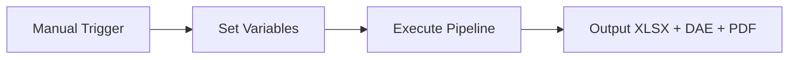
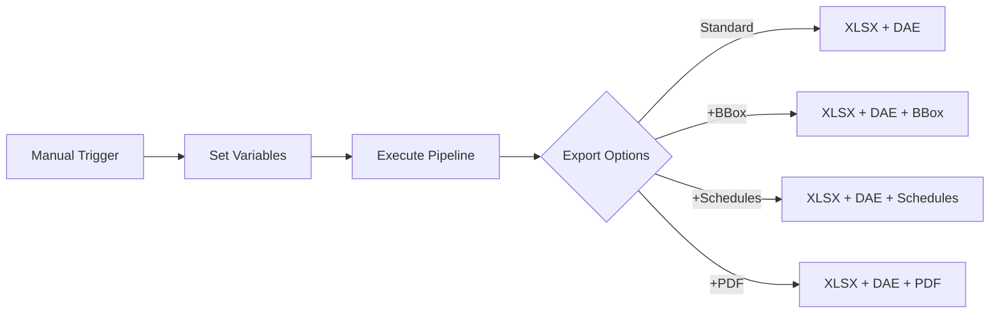
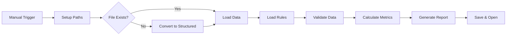
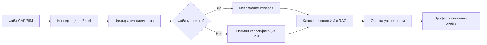
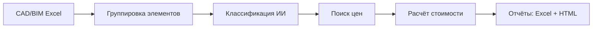
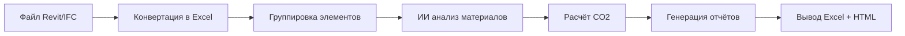
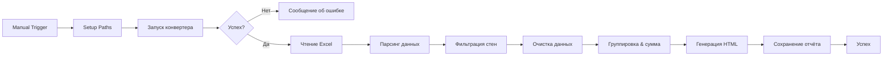

<p align="center">
  <a href="README.md">🇬🇧 English</a> •
  <a href="README.de.md">🇩🇪 Deutsch</a> •
  <a href="README.es.md">🇪🇸 Español</a> •
  <a href="README.fr.md">🇫🇷 Français</a> •
  <a href="README.ru.md">🇷🇺 Русский</a> •
  <a href="README.zh.md">🇨🇳 中文</a> •
  <a href="README.ar.md">🇸🇦 العربية</a>
</p>

<p align="center">
  
</p>
<p align="center">

  <a href="LICENSE">
  
</a>
<a href="https://datadrivenconstruction.io">
  
</a>
</br>


<!-- Ценообразование -->
<a href="https://dify.ai/pricing" target="_blank">
  
</a>
</br>


<h3 align="center">Обработка и конвертация CAD/BIM (Revit, DWG, IFC, DGN) с пакетной обработкой, группировкой, проверками, оценкой стоимости и отчётами QTO. Визуализация процессов автоматизации в открытых агентах и воркфлоу</h3>

<p align="center">
  Автоматизируйте извлечение и преобразование данных CAD/BIM с помощью DDC UI, командной строки, PowerShell или воркфлоу — без привязки к вендору, без лицензий Autodesk® или CAD, с полным контролем над данными вашего проекта
</p>

<p align="center">
  
</p>
<p align="center">
  
<p align="center">
 Клиенты и пользователи DataDrivenConstruction
  <br>
  <a href="https://datadrivenconstruction.io/">
  
  </a>
  <br></br>
</p>


## Содержание

- [Обучающие видео](#обучающие-видео)
- [Обзор](#обзор)
- [Поддерживаемые форматы](#поддерживаемые-форматы)
- [Основные функции](#основные-функции)
- [Запуск конвертеров](#запуск-конвертеров)
- [🖥️ Командная строка (CLI)](#️-командная-строка-cli)
- [Быстрый старт](#быстрый-старт)
- [⚠️ Настройка n8n 2.0+](#️-настройка-n8n-20)
- [📁 Воркфлоу](#воркфлоу-n8n-для-работы-с-данными-cadbim)
  - [⚡️ 1. Базовая конвертация Revit, IFC, DWG, DGN](#️-1-базовая-конвертация-revit-ifc-dwg-dgn)
  - [⚡️ 2. Конвертация Revit с расширенными настройками](#️-2-конвертация-revit-с-расширенными-настройками)
  - [⚡️ 3. Пакетная конвертация Revit, IFC, DWG с валидацией и отчётами](#️-3-пакетная-конвертация-revit-ifc-dwg-с-валидацией-и-отчётами)
  - [⚡️ 4. Мультиформатная валидация CAD (BIM) для Revit, IFC, DWG, DGN](#️-4-мультиформатная-валидация-cad-bim-для-revit-ifc-dwg-dgn)
  - [⚡️ 5. Универсальная классификация BIM/CAD с ИИ и RAG](#️-5-универсальная-классификация-bimcad-с-ии-и-rag-для-revit-ifc-dwg-dgn)
  - [⚡️ 6. Пайплайны оценки стоимости строительства](#️-6-пайплайны-оценки-стоимости-строительства)
  - [⚡️ 7. Калькулятор углеродного следа CO2](#️-7-калькулятор-углеродного-следа-co2-для-revit-и-ifc-с-llm-ии)
  - [⚡️ 8. Простой ETL для LLM-задач](#️-8-простой-etl-для-llm-задач-для-revit-ifc-dwg-dgn)
  - [⚡️ 9. HTML-отчёт по объёмам из Revit и IFC](#️-9-revit-и-ifc-в-html-отчёт-по-объёмам)
- [Устранение неполадок](#устранение-неполадок)
- [Что такое DataFrames?](#что-такое-dataframes)
- [Excel в Revit. Обновление проекта из Excel](#excel-в-revit-обновление-проекта-из-excel)
- [Участие в разработке](#участие-в-разработке)
- [🆘 Поддержка](#поддержка)
- [🎓 Консалтинг и обучение](#консалтинг-и-обучение)


## Обучающие видео

<table style="border: none; border-collapse: collapse;">
  <!-- Новые видео вверху -->
  <tr>
    <td style="border: none; padding-right: 12px; vertical-align: top;">
      <a href="https://www.youtube.com/watch?v=fHkXDMLzWzQ" target="_blank">
        
      </a>
    </td>
    <td style="border: none; vertical-align: top;">
     <b> Обзор универсального конвертера CAD/BIM </b>
      <br>
        Введение в <strong>DDC Converter</strong> для пайплайнов Revit, IFC, DWG и DGN — конвертация, валидация и сценарии автоматизации.<br>
        <a href="https://www.youtube.com/watch?v=fHkXDMLzWzQ" target="_blank">Смотреть обзор конвертера на YouTube</a>
      </br>
    </td>
  </tr>
  <tr>
    <td style="border: none; padding-right: 12px; vertical-align: top;">
      <a href="https://www.youtube.com/watch?v=jVU7vlMNTO0" target="_blank">
        
      </a>
    </td>
    <td style="border: none; vertical-align: top;">
     <b> Пайплайн конвертации DWG в Excel </b>
      <br>
        Пошаговое руководство по автоматизации конвертации данных <strong>DWG в Excel</strong> с использованием <code>n8n</code>, что упрощает использование данных CAD-проектов в отчётности и анализе.<br>
        <a href="https://www.youtube.com/watch?v=jVU7vlMNTO0" target="_blank">Смотреть пайплайн DWG в Excel на YouTube</a>
      </br>
    </td>
  </tr>
  <tr>
    <td style="border: none; padding-right: 12px; vertical-align: top;">
      <a href="https://youtu.be/QBaH8oBsPpM?si=gno6LZf98d6gWdPl" target="_blank">
        
      </a>
    </td>
    <td style="border: none; vertical-align: top;">
     <b> ETL с Revit и IFC </b>
      <br>
        Узнайте, как построить полноценный <strong>ETL-пайплайн</strong> с данными Revit и IFC: извлечение, преобразование, валидация и загрузка информации проекта в открытые форматы.<br>
        <a href="https://youtu.be/QBaH8oBsPpM?si=gno6LZf98d6gWdPl" target="_blank">Смотреть туториал ETL с Revit и IFC на YouTube</a>
      </br>
    </td>
  </tr>

  <!-- Существующие видео -->
  <tr>
    <td style="border: none; padding-right: 12px; vertical-align: top;">
      <a href="https://youtu.be/HUbEPo-yfeA?si=Gjbj2glKgU3q-XZC" target="_blank">
        
      </a>
    </td>
    <td style="border: none; vertical-align: top;">
     <b> Быстрый старт n8n: простая установка и создание пайплайна (шаблоны и LLM) </b>
      <br>
        Пошаговый туториал для начинающих по настройке <strong>n8n</strong> с нуля, созданию первого пайплайна автоматизации и использованию LLM (ChatGPT/Claude) для генерации автоматизаций.<br>
        <a href="https://youtu.be/HUbEPo-yfeA?si=Gjbj2glKgU3q-XZC" target="_blank">Смотреть быстрый старт n8n на YouTube</a>
      </br>
    </td>
  </tr>
  <tr>
    <td style="border: none; padding-right: 12px; vertical-align: top;">
      <a href="https://www.youtube.com/watch?v=PMTZNRFjD6c" target="_blank">
        
      </a>
    </td>
    <td style="border: none; vertical-align: top;">
     <b> Туториал по пайплайну данных CAD-BIM </b>
      <br>
        Полное практическое руководство: автоматизация сложных воркфлоу <strong>обработки данных CAD-BIM</strong> в <code>n8n</code>, включая конвертацию, валидацию и практическую аналитику.<br>
        <a href="https://www.youtube.com/watch?v=PMTZNRFjD6c" target="_blank">Смотреть туториал по пайплайну CAD-BIM на YouTube</a>
      </br>
    </td>
  </tr>
  <tr>
    <td style="border: none; padding-right: 12px; vertical-align: top;">
      <a href="https://www.youtube.com/watch?v=p84AmP2dcvg" target="_blank">
        
      </a>
    </td>
    <td style="border: none; vertical-align: top;">
     <b> ⚡️Автоматическая валидация данных CAD/BIM с n8n | Конец ручных проверок BIM </b>
      <br>
        Узнайте, как полностью автоматизировать воркфлоу <strong>валидации данных CAD/BIM</strong> с помощью бесплатной open-source платформы <code>n8n</code>. Идеально для проектных команд, желающих экономить часы (или дни) каждую неделю.<br>
        <a href="https://www.youtube.com/watch?v=p84AmP2dcvg" target="_blank">Смотреть туториал по автоматической валидации на YouTube</a>
      </br>
    </td>
  </tr>
</table>


<p align="center">
  
</p>

</p>
<p align="center">
  
   <br></br>
</p>


## Обзор

Этот пайплайн автоматизирует конвертацию файлов CAD/BIM в Excel для подсчёта объёмов, анализа данных и дальнейшей обработки. Поддерживает офлайн-работу и расширяемость с помощью Python или инструментов ИИ.


## Поддерживаемые форматы

| Формат | Расширение файла | Конвертер | Вывод |
|--------|------------------|-----------|-------|
| Revit (2015-2026) | `.rvt` | RvtExporter.exe | База данных XLSX + Геометрия DAE + Спецификации + Чертежи PDF |
| Revit (2015-2026) | `.rvt` | RVT2IFC_converter.exe | IFC2x3, IFC4, IFC4.3, IFCXML, IFCZIP, HDF5 |
| IFC (2x3, 4x1, 4x4, 4x, 4.3) | `.ifc` | IfcExporter.exe | База данных XLSX + Геометрия DAE |
| AutoCAD (1983-2026) | `.dwg` | DwgExporter.exe | База данных XLSX + Чертежи PDF |
| MicroStation (v7-v8) | `.dgn` | DgnExporter.exe | База данных XLSX |

## Основные функции

- Автоматическая конвертация в Excel (элементы как строки, свойства как столбцы).
- Экспорт 3D полигональной геометрии (DAE) с ID элементов, соответствующими данным XLSX.
- Офлайн-обработка без интернета, API или лицензий.
- Расширяемость для пользовательской постобработки.

## Запуск конвертеров

Конвертеры DDC можно запускать разными способами — **n8n это лишь один из вариантов** для автоматизации.
В зависимости от вашего рабочего процесса и технического уровня, вы можете выбрать один из четырёх методов:

1. **Графический интерфейс (UI)**
   - Лучше всего подходит для нетехнических пользователей и быстрых разовых конвертаций.
   - Интуитивно понятный интерфейс, настройка не требуется — просто выберите папку и начните.
<p align="center">
  
  <br></br>
</p>

2. **Консоль / Терминал (CMD, PowerShell, Shell)**
   - Подходит для продвинутых пользователей, разработчиков и технических команд.
   - Гибкий и скриптуемый, можно интегрировать в скрипты автоматизации или пакетные процессы.
<p align="center">
  
  <br></br>
</p>

3. **Пайплайны Python или JavaScript**
   - Идеально для предприятий и команд, работающих с большими наборами данных.
   - Масштабируемая параллельная обработка сотен файлов CAD (BIM).
   - Готовые примеры в папке `DDC_Python_pipelines`.
<p align="center">
  
  <br></br>
</p>

4. **Воркфлоу n8n**
   - Идеально для компаний, стремящихся к **полной автоматизации и системной интеграции**.
   - Сквозные пайплайны, где конвертация CAD (BIM) становится частью бесшовного потока данных.
   - Примеры в папке `DDC_n8n_workflows`.
  <p align="center">
  
  <br></br>
</p>

---

## 🖥️ Командная строка (CLI)

Конвертеры DDC — это полнофункциональные инструменты командной строки, которые можно интегрировать в **любой рабочий процесс автоматизации**. Это делает их идеальными для скриптинга, CI/CD пайплайнов, ИИ-агентов и low-code платформ.

### 🤖 Почему CLI важен: пусть ИИ строит ваши пайплайны

**Главное преимущество CLI-инструментов в том, что ИИ может использовать их напрямую.**

Современные ИИ-ассистенты для программирования (**Claude Code**, **Cursor**, **GitHub Copilot**, **Windsurf**, **Aider**, **Cline**) могут выполнять shell-команды, читать документацию и автономно создавать полноценные пайплайны автоматизации. Это означает:

> **Вам не нужно писать код самостоятельно — просто опишите, что вы хотите, и ИИ интегрирует конвертеры DDC в ваш рабочий процесс.**

**Как это работает:**
1. **Скопируйте эту документацию** (или укажите ИИ на этот README)
2. **Опишите вашу задачу** на естественном языке: *"Конвертируй все файлы Revit в папке X в Excel, затем проанализируй объёмы стен"*
3. **ИИ читает синтаксис CLI**, пишет скрипт, выполняет его и обрабатывает результаты

**Что ИИ может делать с конвертерами DDC:**
- ✅ Автоматически пакетно конвертировать сотни файлов CAD/BIM
- ✅ Строить ETL-пайплайны: Revit → Excel → База данных → Дашборд
- ✅ Создавать скрипты валидации, проверяющие качество данных BIM
- ✅ Генерировать отчёты из извлечённых данных (PDF, HTML, Excel)
- ✅ Интегрировать конвертации в CI/CD пайплайны
- ✅ Связывать несколько инструментов: конвертировать → валидировать → классифицировать → оценить стоимость
- ✅ Планировать автоматическую обработку через cron/Планировщик задач

**Пример промпта для ИИ-ассистента:**
```
У меня есть файлы Revit в C:\Projects. Используя DDC RvtExporter.exe, расположенный в C:\DDC\,
конвертируй все файлы .rvt в Excel с bounding boxes, затем создай Python-скрипт,
который читает файлы XLSX и генерирует сводный отчёт по всем типам стен и их объёмам.
```

ИИ выполнит:
1. Сканирование папки на файлы `.rvt`
2. Запуск `RvtExporter.exe` для каждого файла с правильными параметрами
3. Написание Python-кода для парсинга полученных `.xlsx` файлов
4. Генерацию сводного отчёта

**Это превращает DDC из инструмента в нативный строительный блок для автоматизации данных в строительстве с помощью ИИ.**

### RvtExporter.exe — Revit в XLSX/DAE/PDF

```
===========================================
         DataDrivenConstruction
         DDC Revit Community
         Version: 17.1.1
===========================================

Usage: RvtExporter <входной файл> [<выходной файл>] [<выходной файл>] [<режим экспорта>] [<файл категорий>] [bbox] [room] [schedule] [sheets2pdf] [-no-xlsx] [-no-collada]
```

| Параметр | Описание |
|----------|----------|
| `<входной файл>` | Входной файл `.rvt` / `.rfa` (обязательно) |
| `[<выходной файл>]` | Путь вывода для файла `.dae` (опционально, включено по умолчанию) |
| `[<выходной файл>]` | Путь вывода для файла `.xlsx` (опционально, включено по умолчанию) |
| `[<режим экспорта>]` | `basic` (309 категорий), `standard` (724), `complete` (1209), или `custom` |
| `[<файл категорий>]` | Файл `.txt` с названиями категорий (требуется только в режиме `custom`) |
| `bbox` | Включить bounding boxes элементов в вывод XLSX |
| `room` | Включить данные ToRoom/FromRoom в вывод XLSX |
| `schedule` | Экспортировать все спецификации Revit |
| `sheets2pdf` | Экспортировать все листы в PDF |
| `-no-xlsx` | Отключить экспорт в формат `.xlsx` |
| `-no-collada` | Отключить экспорт в формат `.dae` |

**Примеры:**
```bash
# Базовая конвертация (XLSX + DAE)
RvtExporter.exe "C:\Projects\Building.rvt"

# Полный экспорт с bounding boxes, спецификациями и листами PDF
RvtExporter.exe "C:\Projects\Building.rvt" complete bbox schedule sheets2pdf

# Экспорт только XLSX (без 3D-геометрии)
RvtExporter.exe "C:\Projects\Building.rvt" -no-collada

# Пользовательские категории из файла
RvtExporter.exe "C:\Projects\Building.rvt" custom "C:\Config\my_categories.txt"
```

---

### RVT2IFCconverter.exe — Revit в IFC

```
===========================================
         DataDrivenConstruction
         DDC RVT2IFC Community
         Version: 17.1.2
===========================================

Usage: Rvt2IfcConverter <input.rvt> [<output.ifc>] [preset|mode=<name>] [config="..."] [key=value ...]
```

| Параметр | Описание |
|----------|----------|
| `<input.rvt>` | Файл Revit `.rvt` / `.rfa` (обязательно) |
| `[<output.ifc>]` | Путь вывода IFC (опционально) |
| `preset=<name>` или `mode=<name>` | `standard`, `extended`, `custom` |
| `config="K=V; K=V; ..."` | Пользовательская конфигурация (разделённая точкой с запятой) |
| `key=value` | Отдельные параметры конфигурации |

**Примеры:**
```bash
# Стандартный экспорт IFC
RVT2IFCconverter.exe "C:\Projects\Building.rvt"

# Расширенный экспорт с большей детализацией
RVT2IFCconverter.exe "C:\Projects\Building.rvt" preset=extended

# Пользовательский путь вывода
RVT2IFCconverter.exe "C:\Projects\Building.rvt" "D:\Output\model.ifc"

# Пользовательская конфигурация
RVT2IFCconverter.exe "C:\Projects\Building.rvt" config="ExportBaseQuantities=true; SitePlacement=Shared"
```

---

### Примеры интеграции

CLI-инструменты можно вызывать практически из любой среды:

#### 🔹 PowerShell / Batch-скрипты
```powershell
# PowerShell: Обработать все файлы .rvt в папке
Get-ChildItem "C:\Projects\*.rvt" | ForEach-Object {
    & "C:\DDC\RvtExporter.exe" $_.FullName
}
```

```batch
:: Batch: Простая конвертация
@echo off
"C:\DDC\RvtExporter.exe" "%1" complete bbox schedule
```

#### 🔹 Задачи VS Code
Добавьте в `.vscode/tasks.json`:
```json
{
  "version": "2.0.0",
  "tasks": [
    {
      "label": "Конвертировать Revit в Excel",
      "type": "shell",
      "command": "C:\\DDC\\RvtExporter.exe",
      "args": ["${file}", "complete", "bbox"],
      "problemMatcher": []
    }
  ]
}
```

#### 🔹 ИИ-ассистенты для программирования (Claude Code, Cursor, Copilot, Windsurf, Aider, Cline)

ИИ-ассистенты с доступом к терминалу могут напрямую выполнять конвертеры DDC и строить полноценные рабочие процессы:

```bash
# Пример: ИИ выполняет эту команду, когда вы спрашиваете "конвертируй мой файл Revit в Excel"
RvtExporter.exe "C:\Projects\Model.rvt" complete bbox schedule
```

**Реальные сценарии рабочих процессов с ИИ:**

| Вы говорите ИИ | ИИ делает |
|----------------|-----------|
| *"Конвертируй Building.rvt в Excel со всеми данными"* | Запускает `RvtExporter.exe Building.rvt complete bbox room` |
| *"Обработай все файлы Revit в этой папке"* | Пишет цикл PowerShell, выполняет конвертер для каждого файла |
| *"Экспортируй в формат IFC 4.3"* | Запускает `RVT2IFCconverter.exe` с правильным пресетом |
| *"Создай оценку стоимости из этой модели"* | Конвертирует в Excel → парсит данные → рассчитывает стоимость |
| *"Проверь качество данных BIM"* | Конвертирует → анализирует XLSX → генерирует отчёт валидации |
| *"Построй дашборд из данных проекта"* | Конвертирует → обрабатывает pandas → создаёт визуализацию |

**Поддерживаемые ИИ-инструменты:**
- **Claude Code** — полный доступ к терминалу, может запускать конвертеры и анализировать результаты
- **Cursor** — IDE с ИИ, который может выполнять shell-команды
- **GitHub Copilot CLI** — ИИ-ассистент командной строки
- **Windsurf** — IDE на базе ИИ с интеграцией терминала
- **Aider** — парное программирование с ИИ в терминале
- **Cline** — расширение VS Code с доступом к shell
- **Open Interpreter** — ИИ, который запускает код локально
- **AutoGPT / AgentGPT** — автономные ИИ-агенты

**Совет профессионала:** Поделитесь этим README со своим ИИ-ассистентом, чтобы он понял полный синтаксис CLI и мог автономно строить сложные пайплайны.

#### 🔹 n8n (узел Execute Command)
```javascript
// В узле Execute Command в n8n
C:\DDC\RvtExporter.exe "{{ $json.filePath }}" complete bbox
```

#### 🔹 Python Subprocess
```python
import subprocess

result = subprocess.run([
    r"C:\DDC\RvtExporter.exe",
    r"C:\Projects\Building.rvt",
    "complete", "bbox", "schedule"
], capture_output=True, text=True)

print(result.stdout)
```

#### 🔹 Node.js / JavaScript
```javascript
const { execSync } = require('child_process');

const output = execSync(
  'C:\\DDC\\RvtExporter.exe "C:\\Projects\\Building.rvt" complete bbox'
);
console.log(output.toString());
```

#### 🔹 Make / Makefile
```makefile
CONVERTER = C:/DDC/RvtExporter.exe

convert:
	$(CONVERTER) "$(INPUT)" complete bbox schedule
```

#### 🔹 GitHub Actions / CI/CD
```yaml
- name: Конвертировать Revit в Excel
  run: |
    C:\DDC\RvtExporter.exe "${{ github.workspace }}\model.rvt" complete bbox
```

#### 🔹 Docker (Windows Container)
```dockerfile
COPY DDC_CONVERTER_Revit /app/DDC
RUN C:\app\DDC\RvtExporter.exe "C:\data\model.rvt"
```

---

⭐ <b>Если вы находите наши инструменты полезными и хотите видеть больше подобных приложений для строительной отрасли, пожалуйста, поставьте звезду нашим репозиториям.</b>
Поставьте звезду DDC workflow на GitHub и получайте мгновенные уведомления о новых релизах.
<p align="center">
  <br>
  
  <br></br>
</p>


### ✅ Важное требование (v17 и выше)

Начиная с **v17**, конвертеры используют обновлённую базовую среду выполнения.
Пожалуйста, установите **Microsoft Visual C++ Redistributable 2015–2022 (x64)** перед запуском любых `.exe` инструментов (`RvtExporter.exe`, `RVT2IFCconverter.exe` и т.д.).

- Официальная загрузка (Microsoft Learn): **Последняя поддерживаемая версия VC++ 2015–2022**.
- Выберите пакет **x64** и запустите `VC_redist.x64.exe`.

> Без этого пакета некоторые системы (особенно свежие установки Windows/VM) не смогут запустить конвертеры.

**Почему это нужно:** v17 сменила техническую базу с v16; среда выполнения VC++ теперь является обязательной зависимостью.


## Быстрый старт с n8n

### Требования

1. **Установите Node.js** с [nodejs.org](https://nodejs.org/).
2. **Запустите n8n** в командной строке:
   ```
   npx n8n
   ```
   Доступ по адресу `http://localhost:5678`.
3. **Скачайте этот репозиторий с GitHub**
   - Нажмите зелёную кнопку "Code" → "Download ZIP"
   - Распакуйте папку
4. **Запустите воркфлоу**
     - Вы готовы. Просто нажмите **Execute Workflow** в n8n, чтобы начать обработку ваших файлов CAD-BIM
<p align="center">
  
  <br></br>
</p>

---

## ⚠️ Настройка n8n 2.0+

> **Начиная с версии n8n 2.0, узел Execute Command отключён по умолчанию из соображений безопасности.**
>
> Без настройки ниже воркфлоу, использующие Execute Command, **не будут работать** — узлы будут показаны со знаком вопроса или не будут распознаны.

### Быстрое решение

**Windows (CMD) — запускать каждый раз:**
```cmd
set NODES_EXCLUDE=[] && npx n8n
```

**Постоянное решение — создать один раз:**

Создайте файл `C:\Users\ВАШ_ПОЛЬЗОВАТЕЛЬ\.n8n\.env` с содержимым:
```
NODES_EXCLUDE=[]
```
Затем просто запускайте `npx n8n` как обычно.

**Docker:**
```yaml
environment:
  - NODES_EXCLUDE=[]
```

### Проверка настройки

1. Запустите n8n
2. Нажмите **+** → найдите **"Execute Command"**
3. Если узел появился → ✅ всё готово!

> 📚 Подробнее: [n8n 2.0 Breaking Changes](https://docs.n8n.io/2-0-breaking-changes/)

---

## Воркфлоу n8n для работы с данными CAD/BIM

### ⚡️ 1. Базовая конвертация Revit, IFC, DWG, DGN
**Файл**: `n8n_1_Revit_IFC_DWG_Conversation_simple.json`

Конвертирует файлы CAD/BIM (`.rvt`, `.ifc`, `.dwg`, `.dgn`) в Excel (XLSX) и Collada (DAE) для файлов Revit/IFC. Минимальная конфигурация для быстрой настройки.

<p align="center">
  
</p>

#### Установка
1. Импортируйте `n8n_1_Revit_IFC_DWG_Conversation_simple.json` в n8n через **Workflows > Import from File**.
2. Обновите узел **Set Variables**:
   ```
   # Revit
   path_to_converter: C:\Converters\datadrivenlibs\RvtExporter.exe
   path_project_file: C:\Projects\Model.rvt

   # Revit в IFC
   path_to_converter: C:\Converters\datadrivenlibs\RVT2IFCconverter.exe
   path_project_file: C:\Projects\Model.rvt

   # IFC
   path_to_converter: C:\Converters\datadrivenlibs\IfcExporter.exe
   path_project_file: C:\Projects\Model.ifc

   # DWG
   path_to_converter: C:\Converters\datadrivenlibs\DwgExporter.exe
   path_project_file: C:\Projects\Plan.dwg

   # DGN
   path_to_converter: C:\Converters\datadrivenlibs\DgnExporter.exe
   path_project_file: C:\Projects\Bridge.dgn
   ```
3. Убедитесь, что конвертер находится в папке `datadrivenlibs`, например, `C:\Converters\datadrivenlibs\XxxExporter.exe`.

#### Использование
1. Запустите воркфлоу через **Manual Trigger**.
2. Проверьте выходную папку на наличие файлов XLSX, DAE и PDF.
3. Мониторьте логи для статуса конвертации.




### ⚡️ 2. Конвертация Revit с расширенными настройками
**Файл**: `n8n_2_All_Settings_Revit_IFC_DWG_Conversation_simple.json`

Конвертирует файлы CAD/BIM с настраиваемыми режимами экспорта (basic: 309 категорий, standard: 724 категории, complete: все 1209 категорий) и опциональными выводами, такими как bounding box, спецификации Revit или PDF-чертежи.

<p align="center">
  
</p>

#### Установка
1. Импортируйте `n8n_2_All_Settings_Revit_IFC_DWG_Conversation_simple.json` в n8n через **Workflows > Import from File**.
2. Обновите узел **Set Variables** с путями конвертера и файлов (так же, как в базовой конвертации).
3. Настройте опции экспорта:
   ```
   export_mode: basic | standard | complete
   bbox: true | false
   schedule: true | false
   sheets2pdf: true | false
   no-xlsx: true | false
   no-collada: true | false
   ```

#### Использование
1. Запустите воркфлоу через **Manual Trigger**.
2. Проверьте выходную папку на наличие файлов XLSX, DAE, спецификаций или PDF в зависимости от настроек.
3. Мониторьте логи для статуса конвертации.




### ⚡️ 3. Пакетная конвертация Revit, IFC, DWG с валидацией и отчётами
**Файл**: `n8n_3_CAD-BIM-Batch-Converter-Pipeline.json`

Автоматизирует пакетную конвертацию файлов Revit (`.rvt`) в Excel (XLSX) и Collada (DAE), валидирует выходные данные, отслеживает время обработки и генерирует HTML-отчёт с метриками, ссылками на файлы и деталями конфигурации.

<p align="center">
  
</p>

#### Установка
1. Импортируйте `n8n_3_CAD-BIM-Batch-Converter-Pipeline.json` в n8n через **Workflows > Import from File**.
2. Обновите узел **Set Configuration Parameters**:
   ```
   converter_path: C:\Converters\datadrivenlibs\RvtExporter.exe
   source_folder: C:\Sample_Projects
   output_folder: C:\Output
   include_subfolders: true
   file_extension: .rvt
   ```
3. Убедитесь, что `RvtExporter.exe` находится в `C:\Converters\datadrivenlibs\` и файлы `.rvt` находятся в исходной папке.

#### Использование
1. Запустите воркфлоу через **Manual Trigger**.
2. Мониторьте логи для обнаружения файлов и прогресса конвертации.
3. Просмотрите HTML-отчёт (автоматически открывается в браузере) с:
   - Метриками (обработанные файлы, успешность, время, размеры).
   - Таблицами успешных/неудачных конвертаций со ссылками на файлы.
4. Проверьте выходную папку на наличие файлов XLSX и DAE.


### ⚡️ 4. Мультиформатная валидация CAD (BIM) для Revit, IFC, DWG, DGN
**Файлы**: `n8n_4_Validation_CAD_BIM_Revit_IFC_DWG.json`, `DDC_BIM_Requirements_Table_for_Revit_IFC_DWG.xlsx`

Валидирует данные CAD/BIM по предопределённым правилам, генерируя цветокодированные отчёты Excel с метриками качества данных.

<p align="center">
  
</p>

#### Установка
1. Импортируйте `n8n_3_Validation_CAD_BIM_Revit_IFC_DWG.json` в n8n через **Workflows > Import from File**.
2. Обновите узел **Setup Paths**:
   ```
   path_to_converter: C:\Converters\datadrivenlibs\RvtExporter.exe
   project_file: C:\Projects\Model.rvt
   validation_rules_path: C:\Validation\DDC_Revit_IFC_Validation_Table.xlsx
   ```
3. Убедитесь, что конвертер и файл правил валидации доступны.

#### Использование
1. Запустите воркфлоу через **Manual Trigger**.
2. Проверьте выходную папку на наличие цветокодированного XLSX-отчёта.
3. Просмотрите метрики качества данных (заполненность, уникальные значения, паттерны).
4. Мониторьте логи для статуса валидации.



### ⚡️ 5. Универсальная классификация BIM/CAD с ИИ и RAG для Revit, IFC, DWG, DGN
**Файл**: `n8n_5_CAD_BIM_Automatic_Classification_with_LLM_and_RAG.json`

🔗 **Улучшено с базой данных DDC CWICR**: [OpenConstructionEstimate-DDC-CWICR](https://github.com/datadrivenconstruction/OpenConstructionEstimate-DDC-CWICR)
Этот воркфлоу использует векторную базу данных DDC CWICR (Qdrant), содержащую **55 719 позиций работ** с предварительно вычисленными эмбеддингами OpenAI (3072d). Пайплайн RAG выполняет семантический поиск на 9 языках, сопоставляя элементы BIM со стандартизированными описаниями строительных работ.

Интеллектуально классифицирует строительные элементы из файлов CAD/BIM с использованием ИИ и ЛЮБОЙ системы классификации — международных стандартов (Omniclass, Uniclass и т.д.) или ваших пользовательских/проприетарных классификаций.

#### Ключевые функции
- **Универсальная классификация**: Работает с ЛЮБОЙ системой классификации — стандартной или пользовательской
- **Классификация на базе ИИ**: Использует LLM для классификации элементов с оценкой уверенности
- **Умный маппинг**: Автоматически извлекает словари из файлов Excel, CSV, PDF
- **Автоматическая фильтрация**: Отделяет строительные элементы от чертежей/аннотаций
- **Иерархическая поддержка**: Обрабатывает как плоские, так и иерархические структуры классификации
- **Профессиональные отчёты**: Интерактивные HTML-дашборды + многолистовой Excel
- **Технология RAG**: Retrieval-Augmented Generation для точной классификации

<p align="center">
  
</p>

#### Гибкость классификации
Этот пайплайн работает с **ЛЮБОЙ системой классификации**:
- ✅ Международные стандарты (Omniclass, Uniclass, MasterFormat и т.д.)
- ✅ Национальные стандарты (DIN, NF, BS и т.д.)
- ✅ Корпоративные классификации
- ✅ Пользовательские проектные классификации
- ✅ Проприетарные системы кодирования
- ✅ Любая структурированная классификация в формате Excel/CSV/PDF

**⏱️ Время обработки:** 3-10 секунд на группу элементов (зависит от модели LLM)




### ⚡️ 6. Пайплайны оценки стоимости строительства

🔗 **На базе базы данных DDC CWICR**: [OpenConstructionEstimate-DDC-CWICR](https://github.com/datadrivenconstruction/OpenConstructionEstimate-DDC-CWICR)

Воркфлоу оценки стоимости подключаются к базе данных DDC CWICR, содержащей **55 719 позиций работ** и **27 672 ресурса** с детальной разбивкой цен по 10+ региональным рынкам.

📦 **Загрузки базы данных**: [DDC CWICR Releases](https://github.com/datadrivenconstruction/OpenConstructionEstimate-DDC-CWICR/releases) — Excel, Parquet, CSV, снапшоты Qdrant
🌐 **Демо**: [openconstructionestimate.com](https://openconstructionestimate.com) — исследуйте базу данных и семантический поиск

---

#### ⚡️ 6.1 Пайплайн оценки стоимости строительства для Revit и IFC с LLM (ИИ)
**Файл:** `n8n_6_Construction_Price_Estimation_Pipeline.json`

Автоматизирует оценку стоимости строительных элементов из файлов CAD/BIM. Использует ИИ для классификации материалов, поиска рыночных цен и генерации комплексных отчётов о стоимости.

##### Ключевые функции
- **Классификация ИИ**: Материалы по стандартам EU/DE/US
- **Умное ценообразование**: Региональные базы данных с резервными вариантами
- **Анализ стоимости**: Общая стоимость, стоимость за единицу, топ-10 групп
- **Мультиформатный вывод**: Рабочая книга Excel + HTML-отчёт с графиками

<p align="center">
  
</p>

**⏱️ Время обработки:** 5-15 секунд на группу элементов (зависит от скорости LLM)



---

#### ⚡️ 6.2 Пайплайн оценки стоимости CAD (BIM) 4D/5D с DDC CWICR
**Файл:** `n8n_4_CAD_(BIM)_Cost_Estimation_Pipeline_4D_5D_with_DDC_CWICR.json`

🔗 **Репозиторий воркфлоу**: [OpenConstructionEstimate-DDC-CWICR](https://github.com/datadrivenconstruction/OpenConstructionEstimate-DDC-CWICR)

Автоматическая оценка стоимости из моделей Revit/IFC/DWG. Извлекает данные BIM, классифицирует элементы, декомпозирует в позиции работ и генерирует 4D/5D оценки с полной разбивкой ресурсов.

<p align="left">
  <a href="https://datadrivenconstruction.io">
    
  </a>
</p>

##### Этапы пайплайна

| Этап    | Название             | Описание                                                          |
|---------|----------------------|-------------------------------------------------------------------|
| **0**   | Сбор данных BIM      | Извлечение элементов из Revit через DDC Converter                 |
| **1**   | Определение проекта  | ИИ определяет тип проекта (Жилой, Коммерческий и т.д.)           |
| **2**   | Генерация фаз        | ИИ создаёт строительные фазы                                      |
| **3**   | Назначение элементов | ИИ сопоставляет типы BIM с фазами                                |
| **4**   | Декомпозиция работ   | ИИ разбивает типы на позиции работ ("Кирпичная стена" → кладка, раствор) |
| **5**   | Векторный поиск      | Поиск совпадающих расценок в DDC CWICR через Qdrant              |
| **6**   | Маппинг единиц       | Конвертация единиц BIM в единицы расценок                        |
| **7**   | Расчёт стоимости     | Кол-во × Цена за единицу для каждой позиции работ                |
| **7.5** | Валидация            | Проверка CTO на полноту и дубликаты                              |
| **8**   | Агрегация            | Суммирование по фазам и категориям                               |
| **9**   | Генерация отчёта     | Создание HTML и Excel выходных файлов                            |

##### Ключевые функции
- **Полная интеграция BIM**: Нативная поддержка Revit, IFC, DWG через DDC Converter
- **Декомпозиция на базе ИИ**: Разбивает сложные типы BIM на составляющие позиции работ
- **Семантическое ценообразование**: Векторный поиск Qdrant с 55 719 предварительно встроенными позициями работ
- **Поддержка мультиLLM**: OpenAI GPT-4o, Claude, Gemini 2.5 Pro, xAI Grok, DeepSeek
- **Валидация CTO**: Этап проверки ИИ на полноту и дубликаты
- **9 языков**: AR, DE, EN, ES, FR, HI, PT, RU, ZH с региональным ценообразованием

##### Поддерживаемые языки и уровни цен

| Код   | Язык        | Уровень цен     | Валюта | Коллекция Qdrant    |
|-------|-------------|-----------------|--------|---------------------|
| `AR`  | Арабский    | Дубай           | AED    | `ddc_cwicr_ar`      |
| `DE`  | Немецкий    | Берлин          | EUR    | `ddc_cwicr_de`      |
| `EN`  | Английский  | Торонто         | CAD    | `ddc_cwicr_en`      |
| `ES`  | Испанский   | Барселона       | EUR    | `ddc_cwicr_es`      |
| `FR`  | Французский | Париж           | EUR    | `ddc_cwicr_fr`      |
| `HI`  | Хинди       | Мумбаи          | INR    | `ddc_cwicr_hi`      |
| `PT`  | Португальский| Сан-Паулу      | BRL    | `ddc_cwicr_pt`      |
| `RU`  | Русский     | Санкт-Петербург | RUB    | `ddc_cwicr_ru`      |
| `ZH`  | Китайский   | Шанхай          | CNY    | `ddc_cwicr_zh`      |

##### Выходные файлы

Отчёты сохраняются в папку проекта:
```
project_YYYY-MM-DD.html   ← Интерактивный отчёт (открывается в браузере)
project_YYYY-MM-DD.xls    ← Excel-совместимая таблица
```

<p align="center">
  
</p>

**⏱️ Время обработки:** Варьируется в зависимости от размера проекта и модели LLM


### ⚡️ 7. Калькулятор углеродного следа CO2 для Revit и IFC с LLM (ИИ)

**Файл:** `n8n_7_Carbon_Footprint_CO2_Estimator_for_Revit_and_IFC.json`

🔗 **Интегрирован с базой данных DDC CWICR**: [OpenConstructionEstimate-DDC-CWICR](https://github.com/datadrivenconstruction/OpenConstructionEstimate-DDC-CWICR)
Этот воркфлоу использует детальные классификации материалов DDC CWICR и декомпозицию ресурсов для расчёта воплощённого углерода (этапы жизненного цикла A1-A3).

Рассчитывает выбросы воплощённого углерода для строительных проектов. Анализирует материалы, применяет коэффициенты выбросов и генерирует профессиональные отчёты по устойчивости.

#### Ключевые функции
- **Анализ воплощённого углерода**: Этапы жизненного цикла A1-A3
- **Классификация материалов**: Стандарты EU/DE/US с данными о плотности
- **Коэффициенты выбросов**: Отраслевые стандартные коэффициенты CO2e для материалов
- **Оценка воздействия**: Категоризация Критический/Высокий/Средний/Низкий
- **Профессиональные отчёты**: HTML в стиле McKinsey + многолистовой Excel

<p align="center">
  
</p>

**⏱️ Время обработки:** 5-15 секунд на группу элементов (зависит от скорости LLM)





### ⚡️ 8. Простой ETL для LLM-задач для Revit, IFC, DWG, DGN
**Файл**: `n8n_8_Revit_IFC_DWG_Conversation_EXTRACT_Phase_with_Parse_XLSX.json`

Конвертирует файл Revit в Excel, генерирует имя файла XLSX и парсит данные для задач автоматизации на базе LLM.

<p align="center">
  
</p>

#### Использование
1. Запустите воркфлоу через **Manual Trigger**.
2. Проверьте выходную папку на наличие файла XLSX.
3. Используйте распарсенные данные для LLM-задач (например, передайте JSON в Claude или ChatGPT).
4. Мониторьте логи для статуса конвертации и парсинга.


### ⚡️ 9. Revit и IFC в HTML-отчёт по объёмам
**Файл**: `n8n_9_CAD_BIM_Quantity_TakeOff_HTML_Report_Generatorn.json`

Анализирует данные стен Revit, рассчитывает объёмы по типам и генерирует интерактивные HTML-отчёты со сводной статистикой.

<p align="center">
  
</p>

#### Использование
1. Запустите воркфлоу через **Manual Trigger**.
2. Проверьте выходную папку на наличие HTML-отчёта.
3. Просмотрите отчёт (автоматически открывается в браузере) для объёмов стен и статистики.
4. Мониторьте логи для статуса обработки.




## Устранение неполадок

### Отсутствует узел Execute Command (n8n 2.0+)

**Симптомы:**
- Узлы показаны со знаком вопроса (?)
- Ошибка: `Unrecognized node type: n8n-nodes-base.executeCommand`
- Execute Command не появляется в поиске узлов

**Решение:** Добавьте переменную окружения перед запуском n8n:
```cmd
set NODES_EXCLUDE=[] && npx n8n
```
Или создайте файл `.env` в `C:\Users\ВАШ_ПОЛЬЗОВАТЕЛЬ\.n8n\.env` с содержимым `NODES_EXCLUDE=[]`

Смотрите [⚠️ Настройка n8n 2.0+](#️-настройка-n8n-20) для деталей.

### Ошибка блокировки модуля 'os'
В версиях n8n 1.98.0–1.101.x модуль `os` заблокирован, что влияет на библиотеки типа pandas. Решение: Используйте последнюю версию с `npx n8n@latest`.


## Что такое DataFrames?

Форматы CAD/BIM, такие как `.rvt`, `.ifc`, `.dwg` или `.dgn`, сложны и проприетарны. Конвертация их в **DataFrames** — табличные структуры со строками (элементами) и столбцами (свойствами) — обеспечивает эффективную обработку данных. Популяризированные библиотекой pandas Python, DataFrames широко используются благодаря совместимости с инструментами автоматизации, аналитики и ИИ (только одна из библиотек Python, pandas, скачивается 12 миллионов раз в день). Они упрощают задачи фильтрации, группировки и визуализации, что делает их идеальными для дашбордов, подсчёта объёмов и валидации.

<p align="center">
  
</p>


Назад к истокам "BIM". 𝗣𝗼𝘁𝗲𝗿𝘆𝗺𝗻𝗻𝗮я 𝗸𝗼𝗻𝗰𝗲𝗽𝗰𝗶𝗮: 𝗼𝘁 𝗯𝗮𝘇𝘆 𝗱𝗮𝗻𝗻𝘆𝘅 𝗸 𝗺𝗮𝗿𝗸𝗲𝘁𝗶𝗻𝗴𝗼𝘃𝗼𝗺𝘂 𝘀𝗹𝗼𝘃𝘂.
Изначально BIM никогда не был о модных словах или бесконечных дебатах о совместимости. Его фундаментом всегда были базы данных.

🔹 1974. Чарльз Истман представил Building Description System (BDS). В его статье слово «база данных» появилось 43 раза.
🔹 2000. ADSK опубликовала whitepaper, подчёркивающий ценность прямого доступа к «базе данных CAD». Нейтральные трансляторы типа STEP/IFC считались вторичными.
💬 "Возможность нативного обмена данными – приложения должны обращаться напрямую к основной базе данных CAD, чтобы не терять детали и точность."
🔹 2002. После приобретения Revit-BOM, whitepaper BIM от ADSK снова поставил базу данных в центр (23 упоминания термина).
🔹 2003. В последний раз ADSK официально связала BIM с ИТ и базами данных. После этого база данных исчезла из нарратива — заменённая чистым маркетингом.

<p align="center">
  
</p>

В реальности BIM всегда был прост: база данных элементов проекта, каждый со своими параметрами. Всё остальное — маркетинговые надстройки.
Может быть, пора вернуться к сути: открытым, структурированным и доступным данным.


**Узнать больше:**
- [Python Pandas – незаменимый инструмент](https://datadrivenconstruction.io/2025/06/048-python-pandas-an-indispensable-tool-for-working-with-data/)
- [DataFrame – универсальный табличный формат данных](https://datadrivenconstruction.io/2025/06/049-dataframe-universal-tabular-data-format/)
- [Структурированные данные в строительстве](https://datadrivenconstruction.io/2025/06/025-structured-data/)


## Excel в Revit. Обновление проекта из Excel

После преобразования и обогащения ваших данных Excel вы можете легко отправить изменённые данные обратно в ваш проект Revit. Наш специализированный инструмент **[ImportExcelToRevit](https://github.com/datadrivenconstruction/cad2data-Revit-IFC-DWG-DGN-pipeline-with-conversion-validation-qto/tree/main/DDC_Update_Revit_from_Excel)** делает этот процесс бесшовным, напрямую импортируя обновлённые листы Excel в параметры и семейства Revit.

> **Упростите ваш BIM-воркфлоу:** Revit ➡️ Excel ➡️ Преобразование ➡️ Excel ➡️ Revit.
https://github.com/datadrivenconstruction/cad2data-Revit-IFC-DWG-DGN-pipeline-with-conversion-validation-qto/tree/main/DDC_Update_Revit_from_Excel


## 🗃️ DDC CWICR - База данных строительных расценок

Для высококачественной оценки строительных затрат этот репозиторий интегрируется с **[OpenConstructionEstimate-DDC-CWICR](https://github.com/datadrivenconstruction/OpenConstructionEstimate-DDC-CWICR)** — открытой мультиязычной базой данных строительных расценок.

### Почему DDC CWICR?

DDC CWICR (Construction Work Items, Components & Resources) обеспечивает основу для точной, прозрачной и проверяемой оценки стоимости:

- **55 719 позиций работ** — полный охват строительных работ
- **27 672 ресурса** — материалы, труд и оборудование с детальной разбивкой
- **9 языков** — арабский, китайский, немецкий, английский, испанский, французский, хинди, португальский, русский
- **85 полей данных** — полная ресурсная структура стоимости на позицию работ
- **Семантический поиск** — векторная база данных Qdrant с эмбеддингами OpenAI (3072d) для запросов на естественном языке

### Преимущества базы данных

| Функция | Преимущество |
|---------|--------------|
| **Ресурсная методология** | Физические нормы (человеко-часы, количества материалов) отделены от волатильных цен |
| **Полная прозрачность** | Полная разбивка каждой стоимостной компоненты — без скрытых наценок |
| **Мультиформатный экспорт** | Excel, Parquet, CSV, снапшоты Qdrant для любого сценария интеграции |
| **Готовность к ИИ** | Предвычисленные эмбеддинги обеспечивают RAG-пайплайны и LLM-оценку |

### Демо и ресурсы

🌐 **Демо**: [openconstructionestimate.com](https://openconstructionestimate.com) — исследуйте базу данных и семантический поиск в действии

📦 **Репозиторий**: [github.com/datadrivenconstruction/OpenConstructionEstimate-DDC-CWICR](https://github.com/datadrivenconstruction/OpenConstructionEstimate-DDC-CWICR)

Воркфлоу в этом репозитории (особенно **Воркфлоу 5, 6 и 7**) используют DDC CWICR для классификации, ценообразования и расчёта углеродного следа, обеспечивая профессиональное качество оценки.


## Участие в разработке

Мы приветствуем участие! Не стесняйтесь:
- Сообщать об ошибках
- Предлагать функции
- Отправлять pull requests
- Улучшать документацию


## Поддержка

🌐 **Сайт**: [DataDrivenConstruction.io](https://datadrivenconstruction.io)
💬 **Issues**: [GitHub Issues](https://github.com/datadrivenconstruction/Revit-IFC-DWG-DGN-Converter-in-n8n-with-QTO/issues)
📧 **Email**: info@datadrivenconstruction.io


## Консалтинг и обучение

Мы работаем с ведущими строительными, инженерными, консалтинговыми агентствами и технологическими компаниями по всему миру, помогая им внедрять принципы открытых данных, автоматизировать обработку CAD/BIM и строить надёжные ETL-пайплайны.

Если вы хотите протестировать это решение на своих данных или заинтересованы в адаптации воркфлоу к реальным проектным задачам, не стесняйтесь связаться с нами.

Наша команда проводит практические воркшопы, предоставляет стратегический консалтинг и разрабатывает прототипы, адаптированные к реальным проектным процессам. Мы активно поддерживаем организации, ищущие практические решения для цифровой трансформации и интероперабельности, фокусируясь на проблемах качества данных и классификации, и продвигая внедрение открытых и автоматизированных воркфлоу.

Свяжитесь с нами для бесплатной консультации, где мы обсудим ваши задачи и продемонстрируем, как автоматизация n8n может трансформировать ваши операции. Обращайтесь по Email [@DataDrivenConstruction](mailto: info@datadrivenconstruction.io) или посетите наш сайт [datadrivenconstruction.io](https://datadrivenconstruction.io), чтобы узнать больше о наших услугах.

---
 <!-- Социальные ссылки -->
  <a href="https://x.com/datadrivenconst" target="_blank">
    
  </a>
  <a href="https://www.youtube.com/@datadrivenconstruction" target="_blank">
    
  </a>
  <a href="https://www.linkedin.com/company/78381569" target="_blank">
    
  </a>
</p>


<p align="left">

  <a href="https://datadrivenconstruction.io">
    
  </a>
  <br>
   <b>   Раскройте силу данных в строительстве</b>
   <br>
     🚀 Перейдите к полному циклу управления данными, где остаются только унифицированные <br /> структурированные данные и процессы, и где 🔓 ваши данные принадлежат вам
</p>
