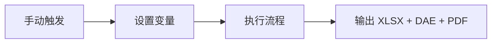
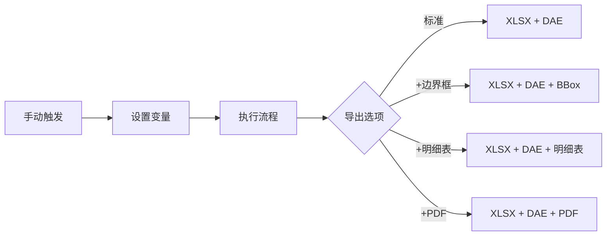
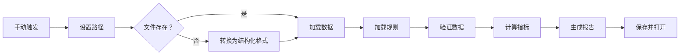
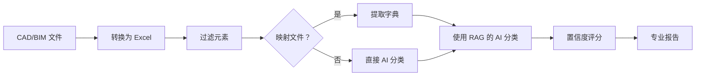
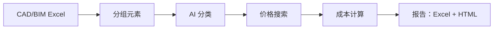
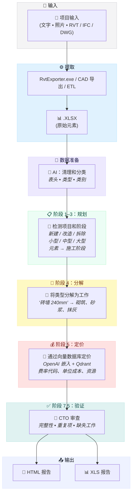
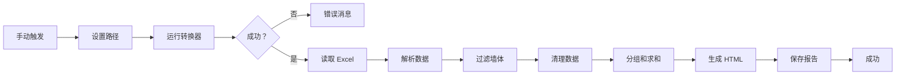

<p align="center">
  <a href="README.md">🇬🇧 English</a> •
  <a href="README.de.md">🇩🇪 Deutsch</a> •
  <a href="README.es.md">🇪🇸 Español</a> •
  <a href="README.fr.md">🇫🇷 Français</a> •
  <a href="README.ru.md">🇷🇺 Русский</a> •
  <a href="README.zh.md">🇨🇳 中文</a> •
  <a href="README.ar.md">🇸🇦 العربية</a>
</p>

<p align="center">
  
</p>
<p align="center">

  <a href="LICENSE">
  
</a>
<a href="https://datadrivenconstruction.io">
  
</a>
</br>


<!-- 定价 -->
<a href="https://dify.ai/pricing" target="_blank">
  
</a>
</br>


<h3 align="center">CAD/BIM（Revit、DWG、IFC、DGN）处理和转换，支持批量处理、分组、检查、成本估算和工程量报告。在开放代理和工作流中可视化自动化流程</h3>

<p align="center">
  使用 DDC UI、命令行、PowerShell 或工作流自动化您的 CAD/BIM 数据提取和转换 — 无供应商锁定，无需 Autodesk® 或 CAD 许可证，完全控制您的项目数据
</p>


<p align="center">
  
</p>
<p align="center">
  
<p align="center">
 DataDrivenConstruction 客户和用户
  <br>
  <a href="https://datadrivenconstruction.io/">
  
  </a>
  <br></br>
</p>


## 目录

- [教程视频](#教程视频)
- [概述](#概述)
- [支持的格式](#支持的格式)
- [主要功能](#主要功能)
- [运行转换器](#运行转换器)
- [🖥️ 命令行界面 (CLI)](#️-命令行界面-cli)
- [使用 n8n 快速入门](#使用-n8n-快速入门)
- [⚠️ n8n 2.0+ 配置](#️-n8n-20-配置必需)
- [📁 工作流](#用于处理-cadbim-数据的-n8n-工作流)
  - [⚡️ 1. Revit、IFC、DWG、DGN 基础转换](#️-1-revitifc dwgdgn-基础转换)
  - [⚡️ 2. Revit 高级设置转换](#️-2-revit-高级设置转换)
  - [⚡️ 3. Revit、IFC、DWG 批量转换与验证和报告](#️-3-revitifc dwg-批量转换与验证和报告)
  - [⚡️ 4. Revit、IFC、DWG、DGN 多格式 CAD (BIM) 验证](#️-4-revitifc dwgdgn-多格式-cad-bim-验证)
  - [⚡️ 5. 用于 Revit、IFC、DWG、DGN 的 AI 和 RAG 通用 BIM/CAD 分类](#️-5-用于-revitifc dwgdgn-的-ai-和-rag-通用-bimcad-分类)
  - [⚡️ 6. 建设成本估算流程](#️-6-建设成本估算流程)
    - [⚡️ 6.1 使用 LLM (AI) 的 Revit 和 IFC 建设价格估算流程](#️-61-使用-llm-ai-的-revit-和-ifc-建设价格估算流程)
    - [⚡️ 6.2 使用 DDC CWICR 的 CAD (BIM) 4D/5D 成本估算流程](#️-62-使用-ddc-cwicr-的-cad-bim-4d5d-成本估算流程)
  - [⚡️ 7. 使用 LLM (AI) 的 Revit 和 IFC 碳足迹 CO2 估算器](#️-7-使用-llm-ai-的-revit-和-ifc-碳足迹-co2-估算器)
  - [⚡️ 8. 用于 Revit、IFC、DWG、DGN 的 LLM 用例简单 ETL](#️-8-用于-revitifc dwgdgn-的-llm-用例简单-etl)
  - [⚡️ 9. Revit 和 IFC 转 HTML 工程量清单](#️-9-revit-和-ifc-转-html-工程量清单)
- [故障排除](#故障排除)
- [什么是 DataFrame？](#什么是-dataframe)
- [Excel 导入 Revit：从 Excel 更新项目](#excel-导入-revit从-excel-更新项目)
- [贡献](#贡献)
- [🆘 支持](#支持)
- [🎓 咨询与培训](#咨询与培训)


## 教程视频

<table style="border: none; border-collapse: collapse;">
  <!-- 顶部新视频 -->
  <tr>
    <td style="border: none; padding-right: 12px; vertical-align: top;">
      <a href="https://www.youtube.com/watch?v=fHkXDMLzWzQ" target="_blank">
        
      </a>
    </td>
    <td style="border: none; vertical-align: top;">
     <b> 通用 CAD/BIM 转换器概述 </b>
      <br>
        <strong>DDC 转换器</strong>介绍，支持 Revit、IFC、DWG 和 DGN 流程 — 转换、验证和自动化用例。<br>
        <a href="https://www.youtube.com/watch?v=fHkXDMLzWzQ" target="_blank">在 YouTube 上观看转换器概述</a>
      </br>
    </td>
  </tr>
  <tr>
    <td style="border: none; padding-right: 12px; vertical-align: top;">
      <a href="https://www.youtube.com/watch?v=jVU7vlMNTO0" target="_blank">
        
      </a>
    </td>
    <td style="border: none; vertical-align: top;">
     <b> DWG 转 Excel 转换器流程 </b>
      <br>
        使用 <code>n8n</code> 自动化 <strong>DWG 转 Excel</strong> 数据转换的分步指南，使 CAD 项目数据易于用于报告和分析。<br>
        <a href="https://www.youtube.com/watch?v=jVU7vlMNTO0" target="_blank">在 YouTube 上观看 DWG 转 Excel 流程</a>
      </br>
    </td>
  </tr>
  <tr>
    <td style="border: none; padding-right: 12px; vertical-align: top;">
      <a href="https://youtu.be/QBaH8oBsPpM?si=gno6LZf98d6gWdPl" target="_blank">
        
      </a>
    </td>
    <td style="border: none; vertical-align: top;">
     <b> Revit 和 IFC 的 ETL </b>
      <br>
        学习如何使用 Revit 和 IFC 数据构建完整的 <strong>ETL 流程</strong>：提取、转换、验证和将项目信息加载到开放格式。<br>
        <a href="https://youtu.be/QBaH8oBsPpM?si=gno6LZf98d6gWdPl" target="_blank">在 YouTube 上观看 Revit 和 IFC 的 ETL 教程</a>
      </br>
    </td>
  </tr>

  <!-- 现有视频 -->
  <tr>
    <td style="border: none; padding-right: 12px; vertical-align: top;">
      <a href="https://youtu.be/HUbEPo-yfeA?si=Gjbj2glKgU3q-XZC" target="_blank">
        
      </a>
    </td>
    <td style="border: none; vertical-align: top;">
     <b> n8n 快速入门：简单安装和流程创建（模板和 LLM） </b>
      <br>
        从零开始设置 <strong>n8n</strong> 的分步初学者教程，构建您的第一个自动化流程，以及使用 LLM（如 ChatGPT/Claude）生成自动化。<br>
        <a href="https://youtu.be/HUbEPo-yfeA?si=Gjbj2glKgU3q-XZC" target="_blank">在 YouTube 上观看 n8n 快速入门</a>
      </br>
    </td>
  </tr>
  <tr>
    <td style="border: none; padding-right: 12px; vertical-align: top;">
      <a href="https://www.youtube.com/watch?v=PMTZNRFjD6c" target="_blank">
        
      </a>
    </td>
    <td style="border: none; vertical-align: top;">
     <b> CAD-BIM 数据流程教程 </b>
      <br>
        完整的实践演练：在 <code>n8n</code> 中自动化复杂的 <strong>CAD-BIM 数据处理</strong>工作流，包括转换、验证和可操作分析。<br>
        <a href="https://www.youtube.com/watch?v=PMTZNRFjD6c" target="_blank">在 YouTube 上观看 CAD-BIM 流程教程</a>
      </br>
    </td>
  </tr>
  <tr>
    <td style="border: none; padding-right: 12px; vertical-align: top;">
      <a href="https://www.youtube.com/watch?v=p84AmP2dcvg" target="_blank">
        
      </a>
    </td>
    <td style="border: none; vertical-align: top;">
     <b> ⚡️使用 n8n 自动化 CAD/BIM 数据验证 | 告别手动 BIM 检查 </b>
      <br>
        了解如何使用免费开源的 <code>n8n</code> 平台完全自动化 <strong>CAD/BIM 数据验证</strong>工作流。非常适合希望每周节省数小时（甚至数天）的项目团队。<br>
        <a href="https://www.youtube.com/watch?v=p84AmP2dcvg" target="_blank">在 YouTube 上观看自动化验证教程</a>
      </br>
    </td>
  </tr>
</table>


<p align="center">
  
</p>

</p>
<p align="center">
  
   <br></br>
</p>


## 概述

此流程自动将 CAD/BIM 文件转换为 Excel，用于工程量计算、数据分析和后续处理。支持离线操作，可通过 Python 或 AI 工具扩展。


## 支持的格式

| 格式 | 文件扩展名 | 转换器 | 输出 |
|------|-----------|--------|------|
| Revit (2015-2026) | `.rvt` | RvtExporter.exe | XLSX 数据库 + DAE 几何体 + 明细表 + PDF 图纸 |
| Revit (2015-2026) | `.rvt` | RVT2IFC_converter.exe | IFC2x3、IFC4、IFC4.3、IFCXML、IFCZIP、HDF5 |
| IFC (2x3, 4x1, 4x4, 4x, 4.3) | `.ifc` | IfcExporter.exe | XLSX 数据库 + DAE 几何体 |
| AutoCAD (1983-2026) | `.dwg` | DwgExporter.exe | XLSX 数据库 + PDF 图纸 |
| MicroStation (v7-v8) | `.dgn` | DgnExporter.exe | XLSX 数据库 |

## 主要功能

- 自动转换为 Excel（元素作为行，属性作为列）。
- 导出 3D 多边形几何体 (DAE)，元素 ID 与 XLSX 数据匹配。
- 离线处理，无需互联网、API 或许可证。
- 可扩展用于自定义后处理。

## 运行转换器

DDC 转换器可以通过不同方式启动 — **n8n 只是自动化的选项之一**。
根据您的工作流程和技术背景，您可以选择以下四种方法：

1. **图形用户界面 (UI)**
   - 最适合非技术用户和快速单次转换。
   - 直观的界面，无需设置 — 只需选择文件夹并开始。
<p align="center">
  
  <br></br>
</p>

2. **控制台/终端 (CMD、PowerShell、Shell)**
   - 适合高级用户、开发人员和技术团队。
   - 灵活且可脚本化，可集成到自动化脚本或批处理过程中。
<p align="center">
  
  <br></br>
</p>

3. **Python 或 JavaScript 流程**
   - 适合处理大型数据集的企业和团队。
   - 可扩展并行处理数百个 CAD (BIM) 文件。
   - `DDC_Python_pipelines` 文件夹中有现成示例。
<p align="center">
  
  <br></br>
</p>

4. **n8n 工作流**
   - 适合寻求**完全自动化和系统集成**的企业。
   - 端到端流程，CAD (BIM) 转换成为无缝数据流的一部分。
   - `DDC_n8n_workflows` 文件夹中有示例。
  <p align="center">
  
  <br></br>
</p>


---

## 🖥️ 命令行界面 (CLI)

DDC 转换器是功能齐全的命令行工具，可以集成到**任何自动化工作流程**中。这使它们非常适合脚本编写、CI/CD 流程、AI 代理和低代码平台。

### 🤖 为什么 CLI 很重要：让 AI 构建您的流程

**CLI 工具的主要优势是 AI 可以直接使用它们。**

现代 AI 编程助手（**Claude Code**、**Cursor**、**GitHub Copilot**、**Windsurf**、**Aider**、**Cline**）可以执行 shell 命令、阅读文档并自主构建完整的自动化流程。这意味着：

> **您无需自己编写代码 — 只需描述您想要什么，AI 就会将 DDC 转换器集成到您的工作流程中。**

**工作原理：**
1. **复制此文档**（或将 AI 指向此 README）
2. **用自然语言描述您的任务**：*"将文件夹 X 中的所有 Revit 文件转换为 Excel，然后分析墙体数量"*
3. **AI 读取 CLI 语法**，编写脚本，执行并处理结果

**AI 可以使用 DDC 转换器做什么：**
- ✅ 自动批量转换数百个 CAD/BIM 文件
- ✅ 构建 ETL 流程：Revit → Excel → 数据库 → 仪表板
- ✅ 创建验证脚本检查 BIM 数据质量
- ✅ 从提取的数据生成报告（PDF、HTML、Excel）
- ✅ 将转换集成到 CI/CD 流程中
- ✅ 链接多个工具：转换 → 验证 → 分类 → 估算成本
- ✅ 通过 cron/任务计划程序安排自动处理

**AI 助手提示示例：**
```
我在 C:\Projects 中有 Revit 文件。使用位于 C:\DDC\ 的 DDC RvtExporter.exe，
将所有 .rvt 文件转换为带有边界框的 Excel，然后创建一个 Python 脚本
读取 XLSX 文件并生成所有墙体类型及其体积的汇总报告。
```

AI 将：
1. 扫描文件夹中的 `.rvt` 文件
2. 使用正确的参数为每个文件执行 `RvtExporter.exe`
3. 编写 Python 代码解析生成的 `.xlsx` 文件
4. 生成汇总报告

**这将 DDC 从一个工具转变为建筑数据自动化的 AI 原生构建块。**

### RvtExporter.exe — Revit 转 XLSX/DAE/PDF

```
===========================================
         DataDrivenConstruction
         DDC Revit Community
         Version: 17.1.1
===========================================

Usage: RvtExporter <输入文件> [<输出文件>] [<输出文件>] [<导出模式>] [<类别文件>] [bbox] [room] [schedule] [sheets2pdf] [-no-xlsx] [-no-collada]
```

| 参数 | 描述 |
|------|------|
| `<输入文件>` | 输入 `.rvt` / `.rfa` 文件（必需） |
| `[<输出文件>]` | `.dae` 文件的输出路径（可选，默认启用） |
| `[<输出文件>]` | `.xlsx` 文件的输出路径（可选，默认启用） |
| `[<导出模式>]` | `basic`（309 个类别）、`standard`（724 个）、`complete`（1209 个）或 `custom` |
| `[<类别文件>]` | 包含类别名称的 `.txt` 文件（仅在 `custom` 模式下需要） |
| `bbox` | 在 XLSX 输出中包含元素边界框 |
| `room` | 在 XLSX 输出中包含 ToRoom/FromRoom 数据 |
| `schedule` | 导出所有 Revit 明细表 |
| `sheets2pdf` | 将所有图纸导出为 PDF |
| `-no-xlsx` | 禁用导出到 `.xlsx` 格式 |
| `-no-collada` | 禁用导出到 `.dae` 格式 |

**示例：**
```bash
# 基本转换（XLSX + DAE）
RvtExporter.exe "C:\Projects\Building.rvt"

# 完整导出，包含边界框、明细表和 PDF 图纸
RvtExporter.exe "C:\Projects\Building.rvt" complete bbox schedule sheets2pdf

# 仅导出 XLSX（无 3D 几何体）
RvtExporter.exe "C:\Projects\Building.rvt" -no-collada

# 从文件自定义类别
RvtExporter.exe "C:\Projects\Building.rvt" custom "C:\Config\my_categories.txt"
```

---

### RVT2IFCconverter.exe — Revit 转 IFC

```
===========================================
         DataDrivenConstruction
         DDC RVT2IFC Community
         Version: 17.1.2
===========================================

Usage: Rvt2IfcConverter <input.rvt> [<output.ifc>] [preset|mode=<name>] [config="..."] [key=value ...]
```

| 参数 | 描述 |
|------|------|
| `<input.rvt>` | Revit 文件 `.rvt` / `.rfa`（必需） |
| `[<output.ifc>]` | 输出 IFC 路径（可选） |
| `preset=<name>` 或 `mode=<name>` | `standard`、`extended`、`custom` |
| `config="K=V; K=V; ..."` | 自定义配置（分号分隔） |
| `key=value` | 单独的配置参数 |

**示例：**
```bash
# 标准 IFC 导出
RVT2IFCconverter.exe "C:\Projects\Building.rvt"

# 扩展导出，包含更多细节
RVT2IFCconverter.exe "C:\Projects\Building.rvt" preset=extended

# 自定义输出路径
RVT2IFCconverter.exe "C:\Projects\Building.rvt" "D:\Output\model.ifc"

# 自定义配置
RVT2IFCconverter.exe "C:\Projects\Building.rvt" config="ExportBaseQuantities=true; SitePlacement=Shared"
```

---

### 集成示例

CLI 工具可以从几乎任何环境调用：

#### 🔹 PowerShell / 批处理脚本
```powershell
# PowerShell：处理文件夹中的所有 .rvt 文件
Get-ChildItem "C:\Projects\*.rvt" | ForEach-Object {
    & "C:\DDC\RvtExporter.exe" $_.FullName
}
```

```batch
:: 批处理：简单转换
@echo off
"C:\DDC\RvtExporter.exe" "%1" complete bbox schedule
```

#### 🔹 VS Code 任务
添加到 `.vscode/tasks.json`：
```json
{
  "version": "2.0.0",
  "tasks": [
    {
      "label": "将 Revit 转换为 Excel",
      "type": "shell",
      "command": "C:\\DDC\\RvtExporter.exe",
      "args": ["${file}", "complete", "bbox"],
      "problemMatcher": []
    }
  ]
}
```

#### 🔹 AI 编程助手（Claude Code、Cursor、Copilot、Windsurf、Aider、Cline）

具有终端访问权限的 AI 助手可以直接执行 DDC 转换器并构建完整的工作流程：

```bash
# 示例：当您询问"将我的 Revit 文件转换为 Excel"时，AI 执行此命令
RvtExporter.exe "C:\Projects\Model.rvt" complete bbox schedule
```

**真实的 AI 工作流场景：**

| 您对 AI 说 | AI 执行 |
|-----------|---------|
| *"将 Building.rvt 转换为包含所有数据的 Excel"* | 运行 `RvtExporter.exe Building.rvt complete bbox room` |
| *"处理此文件夹中的所有 Revit 文件"* | 编写 PowerShell 循环，为每个文件执行转换器 |
| *"导出为 IFC 4.3 格式"* | 使用正确的预设运行 `RVT2IFCconverter.exe` |
| *"从此模型创建成本估算"* | 转换为 Excel → 解析数据 → 计算成本 |
| *"验证 BIM 数据质量"* | 转换 → 分析 XLSX → 生成验证报告 |
| *"从项目数据构建仪表板"* | 转换 → 使用 pandas 处理 → 创建可视化 |

**支持的 AI 工具：**
- **Claude Code** — 完整的终端访问，可以运行转换器并分析结果
- **Cursor** — 可以执行 shell 命令的 AI IDE
- **GitHub Copilot CLI** — 命令行 AI 助手
- **Windsurf** — 具有终端集成的 AI 驱动 IDE
- **Aider** — 终端中的 AI 配对编程
- **Cline** — 具有 shell 访问权限的 VS Code 扩展
- **Open Interpreter** — 本地运行代码的 AI
- **AutoGPT / AgentGPT** — 自主 AI 代理

**专业提示：** 与您的 AI 助手分享此 README，使其理解完整的 CLI 语法并能够自主构建复杂的流程。

#### 🔹 n8n（Execute Command 节点）
```javascript
// 在 n8n Execute Command 节点中
C:\DDC\RvtExporter.exe "{{ $json.filePath }}" complete bbox
```

#### 🔹 Python Subprocess
```python
import subprocess

result = subprocess.run([
    r"C:\DDC\RvtExporter.exe",
    r"C:\Projects\Building.rvt",
    "complete", "bbox", "schedule"
], capture_output=True, text=True)

print(result.stdout)
```

#### 🔹 Node.js / JavaScript
```javascript
const { execSync } = require('child_process');

const output = execSync(
  'C:\\DDC\\RvtExporter.exe "C:\\Projects\\Building.rvt" complete bbox'
);
console.log(output.toString());
```

#### 🔹 Make / Makefile
```makefile
CONVERTER = C:/DDC/RvtExporter.exe

convert:
	$(CONVERTER) "$(INPUT)" complete bbox schedule
```

#### 🔹 GitHub Actions / CI/CD
```yaml
- name: 将 Revit 转换为 Excel
  run: |
    C:\DDC\RvtExporter.exe "${{ github.workspace }}\model.rvt" complete bbox
```

#### 🔹 Docker（Windows 容器）
```dockerfile
COPY DDC_CONVERTER_Revit /app/DDC
RUN C:\app\DDC\RvtExporter.exe "C:\data\model.rvt"
```

---

⭐ <b>如果您觉得我们的工具有用，并希望看到更多类似的建筑行业应用，请给我们的仓库点个星。</b>
在 GitHub 上给 DDC 工作流点星，即可第一时间收到新版本通知。
<p align="center">
  <br>
  
  <br></br>
</p>


### ✅ 重要前提条件（v17 及更高版本）

从 **v17** 开始，转换器使用更新的运行时基础。
在运行任何 `.exe` 工具（`RvtExporter.exe`、`RVT2IFCconverter.exe` 等）之前，请安装 **Microsoft Visual C++ Redistributable 2015–2022 (x64)**。

- 官方下载（Microsoft Learn）：**最新支持的 VC++ 2015–2022**。
- 选择 **x64** 包并运行 `VC_redist.x64.exe`。

> 如果没有此包，某些系统（特别是全新安装的 Windows/虚拟机）将无法启动转换器。

**为什么需要这个：** v17 从 v16 切换了技术基线；VC++ 运行时现在是必需的依赖项。


## 使用 n8n 快速入门

### 先决条件

1. **安装 Node.js**，从 [nodejs.org](https://nodejs.org/) 下载。
2. **启动 n8n**，在命令提示符中运行：
   ```
   npx n8n
   ```
   访问 `http://localhost:5678`。
3. **从 GitHub 下载此仓库**
   - 点击绿色的 "Code" 按钮 → "Download ZIP"
   - 解压文件夹
4. **运行工作流**
     - 准备就绪。只需在 n8n 中点击 **Execute Workflow** 即可处理您的 CAD-BIM 文件
<p align="center">
  
  <br></br>
</p>

---

## ⚠️ n8n 2.0+ 配置（必需）

> **从 n8n 2.0 版本开始，出于安全原因，Execute Command 节点默认被禁用。**
>
> 如果没有以下配置，使用 Execute Command 的工作流**将无法工作** — 节点会显示问号或无法识别。

### 快速修复

**Windows (CMD) — 每次运行：**
```cmd
set NODES_EXCLUDE=[] && npx n8n
```

**永久解决方案 — 创建一次：**

创建文件 `C:\Users\您的用户名\.n8n\.env`，内容为：
```
NODES_EXCLUDE=[]
```
然后像往常一样运行 `npx n8n`。

**Docker：**
```yaml
environment:
  - NODES_EXCLUDE=[]
```

### 验证设置

1. 启动 n8n
2. 点击 **+** → 搜索 **"Execute Command"**
3. 如果节点出现 → ✅ 设置完成！

> 📚 更多详情：[n8n 2.0 重大变更](https://docs.n8n.io/2-0-breaking-changes/)

---


### 用于处理 CAD/BIM 数据的 n8n 工作流

### ⚡️ 1. Revit、IFC、DWG、DGN 基础转换
**文件**：`n8n_1_Revit_IFC_DWG_Conversation_simple.json`

将 CAD/BIM 文件（`.rvt`、`.ifc`、`.dwg`、`.dgn`）转换为 Excel (XLSX) 和 Collada (DAE)（适用于 Revit/IFC 文件）。最小配置，快速设置。

<p align="center">
  
</p>

#### 安装
1. 通过 **Workflows > Import from File** 将 `n8n_1_Revit_IFC_DWG_Conversation_simple.json` 导入 n8n。
2. 更新 **Set Variables** 节点：
   ```
   # Revit
   path_to_converter: C:\Converters\datadrivenlibs\RvtExporter.exe
   path_project_file: C:\Projects\Model.rvt

   # Revit 转 IFC
   path_to_converter: C:\Converters\datadrivenlibs\RVT2IFCconverter.exe
   path_project_file: C:\Projects\Model.rvt

   # IFC
   path_to_converter: C:\Converters\datadrivenlibs\IfcExporter.exe
   path_project_file: C:\Projects\Model.ifc

   # DWG
   path_to_converter: C:\Converters\datadrivenlibs\DwgExporter.exe
   path_project_file: C:\Projects\Plan.dwg

   # DGN
   path_to_converter: C:\Converters\datadrivenlibs\DgnExporter.exe
   path_project_file: C:\Projects\Bridge.dgn
   ```
3. 确保转换器位于 `datadrivenlibs` 文件夹中，例如 `C:\Converters\datadrivenlibs\XxxExporter.exe`。

#### 使用
1. 通过 **Manual Trigger** 运行工作流。
2. 检查输出文件夹中的 XLSX、DAE 和 PDF 文件。
3. 监控日志以了解转换状态。




### ⚡️ 2. Revit 高级设置转换
**文件**：`n8n_2_All_Settings_Revit_IFC_DWG_Conversation_simple.json`

使用可自定义的导出模式（basic：309 个类别，standard：724 个类别，complete：所有 1209 个类别）和可选输出（如边界框、Revit 明细表或 PDF 图纸）转换 CAD/BIM 文件。

<p align="center">
  
</p>

#### 安装
1. 通过 **Workflows > Import from File** 将 `n8n_2_All_Settings_Revit_IFC_DWG_Conversation_simple.json` 导入 n8n。
2. 使用转换器和文件路径更新 **Set Variables** 节点（与基础转换相同）。
3. 配置导出选项：
   ```
   export_mode: basic | standard | complete
   bbox: true | false
   schedule: true | false
   sheets2pdf: true | false
   no-xlsx: true | false
   no-collada: true | false
   ```

#### 使用
1. 通过 **Manual Trigger** 运行工作流。
2. 根据设置检查输出文件夹中的 XLSX、DAE、明细表或 PDF 文件。
3. 监控日志以了解转换状态。




### ⚡️ 3. Revit、IFC、DWG 批量转换与验证和报告
**文件**：`n8n_3_CAD-BIM-Batch-Converter-Pipeline.json`

自动批量转换 Revit (`.rvt`) 文件为 Excel (XLSX) 和 Collada (DAE)，验证输出，跟踪处理时间，并生成包含指标、文件链接和配置详情的 HTML 报告。

<p align="center">
  
</p>

#### 安装
1. 通过 **Workflows > Import from File** 将 `n8n_3_CAD-BIM-Batch-Converter-Pipeline.json` 导入 n8n。
2. 更新 **Set Configuration Parameters** 节点：
   ```
   converter_path: C:\Converters\datadrivenlibs\RvtExporter.exe
   source_folder: C:\Sample_Projects
   output_folder: C:\Output
   include_subfolders: true
   file_extension: .rvt
   ```
3. 确保 `RvtExporter.exe` 位于 `C:\Converters\datadrivenlibs\`，`.rvt` 文件位于源文件夹中。

#### 使用
1. 通过 **Manual Trigger** 运行工作流。
2. 监控日志以了解文件发现和转换进度。
3. 查看 HTML 报告（自动在浏览器中打开），包含：
   - 指标（处理文件数、成功率、时间、大小）。
   - 包含文件链接的成功/失败表。
4. 检查输出文件夹中的 XLSX 和 DAE 文件。


### ⚡️ 4. Revit、IFC、DWG、DGN 多格式 CAD (BIM) 验证
**文件**：`n8n_4_Validation_CAD_BIM_Revit_IFC_DWG.json`、`DDC_BIM_Requirements_Table_for_Revit_IFC_DWG.xlsx`

根据预定义规则验证 CAD/BIM 数据，生成带有数据质量指标的彩色编码 Excel 报告。

<p align="center">
  
</p>

#### 安装
1. 通过 **Workflows > Import from File** 将 `n8n_3_Validation_CAD_BIM_Revit_IFC_DWG.json` 导入 n8n。
2. 更新 **Setup Paths** 节点：
   ```
   path_to_converter: C:\Converters\datadrivenlibs\RvtExporter.exe
   project_file: C:\Projects\Model.rvt
   validation_rules_path: C:\Validation\DDC_Revit_IFC_Validation_Table.xlsx
   ```
3. 确保转换器和验证规则文件可访问。

#### 使用
1. 通过 **Manual Trigger** 运行工作流。
2. 检查输出文件夹中的彩色编码 XLSX 报告。
3. 查看数据质量指标（填充率、唯一值、模式）。
4. 监控日志以了解验证状态。



### ⚡️ 5. 用于 Revit、IFC、DWG、DGN 的 AI 和 RAG 通用 BIM/CAD 分类
**文件**：`n8n_5_CAD_BIM_Automatic_Classification_with_LLM_and_RAG.json`

🔗 **与 DDC CWICR 数据库增强集成**：[OpenConstructionEstimate-DDC-CWICR](https://github.com/datadrivenconstruction/OpenConstructionEstimate-DDC-CWICR)
此工作流利用 DDC CWICR 向量数据库（Qdrant），包含 **55,719 个工作项**和预计算的 OpenAI 嵌入（3072 维）。RAG 流程跨 9 种语言执行语义搜索，将 BIM 元素与标准化的施工工作描述匹配。该数据库涵盖从土方工程和混凝土到专业 MEP 安装的全部建设活动范围，支持按任何标准（Omniclass、Uniclass、MasterFormat 或自定义系统）进行精确分类。

使用 AI 和任何分类系统智能分类 CAD/BIM 文件中的建筑元素 - 国际标准（Omniclass、Uniclass 等）或您的自定义/专有分类。支持从映射文件自动提取字典。

#### 主要功能
- **通用分类**：适用于任何分类系统 - 标准或自定义
- **AI 驱动分类**：使用 LLM 进行带置信度评分的元素分类
- **智能映射**：自动从 Excel、CSV、PDF 文件提取字典
- **自动过滤**：将建筑元素与图纸/注释分离
- **层次支持**：处理平面和层次分类结构
- **专业报告**：交互式 HTML 仪表板 + 多工作表 Excel
- **RAG 技术**：检索增强生成，实现精确分类

<p align="center">
  
</p>

#### 安装
1. 将 `n8n_5_CAD_BIM_Automatic_Classification_with_LLM_and_RAG.json` 导入 n8n
2. 配置 AI 凭证（OpenAI/Anthropic/OpenRouter/Gemini/xAI）
3. 更新 **Setup - Define file paths** 节点：
   ```
   path_to_converter: C:\Converters\datadrivenlibs\RvtExporter.exe
   project_file: C:\Projects\Model.rvt
   group_by: Type Name
   classification_name: [任何分类名称]
   optional_mapping_file: C:\Classifications\[您的分类].xlsx
   optional_help_prompt: "AI 的附加上下文"
   ```

#### 分类灵活性
此流程适用于**任何分类系统**：
- ✅ 国际标准（Omniclass、Uniclass、MasterFormat 等）
- ✅ 国家标准（DIN、NF、BS 等）
- ✅ 公司特定分类
- ✅ 自定义项目分类
- ✅ 专有编码系统
- ✅ 任何 Excel/CSV/PDF 格式的结构化分类

#### 工作原理
1. **使用映射文件**：提供您的分类字典（Excel/CSV/PDF）- AI 将提取代码并准确应用
2. **不使用映射文件**：AI 使用其知识根据您指定的标准进行分类
3. **混合模式**：结合映射文件和 AI 智能以获得最佳结果

**⏱️ 处理时间：** 每个元素组 3-10 秒（因 LLM 模型而异）




### ⚡️ 6. 建设成本估算流程

🔗 **由 DDC CWICR 数据库提供支持**：[OpenConstructionEstimate-DDC-CWICR](https://github.com/datadrivenconstruction/OpenConstructionEstimate-DDC-CWICR)

成本估算工作流连接到 DDC CWICR 成本数据库，包含 **55,719 个工作项**和 **27,672 种资源**，具有跨 10 多个区域市场的详细价格分解。基于资源的方法将物理定额（工时、材料数量、设备时间）与波动价格分离，确保透明和可审计的估算。

📦 **数据库下载**：[DDC CWICR Releases](https://github.com/datadrivenconstruction/OpenConstructionEstimate-DDC-CWICR/releases) — Excel、Parquet、CSV、Qdrant 快照
🌐 **在线演示**：[openconstructionestimate.com](https://openconstructionestimate.com) — 探索数据库和语义搜索

---

#### ⚡️ 6.1 使用 LLM (AI) 的 Revit 和 IFC 建设价格估算流程
**文件：** `n8n_6_Construction_Price_Estimation_Pipeline.json`

自动化 CAD/BIM 文件中建筑元素的成本估算。使用 AI 对材料进行分类，搜索市场价格，并生成全面的成本报告。

##### 主要功能
- **AI 分类**：跨 EU/DE/US 标准的材料
- **智能定价**：区域特定数据库，带回退机制
- **成本分析**：总成本、单位成本、前 10 组
- **多格式输出**：Excel 工作簿 + 带图表的 HTML 报告

<p align="center">
  
</p>


##### 安装
1. 将 `Construction_Price_Estimation_Pipeline.json` 导入 n8n
2. 配置 AI 凭证（OpenAI/Anthropic）
3. 更新 **Set Parameters** 节点：
   ```
   input_file_path: C:\Output\Project_Elements.xlsx
   grouping_parameter: Type Name
   country: Germany
   ```
- 分组参数（group_by，例如 'Type Name'、IFC 的 'IfcType' 或其他）
- 国家（计算值的国家，例如 'Germany' 或 'Brazil'）

**⏱️ 处理时间：** 每个元素组 5-15 秒（取决于 LLM 速度）



---

#### ⚡️ 6.2 使用 DDC CWICR 的 CAD (BIM) 4D/5D 成本估算流程
**文件：** `n8n_4_CAD_(BIM)_Cost_Estimation_Pipeline_4D_5D_with_DDC_CWICR.json`

🔗 **工作流仓库**：[OpenConstructionEstimate-DDC-CWICR](https://github.com/datadrivenconstruction/OpenConstructionEstimate-DDC-CWICR)

从 Revit/IFC/DWG 模型自动成本估算。提取 BIM 数据，对元素分类，分解为工作项，并生成包含完整资源分解的 4D/5D 估算。

<p align="left">
  <a href="https://datadrivenconstruction.io">
    
  </a>
</p>

##### 流程阶段

| 阶段   | 名称                 | 描述                                                       |
|---------|----------------------|-------------------------------------------------------------------|
| **0**   | 收集 BIM 数据     | 通过 DDC 转换器从 Revit 提取元素                     |
| **1**   | 项目检测    | AI 识别项目类型（住宅、商业等）        |
| **2**   | 阶段生成     | AI 创建施工阶段                                    |
| **3**   | 元素分配   | AI 将 BIM 类型映射到阶段                                       |
| **4**   | 工作分解   | AI 将类型分解为工作项（"砖墙" → 砌筑、砂浆）  |
| **5**   | 向量搜索        | 通过 Qdrant 在 DDC CWICR 中查找匹配的费率                       |
| **6**   | 单位映射         | 将 BIM 单位转换为费率单位                                   |
| **7**   | 成本计算     | 数量 × 单价 for 每个工作项                               |
| **7.5** | 验证           | CTO 审查完整性和重复项                        |
| **8**   | 汇总          | 按阶段和类别汇总                                      |
| **9**   | 报告生成    | 创建 HTML 和 Excel 输出                                     |



##### 主要功能
- **完整 BIM 集成**：通过 DDC 转换器原生支持 Revit、IFC、DWG
- **AI 驱动的分解**：将复杂的 BIM 类型分解为组成工作项
- **语义定价**：Qdrant 向量搜索，包含 55,719 个预嵌入的工作项
- **多 LLM 支持**：OpenAI GPT-4o、Claude、Gemini 2.5 Pro、xAI Grok、DeepSeek
- **CTO 验证**：AI 审查阶段检查完整性并捕获重复项
- **9 种语言**：AR、DE、EN、ES、FR、HI、PT、RU、ZH，带区域定价

##### 先决条件

| 组件 | 要求 | 描述 |
|-----------|-------------|-------------|
| **n8n** | v1.0+（自托管） | 工作流自动化平台 |
| **Qdrant** | 云或自托管 | 语义搜索的向量数据库 |
| **OpenAI API** | `text-embedding-3-large` | 生成匹配的嵌入 |
| **LLM API** | OpenAI / Claude / Gemini / Grok | 用于分类的 AI 模型 |
| **DDC 转换器** | `RvtExporter.exe` | 将 BIM 数据提取到 Excel |

##### 支持的语言和价格级别

| 代码  | 语言    | 价格级别     | 货币 | Qdrant 集合   |
|-------|-------------|-----------------|----------|---------------------|
| `AR`  | 阿拉伯语      | 迪拜           | AED      | `ddc_cwicr_ar`      |
| `DE`  | 德语      | 柏林          | EUR      | `ddc_cwicr_de`      |
| `EN`  | 英语     | 多伦多         | CAD      | `ddc_cwicr_en`      |
| `ES`  | 西班牙语     | 巴塞罗那       | EUR      | `ddc_cwicr_es`      |
| `FR`  | 法语      | 巴黎           | EUR      | `ddc_cwicr_fr`      |
| `HI`  | 印地语       | 孟买          | INR      | `ddc_cwicr_hi`      |
| `PT`  | 葡萄牙语  | 圣保罗       | BRL      | `ddc_cwicr_pt`      |
| `RU`  | 俄语     | 圣彼得堡  | RUB      | `ddc_cwicr_ru`      |
| `ZH`  | 中文     | 上海        | CNY      | `ddc_cwicr_zh`      |

##### 输出文件

报告保存到项目文件夹：
```
project_YYYY-MM-DD.html   ← 交互式报告（在浏览器中打开）
project_YYYY-MM-DD.xls    ← Excel 兼容电子表格
```

<p align="center">
  
</p>

##### LLM 模型选择

工作流支持多个 AI 提供商。启用您首选的模型：

| 模型            | 状态       |
|------------------|--------------|
| OpenAI GPT-4o    | ✅ 默认   |
| Claude Opus 4    | 已禁用     |
| Gemini 2.5 Pro   | 已禁用     |
| xAI Grok         | 已禁用     |
| DeepSeek         | 已禁用     |

要切换模型：**启用**所需的模型节点，**禁用**其他节点。

**⏱️ 处理时间：** 因项目大小和 LLM 模型而异


### ⚡️ 7. 使用 LLM (AI) 的 Revit 和 IFC 碳足迹 CO2 估算器

**文件：** `n8n_7_Carbon_Footprint_CO2_Estimator_for_Revit_and_IFC.json`

🔗 **与 DDC CWICR 数据库集成**：[OpenConstructionEstimate-DDC-CWICR](https://github.com/datadrivenconstruction/OpenConstructionEstimate-DDC-CWICR)
此工作流利用 DDC CWICR 的详细材料分类和资源分解来计算隐含碳（A1-A3 生命周期阶段）。该数据库提供每个工作项的精确材料数量 — 混凝土体积、钢材吨数、保温材料面积 — 然后与 CO₂e 排放因子匹配。数据涵盖 9 种语言和多个区域标准（EU/DE/US），为国际项目提供准确的可持续性评估。

计算建筑项目的隐含碳排放。分析材料，应用排放因子，并生成专业的可持续性报告。

#### 主要功能
- **隐含碳分析**：A1-A3 生命周期阶段
- **材料分类**：EU/DE/US 标准，带密度数据
- **排放因子**：每种材料的行业标准 CO2e 因子
- **影响评估**：关键/高/中/低分类
- **专业报告**：麦肯锡风格 HTML + 多工作表 Excel

<p align="center">
  
</p>

#### 安装
1. 将 `n8n_6_Carbon_Footprint_CO2_Estimator_for_Revit_and_IFC.json` 导入 n8n
2. 配置 AI 凭证（OpenAI/Anthropic）
3. 更新 **Setup - Define file paths** 节点：
   ```
   path_to_converter: C:\Converters\datadrivenlibs\RvtExporter.exe
   project_file: C:\Projects\Model.rvt
   group_by: Type Name（类别或其他）
   country: Germany（计算值的国家，例如 'Germany' 或 'Brazil'）

   ```

**⏱️ 处理时间：** 每个元素组 5-15 秒（取决于 LLM 速度）


### ⚡️ 8. 用于 Revit、IFC、DWG、DGN 的 LLM 用例简单 ETL
**文件**：`n8n_8_Revit_IFC_DWG_Conversation_EXTRACT_Phase_with_Parse_XLSX.json`

将 Revit 文件转换为 Excel，生成 XLSX 文件名，并为基于 LLM 的自动化任务解析数据。

<p align="center">
  
</p>

#### 安装
1. 通过 **Workflows > Import from File** 将 `n8n_4_Revit_IFC_DWG_Conversation_EXTRACT_Phase_with_Parse_XLSX.json` 导入 n8n。
2. 更新 **Setup Paths** 节点：
   ```
   path_to_converter: C:\Converters\datadrivenlibs\RvtExporter.exe
   project_file: C:\Projects\Model.rvt
   ```
3. 确保转换器可访问。

#### 使用
1. 通过 **Manual Trigger** 运行工作流。
2. 检查输出文件夹中的 XLSX 文件。
3. 将解析的数据用于 LLM 任务（例如，将 JSON 提供给 Claude 或 ChatGPT）。
4. 监控日志以了解转换和解析状态。


### ⚡️ 9. Revit 和 IFC 转 HTML 工程量清单
**文件**：`n8n_9_CAD_BIM_Quantity_TakeOff_HTML_Report_Generatorn.json`

分析 Revit 墙体数据，按类型计算体积，并生成带有汇总统计的交互式 HTML 报告。

<p align="center">
  
</p>

#### 安装
1. 通过 **Workflows > Import from File** 将 `n8n_5_CAD_BIM_Quantity_TakeOff_HTML_Report_Generatorn.json` 导入 n8n。
2. 更新 **Setup Paths** 节点：
   ```
   path_to_converter: C:\Converters\datadrivenlibs\RvtExporter.exe
   project_file: C:\Projects\Model.rvt
   ```
3. 确保转换器可访问。

#### 使用
1. 通过 **Manual Trigger** 运行工作流。
2. 检查输出文件夹中的 HTML 报告。
3. 查看报告（自动在浏览器中打开）以获取墙体数量和统计信息。
4. 监控日志以了解处理状态。




## 故障排除

### Execute Command 节点缺失（n8n 2.0+）

**症状：**
- 节点显示问号 (?)
- 错误：`Unrecognized node type: n8n-nodes-base.executeCommand`
- 在节点搜索中找不到 Execute Command

**解决方案：** 在启动 n8n 之前添加环境变量：
```cmd
set NODES_EXCLUDE=[] && npx n8n
```
或在 `C:\Users\您的用户名\.n8n\.env` 中创建 `.env` 文件，内容为 `NODES_EXCLUDE=[]`

参见 [⚠️ n8n 2.0+ 配置](#️-n8n-20-配置必需) 了解详情。

### 模块 'os' 被阻止错误
在 n8n 版本 1.98.0–1.101.x 中，`os` 模块被阻止，影响 pandas 等库。解决方案：使用最新版本 `npx n8n@latest`。


## 什么是 DataFrame？

`.rvt`、`.ifc`、`.dwg` 或 `.dgn` 等 CAD/BIM 格式是复杂的专有格式。将它们转换为 **DataFrame** — 包含行（元素）和列（属性）的表格结构 — 可实现高效的数据处理。DataFrame 因 Python 的 pandas 库而流行，因其与自动化、分析和 AI 工具的兼容性而被广泛使用（仅 Python 的 pandas 库每天下载量就达 1200 万次）。它们简化了过滤、分组和可视化等任务，非常适合仪表板、工程量计算和验证。

<p align="center">
  
</p>


回归"BIM"的本源。𝗧𝗵𝗲 𝗟𝗼𝘀𝘁 𝗜𝗱𝗲𝗻𝘁𝗶𝘁𝘆（失落的身份）：𝗳𝗿𝗼𝗺 𝗗𝗮𝘁𝗮𝗯𝗮𝘀𝗲 𝘁𝗼 𝗠𝗮𝗿𝗸𝗲𝘁𝗶𝗻𝗴 𝗕𝘂𝘇𝘇𝘄𝗼𝗿𝗱（从数据库到营销术语）。
一开始，BIM 从来不是关于流行语或无休止的互操作性争论。它的基础始终是数据库。

🔹 1974年。Charles Eastman 引入了建筑描述系统 (BDS)。在他的论文中，"数据库"一词出现了 43 次。
🔹 2000年。ADSK 发布白皮书，强调直接访问"CAD 数据库"的价值。像 STEP/IFC 这样的中性转换器被认为是次要的。
💬 "原生数据交换能力 — 应用程序应直接访问主 CAD 数据库，以免丢失细节和精度。"
🔹 2002年。在收购 Revit-BOM 后，ADSK 的 BIM 白皮书再次将数据库置于核心位置（该术语出现 23 次）。
🔹 2003年。最后一次，ADSK 正式将 BIM 与 IT 和数据库联系起来。此后，数据库从叙述中消失了 — 被纯粹的营销所取代。

<p align="center">
  
</p>

实际上，BIM 一直很简单：项目元素的数据库，每个元素都有自己的参数。其他一切都是营销包装。
也许是时候回归本质了：开放、结构化、可访问的数据。


**了解更多：**
- [Python Pandas — 不可或缺的工具](https://datadrivenconstruction.io/2025/06/048-python-pandas-an-indispensable-tool-for-working-with-data/)
- [DataFrame — 通用表格数据格式](https://datadrivenconstruction.io/2025/06/049-dataframe-universal-tabular-data-format/)
- [建筑中的结构化数据](https://datadrivenconstruction.io/2025/06/025-structured-data/)


## Excel 导入 Revit：从 Excel 更新项目

在转换和丰富您的 Excel 数据后，您可以轻松地将修改后的数据推送回您的 Revit 项目。我们的专用工具 **[ImportExcelToRevit](https://github.com/datadrivenconstruction/cad2data-Revit-IFC-DWG-DGN-pipeline-with-conversion-validation-qto/tree/main/DDC_Update_Revit_from_Excel)** 通过直接将更新的 Excel 表导入 Revit 参数和族，使这一过程无缝衔接。

> **简化您的 BIM 工作流：** Revit ➡️ Excel ➡️ 转换 ➡️ Excel ➡️ Revit。
https://github.com/datadrivenconstruction/cad2data-Revit-IFC-DWG-DGN-pipeline-with-conversion-validation-qto/tree/main/DDC_Update_Revit_from_Excel


## 🗃️ DDC CWICR - 建设成本数据库

为获得最高质量的建设成本估算，此仓库与 **[OpenConstructionEstimate-DDC-CWICR](https://github.com/datadrivenconstruction/OpenConstructionEstimate-DDC-CWICR)** 集成 — 一个开放的多语言建设成本数据库。

### 为什么选择 DDC CWICR？

DDC CWICR（建设工作项、组件和资源）为准确、透明和可审计的成本估算提供基础：

- **55,719 个工作项** — 建设活动的全面覆盖
- **27,672 种资源** — 材料、人工和设备，带详细分解
- **9 种语言** — 阿拉伯语、中文、德语、英语、西班牙语、法语、印地语、葡萄牙语、俄语
- **85 个数据字段** — 每个工作项的完整基于资源的成本结构
- **语义搜索** — 带 OpenAI 嵌入（3072 维）的 Qdrant 向量数据库，支持自然语言查询

### 数据库优势

| 功能 | 优势 |
|---------|---------|
| **基于资源的方法** | 物理定额（工时、材料数量）与波动价格分离 |
| **完全透明** | 每个成本组成部分的完整分解 — 无隐藏加价 |
| **多格式导出** | Excel、Parquet、CSV、Qdrant 快照，适用于任何集成场景 |
| **AI 就绪** | 预计算的嵌入支持 RAG 流程和 LLM 驱动的估算 |

### 在线演示和资源

🌐 **在线演示**：[openconstructionestimate.com](https://openconstructionestimate.com) — 探索数据库和语义搜索的实际应用

📦 **仓库**：[github.com/datadrivenconstruction/OpenConstructionEstimate-DDC-CWICR](https://github.com/datadrivenconstruction/OpenConstructionEstimate-DDC-CWICR)

此仓库中的工作流（特别是**工作流 5、6 和 7**）利用 DDC CWICR 进行分类、定价和碳足迹计算，确保专业级估算质量。


## 贡献

我们欢迎贡献！请随时：
- 报告错误
- 建议功能
- 提交拉取请求
- 改进文档


## 支持

🌐 **网站**：[DataDrivenConstruction.io](https://datadrivenconstruction.io)
💬 **问题**：[GitHub Issues](https://github.com/datadrivenconstruction/Revit-IFC-DWG-DGN-Converter-in-n8n-with-QTO/issues)
📧 **邮箱**：info@datadrivenconstruction.io


## 咨询与培训

我们与全球领先的建筑、工程、咨询机构和技术公司合作，帮助他们实施开放数据原则，自动化 CAD/BIM 处理并构建强大的 ETL 流程。

如果您想用自己的数据测试此解决方案，或有兴趣将工作流调整为实际项目任务，请随时联系我们。

我们的团队提供实践研讨会、战略咨询，并根据实际项目流程开发原型。我们积极支持寻求数字化转型和互操作性实用解决方案的组织，专注于数据质量和分类挑战，并推动采用开放和自动化的工作流程。

联系我们进行免费咨询，我们将讨论您的挑战并演示 n8n 自动化如何改变您的运营。通过邮件联系 [@DataDrivenConstruction](mailto: info@datadrivenconstruction.io) 或访问我们的网站 [datadrivenconstruction.io](https://datadrivenconstruction.io) 了解更多关于我们服务的信息。

---
 <!-- 社交链接 -->
  <a href="https://x.com/datadrivenconst" target="_blank">
    
  </a>
  <a href="https://www.youtube.com/@datadrivenconstruction" target="_blank">
    
  </a>
  <a href="https://www.linkedin.com/company/78381569" target="_blank">
    
  </a>
</p>


<p align="left">

  <a href="https://datadrivenconstruction.io">
    
  </a>
  <br>
   <b>   释放建筑数据的力量</b>
   <br>
     🚀 转向全周期数据管理，只保留统一的 <br /> 结构化数据和流程，🔓 您的数据属于您
</p>
